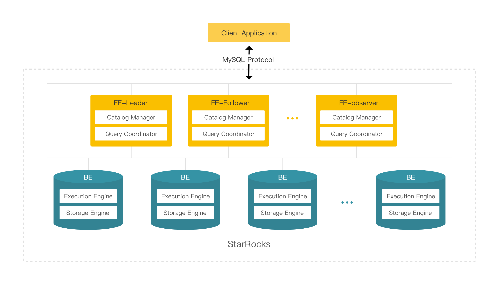
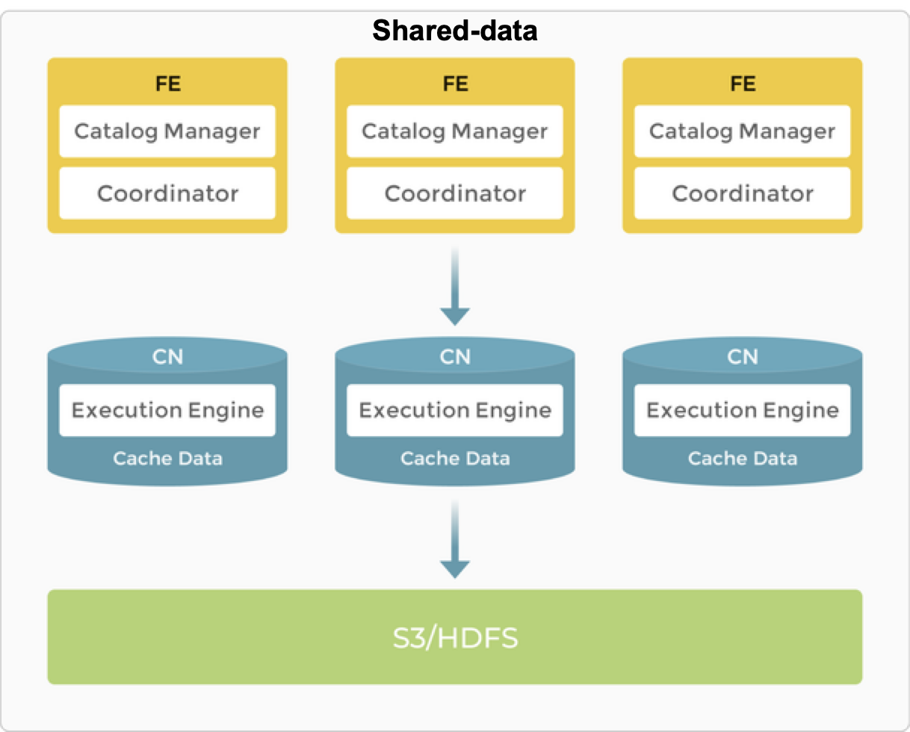

 
 

 

  <a href="https://starrocks.io/download/community">Download</a> | <a href="https://docs.starrocks.io/">Docs</a> | <a href="https://starrocks.io/blog/benchmark-test">Benchmarks</a> | <a href="https://github.com/StarRocks/demo">Demo</a>

 
    </a>
    
    </a>
   
  </a>
   
  </a>
   
  </a>
   
  
 

 

StarRocks is the world's fastest open query engine for sub-second, ad-hoc analytics both on and off the data lakehouse. With average query performance 3x faster than other popular alternatives, StarRocks is a query engine that eliminates the need for denormalization and adapts to your use cases, without having to move your data or rewrite SQL. A Linux Foundation project.   

Learn more 👉🏻 [What Is StarRocks: Features and Use Cases](https://www.youtube.com/watch?v=RfXO5GOnbW4&ab_channel=CelerData)

 
 

    
   </a>

 

## Features

* **🚀 Native vectorized SQL engine:** StarRocks adopts vectorization technology to make full use of the parallel computing power of CPU, achieving sub-second query returns in multi-dimensional analyses, which is 5 to 10 times faster than previous systems.
* **📊 Standard SQL:** StarRocks supports ANSI SQL syntax (fully supported TPC-H and TPC-DS). It is also compatible with the MySQL protocol. Various clients and BI software can be used to access StarRocks.
* **💡 Smart query optimization:** StarRocks can optimize complex queries through CBO (Cost Based Optimizer). With a better execution plan, the data analysis efficiency will be greatly improved.
* **⚡ Real-time update:** The updated model of StarRocks can perform upsert/delete operations according to the primary key, and achieve efficient query while concurrent updates.
* **🪟 Intelligent materialized view:** The materialized view of StarRocks can be automatically updated during the data import and automatically selected when the query is executed.
* **✨ Querying data in data lakes directly**: StarRocks allows direct access to data from Apache Hive™, Apache Iceberg™, Delta Lake™ and Apache Hudi™ without importing.
* **🎛️ Resource management**: This feature allows StarRocks to limit resource consumption for queries and implement isolation and efficient use of resources among tenants in the same cluster.
* **💠 Easy to maintain**: Simple architecture makes StarRocks easy to deploy, maintain and scale out. StarRocks tunes its query plan agilely, balances the resources when the cluster is scaled in or out, and recovers the data replica under node failure automatically.

 
  
## Architecture Overview

 

    
   </a>

StarRocks’s streamlined architecture is mainly composed of two modules: Frontend (FE) and Backend (BE).  The entire system eliminates single points of failure through seamless and horizontal scaling of FE and BE, as well as replication of metadata and data.

Starting from version 3.0, StarRocks supports a new shared-data architecture, which can provide better scalability and lower costs.

 

    
   </a>

 

## Resources

### 📚 Read the docs

| Section | Description |
|-|-|
| [Quick Starts](https://docs.starrocks.io/docs/quick_start/)| How-tos and Tutorials. |
| [Deploy](https://docs.starrocks.io/docs/deployment/deployment_overview/) | Learn how to run and configure StarRocks.|
| [Docs](https://docs.starrocks.io/)| Full documentation. |
| [Blogs](https://www.starrocks.io/blog) | StarRocks deep dive and user stories.  |

### ❓ Get support  

-  [Slack community: ](https://try.starrocks.com/join-starrocks-on-slack) join technical discussions, ask questions, and meet other users!
-  [YouTube channel:](https://www.youtube.com/channel/UC38wR-ogamk4naaWNQ45y7Q/featured) subscribe to the latest video tutorials and webcasts.
-  [GitHub issues:](https://github.com/StarRocks/starrocks/issues) report an issue with StarRocks.

   
  
## Contributing to StarRocks

We welcome all kinds of contributions from the community, individuals and partners. We owe our success to your active involvement.

1. See [Contributing.md](https://github.com/StarRocks/starrocks/blob/main/CONTRIBUTING.md) to get started.
2. Set up StarRocks development environment:
* [IDE Setup](https://docs.starrocks.io/docs/developers/development-environment/ide-setup/) 
* [Compile StarRocks with Docker](https://docs.starrocks.io/docs/developers/build-starrocks/Build_in_docker/) 
* [Deploy StarRocks manually](https://docs.starrocks.io/docs/deployment/deploy_manually/) 
3. Understand our [GitHub workflow](https://github.com/StarRocks/community/blob/main/Contributors/guide/workflow.md) for opening a pull request; use this [PR Template](https://github.com/StarRocks/starrocks/blob/main/.github/PULL_REQUEST_TEMPLATE.md) when submitting a pull request.
4. Pick a [good first issue](https://github.com/StarRocks/starrocks/labels/good%20first%20issue) and start contributing. 

**📝 License:** StarRocks is licensed under [Apache License 2.0](https://www.apache.org/licenses/LICENSE-2.0).

**👥 Community Membership:** Learn more about different [contributor roles](community/membership.md) in StarRocks community.

**💬 Developer Group：** Please join our [Google Groups](https://groups.google.com/g/starrocks-dev) to discuss StarRocks features, project directions, issues, pull requests, or share suggestions.
  
 
  
## Used By

This project is used by the following companies. Learn more about their use cases:

- [Airbnb](https://www.youtube.com/watch?v=AzDxEZuMBwM&ab_channel=StarRocks_labs)
- [Pinterest](https://medium.com/pinterest-engineering/delivering-faster-analytics-at-pinterest-a639cdfad374)
- [Coinbase](https://www.youtube.com/watch?v=3Z9jSCaHnYg&list=PL0eWwaesODdhBhKSnvpfIEAB9sgk8rKmy)
- [Tencent(Games)](https://www.starrocks.io/blog/tencent-unifies-their-gaming-analytics-with-starrocks)
- [Tencent(LLM)](https://www.youtube.com/watch?v=WVHXFks9EQk)
- [Demandbase](https://starrocks.medium.com/demandbase-ditches-denormalization-by-switching-off-clickhouse-44195d795a83)
- [Airtable](https://medium.com/airtable-eng/live-shard-data-archive-export-and-ingestion-to-starrocks-for-validation-6af555e8b3fe)
- [Shopee](https://celerdata.com/blog/how-shopee-3xed-their-query-performance-with-starrocks)
- [Naver](https://starrocks.medium.com/how-join-changed-how-we-approach-data-infra-at-naver-3a5bb1dac49f)
- [Xiaohongshu/RedNote](https://www.youtube.com/watch?v=2cvIZY4EDak&list=PL0eWwaesODdiJ0aXLzSTyNfkjjIFYpOTf)
- [HerdWatch](https://medium.com/p/a7916a7e87bf)
- [TRM Labs](https://www.trmlabs.com/post/from-bigquery-to-lakehouse-how-we-built-a-petabyte-scale-data-analytics-platform-part-1)
- [Verisoul](https://celerdata.com/blog/verisoul-enables-real-time-analytics-by-transitioning-off-bigquery)
- [Trip.com](https://starrocks.medium.com/trip-com-starrocks-efficiently-supports-high-concurrent-queries-dramatically-reduces-labor-and-1e1921dd6bf8) 
- [Didi](https://www.starrocks.io/blog/reduced-80-cost-didis-journey-from-multiple-olap-engines-to-starrocks)
- [Grab](https://engineering.grab.com/building-a-spark-observability)
