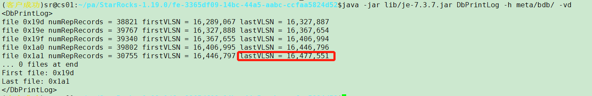

# 恢复元数据

本文介绍如何恢复 StarRocks 中的元数据。

当 StarRocks 集群中的 FE 集群出现以下问题时，您可以通过下述方式手动恢复 FE 服务：

- Berkeley DB Java Edition（BDBJE）无法启动。
- FE 节点之间无法同步数据。
- 无法向 FE 节点中写入元数据。
- FE 集群缺少 Leader 节点。

> **注意**
>
> - **请谨慎操作元数据。错误的操作可能导致集群数据不可逆丢失。如非集群不可用或 BDBJE 无法选主的情况，请不要参考此文档操作。**
> - **请务必清空除了恢复节点（即以下操作中选出来的元数据最新的节点）以外其他节点的元数据目录，否则可能导致节点错乱。**
> - **下述方法无法解决根本问题，仅作为尽快恢复集群运行应急操作。如需彻底修复问题，请联系官方人员协助。**

手动恢复 FE 的原理为先通过当前 `meta_dir` 中留存的元数据启动一个新的 Master 节点，然后逐台添加其他 FE 节点。

请严格按照如下步骤操作。

## 停止 FE 集群

您需要停止所有 FE 进程以及一切业务访问。请保证在恢复元数据期间，系统不会因为外部访问而发生其他不可预期的问题。

## 寻找元数据最新的 FE 节点

您需要先备份所有 FE 节点的元数据路径。该路径存储在 **/fe/conf/fe.conf** 中的 `meta_dir` 配置项下。

```conf
meta_dir = /home/disk1/sr/StarRocks-1.19.0/fe-3365df09-14bc-44a5-aabc-ccfaa5824d52/meta
```

元数据文件夹结构如下：


通常情况下，FE Leader 节点的元数据为最新。

为确保获取元数据最新的节点，您需要切换到各 FE 节点安装目录下，执行以下操作获取 lastVLSN，该值越大则该节点元数据越新。

```shell
java -jar lib/je-7.3.7.jar DbPrintLog -h meta/bdb/ -vd 
```

查询结果如下所示：



您需要比较各个 FE 节点的 lastVLSN 值大小，该值最大的节点为元数据最新的节点。

## 确认恢复节点角色

进入元数据最新的节点的 **image** 目录查看 **role** 文件，确认当前节点的角色。

以下示例中路径为 **/xxx/StarRocks-xxx/fe-xxx/meta/image**。


> 注意：确认恢复节点角色后，您需要基于当前 FE 节点进行恢复。我们建议您优先选择 FOLLOWER 节点进行恢复。

如果恢复的节点的 role 为 FOLLOWER，请参考[基于 FOLLOWER 节点恢复](#基于-follower-节点恢复)，如果恢复的节点的role为 OBSERVER，请参考[基于 OBSERVER 节点恢复](#基于-observer-节点恢复)。

## 基于 FOLLOWER 节点恢复

1. 在当前节点的 **fe.conf** 中添加以下配置。

    ```conf
    metadata_failure_recovery = true
    ```

    > 说明：`metadata_failure_recovery=true` 的含义为，清空 BDBJE 中其他 FE 节点的元数据，只保留待恢复的 FE 节点的元数据。如此，该 FE 节点将不会连接其他 FE 节点，而作为一个独立的 FE 节点启动。
    > 注意：该参数只有在恢复启动时才需要设置为 `true`。恢复完成后，请务必将其设置为 `false` (后面有步骤说明)。否则再次重启后，BDBJE 中的元数据将会被再次被清空，导致其他 FE 节点无法正常工作。
2. 启动当前 FE 节点。

    ```shell
    sh bin/start_fe.sh --daemon
    ```

    正常情况下，当前 FE 节点会以 MASTER 的角色启动。您可以在当前节点的 **fe.log** 中查询到 `transfer from XXXX to MASTER` 的日志条目。
3. 启动完成后，通过 MySQL 连接至当前 FE节点，执行查询导入操作，检查集群是否能够正常访问。如果无法正常访问，您需要查看 FE 节点的启动日志，排查问题后重新启动 FE 节点。
4. 确认启动成功后，检查当前 FE 节点角色。

    ```sql
    show frontends;
    ```

    您可以看到当前 FE 角色为 `Master`，以及之前集群所添加的所有 FE 节点。
5. 【重要】将当前节点 **fe.conf** 中的 `metadata_failure_recovery=true` 配置项删除，或者设置为 `false`，然后重启当前 FE 节点。

## 基于 OBSERVER 节点恢复

1. 将当前节点的 **/image/ROLE** 文件中 `role=OBSERVER` 改为 `role=FOLLOWER`。
2. 在当前节点的 **fe.conf** 中添加以下配置。

    ```conf
    metadata_failure_recovery = true
    ```

    > 说明：`metadata_failure_recovery=true` 的含义为，清空 BDBJE 中其他 FE 节点的元数据，只保留待恢复的 FE 节点的元数据。如此，该 FE 节点将不会连接其他 FE 节点，而作为一个独立的 FE 节点启动。
    > 注意：该参数只有在恢复启动时才需要设置为 `true`。恢复完成后，请务必将其设置为 `false` (后面有步骤说明)。否则再次重启后，BDBJE 中的元数据将会被再次被清空，导致其他 FE 节点无法正常工作。
3. 启动当前 FE 节点。

    ```shell
    sh bin/start_fe.sh --daemon
    ```

    正常情况下，当前 FE 节点会以 MASTER 的角色启动。您可以在当前节点的 **fe.log** 中查询到 `transfer from XXXX to MASTER` 的日志条目。

4. 启动完成后，通过 MySQL 连接至当前 FE节点，执行查询导入操作，检查集群是否能够正常访问。如果无法正常访问，您需要查看 FE 节点的启动日志，排查问题后重新启动 FE 节点。
5. 确认启动成功后，检查当前 FE 节点角色。

    ```sql
    show frontends;
    ```

    由于当前使用 OBSERVER 节点恢复，以上命令的返回中您可以看到当前 FE 角色为 OBSERVER，但是 `IsMaster` 显示为 `true`。
6. 将当前节点的 **fe.conf** 中 `metadata_failure_recovery=true` 注释掉。

    > 注意
    >
    > 请不要重启该节点，以防止这个节点在加入集群的时候报错。

7. DROP 当前 OBSERVER 节点以外的所有 FE 节点。

    ```sql
    ALTER SYSTEM DROP FOLLOWER/OBSERVER "host:heartbeat_service_port"[, "host:heartbeat_service_port", ...];
    ```

8. 添加一个新的 FOLLOWER FE，假设在 hostA 上。

    ```sql
    ALTER SYSTEM ADD FOLLOWER "hostA:edit_log_port";
    ```

9. 在 hostA 上启动一个全新的 FE，并通过 `--helper` 的方式加入集群。

    ```sql
    bin/start_fe.sh --helper "fe_host:edit_log_port" --daemon
    ```

10. 启动成功后，检查当前 FE 节点角色。

    ```sql
    show frontends;
    ```

    在返回结果中，你可以观察到两个 FE 节点，其中一个是之前的 OBSERVER，另一个是新添加的 FOLLOWER，且此时 OBSERVER 为 Leader 节点。
11. 确认新的 FOLLOWER 是否可以正常工作。观察如图所示的 ID 是否同步完成即可了解新的 FOLLOWER 是否正常工作。

    

12. 确认当前新的 FOLLOWER 可以正常工作之后，跳转至第四步骤，用这个新的 FOLLOWER 的元数据，重新执行[基于 FOLLOWER 节点恢复](#基于-follower-节点恢复)操作。以上步骤目的即为人为地制造出一个 FOLLOWER 节点的元数据，然后用该元数据重新开始故障恢复，从而避免了从 OBSERVER 恢复元数据导致的不一致的问题。

## 重新部署 FE 集群

在得到了一个存活的 FOLLOWER 角色的 MASTER 后，您需要将之前的其他的 FE 从元数据删除。

```sql
ALTER SYSTEM DROP FOLLOWER/OBSERVER;
```

然后通过加入全新 FE 的方式重新添加各 FE 节点。

```shell
bin/start_fe.sh --helper "fe_host:edit_log_port" --daemon
```

如果对应 FE 启动失败，您需要检查当前 Leader 节点的 **/fe/meta/bdb** 文件夹大小。如果该文件夹过大，即超过 **fe.conf** 中 jvm 设置的一半，则您需要增大该设置项后重新启动。

如果以上操作正常，则元数据恢复完毕。
