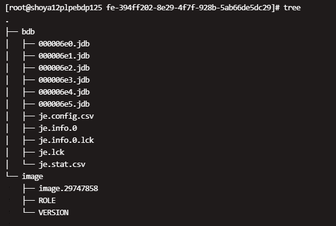

# 元数据恢复

FE 有可能因为某些原因出现无法启动 bdbje、FE 之间无法同步等问题。故障表现包括无法进行元数据写操作、没有 MASTER 等等，需要手动恢复 FE。

## 恢复原理

手动恢复 FE 的大致原理，是先通过当前 meta_dir 中的元数据，启动一个新的 MASTER，然后再逐台添加其他 FE。

## 恢复示例

请严格按照如下步骤操作：

1. 停止所有 FE 进程，同时停止一切业务访问。保证在元数据恢复期间，不会因为外部访问导致其他不可预期的问题。
2. 寻找元数据最新的FE节点
    1. 先备份所有FE的meta_dir目录
    2. 通常情况下，Master FE 的元数据是最新的。
    3. 确保元数据最新，可以查看meta_dir/image目录下，image.xxxx文件的后缀，数字越大，则表示元数据越新。
    4. mate_dir路径可在fe.conf中找到
    
    5. meta_dir文件夹结构如下：
    
    6. 比较image目录下image.xxxx 文件的后缀，确认元数据最新的节点
    
    7. 之后，我们要使用这个拥有最新元数据的 FE 节点，进行恢复，建议尽量选择 FOLLOWER 节点恢复，如果使用 OBSERVER 节点的元数据进行恢复会比较麻烦，cat ROLE(image文件夹下的ROLE文件)可以看到该节点角色。

3. 以下操作在2选出来的元数据最新的FE节点执行：
    1. 如果该节点是一个 OBSERVER，先将 meta_dir/image/ROLE 文件中的 `role=OBSERVER` 改为 `role=FOLLOWER`。（从 OBSERVER 节点恢复会比较麻烦，先按这里的步骤操作，后面会有单独说明）如果该节点是一个 FOLLOWER，跳过3.1步骤。
    2. 在 fe.conf 中添加配置：`metadata_failure_recovery=true` `metadata_failure_recovery=true` 的含义是，清空 "bdbje" 的元数据。这样 bdbje 就不会再联系之前的其他 FE ，而作为一个独立的 FE 启动。这个参数只有在恢复启动时才需要设置为 true。恢复完成后，一定要设置为 false（后面有步骤说明），否则一旦重启，bdbje 的元数据又会被清空，导致其他 FE 无法正常工作。
    3. 执行`sh bin/start_fe.sh --deamon` 启动该FE，如果正常，这个 FE 会以 MASTER 的角色启动，在 fe.log 中会看到 `transfer from XXXX to MASTER` 等字样。
    4. 启动完成后，先连接到这个 FE，执行一些查询导入，检查是否能够正常访问。如果不正常，有可能是操作有误，查看FE启动日志，排查问题后重新启动FE。
    5. 如果成功，通过 `show frontends;` 命令，应该可以看到之前集群所添加的所有 FE，并且当前 FE 是 master。
    6. 将 fe.conf 中的 `metadata_failure_recovery=true` 配置项删除，或者设置为 false，然后重启这个 FE（重要）。
    如果是用一个 OBSERVER 节点的元数据进行恢复的，那么完成如上步骤后，`show frontends;` 会发现，当前这个 FE 的角色为 OBSERVER，但是 IsMaster 显示为 true。这是因为，这里看到的 “OBSERVER” 是记录在 StarRocks 的元数据中的，而是否是 master，是记录在 bdbje 的元数据中的。因为我们是从一个 OBSERVER 节点恢复的，所以这里出现了不一致。这种内部不一致的状态，不能支持后续的导入等修改操作，所以，还需要继续按以下步骤修复：
    7. 先把除了这个 “OBSERVER” 以外的所有 FE 节点 DROP 掉。
    8. 通过 `ADD FOLLOWER` 命令，添加一个新的 FOLLOWER FE，假设在 hostA 上。
    9. 在 hostA 上启动一个全新的 FE，通过 --helper 的方式加入集群。
    10. 启动成功后，通过 `show frontends;` 语句，你应该能看到两个 FE，一个是之前的 OBSERVER，一个是新添加的 FOLLOWER，并且 OBSERVER 是 master。
    11. 确认这个新的 FOLLOWER 是可以正常工作之后，用这个新的 FOLLOWER 的元数据，重新执行一遍故障恢复操作（3.2-3.6）。（观察如图所示的ID是否同步完成即可了解新的 FOLLOWER 是否正常工作）
    
    以上这些步骤的目的，其实就是人为地制造出一个 FOLLOWER 节点的元数据，然后用这个元数据，重新开始故障恢复。这样就避免了从 OBSERVER 恢复元数据所遇到的不一致的问题。

4. 第3步执行成功后，我们再通过 `ALTER SYSTEM DROP FOLLOWER/OBSERVER` 命令，将之前的其他的 FE 从元数据删除后，按加入全新 FE 的方式，重新把这些 FE 添加一遍。

5. 如果以上操作正常，则恢复完毕。
