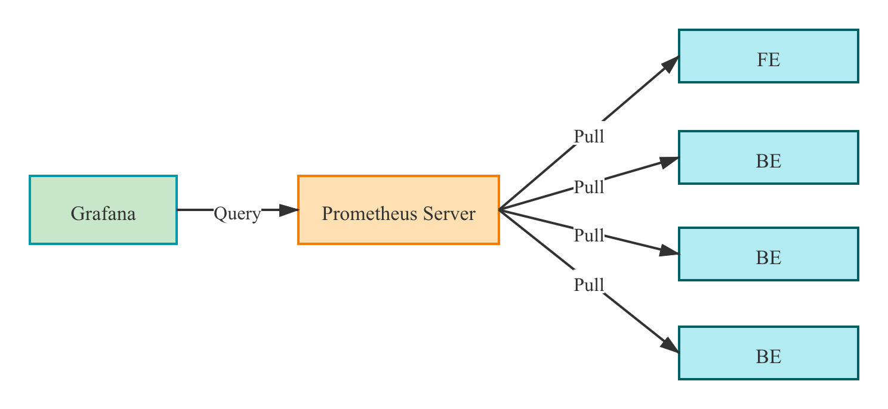

# 监控报警

StarRocks提供两种监控报警的方案，第一种是使用内置的StarRocksManager，其自带的Agent从各个Host采集监控信息上报到Center Service然后做可视化展示，也提供了邮件和Webhook的方式发送报警通知。但是如果用户为了二次开发需求，需要自己搭建部署监控服务，也可以使用开源的Prometheus+Grafana的方案，StarRocks提供了兼容Prometheus的信息采集接口，可以通过直接链接BE/FE的HTTP端口来获取集群的监控信息。

## 使用StarRocksManager

StarRocksManager的监控可以分成**集群**和**节点**两个维度，在集群页面可以看到下列监控项：

* 集群性能监控
  * CPU使用率
  * 内存使用
  * 磁盘I/O使用率，磁盘使用量、磁盘空闲量
  * 发包带宽、收包带宽，发包数、收包数
* 集群查询监控
  * QPS
  * 平均响应时间
  * 50/75/90/95/99/999 分位响应时间
* 数据导入量监控
  * 发起导入次数
  * 导入行数
  * 导入数据量
* 数据组合并（Compaction）监控
  * 基线合并数据组速率
  * 基线合并数据量
  * 增量合并数据组速率
  * 增量合并数据量

在节点页面可以看到所有BE/FE的机器列表和状态等基础信息


点击节点链接可以看到每一个节点的详细监控信息，可以在右侧的节点列表中选择多个节点同时展示，可以在上方的下拉框中选择各类指标


## 监控指标

可供选择的指标有：

  |指标|单位|类型|含义|
|---|:---:|:---:|---|
|be_broker_count|个|平均值|broker的数量|
|be_brpc_endpoint_count|个|平均值|Brpc中StubCache的数量|
|be_bytes_read_per_second|bytes/s|平均值|BE 读取速度|
|be_bytes_written_per_second|bytes/s|平均值|BE 写入速度|
|be_base_compaction_bytes_per_second|bytes/s|平均值|BE 的基线合并速率|
|be_cumulative_compaction_bytes_per_second|bytes/s|平均值|BE 的增量合并速率|
|be_base_compaction_rowsets_per_second|rowsets/s|平均值|BE的基线合并rowsets合并速率|
|be_cumulative_compaction_rowsets_per_second|rowsets/s|平均值|BE的增量合并rowsets合并速率|
|be_base_compaction_failed|个/秒|平均值|BE基线合并失败|
|be_clone_failed|个/秒|平均值|BE克隆失败|
|be_create_rollup_failed|个/秒|平均值|BE 创建物化视图失败|
|be_create_tablet_failed|个/秒|平均值|BE创建tablet 失败|
|be_cumulative_compaction_failed|个/秒|平均值|BE增量合并失败|
|be_delete_failed|个/秒|平均值|BE删除失败|
|be_finish_task_failed|个/秒|平均值|BE task失败|
|be_publish_failed|个/秒|平均值|BE 版本发布失败|
|be_report_tables_failed|个/秒|平均值|BE 表上报失败|
|be_report_disk_failed|个/秒|平均值|BE 磁盘上报失败|
|be_report_tablet_failed|个/秒|平均值|BE 分片上报失败|
|be_report_task_failed|个/秒|平均值|BE 任务上报失败|
|be_schema_change_failed|个/秒|平均值|BE 修改表结构失败|
|be_base_compaction_requests|个/秒|平均值|BE 基线合并请求|
|be_clone_total_requests|个/秒|平均值|BE 克隆请求|
|be_create_rollup_requests|个/秒|平均值|BE 创建物化视图请求|
|be_create_tablet_requests|个/秒|平均值|BE 创建分片请求|
|be_cumulative_compaction_requests|个/秒|平均值|BE 增量合并请求|
|be_delete_requests|个/秒|平均值|BE 删除请求|
|be_finish_task_requests|个/秒|平均值|BE完成任务请求|
|be_publish_requests|个/秒|平均值|BE版本发布请求|
|be_report_tablets_requests|个/秒|平均值|BE分片上报请求|
|be_report_disk_requests|个/秒|平均值|BE磁盘上报请求|
|be_report_tablet_requests|个/秒|平均值|BE任务上报请求|
|be_report_task_requests|个/秒|平均值|BE任务上报请求|
|be_schema_change_requests|个/秒|平均值|BE表结构修改请求|
|be_storage_migrate_requests|个/秒|平均值|BE迁移请求|
|be_fragment_endpoint_count|个|平均值|BE DataStream数量|
|be_fragment_request_latency_avg|ms|平均值|fragment 请求响应时间|
|be_fragment_requests_per_second|个/秒|平均值|fragment 请求数|
|be_http_request_latency_avg|ms|平均值|HTTP请求响应时间|
|be_http_requests_per_second|个/秒|平均值|HTTP请求数|
|be_http_request_send_bytes_per_second|bytes/s|平均值|HTTP请求发送字节数|
|fe_connections_per_second|connections/s|平均值|FE的新增连接速率|
|fe_connection_total|connections|累计值|FE的总连接数量|
|fe_edit_log_read|operations/s|平均值|FE edit log 读取速率|
|fe_edit_log_size_bytes|bytes/s|平均值|FE edit log 大小|
|fe_edit_log_write|bytes/s|平均值|FE edit log 写入速率|
|fe_checkpoint_push_per_second|operations/s|平均值|FE checkpoint 数|
|fe_pending_hadoop_load_job|个|平均值|Pending的hadoop job数量|
|fe_committed_hadoop_load_job|个|平均值|提交的 hadoop job数量|
|fe_loading_hadoop_load_job|个|平均值|加载中的hadoop job数量|
|fe_finished_hadoop_load_job|个|平均值|完成的hadoop job 数量|
|fe_cancelled_hadoop_load_job|个|平均值|取消的hadoop job 数量|
|fe_pending_insert_load_job|个|平均值|Pending的insert job数量|
|fe_loading_insert_load_job|个|平均值|提交的 insert job数量|
|fe_committed_insert_load_job|个|平均值|加载中的insert job数量|
|fe_finished_insert_load_job|个|平均值|完成的insert job 数量|
|fe_cancelled_insert_load_job|个|平均值|取消的insert job 数量|
|fe_pending_broker_load_job|个|平均值|Pending的broker job数量|
|fe_loading_broker_load_job|个|平均值|提交的 broker job数量|
|fe_committed_broker_load_job|个|平均值|加载中的broker job数量|
|fe_finished_broker_load_job|个|平均值|完成的broker job 数量|
|fe_cancelled_broker_load_job|个|平均值|取消的broker job 数量|
|fe_pending_delete_load_job|个|平均值|Pending的delete job数量|
|fe_loading_delete_load_job|个|平均值|提交的 delete job数量|
|fe_committed_delete_load_job|个|平均值|加载中的delete job数量|
|fe_finished_delete_load_job|个|平均值|完成的delete job 数量|
|fe_cancelled_delete_load_job|个|平均值|取消的delete job 数量|
|fe_rollup_running_alter_job|个|平均值|rollup创建中的job 数量|
|fe_schema_change_running_job|个|平均值|表结构变更中的job数量|
|cpu_util| 百分比|平均值|CPU 使用率|
|cpu_system | 百分比|平均值|cpu_system 使用率|
|cpu_user| 百分比|平均值|cpu_user 使用率|
|cpu_idle| 百分比|平均值|cpu_idle 使用率|
|cpu_guest| 百分比|平均值|cpu_guest 使用率|
|cpu_iowait| 百分比|平均值|cpu_iowait 使用率|
|cpu_irq| 百分比|平均值|cpu_irq 使用率|
|cpu_nice| 百分比|平均值|cpu_nice 使用率|
|cpu_softirq| 百分比|平均值|cpu_softirq 使用率|
|cpu_steal| 百分比|平均值|cpu_steal 使用率|
|disk_free|bytes|平均值|空闲磁盘容量|
|disk_io_svctm|Ms|平均值|磁盘IO服务时间|
|disk_io_util|百分比|平均值|磁盘使用率|
|disk_used|bytes|平均值|已用磁盘容量|
|starrocks_fe_meta_log_count|个|瞬时值|未做 Checkpoint 的 Edit Log 数量，该值在 `100000` 以内为合理|

## 监控报警最佳实践

监控系统背景信息：

1. 监控是按照“每 15 秒”收集一些信息；
2. 一些指标是“除以 15 秒”后的，得到的单位是「个/秒」；有些指标没有除，则还是 15 秒的 count；
3. P90、P99 等分位值，当前是算的 15 秒内的，然后按更大粒度（1 分钟、5 分钟等）时，只能按“一共出现多少次 大于多少值 的报警”，不能按“平均值为多少”来做指标，那个意义是有问题的。

### 总体参考

1. 监控的目的是要既能在异常时报警、又尽量避免正常状况下的报警；
2. 不同集群的资源（比如内存、磁盘）、使用量都不一样，需要设置不一样的值；不过，这种 Gauge 值可能“百分比”是有普适性的；
3. 对于失败次数等，都需要看对应的总量的变化，根据一定比例（比如针对 P90，P99，P999的量）来计算报警边界值；
4. 一些 used/query 等，一般都可以按照 2 倍甚至更多些来作为增长上线预警值；或者比峰值再高一些些即可；

### 规则设置参考样例

#### 发生低频的告警

直接设置有失败（次数大于等于 1 次）就报警，失败多的就更高级报警即可。

e.g. schema change 等，本来操作就少，“失败就报警”就可以了。

#### 未启动任务

这种统计可能一段时间都是 0，但一旦有此类任务，后续 success 和 failed 都可能比较多。

则，可以暂时先设置 `failed > 1`就报警，后续可以再修改。

#### 波动大小

##### 波动较大的

需要关注不同时间粒度的数据，因为粒度大的数据中的波峰波谷会被平均掉 （后续会让 Manager 增加 sum/min/max/average等指标聚合值）。一般需要看 15 天、3 天、12 小时、3 小时、1 小时的（不同时间范围的）。

并且监控间隔时间可能需要稍长一些（比如 3 分钟、5 分钟，甚至更长时间），以屏蔽波动引起的报警。

##### 波动较小的

可以设置短一些的间隔时间，以更快地报警问题。

##### 有较高尖刺的

要看尖刺是否需要报警，如果尖刺比较多，则可以适当放大间隔时间，平滑掉尖刺，如果尖刺较少（一天没几个），可以报一些通知级别的报警也没太大问题。

#### 资源使用

##### 资源使用很低的

可以设置相对“资源使用高的”更严格一些值，比如 cpu 使用率低的（都不到 20%的），可能 `cpu_idle<60%` 就可以报警了。

##### 资源使用很高的

可以按照“预留一点资源”的方式设置报警，比如内存，可以设置为 `mem_avaliable<=20%` 报警notice。

### 注意事项

一般会增加 FE/BE 一起监控，但还有些值只有 FE 或只有 BE。

可能有一些机器不是同构的，需要分几批。

### 补充

#### P99 分位计算规则

节点会每 15 秒钟采集数据，并计算一个值，这个 99 分位就是这 15 秒钟内的 99 分位。当 qps 不高时（比如 qps在 10 以下），这些分位其实就不是很准确率了。同时，1 分钟（共 4 次 15 秒）内的 4 个值，也不能简单的求聚合（不管是 sum 还是 average），都是没有意义的。

其他 P50、P90 等都一样。

#### 集群错误性监控

> 需要监控集群中一些非期望的错误项，以及时发现问题，并帮助更快速地解决问题，让集群正常服务。如果一些项虽不太重要（比如 SQL 语法错误等），但**暂时无法从重要错误项中剥离**的，也先一并进行监控，并在后期推动区分。

## 使用Prometheus+Grafana

StarRocks可使用[Prometheus](https://prometheus.io/)作为监控数据存储方案，使用[Grafana](https://grafana.com/)作为可视化组件。

### 组件

>本文档仅提供基于Prometheus和Grafana实现的一种StarRocks可视化监控方案，原则上不维护和开发这些组件。更多详细的介绍和使用，请参考对应的官网文档。

#### Prometheus

Prometheus 是一个拥有多维度数据模型的、灵活的查询语句的时序数据库。它可以通过 Pull 或 Push 采集被监控系统的监控项，存入自身的时序数据库中。并且通过丰富的多维数据查询语言，满足用户的不同需求。

#### Grafana

Grafana 是一个开源的 metric 分析及可视化系统。支持多种数据源，详情可参考官网文档。通过对应的查询语句，从数据源中获取展现数据。通过灵活可配置的 Dashboard，快速的将这些数据以图表的形式展示给用户。

### 监控架构



Prometheus通过Pull方式访问FE/BE的Metric接口，然后将监控数据存入时序数据库。

用户可以通过Grafana配置Prometheus为数据源，自定义绘制Dashboard。

### 部署

#### Prometheus

**1.** 从[Prometheus官网](https://prometheus.io/download/)下载最新版本的Prometheus，以下步骤以prometheus-2.29.1.linux-amd64版本为例

```bash
wget https://github.com/prometheus/prometheus/releases/download/v2.29.1/prometheus-2.29.1.linux-amd64.tar.gz
tar -xf prometheus-2.29.1.linux-amd64.tar.gz
```

**2.** vi prometheus.yml，添加StarRocks监控相关的配置

```yml
# my global config
global:
  scrape_interval:     15s # 全局的采集间隔，默认是 1m，这里设置为 15s
  evaluation_interval: 15s # 全局的规则触发间隔，默认是 1m，这里设置 15s


scrape_configs:
  # The job name is added as a label `job=<job_name>` to any timeseries scraped from this config.
  - job_name: 'StarRocks_Cluster01' # 每一个集群称之为一个job，可以自定义名字作为StarRocks集群名
    metrics_path: '/metrics'    # 指定获取监控项目的Restful Api

    static_configs:
      - targets: ['fe_host1:http_port','fe_host3:http_port','fe_host3:http_port']
        labels:
          group: fe # 这里配置了 fe 的 group，该 group 中包含了 3 个 Frontends

      - targets: ['be_host1:webserver_port', 'be_host2:webserver_port', 'be_host3:webserver_port']
        labels:
          group: be # 这里配置了 be 的 group，该 group 中包含了 3 个 Backends
  - job_name: 'StarRocks_Cluster02' # 可以在Prometheus中监控多个StarRocks集群
    metrics_path: '/metrics'

    static_configs:
      - targets: ['fe_host1:http_port','fe_host3:http_port','fe_host3:http_port']
        labels:
          group: fe

      - targets: ['be_host1:webserver_port', 'be_host2:webserver_port', 'be_host3:webserver_port']
        labels:
          group: be
```

**3.** 启动 Prometheus

```bash
nohup ./prometheus \
    --config.file="./prometheus.yml" \
    --web.listen-address=":9090" \
    --log.level="info" &
```

该命令将后台运行 Prometheus，并指定其 web 端口为 9090。启动后，即开始采集数据，并将数据存放在 ./data 目录中。

**4.** 访问 Prometheus

Prometheus 可以通过 web 页面进行简单的访问。通过浏览器打开 9090 端口，即可访问 Prometheus 的页面。点击导航栏中，`Status -> Targets`，可以看到所有分组 Job 的监控主机节点。正常情况下，所有节点都应为 UP，表示数据采集正常。如果节点状态不为 UP，可以先访问 StarRocks 的 metrics (`http://fe_host:fe_http_port/metrics`或`http://be_host:be_http_port/metrics`)接口检查是否可以访问，或查询 Prometheus 相关文档尝试解决。


至此，一个简单的 Prometheus 已经搭建、配置完毕。更多高级使用方式，请参阅[官方文档](https://prometheus.io/docs/introduction/overview/)

#### Grafana

**1.** 从[Grafana官网](https://grafana.com/grafana/download)下载最新版本的Grafana，以下以grafana-8.0.6.linux-amd64版本为例

```SHELL
wget https://dl.grafana.com/oss/release/grafana-8.0.6.linux-amd64.tar.gz
tar -zxf grafana-8.0.6.linux-amd64.tar.gz
```

**2.** vi ./conf/defaults.ini 添加配置

```ini
...
[paths]
data = ./data
logs = ./data/log
plugins = ./data/plugins
[server]
http_port = 8000
domain = localhost
...
```

**3.** 启动Grafana

```Plain text
nohup ./bin/grafana-server \
    --config="./conf/defaults.ini" &
```

### Dashboard

#### DashBoard配置

登录grafana，即上一步配置的地址`http://grafana_host:8000`，默认用户名/密码为admin/admin。

**1.** 数据源配置

配置路径：`Configuration-->Data sources-->Add data source-->Prometheus`

Data Source配置简介


* Name: 数据源的名称，自定义，比如 starrocks_monitor
* URL: Prometheus 的 web 地址，如 `http://prometheus_host:9090`
* Access: 选择 Server 方式，即通过 Grafana 进程所在服务器，访问 Prometheus。
其余选项默认即可。

点击最下方 Save & Test，如果显示 Data source is working，即表示数据源可用。

**2.** 添加Dashboard

`注：StarRocks-1.19.0版本及其之后的版本监控Metric name有调整，需要下载下面 StarRocks-1.19.0+版本DashBoard模版`

[Dashboard 模版下载](http://starrocks-thirdparty.oss-cn-zhangjiakou.aliyuncs.com/StarRocks-Overview.json)

> 说明：StarRocks 1.19.0 和 2.4.0 版本的监控 Metric Name 有调整，需要下载下面对应版本的 Dashboard 模版。

* [StarRocks-1.19.0 之前版本 Dashboard 模版](http://starrocks-thirdparty.oss-cn-zhangjiakou.aliyuncs.com/StarRocks-Overview.json)
* [StarRocks-1.19.0 开始到 StarRocks-2.4.0 之前版本 Dashboard 模版](http://starrocks-thirdparty.oss-cn-zhangjiakou.aliyuncs.com/StarRocks-Overview-19.json)
* [StarRocks-2.4.0 及其之后版本 Dashboard 模版](http://starrocks-thirdparty.oss-cn-zhangjiakou.aliyuncs.com/StarRocks-Overview-24.json)

确认数据源可用后，点击左边导航栏的 + 号，开始添加 Dashboard。这里我们使用上文下载的 StarRocks 的 Dashboard 模板。点击 `左边的导航栏 + 号 -> Import -> Upload Json File`，将下载的 json 文件导入。
导入后，可以命名 Dashboard，默认是 StarRocks Overview。同时，需要选择数据源，这里选择之前创建的 starrocks_monitor。
点击 Import，即完成导入。之后，可以看到 StarRocks 的 Dashboard 展示。

#### Dashboard说明

这里我们简要介绍 StarRocks Dashboard。Dashboard 的内容可能会随版本升级，不断更新，请参考上文Dashboard模版。

**1.** 顶栏


左上角为 Dashboard 名称。
右上角显示当前监控时间范围，可以下拉选择不同的时间范围，还可以指定定时刷新页面间隔。
cluster_name: 即 Prometheus 配置文件中的各个 job_name，代表一个 StarRocks 集群。选择不同的 cluster，下方的图表将展示对应集群的监控信息。

* fe_master: 对应集群的 Master Frontend 节点。
* fe_instance: 对应集群的所有 Frontend 节点。选择不同的 Frontend，下方的图表将展示对应 Frontend 的监控信息。
* be_instance: 对应集群的所有 Backend 节点。选择不同的 Backend，下方的图表将展示对应 Backend 的监控信息。
* interval: 有些图表展示了速率相关的监控项，这里可选择以多大间隔进行采样计算速率（注：15s 间隔可能导致一些图表无法显示**）。

**2.** Row


Grafana 中，Row 的概念，即一组图表的集合。如上图中的 Overview、Cluster Overview 即两个不同的 Row。可以通过点击 Row，对 Row 进行折叠。当前 Dashboard 有如下 Rows（持续更新中）：

* Overview: 所有 StarRocks 集群的汇总展示。
* Cluster Overview: 选定集群的汇总展示。
* Query Statistic: 选定集群的查询相关监控。
* Jobs: 导入任务相关监控。
* Transaction: 事务相关监控。
* FE JVM: 选定 Frontend 的 JVM 监控。
* BE: 选定集群的 Backends 的汇总展示。
* BE Task: 选定集群的 Backends 任务信息的展示。

**3.** 一个典型的图标分为以下几部分：


* 鼠标悬停左上角的 i 图标，可以查看该图表的说明。
* 点击下方的图例，可以单独查看某一监控项。再次点击，则显示所有。
* 在图表中拖拽可以选定时间范围。
* 标题的 [] 中显示选定的集群名称。
* 一些数值对应左边的Y轴，一些对应右边的，可以通过图例末尾的 -right 区分。
* 点击图表名称->Edit，可以对图表进行编辑。

### 其他

如果仅仅需要将监控数据接入自有的Prometheus系统，可以通过下列接口访问：

* FE:  fe_host:fe_http_port/metrics
* BE:  be_host:be_web_server_port/metrics

如果需要JSON格式可以访问：

* FE:  fe_host:fe_http_port/metrics?type=json
* BE:  be_host:be_web_server_port/metrics?type=json
