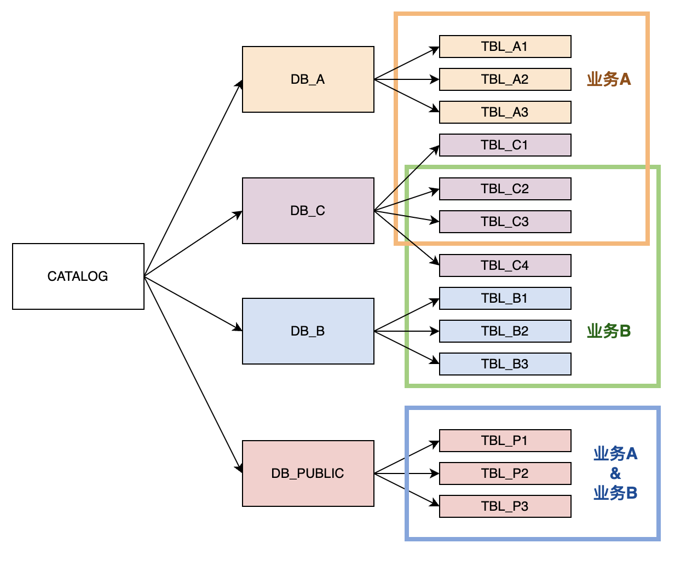
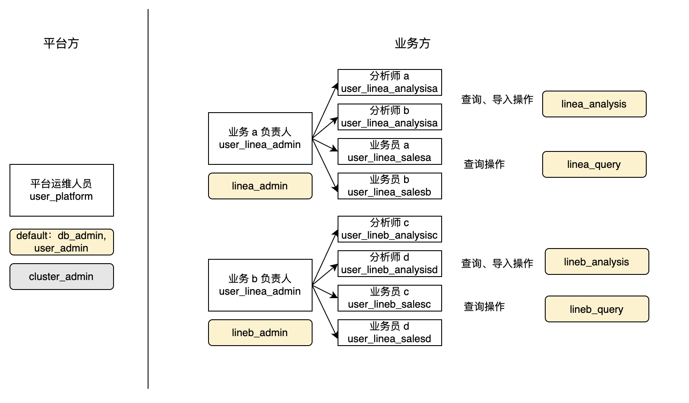

# 管理用户权限

本文描述如何在 StarRocks 中管理用户、角色和权限。

StarRocks 同时采用了基于角色的访问控制 (RBAC) 和基于身份的访问控制 (IBAC) 以管理集群内的权限，使集群管理员可以轻松地在不同粒度级别上限制集群内的权限。

在 StarRocks 集群中，您可以将权限授予用户或角色。角色是一组权限，可根据需要授予集群内的用户或角色。一个用户或角色可以被授予一个或多个角色，这些角色决定了他们对不同对象的权限。

## 管理用户

拥有系统预置角色 `user_admin` 的用户可以在 StarRocks 中创建、修改和删除用户。

### 创建用户

您可以通过指定用户身份（user identity）、认证方式和默认角色来创建用户。

StarRocks 支持使用用户密码登录或 LDAP 认证作为用户认证方式。有关 StarRocks 认证方式的更多信息，请参阅 [用户认证](../administration/Authentication.md)。有关创建用户的更多操作说明，请参阅 [CREATE USER](../sql-reference/sql-statements/account-management/CREATE%20USER.md)。

以下示例创建用户 `jack`，仅允许其从 IP 地址 `172.10.1.10` 进行连接，为其设置密码为 `12345`，并将角色 `example_role` 分配给它作为其默认角色：

```SQL
CREATE USER jack@'172.10.1.10' IDENTIFIED BY '12345' DEFAULT ROLE 'example_role';
```

> **说明**
>
> - StarRocks 会在存储用户密码之前对其进行加密。您可以使用 password() 函数获取加密后的密码。
> - 如果在创建用户期间未指定默认角色，StarRocks 会指定系统预置角色 `PUBLIC` 作为用户默认角色。

### 修改用户

您可以修改用户的密码、默认角色或属性。

当用户连接到 StarRocks 时，其默认角色会自动激活。有关如何在连接后为用户启用所有（默认和授予的）角色的说明，请参阅[启用所有角色](#启用所有角色)。

#### 修改用户默认角色

您可以使用 [SET DEFAULT ROLE](../sql-reference/sql-statements/account-management/SET_DEFAULT_ROLE.md) 或 [ALTER USER](../sql-reference/sql-statements/account-management/ALTER%20USER.md) 设置用户的默认角色。

以下两个示例都将 `jack` 的默认角色设置为 `db1_admin`。设置前需要确保 `db1_admin` 角色已经赋予给了 `jack`。

- 通过 SET DEFAULT ROLE 设置默认角色：

  ```SQL
  SET DEFAULT ROLE 'db1_admin' TO jack@'172.10.1.10';
  ```

- 通过 ALTER USER 设置默认角色：

  ```SQL
  ALTER USER jack@'172.10.1.10' DEFAULT ROLE 'db1_admin';
  ```

#### 修改用户属性

您可以使用 [SET PROPERTY](../sql-reference/sql-statements/account-management/SET%20PROPERTY.md) 设置用户的属性。

相同用户名的用户标识共享一个属性。在以下示例中，只需将属性配置给 `jack`，那么该属性配置会对所有含用户名 `jack` 的用户标识生效。

将用户 `jack` 的最大连接数设置为 `1000`：

```SQL
SET PROPERTY FOR jack 'max_user_connections' = '1000';
```

#### 重置用户密码

您可以使用 [SET PASSWORD](../sql-reference/sql-statements/account-management/SET%20PASSWORD.md) 或 [ALTER USER](../sql-reference/sql-statements/account-management/ALTER%20USER.md) 为用户重置密码。

> **说明**
>
> - 任何用户都可以重置自己的密码，无需任何权限。
> - `root` 用户的密码仅 `root` 用户自身可以重置。如果您丢失了密码并且无法连接到 StarRocks，请参阅 [重置丢失的 root 密码](#重置丢失的-root-密码)。

以下两个示例都将 `jack` 的密码重置为 `54321`：

- 通过 SET PASSWORD 重置密码：

  ```SQL
  SET PASSWORD FOR jack@'172.10.1.10' = PASSWORD('54321');
  ```

- 通过 ALTER USER 重置密码：

  ```SQL
  ALTER USER jack@'172.10.1.10' IDENTIFIED BY '54321';
  ```

#### 重置丢失的 root 密码

如果您丢失了 root 用户的密码且无法连接到 StarRocks，您可以按照以下步骤重置密码：

1. 在**所有 FE 节点**的配置文件 **fe/conf/fe.conf** 中添加以下配置项以关闭用户认证：

   ```YAML
   enable_auth_check = false
   ```

2. 重启**所有 FE 节点**使配置生效。

   ```Bash
   ./fe/bin/stop_fe.sh
   ./fe/bin/start_fe.sh
   ```

3. 使用 `root` 用户从 MySQL 客户端连接到 StarRocks。禁用用户认证时，无需密码即可登录。

   ```Bash
   mysql -h <fe_ip_or_fqdn> -P<fe_query_port> -uroot
   ```

4. 重置 `root` 用户密码。

   ```SQL
   SET PASSWORD for root = PASSWORD('xxxxxx');
   ```

5. 在**所有 FE 节点**的配置文件 **fe/conf/fe.conf** 中将配置项 `enable_auth_check` 设置为 `true` 以重新开启用户认证。

   ```YAML
   enable_auth_check = true
   ```

6. 重启**所有 FE 节点**使配置生效。

   ```Bash
   ./fe/bin/stop_fe.sh
   ./fe/bin/start_fe.sh
   ```

7. 使用 `root` 用户和新密码从 MySQL 客户端连接 StarRocks 以验证密码是否重置成功。

   ```Bash
   mysql -h <fe_ip_or_fqdn> -P<fe_query_port> -uroot -p<xxxxxx>
   ```

### 删除用户

您可以使用 [DROP USER](../sql-reference/sql-statements/account-management/DROP%20USER.md) 删除用户。

以下示例删除用户 `jack`：

```SQL
DROP USER jack@'172.10.1.10';
```

## 管理角色

拥有系统预置角色 `user_admin` 的用户可以在 StarRocks 中创建、授予、撤销和删除角色。

### 创建角色

您可以使用 [CREATE ROLE](../sql-reference/sql-statements/account-management/CREATE%20ROLE.md) 创建角色。

以下示例创建角色 `example_role`：

```SQL
CREATE ROLE example_role;
```

### 授予角色

您可以使用 [GRANT](../sql-reference/sql-statements/account-management/GRANT.md) 将角色授予用户或其他角色。

- 将角色授予用户。

  以下示例将角色 `example_role` 授予用户 `jack`：

  ```SQL
  GRANT example_role TO USER jack@'172.10.1.10';
  ```

- 将角色授予其他角色。

  以下示例将角色 `example_role` 授予角色 `test_role`：

  ```SQL
  GRANT example_role TO ROLE test_role;
  ```

### 撤销角色

您可以使用 [REVOKE](../sql-reference/sql-statements/account-management/REVOKE.md) 将角色从用户或其他角色撤销。

> **说明**
>
> 系统预置的默认角色 `PUBLIC` 无法撤销。

- 从用户撤销角色。

  以下示例从用户 `jack` 撤销角色 `example_role`：

  ```SQL
  REVOKE example_role FROM USER jack@'172.10.1.10';
  ```

- 从角色撤销其他角色。

  以下示例从角色 `test_role` 撤销角色 `example_role`：

  ```SQL
  REVOKE example_role FROM ROLE test_role;
  ```

### 删除角色

您可以使用 [DROP ROLE](../sql-reference/sql-statements/account-management/DROP%20ROLE.md) 删除角色。

以下示例删除角色 `example_role`：

```SQL
DROP ROLE example_role;
```

> **注意**
>
> 系统预置角色无法删除。

### 启用所有角色

用户的默认角色是每次用户连接到 StarRocks 集群时自动激活的角色。授予给角色的权限仅在授予后生效。

如果您希望集群里所有的用户在登录时都默认激活所有角色（默认和授予的角色），可以执行如下操作。该操作需要 system 层的 OPERATE 权限。

执行以下语句为集群中用户启用所有角色：

```SQL
SET GLOBAL activate_all_roles_on_login = TRUE;
```

您还可以通过 SET ROLE 来手动激活拥有的角色。例如用户 jack@'172.10.1.10' 拥有 `db_admin` 和 `user_admin` 角色，但此角色不是他的默认角色，因此在登录时不会被默认激活。当 jack@'172.10.1.10' 需要激活 `db_admin`和 `user_admin` 时，可以手动执行 `SET ROLE db_admin, user_admin;`。 注意 SET ROLE 命令是覆盖的，如果您希望激活拥有的所有角色，可以执行 SET ROLE ALL。

## 管理权限

拥有系统预置角色 `user_admin` 的用户可以在 StarRocks 中授予和撤销权限。

### 授予权限

您可以使用 [GRANT](../sql-reference/sql-statements/account-management/GRANT.md) 向用户或角色授予权限。

- 向用户授予权限。

  以下示例将表 `sr_member` 的 SELECT 权限授予用户 `jack`，并允许 `jack` 将此权限授予其他用户或角色（通过在 SQL 中指定 WITH GRANT OPTION）：

  ```SQL
  GRANT SELECT ON TABLE sr_member TO USER jack@'172.10.1.10' WITH GRANT OPTION;
  ```

- 向角色授予权限。

  以下示例将表 `sr_member` 的 SELECT 权限授予角色 `example_role`：

  ```SQL
  GRANT SELECT ON TABLE sr_member TO ROLE example_role;
  ```

### 撤销权限

您可以使用 [REVOKE](../sql-reference/sql-statements/account-management/REVOKE.md) 撤销用户或角色的权限。

- 撤销用户的权限。

  以下示例撤销用户 `jack` 对表 `sr_member` 的 SELECT 权限，并禁止 `jack` 将此权限授予其他用户或角色：

  ```SQL
  REVOKE SELECT ON TABLE sr_member FROM USER jack@'172.10.1.10';
  ```

- 撤销角色的权限。

  以下示例撤销角色 `example_role` 对表 `sr_member` 的 SELECT 权限：

  ```SQL
  REVOKE SELECT ON TABLE sr_member FROM ROLE example_role;
  ```

## 查看用户和角色信息

拥有系统预置角色 `user_admin` 的用户可以查看 StarRocks 集群中用户和角色的信息。

### 查看权限信息

您可以使用 [SHOW GRANTS](../sql-reference/sql-statements/account-management/SHOW%20GRANTS.md) 查看授予用户或角色的权限。

- 查看当前用户的权限。

  ```SQL
  SHOW GRANTS;
  ```

  > **说明**
  >
  > 任何用户都可以查看自身的权限，无需任何权限。

- 查看特定用户的权限。

  以下示例查看用户 `jack` 的权限。

  ```SQL
  SHOW GRANTS FOR jack@'172.10.1.10';
  ```

- 查看特定角色的权限。

  以下示例查看角色 `example_role` 的权限。

  ```SQL
  SHOW GRANTS FOR ROLE example_role;
  ```

### 查看用户属性

您可以使用 [SHOW PROPERTY](../sql-reference/sql-statements/account-management/SET%20PROPERTY.md) 查看用户的属性。

以下示例查看用户 `jack` 的属性：

```SQL
SHOW PROPERTY FOR jack@'172.10.1.10';
```

### 查看角色

您可以使用 [SHOW ROLES](../sql-reference/sql-statements/account-management/SHOW%20ROLES.md) 查看 StarRocks 集群中的所有角色。

```SQL
SHOW ROLES;
```

### 查看用户

您可以使用 SHOW USERS 查看 StarRocks 集群中的所有用户。

```SQL
SHOW USERS;
```

## 最佳实践

### 多业务线权限管理

通常，在企业内部，StarRocks 集群会由平台方统一运维管理，向各类业务方提供服务。其中，一个 StarRocks 集群内可能包含多个业务线，每个业务线可能涉及到一个或多个数据库。

举例来说，在人员架构上包含平台方和业务方。业务方涉及业务线 A 和业务线 B，业务线内包含不同角色的岗位，例如分析师和业务员。分析师日常需要产出报表、分析报告，业务员日常需要查询分析师产出的报表。


在数据结构上，业务 A 和业务 B 均有自己的数据库 `DB_A` 和 `DB_B`。在数据库 `DB_C` 中，业务 A 和业务 B 均需要用到部分表。并且公司中所有人都可以访问公共数据库 `DB_PUBLIC`。



由于不同业务、不同岗位的日常操作与涉及库表不同，StarRocks 建议您按照业务、岗位来创建角色，将所需权限赋予给对应角色后再分配给用户。具体来说：



1. 将系统预置角色 `db_admin`、`user_admin` 以及 `cluster_admin` 赋予给平台运维角色。同时将 `db_admin` 和 `user_admin` 作为默认角色，用于日常的基础运维。当确认需要进行节点操作时，再手动激活 `cluster_admin` 角色。

   例如：

   ```SQL
   GRANT db_admin, user_admin, cluster_admin TO USER user_platform;
   ALTER USER user_platform DEFAULT ROLE db_admin, user_admin;
   ```

2. 由平台运维人员创建系统内的所有用户，每人对应一个用户，并设置复杂密码。
3. 为每个业务方按照职能设置角色，例如本例中的业务管理员、业务分析师、业务员。并为他们赋予对应权限。

   对于业务负责人，可以赋予该业务所需权限的最大集合，并赋予他们赋权权限（即，在授权时加上 WITH GRANT OPTION 关键字）。从而，他们可以在后续工作中自行为下属分配所需权限。如果此角色为他们的日常角色，则可以设置为Default Role。

   例如：

   ```SQL
   GRANT SELECT, ALTER, INSERT, UPDATE, DELETE ON ALL TABLES IN DATABASE DB_A TO ROLE linea_admin WITH GRANT OPTION;
   GRANT SELECT, ALTER, INSERT, UPDATE, DELETE ON TABLE TABLE_C1, TABLE_C2, TABLE_C3 TO ROLE linea_admin WITH GRANT OPTION;
   GRANT linea_admin TO USER user_linea_admin;
   ALTER USER user_linea_admin DEFAULT ROLE linea_admin;
   ```

   对于分析师、业务员等角色，赋予他们对应操作权限即可。

   例如：

   ```SQL
   GRANT SELECT ON ALL TABLES IN DATABASE DB_A TO ROLE linea_query;
   GRANT SELECT ON TABLE TABLE_C1, TABLE_C2, TABLE_C3 TO ROLE linea_query;
   GRANT linea_query TO USER user_linea_salesa;
   GRANT linea_query TO USER user_linea_salesb;
   ALTER USER user_linea_salesa DEFAULT ROLE linea_query;
   ALTER USER user_linea_salesb DEFAULT ROLE linea_query;
   ```

4. 对于任何人都可以访问的公共库，可将该库下所有表的查询权限赋予给预置角色 `public`。

  例如：

   ```SQL
   GRANT SELECT ON ALL TABLES IN DATABASE DB_PUBLIC TO ROLE public;
   ```

在其他复杂情况下，您也可以通过将角色赋予给其他的角色来达到权限继承的目的。

例如，所有分析师可以对 DB_PUBLIC 的数据进行导入与修改，所有业务员可以对 DB_PUBLIC 的数据进行查询，您可以创建 public_analysis 和 public_sales，授予对应权限后，再将角色赋予给所有业务线的分析师和业务员角色。

```SQL
CREATE ROLE public_analysis;
CREATE ROLE public_sales;
GRANT SELECT, ALTER, INSERT, UPDATE, DELETE ON ALL TABLES IN DATABASE DB_PUBLIC TO ROLE public_analysis;
GRANT SELECT ON ALL TABLES IN DATABASE DB_PUBLIC TO ROLE public_sales;
GRANT public_analysis TO ROLE linea_analysis;
GRANT public_analysis TO ROLE lineb_analysis;
GRANT public_sales TO ROLE linea_query;
GRANT public_sales TO ROLE lineb_query;
```

### 基于使用场景创建自定义角色

建议您通过自定义角色管理权限和用户。以下梳理了一些常见场景所需的权限项。

1. StarRocks 内表全局查询权限

   ```SQL
   -- 创建自定义角色。
   CREATE ROLE read_only;
   -- 赋予角色所有 Catalog 的使用权限。
   GRANT USAGE ON ALL CATALOGS TO ROLE read_only;
   -- 赋予角色所有表的查询权限。
   GRANT SELECT ON ALL TABLES IN ALL DATABASES TO ROLE read_only;
   -- 赋予角色所有视图的查询权限。
   GRANT SELECT ON ALL VIEWS IN ALL DATABASES TO ROLE read_only;
   -- 赋予角色所有物化视图的查询和加速权限。
   GRANT SELECT ON ALL MATERIALIZED VIEWS IN ALL DATABASES TO ROLE read_only;
   ```

   您还可以进一步授予角色在查询中使用 UDF 的权限：

   ```SQL
   -- 赋予角色所有库级别 UDF 的使用权限。
   GRANT USAGE ON ALL FUNCTIONS IN ALL DATABASES TO ROLE read_only;
   -- 赋予角色所有全局 UDF 的使用权限。
   GRANT USAGE ON ALL GLOBAL FUNCTIONS TO ROLE read_only;
   ```

2. StarRocks 内表全局写权限

   ```SQL
   -- 创建自定义角色。
   CREATE ROLE write_only;
   -- 赋予角色所有 Catalog 的使用权限。
   GRANT USAGE ON ALL CATALOGS TO ROLE write_only;
   -- 赋予角色所有表的导入、更新权限。
   GRANT INSERT, UPDATE ON ALL TABLES IN ALL DATABASES TO ROLE write_only;
   -- 赋予角色所有物化视图的更新权限。
   GRANT REFRESH ON ALL MATERIALIZED VIEWS IN ALL DATABASES TO ROLE write_only;
   ```

3. 指定外部数据目录（External Catalog）下的查询权限

   ```SQL
   -- 创建自定义角色。
   CREATE ROLE read_catalog_only;
   -- 切换到对应数据目录。
   SET CATALOG hive_catalog;
   -- 赋予角色所有表的查询权限。
   GRANT SELECT ON ALL TABLES IN ALL DATABASES TO ROLE read_catalog_only;
   ```

4. 全局、数据库级、表级以及分区级备份恢复权限

   - 全局备份恢复权限

     全局备份恢复权限可以对任意库、表、分区进行备份恢复。需要 SYSTEM 级的 REPOSITORY 权限，在 Default Catalog 下创建数据库的权限，在任意数据库下创建表的权限，以及对任意表进行导入、导出的权限。

     ```SQL
     -- 创建自定义角色。
     CREATE ROLE recover;
     -- 赋予角色 SYSTEM 级的 REPOSITORY 权限。
     GRANT REPOSITORY ON SYSTEM TO ROLE recover;
     -- 赋予角色创建数据库的权限。
     GRANT CREATE DATABASE ON CATALOG default_catalog TO ROLE recover;
     -- 赋予角色创建任意表的权限。
     GRANT CREATE TABLE ON ALL DATABASE TO ROLE recover;
     -- 赋予角色向任意表导入、导出数据的权限。
     GRANT INSERT, EXPORT ON ALL TABLES IN ALL DATABASES TO ROLE recover;
     ```

   - 数据库级备份恢复权限

     数据库级备份恢复权限可以对整个数据库进行备份恢复，需要 SYSTEM 级的 REPOSITORY 权限，在 Default Catalog 下创建数据库的权限，在任意数据库下创建表的权限，以及待备份数据库下所有表的导出权限。

     ```SQL
     -- 创建自定义角色。
     CREATE ROLE recover_db;
     -- 赋予角色 SYSTEM 级的 REPOSITORY 权限。
     GRANT REPOSITORY ON SYSTEM TO ROLE recover_db;
     -- 赋予角色创建数据库的权限。
     GRANT CREATE DATABASE ON CATALOG default_catalog TO ROLE recover_db;
     -- 赋予角色创建任意表的权限。
     GRANT CREATE TABLE ON ALL DATABASE TO ROLE recover_db;
     -- 赋予角色向任意表导入数据的权限。
     GRANT INSERT ON ALL TABLES IN ALL DATABASES TO ROLE recover_db;
     -- 赋予角色向待备份数据库下所有表的导出权限。
     GRANT EXPORT ON ALL TABLES IN DATABASE <db_name> TO ROLE recover_db;
     ```

   - 表级备份恢复权限

     表级备份恢复权限需要 SYSTEM 级的 REPOSITORY 权限，在待备份数据库下创建表及导入数据的权限，以及待备份表的导出权限。

     ```SQL
     -- 创建自定义角色。
     CREATE ROLE recover_tbl;
     -- 赋予角色 SYSTEM 级的 REPOSITORY 权限。
     GRANT REPOSITORY ON SYSTEM TO ROLE recover_tbl;
     -- 赋予角色在对应数据库下创建表的权限。
     GRANT CREATE TABLE ON DATABASE <db_name> TO ROLE recover_tbl;
     -- 赋予角色向任意表导入数据的权限。
     GRANT INSERT ON ALL TABLES IN DATABASE <db_name> TO ROLE recover_db;
     -- 赋予角色导出待备份表数据的权限。
     GRANT EXPORT ON TABLE <table_name> TO ROLE recover_tbl;     
     ```

   - 分区级备份恢复权限

     分区级备份恢复权限需要 SYSTEM 级的 REPOSITORY 权限，以及对待备份表的导入、导出权限。

     ```SQL
     -- 创建自定义角色。
     CREATE ROLE recover_par;
     -- 赋予角色 SYSTEM 级的 REPOSITORY 权限。
     GRANT REPOSITORY ON SYSTEM TO ROLE recover_par;
     -- 赋予角色对对应表进行导入的权限。
     GRANT INSERT, EXPORT ON TABLE <table_name> TO ROLE recover_par;
     ```
