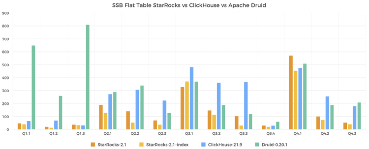
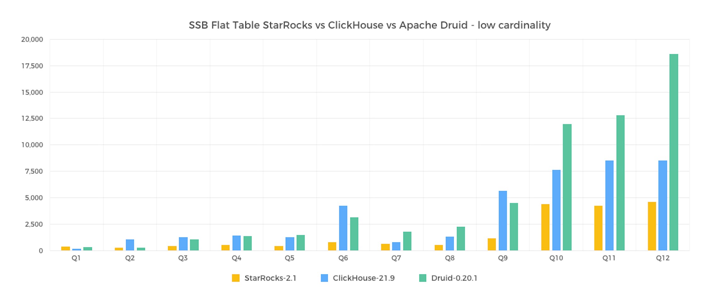

# SSB 性能测试

## 一、测试结论

Star Schema Benchmark（以下简称 SSB）是学术界和工业界广泛使用的一个星型模型测试集（来源[论文](https://www.cs.umb.edu/~poneil/StarSchemaB.PDF)），通过这个测试集合可以方便的对比各种 OLAP 产品的基础性能指标。Clickhouse 通过改写 SSB，将星型模型打平转化成宽表，改造成了一个单表测试 benchmark（参考[链接](https://clickhouse.tech/docs/en/getting-started/example-datasets/star-schema/)）。本报告记录了 StarRocks、Apache Druid 和 Clickhouse 在 SSB 单表数据集上的性能对比结果，并记录了在用户经常碰到的低基数聚合场景下 StarRocks 和 ClickHouse 的性能对比结果。测试结论如下：

- 在标准测试数据集的 13 个查询上，ClickHouse 的整体查询时间是 StarRocks 的 1.7 倍，Apache Druid 的整体查询时间是 StarRocks 的 2.2 倍。
- 在 StarRocks 启用 bitmap index 和 cache 的情况下，性能更胜一筹，尤其在 Q2.2 Q2.3 Q3.3 上有显著提升。整体性能是 ClickHouse 的 2.2 倍，Apache Druid 的 2.9 倍。



- 在标准测试数据集上，我们选取了一些常见的低基数聚合场景。ClickHouse 的整体查询时间是 StarRocks 的 2.26 倍。



在 SSB 单表和用户经常碰到的低基数聚合场景下对比了 StarRocks 和 ClickHouse 的性能指标。采用 3x16core 64GB 内存的云主机，在 6 亿行的数据规模进行测试。

## 二、测试准备

### （一）硬件环境

| 机器     | 3台 阿里云主机                                               |
| -------- | ------------------------------------------------------------ |
| CPU      | 16coreIntel(R) Xeon(R) Platinum 8269CY CPU @ 2.50GHzcache size : 36608 KB |
| 内存     | 64GB                                                         |
| 网络带宽 | 5Gbits/s                                                     |
| 磁盘     | ESSD 高效云盘                                                |

### （二）软件环境

StarRocks，Apache Druid 和 Clickhouse 部署在相同配置的机器上分别进行启动测试。

- StarRocks 部署 3BE 1FE；
- Clickhouse 部署三个节点后建立分布式表；
- Apache Druid 多一台 8core 的 master 主机，部署了 Broker/Coordinator/Overlord/Router（但是测试压力不在 master，影响较小可以忽略），Historical/MiddleManager 混合部署在与 SR，CK 同等配置的主机上。

内核版本：Linux 3.10.0-1127.13.1.el7.x86_64

操作系统版本：CentOS Linux release 7.8.2003

软件版本：StarRocks 社区版 2.1，Aapche Druid 0.20.1，Clickhouse 21.9

## 三、测试数据与结果

### （一）测试数据

| 表名           | 行数  | 解释             |
| -------------- | ----- | ---------------- |
| lineorder      | 6亿   | SSB 商品订单表   |
| customer       | 300万 | SSB 客户表       |
| part           | 140万 | SSB 零部件表     |
| supplier       | 20万  | SSB 供应商表     |
| dates          | 2556  | 日期表           |
| lineorder_flat | 6亿   | SSB 打平后的宽表 |

### （二）测试 SQL

#### 1. 单表测试 SQL

```SQL
--Q1.1 
SELECT sum(lo_extendedprice * lo_discount) AS `revenue` 
FROM lineorder_flat 
WHERE lo_orderdate >= '1993-01-01' and lo_orderdate <= '1993-12-31' AND lo_discount BETWEEN 1 AND 3 AND lo_quantity < 25; 

--Q1.2 
SELECT sum(lo_extendedprice * lo_discount) AS revenue FROM lineorder_flat  
WHERE lo_orderdate >= '1994-01-01' and lo_orderdate <= '1994-01-31' AND lo_discount BETWEEN 4 AND 6 AND lo_quantity BETWEEN 26 AND 35; 

--Q1.3 
SELECT sum(lo_extendedprice * lo_discount) AS revenue 
FROM lineorder_flat 
WHERE weekofyear(lo_orderdate) = 6 AND lo_orderdate >= '1994-01-01' and lo_orderdate <= '1994-12-31' 
 AND lo_discount BETWEEN 5 AND 7 AND lo_quantity BETWEEN 26 AND 35; 

--Q2.1 
SELECT sum(lo_revenue), year(lo_orderdate) AS year,  p_brand 
FROM lineorder_flat 
WHERE p_category = 'MFGR#12' AND s_region = 'AMERICA' 
GROUP BY year,  p_brand 
ORDER BY year, p_brand; 

--Q2.2 
SELECT 
sum(lo_revenue), year(lo_orderdate) AS year, p_brand 
FROM lineorder_flat 
WHERE p_brand >= 'MFGR#2221' AND p_brand <= 'MFGR#2228' AND s_region = 'ASIA' 
GROUP BY year,  p_brand 
ORDER BY year, p_brand; 

--Q2.3 
SELECT sum(lo_revenue),  year(lo_orderdate) AS year, p_brand 
FROM lineorder_flat 
WHERE p_brand = 'MFGR#2239' AND s_region = 'EUROPE' 
GROUP BY  year,  p_brand 
ORDER BY year, p_brand; 

--Q3.1 
SELECT c_nation, s_nation,  year(lo_orderdate) AS year, sum(lo_revenue) AS revenue FROM lineorder_flat 
WHERE c_region = 'ASIA' AND s_region = 'ASIA' AND lo_orderdate  >= '1992-01-01' AND lo_orderdate   <= '1997-12-31' 
GROUP BY c_nation, s_nation, year 
ORDER BY  year ASC, revenue DESC; 

--Q3.2 
SELECT  c_city, s_city, year(lo_orderdate) AS year, sum(lo_revenue) AS revenue
FROM lineorder_flat 
WHERE c_nation = 'UNITED STATES' AND s_nation = 'UNITED STATES' AND lo_orderdate  >= '1992-01-01' AND lo_orderdate <= '1997-12-31' 
GROUP BY c_city, s_city, year 
ORDER BY year ASC, revenue DESC; 

--Q3.3 
SELECT c_city, s_city, year(lo_orderdate) AS year, sum(lo_revenue) AS revenue 
FROM lineorder_flat 
WHERE c_city in ( 'UNITED KI1' ,'UNITED KI5') AND s_city in ( 'UNITED KI1' ,'UNITED KI5') AND lo_orderdate  >= '1992-01-01' AND lo_orderdate <= '1997-12-31' 
GROUP BY c_city, s_city, year 
ORDER BY year ASC, revenue DESC; 

--Q3.4 
SELECT c_city, s_city, year(lo_orderdate) AS year, sum(lo_revenue) AS revenue 
FROM lineorder_flat 
WHERE c_city in ('UNITED KI1', 'UNITED KI5') AND s_city in ( 'UNITED KI1',  'UNITED KI5') AND  lo_orderdate  >= '1997-12-01' AND lo_orderdate <= '1997-12-31' 
GROUP BY c_city,  s_city, year 
ORDER BY year ASC, revenue DESC; 

--Q4.1 
SELECT year(lo_orderdate) AS year, c_nation,  sum(lo_revenue - lo_supplycost) AS profit FROM lineorder_flat 
WHERE c_region = 'AMERICA' AND s_region = 'AMERICA' AND p_mfgr in ( 'MFGR#1' , 'MFGR#2') 
GROUP BY year, c_nation 
ORDER BY year ASC, c_nation ASC; 

--Q4.2 
SELECT year(lo_orderdate) AS year, 
    s_nation, p_category, sum(lo_revenue - lo_supplycost) AS profit 
FROM lineorder_flat 
WHERE c_region = 'AMERICA' AND s_region = 'AMERICA' AND lo_orderdate >= '1997-01-01' and lo_orderdate <= '1998-12-31' AND  p_mfgr in ( 'MFGR#1' , 'MFGR#2') 
GROUP BY year, s_nation,  p_category 
ORDER BY  year ASC, s_nation ASC, p_category ASC; 

--Q4.3 
SELECT year(lo_orderdate) AS year, s_city, p_brand, 
    sum(lo_revenue - lo_supplycost) AS profit 
FROM lineorder_flat 
WHERE s_nation = 'UNITED STATES' AND lo_orderdate >= '1997-01-01' and lo_orderdate <= '1998-12-31' AND p_category = 'MFGR#14' 
GROUP BY  year,  s_city, p_brand 
ORDER BY year ASC,  s_city ASC,  p_brand ASC; 
```

#### 2. 单表低基数测试 SQL

```SQL
--Q1
select count(*),lo_shipmode from lineorder_flat group by lo_shipmode;
--Q2
select count(distinct lo_shipmode) from lineorder_flat;
--Q3
select count(*),lo_shipmode,lo_orderpriority from lineorder_flat group by lo_shipmode,lo_orderpriority;
--Q4
select count(*),lo_shipmode,lo_orderpriority from lineorder_flat group by lo_shipmode,lo_orderpriority,lo_shippriority;
--Q5
select count(*),lo_shipmode,s_city from lineorder_flat group by lo_shipmode,s_city;
--Q6
select count(*) from lineorder_flat group by c_city,s_city;
--Q7
select count(*) from lineorder_flat group by lo_shipmode,lo_orderdate;
--Q8
select count(*) from lineorder_flat group by lo_orderdate,s_nation,s_region;
--Q9
select count(*) from lineorder_flat group by c_city,s_city,c_nation,s_nation;
--Q10
select count(*) from (select count(*) from lineorder_flat group by lo_shipmode,lo_orderpriority,p_category,s_nation,c_nation) t;
--Q11
select count(*) from (select count(*) from lineorder_flat_distributed group by lo_shipmode,lo_orderpriority,p_category,s_nation,c_nation,p_mfgr) t;
--Q12
select count(*) from (select count(*) from lineorder_flat group by substr(lo_shipmode,2),lower(lo_orderpriority),p_category,s_nation,c_nation,s_region,p_mfgr) t;
```

### （三）测试结果

#### 1. SSB 单表测试结果

> StarRocks 与 ClickHouse、Druid 的性能对比，分别使用 ClickHouse、Druid 的查询时间除以 StarRocks 的查询时间，且结果数字越大代表 StarRocks 性能越好。

|      | StarRocks-2.1(ms) | StarRocks-2.1-index(ms) | ClickHouse-21.9(ms) | ClickHouse/StarRocks 性能对比 | Druid-0.20.1(ms) | Druid/StarRocks 性能对比 |
| ---- | ----------------- | ----------------------- | ------------------- | ----------------------------- | ---------------- | ------------------------ |
| Q1.1 | 47                | 40                      | 65                  | 1.38                          | 650              | 13.83                    |
| Q1.2 | 20                | 13                      | 69                  | 3.45                          | 260              | 13.00                    |
| Q1.3 | 37                | 33                      | 31                  | 0.84                          | 810              | 21.89                    |
| Q2.1 | 190               | 127                     | 273                 | 1.44                          | 290              | 1.53                     |
| Q2.2 | 140               | 53                      | 307                 | 2.19                          | 340              | 2.43                     |
| Q2.3 | 70                | 37                      | 224                 | 3.20                          | 130              | 1.86                     |
| Q3.1 | 330               | 370                     | 481                 | 1.46                          | 370              | 1.12                     |
| Q3.2 | 147               | 113                     | 361                 | 2.46                          | 190              | 1.29                     |
| Q3.3 | 103               | 30                      | 367                 | 3.56                          | 120              | 1.17                     |
| Q3.4 | 30                | 20                      | 29                  | 0.97                          | 60               | 2.00                     |
| Q4.1 | 570               | 453                     | 475                 | 0.83                          | 510              | 0.89                     |
| Q4.2 | 100               | 73                      | 256                 | 2.56                          | 190              | 1.90                     |
| Q4.3 | 53                | 40                      | 180                 | 3.40                          | 210              | 3.96                     |
| sum  | 1837              | 1402                    | 3118                | 1.70                          | 4130             | 2.25                     |

#### 2. 低基数聚合测试结果

|      | SQL                                                          | 查询类型                                  | 结果集 的基数 | StarRocks (ms) | ClickHouse (ms) | 性能提升倍数(CK/SR) | Druid (ms) | 性能提升倍数(Druid/SR) |
| ---- | ------------------------------------------------------------ | ----------------------------------------- | ------------- | -------------- | --------------- | ------------------- | ---------- | ---------------------- |
| Q1   | `select count(*),lo_shipmode from lineorder_flat group by lo_shipmode;` | group by 1 个低基数列 `(<50)`               | 7             | 380            | 198             | 0.5                 | 341        | 0.9                    |
| Q2   | `select count(distinct lo_shipmode) from lineorder_flat;`      | count distinct 1 个低基数列 `(<50)`         | 1             | 280            | 1055            | 3.8                 | 304        | 1.1                    |
| Q3   | `select count(*),lo_shipmode,lo_orderpriority from lineorder_flat group by lo_shipmode,lo_orderpriority;` | group by 2 个低基数列                     | 35            | 470            | 1275            | 2.7                 | 1072       | 2.3                    |
| Q4   | `select count(*),lo_shipmode,lo_orderpriority from lineorder_flat group by lo_shipmode,lo_orderpriority,lo_shippriority;` | group by 2 个低基数列和一个int列          | 35            | 550            | 1431            | 2.6                 | 1391       | 2.5                    |
| Q5   | `select count(*),lo_shipmode,s_city from lineorder_flat group by lo_shipmode,s_city;` | group by 2 个低基数列（7 * 250）          | 1750          | 430            | 1273            | 3.0                 | 1513       | 3.5                    |
| Q6   | `select count(*) from lineorder_flat group by c_city,s_city;`  | group by 2 个低基数列  (250 * 250)        | 62500         | 790            | 4236            | 5.4                 | 3146       | 4.0                    |
| Q7   | `select count(*) from lineorder_flat group by lo_shipmode,lo_orderdate;` | group by 1 个低基数列 `(<50)` 和 1 个日期列 | 16842         | 650            | 804             | 1.2                 | 1825       | 2.8                    |
| Q8   | `select count(*) from lineorder_flat group by lo_orderdate,s_nation,s_region;` | group by 2 个低基数列 `(<50)` 和 1 个日期列 | 60150         | 550            | 1357            | 2.5                 | 2255       | 4.1                    |
| Q9   | `select count(*) from lineorder_flat group by c_city,s_city,c_nation,s_nation;` | group by 4 个低基数列                     | 62500         | 1160           | 5683            | 4.9                 | 4502       | 3.9                    |
| Q10  | `select count(*) from (select count(*) from lineorder_flat group by lo_shipmode,lo_orderpriority,p_category,s_nation,c_nation) t;` | group by 5 个低基数列 `(<50)`               | 546875        | 4430           | 7635            | 1.7                 | 11956      | 2.7                    |
| Q11  | `select count(*) from (select count(*) from lineorder_flat_distributed group by lo_shipmode,lo_orderpriority,p_category,s_nation,c_nation,p_mfgr) t;` | group by 6 个低基数列 `(<50)`               | 546875        | 4250           | 8540            | 2.0                 | 12817      | 3.0                    |
| Q12  | `select count(*) from (select count(*) from lineorder_flat group by substr(lo_shipmode,2),lower(lo_orderpriority),p_category,s_nation,c_nation,s_region,p_mfgr) t;` | group by 7 个包含函数计算的低基数列 `(<50)` | 468750        | 4620           | 8538            | 1.8                 | 18582      | 4.0                    |
| sum  |                                                              |                                           |               | 18560          | 42025           | 2.3                 | 59704      | 3.2                    |

## 四、测试步骤

ClickHouse 的建表导入参考[官方文档](https://clickhouse.tech/docs/en/getting-started/example-datasets/star-schema/)，StarRocks 的数据生成导入流程如下。

### （一）数据生成

首先下载 ssb-poc 工具包并编译。

```Bash
wget https://starrocks-public.oss-cn-zhangjiakou.aliyuncs.com/ssb-poc-0.10.0.zip
unzip ssb-poc-0.10.0.zip
cd ssb-poc-0.10.0
cd ssb-poc
make && make install  
```

所有相关工具安装到 output 目录。

进入 output 目录，生成数据。

```Bash
cd output
bin/gen-ssb.sh 100 data_dir
```

### （二）创建表结构

修改配置文件 conf/starrocks.conf，指定脚本操作的集群地址，用户名和密码，数据库名等。

```Bash
 # for mysql cmd
 mysql_host: 192.168.1.1
 mysql_port: 9030
 mysql_user: root
 mysql_password:
 database: ssb

# cluster ports
  http_port: 8030
  be_heartbeat_port: 9050
  broker_port: 8000

# parallel_fragment_exec_instance_num 设置并行度,建议是每个集群节点逻辑核数的一半,以下以8为例
  parallel_num: 8
 ...
```

执行脚本建表。

```Bash
# 测试100G数据
 bin/create_db_table.sh ddl_100
```

以下为"lineorder_flat"表建表语句。在上一步脚本中已经创建"lineorder_flat"表，并进行了默认分桶数配置。您可以删除该表，然后根据集群规模节点配置重新规划分桶数再进行创建，可实现更好测试效果。

```SQL
CREATE TABLE `lineorder_flat` (
  `lo_orderdate` date NOT NULL COMMENT "",
  `lo_orderkey` int(11) NOT NULL COMMENT "",
  `lo_linenumber` tinyint(4) NOT NULL COMMENT "",
  `lo_custkey` int(11) NOT NULL COMMENT "",
  `lo_partkey` int(11) NOT NULL COMMENT "",
  `lo_suppkey` int(11) NOT NULL COMMENT "",
  `lo_orderpriority` varchar(100) NOT NULL COMMENT "",
  `lo_shippriority` tinyint(4) NOT NULL COMMENT "",
  `lo_quantity` tinyint(4) NOT NULL COMMENT "",
  `lo_extendedprice` int(11) NOT NULL COMMENT "",
  `lo_ordtotalprice` int(11) NOT NULL COMMENT "",
  `lo_discount` tinyint(4) NOT NULL COMMENT "",
  `lo_revenue` int(11) NOT NULL COMMENT "",
  `lo_supplycost` int(11) NOT NULL COMMENT "",
  `lo_tax` tinyint(4) NOT NULL COMMENT "",
  `lo_commitdate` date NOT NULL COMMENT "",
  `lo_shipmode` varchar(100) NOT NULL COMMENT "",
  `c_name` varchar(100) NOT NULL COMMENT "",
  `c_address` varchar(100) NOT NULL COMMENT "",
  `c_city` varchar(100) NOT NULL COMMENT "",
  `c_nation` varchar(100) NOT NULL COMMENT "",
  `c_region` varchar(100) NOT NULL COMMENT "",
  `c_phone` varchar(100) NOT NULL COMMENT "",
  `c_mktsegment` varchar(100) NOT NULL COMMENT "",
  `s_region` varchar(100) NOT NULL COMMENT "",
  `s_nation` varchar(100) NOT NULL COMMENT "",
  `s_city` varchar(100) NOT NULL COMMENT "",
  `s_name` varchar(100) NOT NULL COMMENT "",
  `s_address` varchar(100) NOT NULL COMMENT "",
  `s_phone` varchar(100) NOT NULL COMMENT "",
  `p_name` varchar(100) NOT NULL COMMENT "",
  `p_mfgr` varchar(100) NOT NULL COMMENT "",
  `p_category` varchar(100) NOT NULL COMMENT "",
  `p_brand` varchar(100) NOT NULL COMMENT "",
  `p_color` varchar(100) NOT NULL COMMENT "",
  `p_type` varchar(100) NOT NULL COMMENT "",
  `p_size` tinyint(4) NOT NULL COMMENT "",
  `p_container` varchar(100) NOT NULL COMMENT ""
) ENGINE=OLAP
DUPLICATE KEY(`lo_orderdate`, `lo_orderkey`)
COMMENT "OLAP"
PARTITION BY RANGE(`lo_orderdate`)
(START ("1992-01-01") END ("1999-01-01") EVERY (INTERVAL 1 YEAR))
DISTRIBUTED BY HASH(`lo_orderkey`) BUCKETS 48
PROPERTIES (
"replication_num" = "1",
"in_memory" = "false",
"storage_format" = "DEFAULT"
);
```

同时修改 BE 的 page_cache 参数，并重启 BE。

```Bash
disable_storage_page_cache=false; -- 开启page_cache
storage_page_cache_limit=4294967296; --设置page_cache的大小
```

如您希望测试创建 bitmap_index 情况下的性能，可以进行如下操作。如您希望直接测试标准性能，请跳过此步骤进行数据导入。

对所有字符串列创建 bitmap_index。

```sql
--对 lo_orderpriority、lo_shipmode、c_name、c_address、c_city、c_nation、c_region、c_phone、c_mktsegment、s_region、s_nation、s_city、s_name、s_address、s_phone、p_name、p_mfgr、p_category、p_brand、p_color、p_type、p_container 创建bitmap_index

CREATE INDEX bitmap_lo_orderpriority ON lineorder_flat (lo_orderpriority) USING BITMAP;
CREATE INDEX bitmap_lo_shipmode ON lineorder_flat (lo_shipmode) USING BITMAP;
CREATE INDEX bitmap_c_name ON lineorder_flat (c_name) USING BITMAP;
CREATE INDEX bitmap_c_address ON lineorder_flat (c_address) USING BITMAP;
CREATE INDEX bitmap_c_city ON lineorder_flat (c_city) USING BITMAP;
CREATE INDEX bitmap_c_nation ON lineorder_flat (c_nation) USING BITMAP;
CREATE INDEX bitmap_c_region ON lineorder_flat (c_region) USING BITMAP;
CREATE INDEX bitmap_c_phone ON lineorder_flat (c_phone) USING BITMAP;
CREATE INDEX bitmap_c_mktsegment ON lineorder_flat (c_mktsegment) USING BITMAP;
CREATE INDEX bitmap_s_region ON lineorder_flat (s_region) USING BITMAP;
CREATE INDEX bitmap_s_nation ON lineorder_flat (s_nation) USING BITMAP;
CREATE INDEX bitmap_s_city ON lineorder_flat (s_city) USING BITMAP;
CREATE INDEX bitmap_s_name ON lineorder_flat (s_name) USING BITMAP;
CREATE INDEX bitmap_s_address ON lineorder_flat (s_address) USING BITMAP;
CREATE INDEX bitmap_s_phone ON lineorder_flat (s_phone) USING BITMAP;
CREATE INDEX bitmap_p_name ON lineorder_flat (p_name) USING BITMAP;
CREATE INDEX bitmap_p_mfgr ON lineorder_flat (p_mfgr) USING BITMAP;
CREATE INDEX bitmap_p_category ON lineorder_flat (p_category) USING BITMAP;
CREATE INDEX bitmap_p_brand ON lineorder_flat (p_brand) USING BITMAP;
CREATE INDEX bitmap_p_color ON lineorder_flat (p_color) USING BITMAP;
CREATE INDEX bitmap_p_type ON lineorder_flat (p_type) USING BITMAP;
CREATE INDEX bitmap_p_container ON lineorder_flat (p_container) USING BITMAP;
```

修改BE参数并重启BE。

```SQL
bitmap_max_filter_ratio=1000; 
```

### （三）数据导入

使用 Stream load 导入单表数据。

```Bash
bin/stream_load.sh data_dir
```

插入数据到宽表 lineorder_flat。

```Bash
bin/flat_insert.sh 
```

### （四）数据查询

1. SSB query

   ```Bash
   bin/benchmark.sh -p -d ssb

   bin/benchmark.sh -p -d ssb-flat
   ```

2. 低基数query

   ```Bash
   bin/benchmark.sh -p -d ssb-low_cardinality
   ```
