# StarRocks Python Client - Development Design

This document outlines the technical design of the `starrocks-python-client` project. It covers the overall architecture and the key plugin development flows for integrating with SQLAlchemy and Alembic.

---

## 1. Overall Architecture

The `starrocks-python-client` acts as a SQLAlchemy Dialect, bridging the gap between the SQLAlchemy/Alembic ecosystem and the StarRocks database. The architecture is designed as a plug-in, extending the core libraries without modifying their source code.

```mermaid
graph TD
    subgraph "User & Application Layer"
        User(["👨‍💻<br/>Developer"]);
        AppCode["<b>models.py</b><br/>(ORM Classes, View/MV objects)"];
        AlembicCLI["Alembic CLI<br/>(revision, upgrade)"];
    end

    subgraph "Framework Layer"
        SQLAlchemyCore["SQLAlchemy Core / ORM"];
        AlembicCore["Alembic Core Engine"];
        MigrationScript["<b>versions/xxx.py</b><br/>(Generated Migration Script)"];
    end

    subgraph "StarRocks Python Client (Our Project)"
        style StarRocksClient fill:#D5E8D4,stroke:#82B366,stroke-width:2px
        Dialect["<b>StarRocksDialect</b><br/>(Main Entry Point)"];
        Compiler["<b>StarRocksDDLCompiler</b><br/>(Generates StarRocks SQL)"];
        Inspector["<b>StarRocksInspector</b><br/>(Reflects DB Schema)"];
        SchemaObjects["<b>Custom Schema Objects</b><br/>(View, MaterializedView)"];

        subgraph "Alembic Integration"
            style AlembicIntegration fill:#DAE8FC,stroke:#6C8EBF,stroke-width:1px
            Compare["<b>compare.py</b><br/>(Detects Differences)"];
            Ops["<b>ops.py</b><br/>(Custom Operations)"];
            Render["<b>render.py</b><br/>(Renders Ops to SQL)"];
        end
    end

    subgraph "Database Layer"
        PyMySQL["PyMySQL Driver"];
        StarRocksDB["<b>StarRocks Database</b><br/>(information_schema)"];
    end

    %% --- Flows ---
    User -- "Writes" --> AppCode;
    User -- "Runs" --> AlembicCLI;
    AlembicCLI -- "1. Invokes" --> AlembicCore;

    %% Autogenerate Flow
    AlembicCore -- "<b>2a. (autogenerate)</b><br/>Triggers Hooks" --> Compare;
    Compare -- "Reads Python Metadata from" --> AppCode;
    Compare -- "Uses Inspector to Read DB" --> Inspector;
    Inspector -- "Queries information_schema via" --> PyMySQL;
    Compare -- "Generates Custom Ops" --> Ops;
    Ops -- "<b>2b. Writes into</b>" --> MigrationScript;

    %% Upgrade Flow
    AlembicCore -- "<b>3a. (upgrade)</b><br/>Executes" --> MigrationScript;
    MigrationScript -- "Calls op.* functions which trigger" --> Render;
    Render -- "Uses Compiler to generate SQL" --> Compiler;
    Compiler -- "<b>3b. Generates StarRocks DDL</b>" --> PyMySQL;

    %% Generic Connections
    SQLAlchemyCore -- "Loads & Uses" --> Dialect;
    Dialect -- "Provides" --> Compiler;
    Dialect -- "Provides" --> Inspector;
    AppCode -- "Builds on" --> SQLAlchemyCore;
    AppCode -- "Instantiates" --> SchemaObjects;
    PyMySQL -- "Connects to" --> StarRocksDB;
```

### Key Workflows

1. **Autogenerate Flow (Schema Comparison)**: The user runs `alembic revision --autogenerate`. Our `compare.py` module is triggered. It uses the `StarRocksInspector` to read the database's current state and compares it against the user's `models.py`. The detected differences are translated into a series of operations (`ops.py`) which are written into a new migration script.

2. **Upgrade Flow (Schema Migration)**: The user runs `alembic upgrade`. The migration script is executed. The operations within the script trigger our `render.py` module, which in turn uses the `StarRocksDDLCompiler` to generate the final StarRocks-specific DDL. This DDL is then executed against the database.

---

## 2. Key Plugin Development Flows

To extend SQLAlchemy and Alembic, we hook into several key processes. Understanding these is crucial for development.

### 2.1 `inspect` (Reflection) Flow

**Goal**: To read the schema from a StarRocks database and convert it into SQLAlchemy-understandable Python objects.

**Workflow**:

**How-To**: We implement methods in our `StarRocksDialect` and `StarRocksInspector`.

- **Location**: `starrocks/dialect.py`, `starrocks/reflection.py`
- **Key Methods**:
  - `get_table_names()`, `get_view_names()`, `get_materialized_view_names()`
  - `get_columns(table_name)`
  - `get_view_definition(view_name)`
  - `get_pk_constraint`, `get_indexes`
  - **`get_table_options(table_name)`**: Crucial for fetching StarRocks-specific properties like `DISTRIBUTED BY` and `PROPERTIES`.

### 2.2 `compile` (DDL Compilation) Flow

**Goal**: To translate SQLAlchemy's abstract DDL objects (e.g., `CreateTable`) into concrete StarRocks SQL dialect.

**Workflow**:

**How-To**: We create a `StarRocksDDLCompiler` inheriting from `MySQLDDLCompiler` and implement `visit_*` methods for each DDL element we want to customize.

- **Location**: `starrocks/compiler.py` (recommended) or `starrocks/dialect.py`
- **Key Methods**:
  - `visit_create_table(element)`: Reads `starrocks_*` kwargs from the `Table` object and appends clauses like `DISTRIBUTED BY...` and `PROPERTIES...`.
  - `visit_create_view(element)`: Compiles our custom `View` object into a `CREATE VIEW` statement.
  - `visit_AlterTableDistribution(element)`: Compiles our custom `AlterTableDistribution` DDL element into an `ALTER TABLE...` statement.

### 2.3 Alembic `compare` Flow

**Goal**: To detect differences between code-defined schema and the database schema for `autogenerate`.

**Workflow**: Alembic uses a decorator-based dispatch system. We register our custom comparison functions to be called during the `autogenerate` process.

**How-To**: We write decorated functions in `starrocks/alembic/compare.py`.

- `@comparators.dispatch_for("schema")`: For container-level objects. We use this to compare the lists of `Views` and `Materialized Views`.
- `@comparators.dispatch_for("table")`: To compare StarRocks-specific table-level options (`PROPERTIES`, `DISTRIBUTED BY`, etc.) after Alembic has compared the standard table attributes.
- `@comparators.dispatch_for("column")`: To compare StarRocks-specific column-level attributes (e.g., aggregation type).

### 2.4 Alembic `ops` and `render` Flow

**Goal**: To define custom Alembic operations and control how they are represented as Python code within migration scripts, or represendted as SQL by using `--sql`.

**How-To**:

1.  **Define Custom Operations (`ops.py`)**:

    - Create classes like `CreateViewOp(MigrateOperation)`.
    - These classes define the structure of the operation and its `reverse()` method for downgrades.

2.  **Render Operations (`render.py`)**:
    - Implement a function for each custom op, decorated with `@renderers.dispatch_for(CreateViewOp)`.
    - This function defines how Alembic generates the Python code (e.g., `op.create_view(...)`) that appears in the `upgrade()` and `downgrade()` methods of the migration script. The actual execution of these `op.*` functions during `alembic upgrade` will then trigger the DDL Compiler to generate and execute the corresponding SQL.

- [Inspect](./inspect.md)
- [Compare](./compare.md)
- [Compile](./compile.md)
- [Render](./render.md)
- [Column Definitions](./column_definitions.md)
