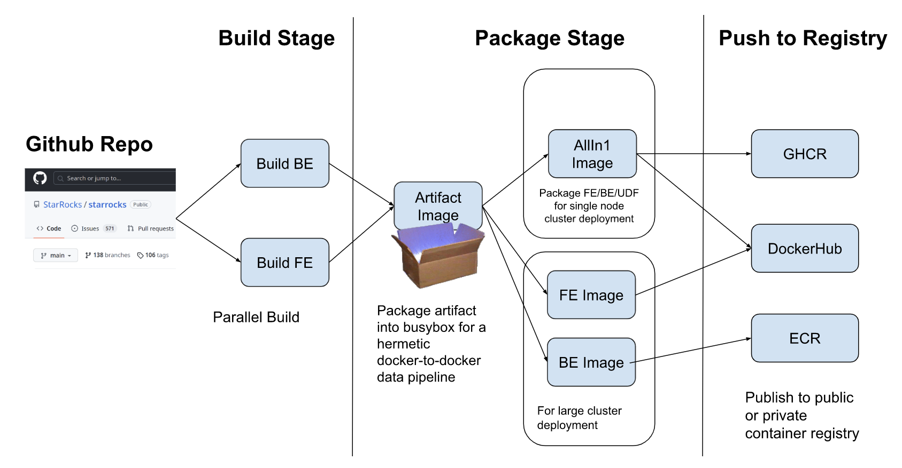

The building of Starrocks artifacts and packaging to runtime container images are performed in a hermetic, [multi-stage docker build](https://docs.docker.com/build/building/multi-stage/) environment. This setup enables the reuse of FE/BE artifacts for packaging into container images for different deployment scenarios. The building of artifacts will be executed in parallel leveraging the [BuildKit](https://docs.docker.com/build/buildkit/) for optimal speed.



# 1. Starrocks Ubuntu dev env image
This [dev-env-ubuntu.Dockerfile](dev-env-ubuntu.Dockerfile) build the docker image for the dev environment.
It builds and pre-install all the toolchains, dependence libraries, and maven dependencies that are needed for building Starrocks FE and BE.

## 1.1 Build Ubuntu dev env image
```
DOCKER_BUILDKIT=1 docker build --rm=true -f dev-env-ubuntu.Dockerfile -t ghcr.io/OWNER/starrocks/dev-env-ubuntu:<tag> ../..
```
E.g.:
```shell
DOCKER_BUILDKIT=1 docker build --rm=true -f dev-env-ubuntu.Dockerfile -t ghcr.io/dengliu/starrocks/dev-env-ubuntu:latest ../..
```
## 1.2 Publish image to ghcr
```
docker push ghcr.io/OWNER/starrocks/dev-env-ubuntu:<tag>
```
E.g.:
```shell
docker push ghcr.io/dengliu/starrocks/dev-env-ubuntu:latest
```

# 2 Starrocks artifacts image

Artifact Package Stage packages the artifacts into a Busybox based image. The busybox base image is only 1MB, the packaged artifact image serves as a carrier to pass the Starrocks artifact to the next stage of docker build to package into various types of k8s deployment runtime images.


## 2.1 Build Starrocks aftifacts image for Ubuntu
Build the Starrocks artifacts fe & be and package them into a busybox basedimage

```
DOCKER_BUILDKIT=1 docker build -f artifact-ubuntu.Dockerfile -t ghcr.io/OWNER/starrocks/artifact-ubuntu:<tag> ../..
```
E.g.
```shell
DOCKER_BUILDKIT=1 docker build -f artifact-ubuntu.Dockerfile -t ghcr.io/dengliu/starrocks/artifact-ubuntu:latest ../..
```

## 2.2 Publish image to ghcr
```
docker push ghcr.io/OWNER/starrocks/artifact-ubuntu:<tag>
```
E.g.:
```shell
docker push ghcr.io/dengliu/starrocks/artifact-ubuntu:latest
```


# 3. Starrocks be ubuntu image

## 3.1 Build Starrocks be ubuntu image for k8s deployment
```
DOCKER_BUILDKIT=1 docker build -f be-ubuntu.Dockerfile -t ghcr.io/OWNER/starrocks/be-ubuntu:<tag> ../..
```
E.g.:
- Use artifact image to package runtime container
```shell
DOCKER_BUILDKIT=1 docker build --build-arg ARTIFACT_SOURCE=image --build-arg ARTIFACTIMAGE=ghcr.io/dengliu/starrocks/artifact-ubuntu:latest -f be-ubuntu.Dockerfile -t be-ubuntu:latest ../..
```

- Use locally build artifacts to package runtime container
```shell
DOCKER_BUILDKIT=1 docker build --build-arg ARTIFACT_SOURCE=local --build-arg LOCAL_REPO_PATH=. -f be-ubuntu.Dockerfile -t be-ubuntu:latest ../..
```

## 3.2 Publish image to ghcr
```
docker push ghcr.io/OWNER/starrocks/be-ubuntu:<tag>
```
E.g.:
```shell
docker push ghcr.io/dengliu/starrocks/be-ubuntu:latest
```


# 4. Starrocks fe ubuntu image

## 4.1 Build Starrocks fe ubuntu image for k8s deployment
```
DOCKER_BUILDKIT=1 docker build -f fe-ubuntu.Dockerfile -t ghcr.io/OWNER/starrocks/fe-ubuntu:<tag> ../..
```
E.g.:
- Use artifact image to package runtime container
```shell
DOCKER_BUILDKIT=1 docker build --build-arg ARTIFACT_SOURCE=image --build-arg ARTIFACTIMAGE=ghcr.io/dengliu/starrocks/artifact-ubuntu:latest -f fe-ubuntu.Dockerfile -t fe-ubuntu:latest ../..
```

- Use locally build artifacts to package runtime container
```shell
DOCKER_BUILDKIT=1 docker build --build-arg ARTIFACT_SOURCE=local --build-arg LOCAL_REPO_PATH=. -f fe-ubuntu.Dockerfile -t fe-ubuntu:latest ../..
```

## 4.2 Publish image to ghcr
```
docker push ghcr.io/OWNER/starrocks/fe-ubuntu:<tag>
```
E.g.:
```shell
docker push ghcr.io/dengliu/starrocks/fe-ubuntu:latest
```
