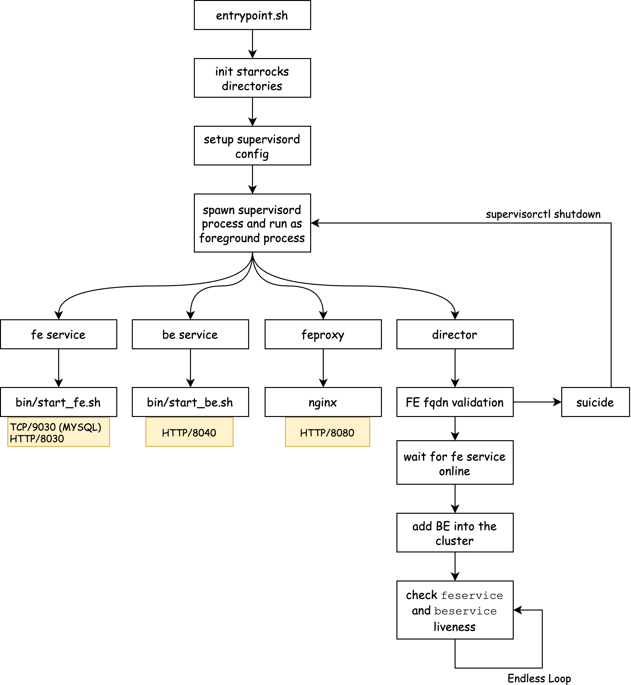

# Allin1 Image HOWTO

This document describes how the `allin1` image is created and the internal details of the service setup. Also, a few examples are provided for running `allin1` in different scenarios.

## How Does Allin1 Work

StarRocks [allin1 image](https://hub.docker.com/r/starrocks/allin1-ubuntu) provides the ability to bring up a brand new StarRocks cluster with 1 FE node and 1 BE node running inside the same container.



* **supervisord**: The main process and the watchdog process to spawn and manage all the child processes.
* **feservice**: The Frontend service, running under `/data/deploy/starrocks/fe`. Usually `TCP/9030` is exposed to the host network for the mysql compatible communication.
* **beservice**: The Backend service, running under `/data/deploy/starrocks/be`. Usually no port is needed to expose to the host network.
* **feproxy**: The nginx reverse proxy service, running under `/data/deploy/starrocks/feproxy`, which proxies all the Frontend's HTTP traffic and eliminates possible redirections with the Backend internal address to the HTTP client. Usually, `TCP/8080` is exposed to the host network for Stream Load related user scenarios.
* **director**: The init script to set up the StarRocks cluster. No port is needed to expose.

## Examples

### Run a shared-nothing cluster

Running a shared-nothing cluster with TCP/9030 and TCP/8080 exposed to the host network.

```shell
docker run -it -p 9030:9030 -p 8080:8080 --name sr-shared-nothing starrocks/allin1-ubuntu:latest
```

### Run a shared-data cluster

Running a shared-data cluster with TCP/9030 and TCP/8080 exposed to the host network.
```shell
docker run -it -p 9030:9030 -p 8080:8080 -e RUN_MODE=shared_data --name sr-shared-data starrocks/allin1-ubuntu:latest
```

### Run the cluster after `root` user's password changed

When the `root` user's password is changed through MYSQL protocol, the container may have difficulty to start due to not able to access Frontend service to grab the system information. `MYSQL_PASSWORD` environment variable can be used.

```shell
docker run -it -p 9030:9030 -p 8080:8080 -e MYSQL_PASSWORD=<root_password> --name sr-shared-nothing starrocks/allin1-ubuntu:latest
```

### Loading data into the cluster via stream load HTTP interface

When loading data into the StarRocks cluster through the Stream Load interface, the `feproxy` component is a must to solve the problem that the FE's HTTP response redirects the client to the Backend service via an internal address only available inside the container.

```shell
# run the container
docker run -it -p 9030:9030 -p 8080:8080 --name sr-shared-nothing-streamload starrocks/allin1-ubuntu:latest

# load datafile example1.csv into the StarRocks cluster inside the container
curl --location-trusted -u <username>:<password> -H "label:<load_label>" \
    -H "Expect:100-continue" \
    -H "column_separator:," \
    -H "columns: id, name, score" \
    -T example1.csv -XPUT  \
    http://<container_external_ip>:<nginx_http_port>/api/{dbname}/{tablename}/_stream_load
```

### Switch to a different StarRocks version

The allin1 image is available on Docker Hub for every official StarRocks release. End users can change the image tag to the specific version number to run a specific StarRocks release.

```shell
# run StarRocks 3.4-latest
docker run -it -p 9030:9030 -p 8080:8080 --name sr-shared-nothing starrocks/allin1-ubuntu:3.4-latest


# run StarRocks 3.3.11
docker run -it -p 9030:9030 -p 8080:8080 --name sr-shared-nothing starrocks/allin1-ubuntu:3.3.11
```
