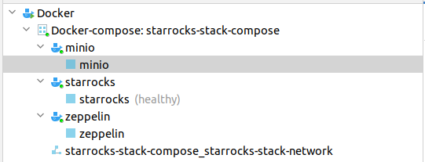
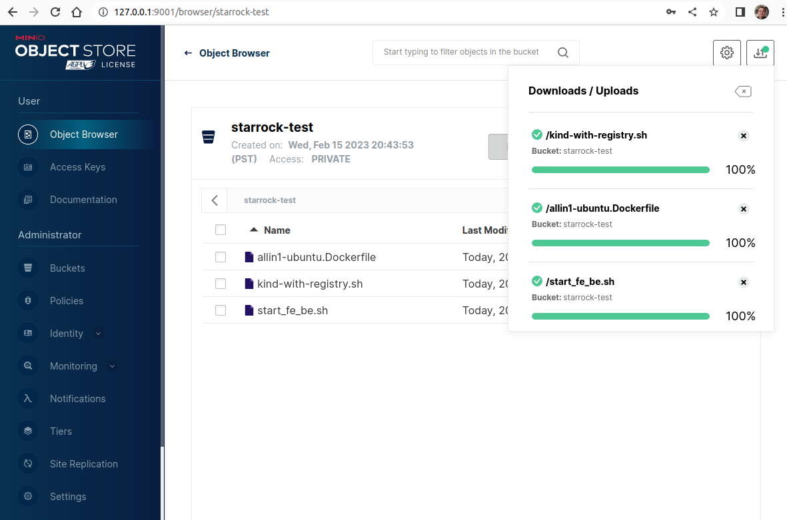
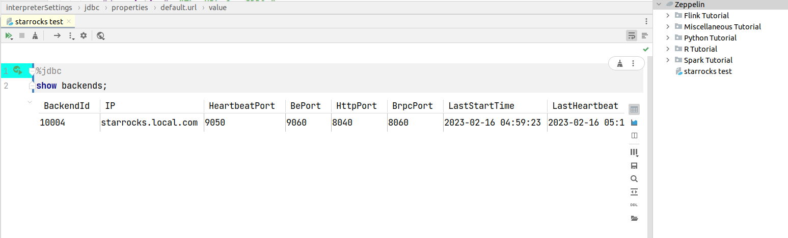

# StarRocks Stacks Docker Compose 

Docker Compose for StarRocks AllIn1 container and a few other peripheral applications for StarRocks development and test on local laptop

## This compose file composes the following services:
- starrocks allin1 local cluster service.
- minio local service.(used by testing broker load)
- zeppelin local service with: (used as sql notebook and data visualization)
  - mysql jdbc interpreter pre-configured and connected to starrocks allin1 service.
  - sample starrocks notebook.



**Note**: Please refer to [docker-compose.yml](docker-compose.yml) to customize the container port mapping, volume mount, or other docker configs.

## Start the StarRocks stack compose environment

### Start all services in the compose file
```shell
COMPOSE_DOCKER_CLI_BUILD=1 DOCKER_BUILDKIT=1 docker compose up -d
```

### Start a specific service(s) in the compose file

```shell
COMPOSE_DOCKER_CLI_BUILD=1 DOCKER_BUILDKIT=1 docker compose up -d starrocks minio
```

### Stop the Celostar compose environment
```shell
docker compose down                                               
```
## Minio Local Service
MinIO Object Storage Server Running locally.
This service can be accessed from:
- **local laptop**
  - Storage API: http://127.0.0.1:9000
  - Console: http://127.0.0.1:9001
- **docker network**
  - Storage API: http://minio.local.com:9000
  - Console: http://minio.local.com:9001


Documentation: https://min.io/docs/minio/linux/index.html



## Zeppelin Local Service
Zeppelin Notebook Service running locally.
This service can be accessed from:
- **local laptop**: http://127.0.0.1:8089
- **docker network**: http://zeppelin.local.com:8089

The Zeppelin Notebook can also be accessed via Big Data Tools Intellij plugin


