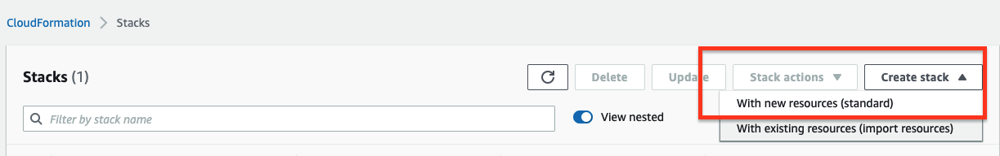
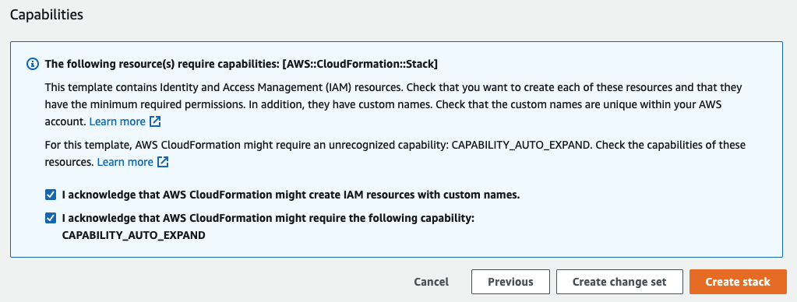

# Deploy a StarRocks Cluster on AWS by Using AWS CloudFormation

StarRocks supports integration with AWS CloudFormation since version 2.3.0. You can use AWS CloudFormation to quickly deploy and use StarRocks clusters on AWS.

## AWS CloudFormation

AWS CloudFormation is provided by AWS to help you conveniently and fastly model and set up AWS resources and third-party resources, such as StarRocks clusters, so that you can spend less time managing resources and more time using them. You create a template that describes the resources you need, and AWS CloudFormation takes care of configuring those resources for you. For more information, see [What is AWS CloudFormation?](https://docs.aws.amazon.com/AWSCloudFormation/latest/UserGuide/Welcome.html)

## Basic Concepts

### Templates

Templates are JSON or YAML formatted text files that describe AWS resources and third-party resources, as well as the properties of those resources. For more information, see [Templates](https://docs.aws.amazon.com/AWSCloudFormation/latest/UserGuide/cfn-whatis-concepts.html#w2aab5c15b7).

### Stacks

Stacks are used to create and manage the resources described in templates. You can create, update, and delete a set of resources by creating, updating, and deleting stacks. All resources in a stack are defined by a template. Suppose you have created a template that describes various resources. To configure these resources, you need to create a stack by submitting the template that you created, and AWS CloudFormation then configures all those resources for you. For more information, see [Stacks](https://docs.aws.amazon.com/AWSCloudFormation/latest/UserGuide/cfn-whatis-concepts.html#w2ab1b5c15b9).

## Procedure

1. Log in to the [AWS CloudFormation console](https://console.aws.amazon.com/cloudformation/home).

2. Choose **Create stack** > **With new resources (standard)**.
    
3. Follow these steps to specify the template:
    
    1. Under **Prerequisite - Prepare template**, choose **Template is ready.**
    2. Under **Specify template**, choose **Template source** as **Amazon S3 URL.** And under **Amazon S3 URL,** enter the following address:
        `https://cf-templates-1euv6e68138u2-us-east-1.s3.amazonaws.com/templates/starrocks.template.yaml`
        > Note: You can also set **Template source** to **Upload a template file**. Click **Choose file** to upload the **starrocks.template.yaml** file. You can download the **starrocks.template.yaml** file from the [aws-cloudformation repository](https://github.com/StarRocks/aws-cloudformation) in the StarRocks project.
        .
    3. Click **next**.

4. Specify the stack details, including the **Stack name** and **Parameters.** Click **Next**.

   1. Type a stack name in the **Stack name** field.

      The stack name is an identifier that helps you find a particular stack from a list of stacks. A stack name can contain only letters (case-sensitive), characters, and hyphens(-). It must start with a letter and can be up to 128 characters in length.

   2. Configure the following parameters.

    | Type                            | Parameter                                                    | Description                                                  |
    | ------------------------------- | ------------------------------------------------------------ | ------------------------------------------------------------ |
    | Network configuration           | Availability Zones                                           | Select an availability zone for deploying the StarRocks cluster. For more information, see [Regions and Zones](https://docs.aws.amazon.com/AWSEC2/latest/UserGuide/using-regions-availability-zones.html#concepts-local-zones). |
    | EC2 configuration               | Key pair name                                                | A key pair, consisting of a public key and a private key, is a set of security credentials that you use to prove your identity when you attempt to connect to an Amazon EC2 instance. For more information, see [key pairs](https://docs.aws.amazon.com/AWSEC2/latest/UserGuide/ec2-key-pairs.html).Note: If you need to create a key pair, see [Create key pairs](https://docs.aws.amazon.com/AWSEC2/latest/UserGuide/create-key-pairs.html). |
    | Environment configuration       | Reference the latest Amazon Linux AMI in a CloudFormation template | The ID of the latest Amazon Machine Image (AMI) with the 64-bit architecture (`x86_64`), which is used to launch an Amazon EC2 instance.Note: An AMI is a supported and maintained image provided by AWS. It provides the information required to launch an Amazon EC2 instance. For more information, see [Amazon Machine Images](https://docs.aws.amazon.com/AWSEC2/latest/UserGuide/AMIs.html). |
    |                                 | URL of download JDK 1.8                                      | The URL from which you can download JDK 1.8.                 |
    |                                 | URL of StarRocks                                             | The URL from which you can download the StarRocks binary package. |
    | StarRocks Cluster configuration | Number of StarRocks Fe                                       | The number of FEs. Default value: **1**. Valid values: **1** and **3**. |
    |                                 | Fe instance type                                             | The instance type of the Amazon EC2 to which a FE node belongs. Default value: **t2.micro**. For more information about instance types, see [Amazon EC2 Instance Types](https://aws.amazon.com/ec2/instance-types/?nc1=h_ls). |
    |                                 | Number of StarRocks Be                                       | The number of BEs. Default value: **3.** Valid values: **3** and **6**. |
    |                                 | Be instance type                                             | The instance type of the Amazon EC2 to which the BE nodes belong. Default value: **t2.micro**. For more information about instance types, see [Amazon EC2 Instance Types](https://aws.amazon.com/ec2/instance-types/?nc1=h_ls). |
    | Fe configuration                | Dir to save fe log                                           | The path of the FE log file. Only absolute paths are allowed. |
    |                                 | Sys Log Level                                                | The logging level of FE. Default level: **INFO.** Valid levels: **INFO**, **WARN**, **ERROR** and **FATAL**. |
    |                                 | Meta data dir                                                | The path of the FE metadata file. The value of this parameter must be an absolute path. The default value is **feDefaultMetaPath**, which means to use **/home/starrocks/StarRocks/fe/meta**. |
    | BE configuration                | Dir to save be sys log                                       | The path of the log file on each BE. The value of this parameter must be an absolute path. |
    |                                 | Sys Log Level                                                | The log level of each BE. Default level: **INFO.** Valid levels: **INFO**, **WARN**, **ERROR** and **FATAL**. |
    |                                 | Volume type of Be nodes                                      | The type of the Amazon EBS volume attached to the Amazon EC2 instances to which each BE belongs. An Amazon EBS volume is a block-level storage device that you can attach to Amazon EC2 instances. For more information, see [Amazon EBS volumes](https://docs.aws.amazon.com/AWSEC2/latest/UserGuide/ebs-volumes.html). |
    |                                 | Volume size of Be nodes                                      | The storage capacity of EBS volumes that BE nodes use to store data. Unit: GB. |

5. Configure more options about the stack. For more information, see [Setting AWS CloudFormation stack options](https://docs.aws.amazon.com/AWSCloudFormation/latest/UserGuide/cfn-console-add-tags.html).

    After the configuration is completed, click **Next**.

6. Review the stack information you entered, including the template, details, and more options. You can also estimate the cost of your stack. For more information, see [Reviewing your stack and estimating stack cost on the AWS CloudFormation console](https://docs.aws.amazon.com/AWSCloudFormation/latest/UserGuide/cfn-using-console-create-stack-review.html).

    > Note: If you need to change any of the parameters, click **Edit** on the top right corner of the related section to go back to the relevant page.

7. Select the following two check boxes and click **Create stack**.
    
