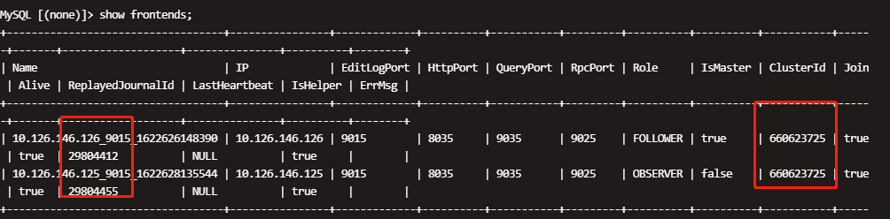

# Restore FEs

This topic describes how to restore the frontends (FEs) in your StarRocks cluster if the cluster is unavailable due to one of the following issues:

- An FE cannot start Berkeley DB Java Edition (BDBJE).

- An FE cannot synchronize data to the other FEs.

- Your StarRocks cluster cannot write metadata into an FE.

- Your StarRocks cluster cannot select a follower FE as the leader FE.

> **Note**
>
> - Proceed with caution when you perform the operations that are described in this topic. Improper operations may cause an irreversible loss of data. If the FEs in your StarRocks cluster cannot start, we recommend that you troubleshoot the start failure rather than using this topic to restore the FEs.
>
> - The method that is provided in this topic cannot help you resolve the preceding issues. The method can only help you restore the service of your StarRocks cluster at the earliest opportunity. We recommend that you contact StarRocks technical support when you restore FEs.

## Procedure

To manually restore the FEs in your StarRocks cluster, you must select an FE as the new leader FE, start that FE by using the metadata stored in the meta_dir directory, and then add the other FEs one by one.

### Step 1: Stop all FEs

To prevent unanticipated problems, do not access the data when the restoration is in progress.

### Step 2: Find the FE that contains the latest metadata

Back up the meta_dir directories of all FEs. If the meta_dir directory of an FE cannot be found in the default path, view the **xxx/fe/conf/fe.conf** file of an FE to obtain the directory. Example:

```Shell
meta_dir = /home/disk1/sr/StarRocks-1.19.0/fe-3365df09-14bc-44a5-aabc-ccfaa5824d52/meta
```

The following figure shows the structure of the meta_dir directory.


Usually, the leader FE stores the latest metadata. To obtain the latest metadata, you can switch to the installation directory of each FE and run the following command to obtain the lastVLSN value of each FE. The FE that has the largest lastVLSN value stores the latest metadata.

```Shell
java -jar lib/je-7.3.7.jar DbPrintLog -h meta/bdb/ -vd 
```

The current path of lib/je-7.3.7.jar is **starrocks/fe**.

The following figure shows an example on how to identify the largest lastVLSN value.


### Step 3: Restore the FE that contains the latest metadata

The restoration steps vary for each FE based on the role of an FE. We recommend that you restore the follower FE that contains the latest metadata. View the image directory of each FE to check the role of the FE. A sample path of the image directory is **/xxx/StarRocks-xxx/fe-xxx****/meta/image**.


#### Restore a follower FE

We recommend that you restore a follower FE. Perform the following steps to restore a follower FE:

1. Set `metadata_failure_recovery` in the **fe.conf** file to `true` to delete the metadata of other FEs in BDBJE except for the metadata of the FE that needs to be restored. In this way, the FE cannot connect with other FEs and starts as a standalone FE.
2. Run `./bin/start_fe.sh --deamon` to start the FE, which works as the leader FE. You can see `transfer from XXXX to MASTER` in the **fe.log** log.
3. You can send queries to the FE to check whether the FE is started successfully. If an error occurs, view the log of the FE and troubleshoot the error based on the log data and then restart the FE. If no error occurs, you can run the `show frontends` command to check the details of all the FEs that are added to your StarRocks cluster before. The current FE is the leader FE.
4. Delete `metadata_failure_recovery=true` from the **fe.conf** file or change `true` to `false`. Then restart the FE. Otherwise, the metadata of BDBJE is deleted when you restart the FE, and other FEs cannot work properly.

#### Restore an observer FE

Perform the following steps to restore an observer FE:

1. Change `role=OBSERVER` to `role=FOLLOWER` in the **meta_dir/image/ROLE** file.

2. Set `metadata_failure_recovery` in the **fe.conf** file of the FE to `true` to delete the metadata of other FEs in BDBJE except for the metadata of the FE that needs to be restored. In this way, the FE cannot connect with other FEs and starts as a standalone FE.

3. Run `./bin/start_fe.sh --deamon` to start the FE, which works as the leader FE. You can see `transfer from XXXX to MASTER` in the **fe.log** log.

4. You can send queries to the FE to check whether the FE is started successfully. If an error occurs, view the log of the FE and troubleshoot the error based on the log data and then restart the FE. If no error occurs, you can run the `show frontends` command to check the details of all the FEs that are added to your StarRocks cluster before.

5. Then you can find the issue: The role of the current FE is an observer, but the value of the `IsMaster` parameter is `true`. The inconsistency is because the role of the current FE is recorded in FE metadata, whereas the value of the `IsMaster` parameter is recorded in BDBJE. To perform operations such as data loading, you need to perform the following steps to solve this issue:

   1. Comment out `metadata_failure_recovery=true` in the **fe.conf** file of the observer FE, and do not restart the observer FE.
   2. Delete all FEs except for the observer FE that is being restored.
   3. Run the `ADD FOLLOWER` command to add a new follower FE, and assume the follower FE is on the hostA.
   4. Start the new follower FE on hostA and add it to your StarRocks cluster with the `--helper` option.
   5. Run the `show frontends` command. You can see two FEs: the preceding observer FE and the new follower FE. The preceding observer FE is the leader FE.
   6. Check whether the new follower FE works properly. If the synchronization of IDs as shown in the following figure is completed, the new follower FE works properly.

6. If the new follower FE works properly, follow the steps that are provided in the [Restore a follower FE](../administration/Metadata_recovery.md#restore-a-follower-fe) section to complete the overall restoration process.

### Step 4: Delete other FEs and add them again

After the preceding steps are completed, a new leader FE that assumes the follower role is created and alive. You can execute the `ALTER SYSTEM DROP FOLLOWER` command or the `ALTER SYSTEM DROP OBSERVER` command to delete other FEs and then add them again with the `--helper` option. If an FE cannot be started, check the size of the **/fe/meta/bdb** folder of the current leader FE. If the size of BDBJE is greater than half of the size of Java Virtue Machine (JVM) specified in the **fe.conf** file, increase the size of JVM specified in the **fe.conf** file and then restart the FE.
