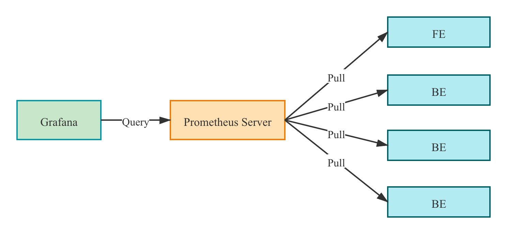
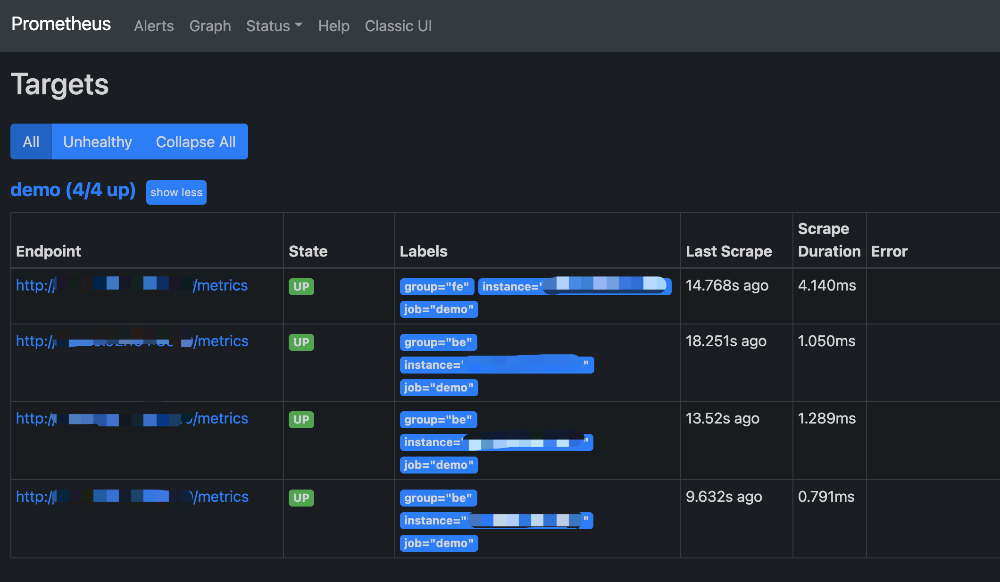
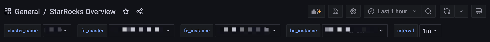

# Monitor and Alerting

You can build your own monitoring services, or use the Prometheus + Grafana solution. StarRocks provides a Prometheus-compatible interface that directly links to the HTTP port of the BE and FE to obtain monitoring information from the cluster.

## Metrics

The available metrics are:

|Metric|Unit|Type|Meaning|
|---|:---:|:---:|---|
|be_broker_count|count|average|Number of brokers |
|be_brpc_endpoint_count|count|average|Number of StubCache in BRPC|
|be_bytes_read_per_second|bytes/s|average| Read speed of BE |
|be_bytes_written_per_second|bytes/s|average|Write speed of BE |
|be_base_compaction_bytes_per_second|bytes/s|average|Base compaction speed of BE|
|be_cumulative_compaction_bytes_per_second|bytes/s|average|Cumulative compaction speed of BE|
|be_base_compaction_rowsets_per_second|rowsets/s|average| Base compaction speed of BE rowsets|
|be_cumulative_compaction_rowsets_per_second|rowsets/s|average| Cumulative compaction speed of BE rowsets |
|be_base_compaction_failed|count/s|average|Base compaction failure of BE |
|be_clone_failed| count/s |average|BE clone failure |
|be_create_rollup_failed| count/s |average|Materialized view creation failure of BE |
|be_create_tablet_failed| count/s |average|Tablet creation failure of BE |
|be_cumulative_compaction_failed| count/s |average|Cumulative compaction failure of BE |
|be_delete_failed| count/s |average| Delete failure of BE |
|be_finish_task_failed| count/s |average|Task failure of BE |
|be_publish_failed| count/s |average| Version release failure of BE |
|be_report_tables_failed| count/s |average| Table report failure of BE |
|be_report_disk_failed| count/s |average|Disk report failure of BE |
|be_report_tablet_failed| count/s |average|Tablet report failure of BE |
|be_report_task_failed| count/s |average|Task report failure of BE |
|be_schema_change_failed| count/s |average|Schema change failure of BE |
|be_base_compaction_requests| count/s |average|Base compaction request of BE |
|be_clone_total_requests| count/s |average|Clone request of BE |
|be_create_rollup_requests| count/s |average| Materialized view creation request of BE |
|be_create_tablet_requests|count/s|average| Tablet creation request of BE |
|be_cumulative_compaction_requests|count/s|average|Cumulative compaction request of BE |
|be_delete_requests|count/s|average| Delete request of BE |
|be_finish_task_requests|count/s|average| Task finish request of BE |
|be_publish_requests|count/s|average| Version publish request of BE |
|be_report_tablets_requests|count/s|average|Tablet report request of BE |
|be_report_disk_requests|count/s|average|Disk report request of BE |
|be_report_tablet_requests|count/s|average|Tablet report request of BE |
|be_report_task_requests|count/s|average|Task report request of BE |
|be_schema_change_requests|count/s|average|Schema change report request of BE |
|be_storage_migrate_requests|count/s|average| Migration request of BE |
|be_fragment_endpoint_count|count|average|Number of BE DataStream |
|be_fragment_request_latency_avg|ms|average| Latency of fragment requests |
|be_fragment_requests_per_second|count/s|average|Number of fragment requests|
|be_http_request_latency_avg|ms|average|Latency of HTTP requests |
|be_http_requests_per_second|count/s|average|Number of HTTP requests|
|be_http_request_send_bytes_per_second|bytes/s|average| Number of bytes sent for HTTP requests |
|fe_connections_per_second|connections/s|average| New connection rate of FE |
|fe_connection_total|connections| cumulative | Total number of FE connections |
|fe_edit_log_read|operations/s|average|Read speed of FE edit log |
|fe_edit_log_size_bytes|bytes/s|average|Size of FE edit log |
|fe_edit_log_write|bytes/s|average|Write speed of FE edit log |
|fe_checkpoint_push_per_second|operations/s|average|Number of FE checkpoints |
|fe_pending_hadoop_load_job|count|average| Number of pending hadoop jobs|
|fe_committed_hadoop_load_job|count|average| Number of committed hadoop jobs|
|fe_loading_hadoop_load_job|count|average| Number of loading hadoop jobs|
|fe_finished_hadoop_load_job|count|average| Number of completed  hadoop jobs|
|fe_cancelled_hadoop_load_job|count|average| Number of cancelled hadoop jobs|
|fe_pending_insert_load_job|count|average| Number of pending insert jobs |
|fe_loading_insert_load_job|count|average| Number of loading insert jobs|
|fe_committed_insert_load_job|count|average| Number of committed insert jobs|
|fe_finished_insert_load_job|count|average| Number of completed insert jobs|
|fe_cancelled_insert_load_job|count|average| Number of cancelled insert jobs|
|fe_pending_broker_load_job|count|average| Number of pending broker jobs|
|fe_loading_broker_load_job|count|average| Number of loading broker jobs
|fe_committed_broker_load_job|count|average| Number of committed broker jobs|
|fe_finished_broker_load_job|count|average| Number of finished broker jobs|
|fe_cancelled_broker_load_job|count|average| Number of cancelled broker jobs |
|fe_pending_delete_load_job|count|average| Number of pending delete jobs|
|fe_loading_delete_load_job|count|average| Number of loading delete jobs|
|fe_committed_delete_load_job|count|average| Number of committed delete jobs|
|fe_finished_delete_load_job|count|average| Number of finished delete jobs|
|fe_cancelled_delete_load_job|count|average| Number of cancelled delete jobs|
|fe_rollup_running_alter_job|count|average| Number of jobs created in rollup |
|fe_schema_change_running_job|count|average| Number of jobs in schema change |
|cpu_util| percentage|average|CPU usage rate |
|cpu_system | percentage|average|cpu_system usage rate |
|cpu_user| percentage|average|cpu_user usage rate |
|cpu_idle| percentage|average|cpu_idle usage rate |
|cpu_guest| percentage|average|cpu_guest usage rate |
|cpu_iowait| percentage|average|cpu_iowait usage rate |
|cpu_irq| percentage|average|cpu_irq usage rate |
|cpu_nice| percentage|average|cpu_nice usage rate |
|cpu_softirq| percentage|average|cpu_softirq usage rate |
|cpu_steal| percentage|average|cpu_steal usage rate |
|disk_free|bytes|average| Free disk capacity |
|disk_io_svctm|ms|average| Disk IO service time |
|disk_io_util|percentage|average| Disk usage |
|disk_used|bytes|average| Used disk capacity |
|starrocks_fe_meta_log_count|count|Instantaneous|The number of Edit Logs without a checkpoint. A value within `100000` is considered reasonable.|
|starrocks_fe_query_resource_group|count|cumulative|The number of queries for each resource group|
|starrocks_fe_query_resource_group_latency|second|average|the query latency percentile for each resource group|
|starrocks_fe_query_resource_group_err|count|cumulative|The number of incorrect queries for each resource group|
|starrocks_be_resource_group_cpu_limit_ratio|percentage|Instantaneous|Instantaneous value of resource group cpu quota ratio|
|starrocks_be_resource_group_cpu_use_ratio|percentage|average|The ratio of CPU time used by the resource group to the CPU time of all resource groups|
|starrocks_be_resource_group_mem_limit_bytes|byte|Instantaneous|Instantaneous value of resource group memory quota|
|starrocks_be_resource_group_mem_allocated_bytes|byte|Instantaneous|Instantaneous value of resource group memory usage|
|starrocks_be_pipe_prepare_pool_queue_len|count|Instantaneous|Instantaneous value of pipeline prepare thread pool task queue length|

## Monitoring Alarm Best Practices

Background information on the monitoring system:

1. The system collects information every 15 seconds.
2. Some indicators are divided by 15 seconds and the unit is count/s. Some indicators are not divided, and the count is still 15 seconds.
3. P90, P99 and other quantile values are currently counted within 15 seconds. When calculating at a greater granularity (1 minute, 5 minutes, etc.), use "how many alarms greater than a certain value" rather than "what is the average value".

### References

1. The purpose of monitoring is to only alert on abnormal conditions, not  normal conditions.
2. Different clusters have different resources (e.g., memory, disk), different usage, and need to be set to different values; however, "percentage" is universal as a measurement unit.
3. For indicators such as `number of failures`, it is necessary to monitor the change of the total number, and calculate the alarm boundary value according to a certain proportion (for example, for the amount of P90, P99, P999).
4. `A value of 2x or more` or `a value higher than the peak` can generally be used as a warning value for the growth of used/query.

### Alarm settings

#### Low frequency alarms

Trigger the alarm  if one or more failures occur. Set a more advanced alarm if there are multiple failures.

For operations (e.g.,schema change) that are not frequently performed, "alarm on failure" is sufficient.

#### No task started

Once the monitoring alarm is turned on, there may be a lot of successful and failed tasks. You can set `failed > 1` to alert and modify it later.

#### Fluctuation

##### Large fluctuations

Need to focus on data with different time granularity, as the peaks and valleys in data with large granularity may be averaged out. Generally, you need to look at 15 days, 3 days, 12 hours, 3 hours, and 1 hour (for different time ranges).

The monitoring interval may need to be slightly longer (e.g. 3 minutes, 5 minutes, or even longer) to shield the alarm caused by fluctuations.

##### Small fluctuations

Set shorter intervals to quickly get alarms when problems occur.

##### High spikes

It depends on whether the spikes need to be alarmed or not. If there are too many spikes, setting longer intervals may help smooth out the spikes.

#### Resource usage

##### High resource usage

You can set the alarm to reserve a little resource.For example, set the memory alert to `mem_avaliable<=20%`.

##### Low resource usage

You can set a stricter value than "high resource usage".For example, for  a CPU with low usage (less than 20%), set the alarm to `cpu_idle<60%`.

### Caution

Usually FE/BE are monitored together, but there are some values that only FE or BE has.

There may be some machines that need to be set up  in batches for monitoring.

### Additional information

#### P99 Batch calculation rules

The node collects data every 15 seconds and calculates a value, the 99th percentile is the 99th percentile in those 15 seconds. When the QPS is not high (e.g. QPS is below 10), these percentiles are not very accurate. Also, it is meaningless to aggregate four values generated in one minute (4 x 15 seconds) whether using sum or average function.

The same applies to P50, P90, and so on.

#### Cluster Monitoring for errors

> Some undesired cluster errors need to be found and resolved in time to keep the cluster stable. If the errors are less critical (e.g. SQL syntax errors, etc.) but **can't be stripped out from the important error items**, it’s recommended to monitor first and distinguish those at a later stage.

## Using Prometheus+Grafana

StarRocks can use [Prometheus](https://prometheus.io/) to monitor data storage and use [Grafana](https://grafana.com/) to visualize results.

### Components

>This document describes StarRocks’ visual monitoring solution based on Prometheus and Grafana implementations. StarRocks is not responsible for maintaining or developing these components. For more detailed information about Prometheus and Grafana, please refer to their official websites.

#### Prometheus

Prometheus is a temporal database with multi-dimensional data models and flexible query statements. It collects data by pulling or pushing them from monitored systems and stores these data in its temporal database. It meets different user needs through its rich multi-dimensional data query language.

#### Grafana

Grafana is an open-source metric analysis and visualization system that supports a variety of data sources. Grafana retrieves data from data sources with corresponding query statements. It allows users to create charts and dashboards to visualize data.

### Monitoring architecture



Prometheus pulls the metrics from the FE/BE interface and then stores the data into its temporal database.

In Grafana, users can configure Prometheus as a data source to customize the Dashboard.

### Deployment

#### Prometheus

**1.** Download the latest version of Prometheus from the [Prometheus official website](https://prometheus.io/download/). Take the prometheus-2.29.1.linux-amd64 version for example.

```bash
wget https://github.com/prometheus/prometheus/releases/download/v2.29.1/prometheus-2.29.1.linux-amd64.tar.gz
tar -xf prometheus-2.29.1.linux-amd64.tar.gz
```

**2.** Add configuration in `vi prometheus.yml`

```yml
# my global config
global:
  scrape_interval: 15s # global acquisition interval, 1m by default, here set to 15s
  evaluation_interval: 15s # global rule trigger interval, 1m by default, here set to 15s

scrape_configs:
  # The job name is added as a label `job=<job_name>` to any timeseries scraped from this config.
  - job_name: 'StarRocks_Cluster01' # Each cluster is called a job, job name is customizable
    metrics_path: '/metrics' # Specify the Restful API to get metrics

    static_configs:
      - targets: ['fe_host1:http_port','fe_host3:http_port','fe_host3:http_port']
        labels:
          group: fe # Here the group of FE is configured which contains 3 Frontends

      - targets: ['be_host1:http_port', 'be_host2:http_port', 'be_host3:http_port']
        labels:
          group: be # The group of BE is configured here which contains three Backends
  - job_name: 'StarRocks_Cluster02' # Multiple StarRocks clusters can be monitored in Prometheus
metrics_path: '/metrics'

    static_configs:
      - targets: ['fe_host1:http_port','fe_host3:http_port','fe_host3:http_port']
        labels:
          group: fe

      - targets: ['be_host1:http_port', 'be_host2:http_port', 'be_host3:http_port']
        labels:
          group: be
```

**3.** Start Prometheus

```bash
nohup ./prometheus \
    --config.file="./prometheus.yml" \
    --web.listen-address=":9090" \
    --log.level="info" &
```

This command runs Prometheus in the background and specifies its web port as 9090. Once set up, Prometheus starts collecting data and stores it in the `. /data` directory.

**4.** Accessing Prometheus

Prometheus can be accessed via BUI. You simply need to open port 9090 in your browser. Go to`Status -> Targets` to see the monitored host nodes for all grouped jobs. Under normal circumstances, all nodes should be `UP`. If the node status is not `UP`, you can visit the StarRocks metrics (`http://fe_host:fe_http_port/metrics` or `http://be_host:be_http_port/metrics`) interface first to check if it is accessible, or check the Prometheus documentation for troubleshooting.



A simple Prometheus has been built and configured. For more advanced usage, please refer to the [official documentation](https://prometheus.io/docs/introduction/overview/)

#### Grafana

**1.** Download the latest version of Grafana from [Grafana official website](https://grafana.com/grafana/download). Take thegrafana-8.0.6.linux-amd64 version for example.

```SHELL
wget https://dl.grafana.com/oss/release/grafana-8.0.6.linux-amd64.tar.gz
tar -zxf grafana-8.0.6.linux-amd64.tar.gz
```

**2.** Add configuration in `vi . /conf/defaults.ini`

```ini
...
[paths]
data = ./data
logs = ./data/log
plugins = ./data/plugins
[server]
http_port = 8000
domain = localhost
...
```

**3.** Start Grafana

```Plain text
nohup ./bin/grafana-server \
    --config="./conf/grafana.ini" &
```

### Dashboard

#### DashBoard Configuration

Log in to Grafana through the address configured in the previous step `http://grafana_host:8000` with the default username,password (i.e. admin,admin).

**1.** Add a data source.

Configuration path: `Configuration-->Data sources-->Add data source-->Prometheus`

Data Source Configuration Introduction


* Name: Name of the data source. Can be customized, e.g. starrocks_monitor
* URL: The web address of Prometheus, e.g. `http://prometheus_host:9090`
* Access: Select the Server method, i.e., the server where Grafana is located for Prometheus to access.
The rest of the options are default.

Click Save & Test at the bottom, if it shows `Data source is working`, it means the data source is available.

**2.** Add a dashboard.

Download a dashboard.

> **NOTE**
>
> Metric names in StarRocks v1.19.0 and v2.4.0 are changed. You must download a dashboard template based on your StarRocks version:
>
> * [Dashboard template for versions earlier than v1.19.0](http://starrocks-thirdparty.oss-cn-zhangjiakou.aliyuncs.com/StarRocks-Overview.json)
> * [Dashboard template for v1.19.0 to v2.4.0 (exclusive)](http://starrocks-thirdparty.oss-cn-zhangjiakou.aliyuncs.com/StarRocks-Overview-19.json)
> * [Dashboard template for v2.4.0 and later](http://starrocks-thirdparty.oss-cn-zhangjiakou.aliyuncs.com/StarRocks-Overview-24.json)

Dashboard templates will be updated from time to time.

After confirming the data source is available, click on the `+` sign to add a new Dashboard, here we use the StarRocks Dashboard template downloaded above. Go to Import -> Upload Json File to load the downloaded json file.

After loading, you can name the Dashboard. The default name is StarRocks Overview. Then select`starrocks_monitor`as the data source.
Click`Import` to complete the import. Then you should see the Dashboard.

#### Dashboard Description

Add a description for your dashboard. Update the description for each version.

**1.** Top bar



The top left corner shows the Dashboard name.
The top right corner shows the current time range. Use the drop down to select a different time range and specify an interval for page refresh.
cluster_name: The `job_name` of each job in the Prometheus configuration file, representing a StarRocks cluster. You can select a cluster and view its monitoring information in the chart.

* fe_master: The leader node of the cluster.
* fe_instance: All frontend nodes of the corresponding cluster. Select to view the monitoring information in the chart.
* be_instance: All backend nodes of the corresponding cluster. Select to view the monitoring information in the chart.
* interval: Some charts show intervals  related to monitoring items. Interval is customizable(Note: 15s interval may cause some charts not to display).

**2.** Row


In Grafana, the concept of a `Row` is a collection of diagrams. You can collapse a `Row` by clicking on it. The current Dashboard has the following `Rows` :

* Overview: Display of all StarRocks clusters.
* Cluster Overview: Display of selected clusters.
* Query Statistic: Monitoring for Queries of  selected clusters.
* Jobs: Monitoring for Import jobs.
* Transaction: Monitoring for Transactions.
* FE JVM: Monitoring for JVM of selected Frontend.
* BE: Display of Backends of selected clusters.
* BE Task: Display of Backends tasks of selected clusters.

**3.** A typical chart is divided into the following parts.


* Hover over the i icon in the upper left corner to see the chart description.
* Click on the legend below to view a particular item. Click again to display all.
* Drag and drop in the chart to select a time range.
* The name of the selected cluster is displayed in [] of the title.
* Values may correspond to the left Y-axis or the right Y-axis, which can be distinguished by the -right at the end of the legend.
* Click on the chart name to edit the name.

### Other

If you need to access the monitoring data in your own Prometheus system, access it through the following interface.

* FE: fe_host:fe_http_port/metrics
* BE: be_host:be_web_server_port/metrics

If JSON format is required, access the following instead.

* FE: fe_host:fe_http_port/metrics?type=json
* BE: be_host:be_web_server_port/metrics?type=json
