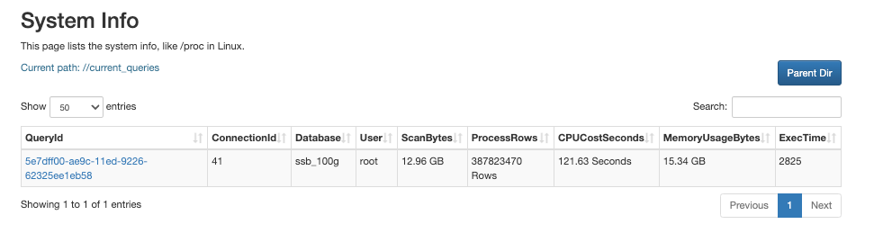

# Monitor and manage big queries

This topic describes how to monitor and manage big queries in your StarRocks cluster.

Big queries include queries that scan too many rows or occupy too many CPU and memory resources. They can easily exhaust cluster resources and cause system overload if no restrictions are imposed on them. To tackle this issue, StarRocks provides a series of measures to monitor and manage big queries, preventing queries from monopolizing cluster resources.

The overall idea of handling big queries in StarRocks is as follows:

1. Set automatic precautions against big queries with resource groups and query queues.
2. Monitor big queries in real-time, and terminate those who bypass the precautions.
3. Analyze audit logs and Big Query Logs to study the patterns of big queries, and fine-tune the precaution mechanisms you set earlier.

This feature is supported from v3.0.

## Set precautions against big queries

StarRocks provides two precautionary instruments for dealing with big queries - resource groups and query queues. You can use resource groups to stop big queries from being executed. Query queues, on the other hand, can help you queue the incoming queries when the concurrency threshold or resource limit is reached, preventing system overload.

### Filter out big queries via resource groups

Resource groups can automatically identify and terminate big queries. When creating a resource group, you can specify the upper limit of CPU time, memory usage, or scan row count that a query is entitled to. Among all queries that hit the resource group, any queries that require more resources are rejected and returned with an error. For more information, see [Resource Isolation](../../administration/resource_group.md).

Before creating resource groups, you must execute the following statement to enable Pipeline Engine, on which the Resource Group feature depends:

```SQL
SET GLOBAL enable_pipeline_engine = true;
```

The following example creates a resource group `bigQuery` that limits the CPU time upper limit to `100` seconds, scan row count upper limit to `100000`, and memory usage upper limit to `1073741824` bytes (1 GB):

```SQL
CREATE RESOURCE GROUP bigQuery
TO 
    (db='sr_hub')
WITH (
    'cpu_core_limit' = '10',
    'mem_limit' = '20%',
    'big_query_cpu_second_limit' = '100',
    'big_query_scan_rows_limit' = '100000',
    'big_query_mem_limit' = '1073741824'
);
```

If the required resources of a query exceed any of the limits, the query will not be executed and is returned with an error. The following example shows the error message returned when a query demands too many scan rows:

```Plain
ERROR 1064 (HY000): exceed big query scan_rows limit: current is 4 but limit is 1
```

If it is your first time setting up resource groups, we recommend you set relatively higher limits so that they will not hinder regular queries. You can fine-tune these limits after you have a better knowledge of the big query patterns.

### Ease system overload via query queues

Query queues are designed to cushion the system overload deterioration when the cluster resource occupation exceeds the prespecified thresholds. You can set thresholds for maximum concurrency, memory usage, and CPU usage. StarRocks automatically queues the incoming queries when any of these thresholds is reached. Pending queries either wait in the queue for execution or get cancelled when the prespecified resource threshold is reached. For more information, see [Query Queues](../../administration/query_queues.md).

Execute the following statements to enable query queues for the SELECT queries:

```SQL
SET GLOBAL enable_query_queue_select = true;
```

After the query queue feature is enabled, you can then define the rules to trigger query queues.

- Specify the concurrency threshold for triggering the query queue.

  The following example sets the concurrency threshold to `100`:

  ```SQL
  SET GLOBAL query_queue_concurrency_limit = 100;
  ```

- Specify the memory usage ratio threshold for triggering the query queue.

  The following example sets the memory usage ratio threshold to `0.9`:

  ```SQL
  SET GLOBAL query_queue_mem_used_pct_limit = 0.9;
  ```

- Specify the CPU usage ratio threshold for triggering the query queue.

  The following example sets the CPU usage permille (CPU usage * 1000) threshold to `800`:

  ```SQL
  SET GLOBAL query_queue_cpu_used_permille_limit = 800;
  ```

You can also decide how to deal with these queued queries by configuring the maximum queue length and the timeout for each pending query in the queue.

- Specify the maximum query queue length. When this threshold is reached, incoming queries are rejected.

  The following example sets the query queue length to `100`:

  ```SQL
  SET GLOBAL query_queue_max_queued_queries = 100;
  ```

- Specify the maximum timeout of a pending query in a queue. When this threshold is reached, the corresponding query is rejected.

  The following example sets the maximum timeout to `480` seconds:

  ```SQL
  SET GLOBAL query_queue_pending_timeout_second = 480;
  ```

You can check whether a query is pending using [SHOW PROCESSLIST](../../sql-reference/sql-statements/Administration/SHOW_PROCESSLIST.md).

```Plain
mysql> SHOW PROCESSLIST;
+------+------+---------------------+-------+---------+---------------------+------+-------+-------------------+-----------+
| Id   | User | Host                | Db    | Command | ConnectionStartTime | Time | State | Info              | IsPending |
+------+------+---------------------+-------+---------+---------------------+------+-------+-------------------+-----------+
|    2 | root | xxx.xx.xxx.xx:xxxxx |       | Query   | 2022-11-24 18:08:29 |    0 | OK    | SHOW PROCESSLIST  | false     |
+------+------+---------------------+-------+---------+---------------------+------+-------+-------------------+-----------+
```

If `IsPending` is `true`, the corresponding query is pending in the query queue.

## Monitor big queries in real-time

From v3.0 onwards, StarRocks supports viewing the queries that are currently processed in the cluster and the resources they occupy. This allows you to monitor the cluster in case any big queries bypass the precautions and cause unexpected system overload.

### Monitor via MySQL client

1. You can view the queries that are currently processed (`current_queries`) using [SHOW PROC](../../sql-reference/sql-statements/Administration/SHOW_PROC.md).

   ```SQL
   SHOW PROC '/current_queries';
   ```

   StarRocks returns the query ID (`QueryId`), connection ID (`ConnectionId`), and the resource consumption of each query, including the scanned data size (`ScanBytes`), processed row count (`ProcessRows`), CPU time (`CPUCostSeconds`), memory usage (`MemoryUsageBytes`), and execution time (`ExecTime`).

   ```Plain
   mysql> SHOW PROC '/current_queries';
   +--------------------------------------+--------------+------------+------+-----------+----------------+----------------+------------------+----------+
   | QueryId                              | ConnectionId | Database   | User | ScanBytes | ProcessRows    | CPUCostSeconds | MemoryUsageBytes | ExecTime |
   +--------------------------------------+--------------+------------+------+-----------+----------------+----------------+------------------+----------+
   | 7c56495f-ae8b-11ed-8ebf-00163e00accc | 4            | tpcds_100g | root | 37.88 MB  | 1075769 Rows   | 11.13 Seconds  | 146.70 MB        | 3804     |
   | 7d543160-ae8b-11ed-8ebf-00163e00accc | 6            | tpcds_100g | root | 13.02 GB  | 487873176 Rows | 81.23 Seconds  | 6.37 GB          | 2090     |
   +--------------------------------------+--------------+------------+------+-----------+----------------+----------------+------------------+----------+
   2 rows in set (0.01 sec)
   ```

2. You can further examine a query's resource consumption on each BE node by specifying the query ID.

   ```SQL
   SHOW PROC '/current_queries/<QueryId>/hosts';
   ```

   StarRocks returns the query's scanned data size (`ScanBytes`), scanned row count (`ScanRows`), CPU time (`CPUCostSeconds`), and memory usage (`MemUsageBytes`) on each BE node.

   ```Plain
   mysql> show proc '/current_queries/7c56495f-ae8b-11ed-8ebf-00163e00accc/hosts';
   +--------------------+-----------+-------------+----------------+---------------+
   | Host               | ScanBytes | ScanRows    | CpuCostSeconds | MemUsageBytes |
   +--------------------+-----------+-------------+----------------+---------------+
   | 172.26.34.185:8060 | 11.61 MB  | 356252 Rows | 52.93 Seconds  | 51.14 MB      |
   | 172.26.34.186:8060 | 14.66 MB  | 362646 Rows | 52.89 Seconds  | 50.44 MB      |
   | 172.26.34.187:8060 | 11.60 MB  | 356871 Rows | 52.91 Seconds  | 48.95 MB      |
   +--------------------+-----------+-------------+----------------+---------------+
   3 rows in set (0.00 sec)
   ```

### Monitor via FE console

In addition to MySQL client, you can use the FE console for visualized, interactive monitoring.

1. Navigate to the FE console in your browser using the following URL:

   ```Bash
   http://<fe_IP>:<fe_http_port>/system?path=//current_queries
   ```

   

   You can view the queries that are currently processed and their resource consumption on the **System Info** page.

2. Click the **QueryID** of the query.

   

   You can view the detailed, node-specific resource consumption information on the page that appears.

### Manually terminate big queries

If any big queries bypass the precautions you have set and threaten the system availability, you can terminate them manually using the corresponding connection ID in the [KILL](../../sql-reference/sql-statements/Administration/KILL.md) statement:

```SQL
KILL QUERY <ConnectionId>;
```

## Analyze Big Query Logs

From v3.0 onwards, StarRocks supports Big Query Logs, which are stored in the file **fe/log/fe.big_query.log**. Compared to the StarRocks audit logs, Big Query Logs print additional three fields:

- `bigQueryLogCPUSecondThreshold`
- `bigQueryLogScanBytesThreshold`
- `bigQueryLogScanRowsThreshold`

These three fields correspond to the resource consumption thresholds you defined to determine whether a query is a big query.

To enable Big Query Logs, execute the following statement:

```SQL
SET GLOBAL enable_big_query_log = true;
```

After Big Query Logs are enabled, you can then define the rules to trigger Big Query Logs.

- Specify the CPU time threshold for triggering Big Query Logs.

  The following example sets the CPU time threshold to `600` seconds:

  ```SQL
  SET GLOBAL big_query_log_cpu_second_threshold = 600;
  ```

- Specify the scan data size threshold for triggering Big Query Logs.

  The following example sets the scan data size threshold to `10737418240` bytes (10 GB):

  ```SQL
  SET GLOBAL big_query_log_scan_bytes_threshold = 10737418240;
  ```
  
- Specify the scan row count threshold for triggering Big Query Logs.

  The following example sets the scan row count threshold to `1500000000`:

  ```SQL
  SET GLOBAL big_query_log_scan_rows_threshold = 1500000000;
  ```

## Fine-tune precautions

From the statistics obtained from real-time monitoring and Big Query Logs, you can study the pattern of the omitted big queries (or regular queries that are mistakenly diagnosed as big queries) in your cluster, and then optimize the settings for resource groups and the query queue.

If a notable proportion of big queries conform to a certain SQL pattern, and you want to permanently forbid this SQL pattern, you can add this pattern to SQL Blacklist. StarRocks rejects all queries that match any patterns specified in SQL Blacklist, and returns an error. For more information, see [Manage SQL Blacklist](../../administration/Blacklist.md).

To enable SQL Blacklist, execute the following statement:

```SQL
ADMIN SET FRONTEND CONFIG ("enable_sql_blacklist" = "true");
```

Then you can add the regular expression that represents the SQL pattern to SQL Blacklist using [ADD SQLBLACKLIST](../../sql-reference/sql-statements/Administration/ADD_SQLBLACKLIST.md).

The following example adds `COUNT(DISTINCT)` to SQL Blacklist:

```SQL
ADD SQLBLACKLIST "SELECT COUNT(DISTINCT .+) FROM .+";
```
