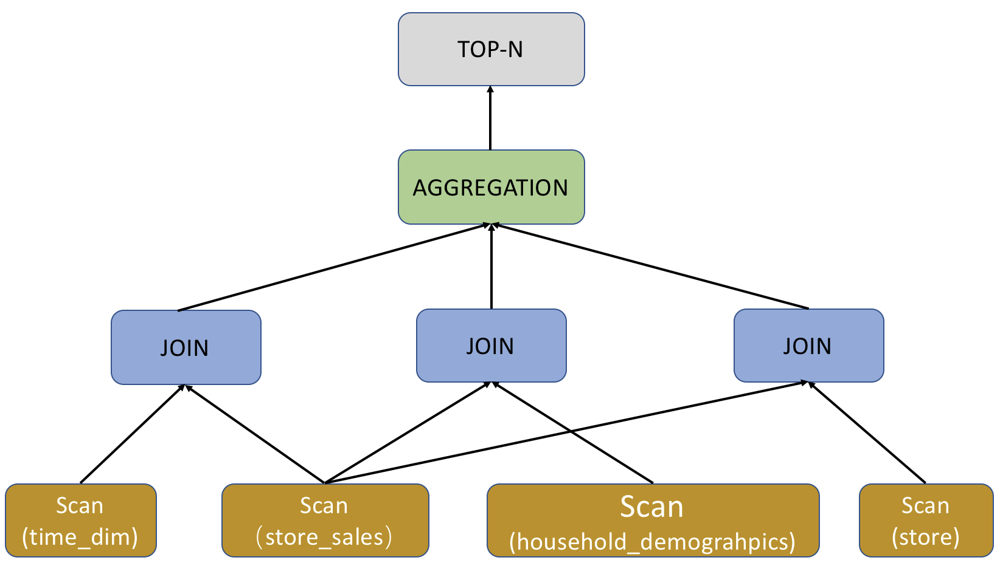

# Query analysis

How to optimize query performance is a frequently asked question. Slow queries impair user experience as well as cluster performance. It is important to analyze and optimize query performance.

You can view query information in `fe/log/fe.audit.log`. Each query corresponds to a `QueryID` that can be used to search for the `QueryPlan` and `Profile` of a query. `QueryPlan` is the execution plan generated by FE by parsing SQL statements. `Profile` is BE execution result and contains information such as the time consumed by each step and the volume of data processed at each step.

## Plan analysis

In StarRocks, the lifecycle of an SQL statement can be divided into three phases: query parsing, query planning, and query execution. Query parsing is generally not a bottleneck because the required QPS of analytical workloads is not high.

Query performance in StarRocks is determined by query planning and query execution. Query planning is responsible for coordinating operators (Join/Order/Aggregate), and query execution is responsible for running specific operations.

A query plan provides the DBA with a macro perspective to access query information. A query plan is the key to query performance and a good resource for the DBA to reference. The following code snippet uses `TPCDS query96` as an example to show how to view a query plan.

~~~SQL
-- query96.sql
select  count(*)
from store_sales
    ,household_demographics
    ,time_dim
    , store
where ss_sold_time_sk = time_dim.t_time_sk
    and ss_hdemo_sk = household_demographics.hd_demo_sk
    and ss_store_sk = s_store_sk
    and time_dim.t_hour = 8
    and time_dim.t_minute >= 30
    and household_demographics.hd_dep_count = 5
    and store.s_store_name = 'ese'
order by count(*) limit 100;
~~~

There are two types of query plans –  logical query plan and physical query plan. The query plan described here refers to the logical query plan. The query plan corresponding to `TPCDS query96.sq`l is shown below.

~~~sql
+------------------------------------------------------------------------------+
| Explain String                                                               |
+------------------------------------------------------------------------------+
| PLAN FRAGMENT 0                                                              |
|  OUTPUT EXPRS:<slot 11>                                                      |
|   PARTITION: UNPARTITIONED                                                   |
|   RESULT SINK                                                                |
|   12:MERGING-EXCHANGE                                                        |
|      limit: 100                                                              |
|      tuple ids: 5                                                            |
|                                                                              |
| PLAN FRAGMENT 1                                                              |
|  OUTPUT EXPRS:                                                               |
|   PARTITION: RANDOM                                                          |
|   STREAM DATA SINK                                                           |
|     EXCHANGE ID: 12                                                          |
|     UNPARTITIONED                                                            |
|                                                                              |
|   8:TOP-N                                                                    |
|   |  order by: <slot 11> ASC                                                 |
|   |  offset: 0                                                               |
|   |  limit: 100                                                              |
|   |  tuple ids: 5                                                            |
|   |                                                                          |
|   7:AGGREGATE (update finalize)                                              |
|   |  output: count(*)                                                        |
|   |  group by:                                                               |
|   |  tuple ids: 4                                                            |
|   |                                                                          |
|   6:HASH JOIN                                                                |
|   |  join op: INNER JOIN (BROADCAST)                                         |
|   |  hash predicates:                                                        |
|   |  colocate: false, reason: left hash join node can not do colocate        |
|   |  equal join conjunct: `ss_store_sk` = `s_store_sk`                       |
|   |  tuple ids: 0 2 1 3                                                      |
|   |                                                                          |
|   |----11:EXCHANGE                                                           |
|   |       tuple ids: 3                                                       |
|   |                                                                          |
|   4:HASH JOIN                                                                |
|   |  join op: INNER JOIN (BROADCAST)                                         |
|   |  hash predicates:                                                        |
|   |  colocate: false, reason: left hash join node can not do colocate        |
|   |  equal join conjunct: `ss_hdemo_sk`=`household_demographics`.`hd_demo_sk`|
|   |  tuple ids: 0 2 1                                                        |
|   |                                                                          |
|   |----10:EXCHANGE                                                           |
|   |       tuple ids: 1                                                       |
|   |                                                                          |
|   2:HASH JOIN                                                                |
|   |  join op: INNER JOIN (BROADCAST)                                         |
|   |  hash predicates:                                                        |
|   |  colocate: false, reason: table not in same group                        |
|   |  equal join conjunct: `ss_sold_time_sk` = `time_dim`.`t_time_sk`         |
|   |  tuple ids: 0 2                                                          |
|   |                                                                          |
|   |----9:EXCHANGE                                                            |
|   |       tuple ids: 2                                                       |
|   |                                                                          |
|   0:OlapScanNode                                                             |
|      TABLE: store_sales                                                      |
|      PREAGGREGATION: OFF. Reason: `ss_sold_time_sk` is value column          |
|      partitions=1/1                                                          |
|      rollup: store_sales                                                     |
|      tabletRatio=0/0                                                         |
|      tabletList=                                                             |
|      cardinality=-1                                                          |
|      avgRowSize=0.0                                                          |
|      numNodes=0                                                              |
|      tuple ids: 0                                                            |
|                                                                              |
| PLAN FRAGMENT 2                                                              |
|  OUTPUT EXPRS:                                                               |
|   PARTITION: RANDOM                                                          |
|                                                                              |
|   STREAM DATA SINK                                                           |
|     EXCHANGE ID: 11                                                          |
|     UNPARTITIONED                                                            |
|                                                                              |
|   5:OlapScanNode                                                             |
|      TABLE: store                                                            |
|      PREAGGREGATION: OFF. Reason: null                                       |
|      PREDICATES: `store`.`s_store_name` = 'ese'                              |
|      partitions=1/1                                                          |
|      rollup: store                                                           |
|      tabletRatio=0/0                                                         |
|      tabletList=                                                             |
|      cardinality=-1                                                          |
|      avgRowSize=0.0                                                          |
|      numNodes=0                                                              |
|      tuple ids: 3                                                            |
|                                                                              |
| PLAN FRAGMENT 3                                                              |
|  OUTPUT EXPRS:                                                               |
|   PARTITION: RANDOM                                                          |
|   STREAM DATA SINK                                                           |
|     EXCHANGE ID: 10                                                          |
|     UNPARTITIONED                                                            |
|                                                                              |
|   3:OlapScanNode                                                             |
|      TABLE: household_demographics                                           |
|      PREAGGREGATION: OFF. Reason: null                                       |
|      PREDICATES: `household_demographics`.`hd_dep_count` = 5                 |
|      partitions=1/1                                                          |
|      rollup: household_demographics                                          |
|      tabletRatio=0/0                                                         |
|      tabletList=                                                             |
|      cardinality=-1                                                          |
|      avgRowSize=0.0                                                          |
|      numNodes=0                                                              |
|      tuple ids: 1                                                            |
|                                                                              |
| PLAN FRAGMENT 4                                                              |
|  OUTPUT EXPRS:                                                               |
|   PARTITION: RANDOM                                                          |
|   STREAM DATA SINK                                                           |
|     EXCHANGE ID: 09                                                          |
|     UNPARTITIONED                                                            |
|                                                                              |
|   1:OlapScanNode                                                             |
|      TABLE: time_dim                                                         |
|      PREAGGREGATION: OFF. Reason: null                                       |
|      PREDICATES: `time_dim`.`t_hour` = 8, `time_dim`.`t_minute` >= 30        |
|      partitions=1/1                                                          |
|      rollup: time_dim                                                        |
|      tabletRatio=0/0                                                         |
|      tabletList=                                                             |
|      cardinality=-1                                                          |
|      avgRowSize=0.0                                                          |
|      numNodes=0                                                              |
|      tuple ids: 2                                                            |
+------------------------------------------------------------------------------+
128 rows in set (0.02 sec)
~~~

Query 96 shows a query plan that involves several StarRocks concepts.

|Name|Explanation|
|--|--|
|avgRowSize|The average size of the scanned data rows|
|cardinality|The total number of data rows in the scanned table|
|colocate|Whether the table is in colocate mode|
|numNodes|The number of nodes to be scanned|
|rollup|Materialized view|
|preaggregation|Pre-aggregation|
|predicates|Predicates, the query filters|

The query plan of Query 96 is divided into five fragments, numbered from 0 to 4. The query plan can be read one by one in a bottom-up manner.

Fragment 4 is responsible for scanning the `time_dim` table and executing the related query condition (i.e. `time_dim.t_hour = 8 and time_dim.t_minute >= 30`) in advance. This step is also known as predicate pushdown. StarRocks decides whether to enable `PREAGGREGATION` for aggregation tables. In the previous figure, preaggregation of `time_dim` is disabled. In this case, all dimension columns of `time_dim` are read, which may negatively affect performance if there are many dimension columns in the table. If the `time_dim` table selects `range partition` for data division, several partitions will be hit in the query plan and irrelevant partitions will be automatically filtered out. If there is a materialized view, StarRocks will automatically select the materialized view based on the query. If there is no materialized view, the query will automatically hit the base table (for example, `rollup: time_dim` in the previous figure).

When the scan is complete, Fragment 4 ends. Data will be passed to other fragments, as indicated by EXCHANGE ID : 09 in the previous figure, to the receiving node labeled 9.

For the query plan of Query 96, Fragment 2, 3, and 4 have similar functions but they are responsible for scanning different tables. Specifically, the `Order/Aggregation/Join` operations in the query are performed in Fragment 1.

Fragment 1 uses the `BROADCAST` method to perform `Order/Aggregation/Join` operations i, that is, to broadcast the small table to the large table. If both tables are large, we recommend that you use the `SHUFFLE` method. Currently, StarRocks only supports `HASH JOIN`. The `colocate` field is used to show that the two joined tables are partitioned and bucketed in the same way, so that the join operation can be performed locally without migrating the data. When the Join operation is complete, the upper-level `aggregation`, `order by`, and `top-n` operations will be performed.

By removing the specific expressions (only keep the operators), the query plan can be presented in a more macroscopic view, as shown in the following figure.

## Query hint

Query hints are directives or comments that explicitly suggest the query optimizer on how to execute a query. Currently, StarRocks supports two types of hints: variable-setting hint and join hint. Hints only take effect within a single query.

### Variable-Setting hint

You can set one or more [system variables](../../sql-reference/System_variable.md) by using the `SET_VAR` hint in the form of the syntax `/*+ SET_VAR(var_name = value) */` in SELECT and SUBMIT TASK statements, or in the SELECT clause that is included in other statement, such as CREATE MATERIALIZED VIEW AS SELECT and CREATE VIEW AS SELECT.

#### Syntax

~~~SQL
[...] SELECT [/*+ SET_VAR(key=value [, key = value]*) */] ...
SUBMIT [/*+ SET_VAR(key=value [, key = value]*) */] TASK ...
~~~

#### Examples

 Hint the aggregation method for an aggregate query by setting the system variables `streaming_preaggregation_mode` and `new_planner_agg_stage`.

~~~SQL
SELECT /*+ SET_VAR (streaming_preaggregation_mode = 'force_streaming',new_planner_agg_stage = '2') */ SUM(sales_amount) AS total_sales_amount FROM sales_orders;
~~~

Hint the query's task execution timeout period by setting the system variable `query_timeout` in the SUBMIT TASK statement.

~~~SQL
SUBMIT /*+ SET_VAR(query_timeout=3) */ TASK AS CREATE TABLE temp AS SELECT count(*) AS cnt FROM tbl1;
~~~

Hint the query's execution timeout period by setting the system variable `query_timeout` in the SELECT clause when creating a materialized view.

~~~SQL
CREATE MATERIALIZED VIEW mv 
PARTITION BY dt 
DISTRIBUTED BY HASH(`key`) 
BUCKETS 10 
REFRESH ASYNC 
AS SELECT /*+ SET_VAR(query_timeout=500) */ * from dual;
~~~

### Join hint

For multi-table join queries, the optimizer usually selects the optimal join execution method. In special cases, you can use a join hint to explicitly suggest the join execution method to the optimizer or disable Join Reorder. Currently, a join hint supports suggesting Shuffle Join, Broadcast Join, Bucket Shuffle Join, or Colocate Join as a join execution method. When a join hint is used, the optimizer does not perform Join Reorder. So you need to select the smaller table as the right table. Additionally, when suggesting [Colocate Join](../../using_starrocks/Colocate_join.md) or Bucket Shuffle Join as the join execution method, make sure that the data distribution of the joined table meets the requirements of these join execution methods. Otherwise, the suggested join execution method cannot take effect.

#### Syntax

~~~SQL
... JOIN { [BROADCAST] | [SHUFFLE] | [BUCKET] | [COLOCATE] | [UNREORDER]} ...
~~~

> **NOTE**
>
> Join Hint is case-insensitive.

#### Examples

- Shuffle Join

  If you need to shuffle the data rows with the same bucketing key values from tables A and B onto the same machine before a Join operation is performed, you can hint the join execution method as Shuffle Join.

  ~~~SQL
  select k1 from t1 join [SHUFFLE] t2 on t1.k1 = t2.k2 group by t2.k2;
  ~~~

- Broadcast Join
  
  If table A is a large table and table B is a small table, you can hint the join execution method as Broadcast Join. The data of the table B is fully broadcasted to the machines on which the data of table A resides, and then the Join operation is performed. Compared to Shuffle Join, Broadcast Join saves the cost of shuffling the data of table A.

  ~~~SQL
  select k1 from t1 join [BROADCAST] t2 on t1.k1 = t2.k2 group by t2.k2;
  ~~~

- Bucket Shuffle Join
  
  If the Join equijoin expression in the join query contains the bucketing key of table A, especially when both tables A and B are large tables, you can hint the join execution method as Bucket Shuffle Join. The data of table B is shuffled to the machines on which the data of table A resides, according to the data distribution of table A, and then the Join operation is performed. Compared to Broadcast Join, Bucket Shuffle Join significantly reduces data transferring because the data of table B is shuffled only once globally.

  ~~~SQL
  select k1 from t1 join [BUCKET] t2 on t1.k1 = t2.k2 group by t2.k2;
  ~~~

- Colocate Join
  
  If tables A and B belong to the same Colocation Group which is specified during table creation, the data rows with the same bucketing key values from tables A and B are distributed on the same BE node. When the Join equijoin expression contains the bucketing key of tables A and B in the join query, you can hint the join execution method as Colocate Join. Data with the same key values are directly joined locally, reducing the time spent on data transmission between nodes and improving query performance.

  ~~~SQL
  select k1 from t1 join [COLOCATE] t2 on t1.k1 = t2.k2 group by t2.k2;
  ~~~

### View join execution method

Use the `EXPLAIN` command to view the actual join execution method. If the returned result shows that the join execution method matches the join hint, it means that the join hint is effective.

~~~SQL
EXPLAIN select k1 from t1 join [COLOCATE] t2 on t1.k1 = t2.k2 group by t2.k2;
~~~

## SQL fingerprint

SQL fingerprint is used to optimize slow queries and improve system resource utilization. StarRocks uses the SQL fingerprint feature to normalize SQL statements in the slow query log (`fe.audit.log.slow_query`), categorizes the SQL statements into different types, and calculates the MD5 hash value of each SQL type to identify slow queries. The MD5 hash value is specified by the field `Digest`.

~~~SQL
2021-12-27 15:13:39,108 [slow_query] |Client=172.26.xx.xxx:54956|User=root|Db=default_cluster:test|State=EOF|Time=2469|ScanBytes=0|ScanRows=0|ReturnRows=6|StmtId=3|QueryId=824d8dc0-66e4-11ec-9fdc-00163e04d4c2|IsQuery=true|feIp=172.26.92.195|Stmt=select count(*) from test_basic group by id_bigint|Digest=51390da6b57461f571f0712d527320f4
~~~

SQL statement normalization transforms a statement text into a more normalized format and preserves only important statement structure.

- Preserves object identifiers, such as database and table names.

- Converts constants into a question mark (?).

- Deletes comments and formats spaces.

For example, the following two SQL statements belong to the same type after normalization.

- SQL statements before normalization

~~~SQL
SELECT * FROM orders WHERE customer_id=10 AND quantity>20

SELECT * FROM orders WHERE customer_id = 20 AND quantity > 100
~~~

- SQL statement after normalization

~~~SQL
SELECT * FROM orders WHERE customer_id=? AND quantity>?
~~~
