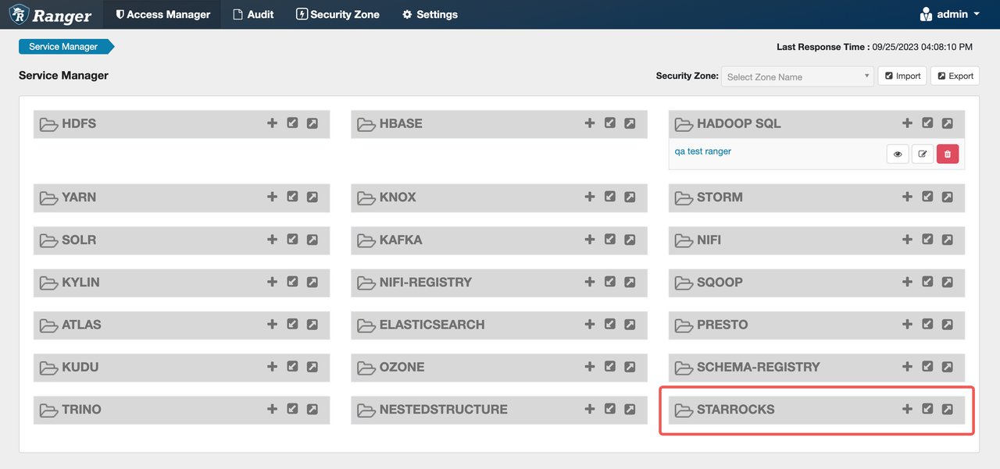
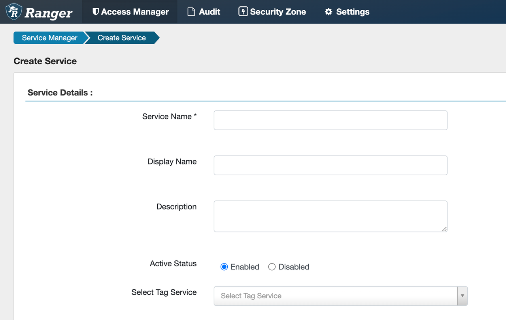
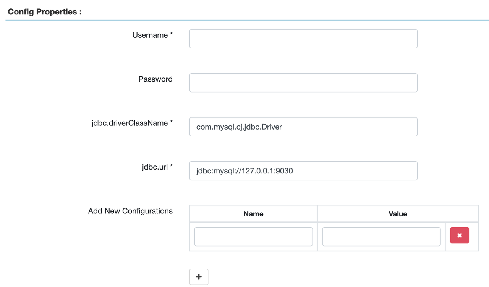
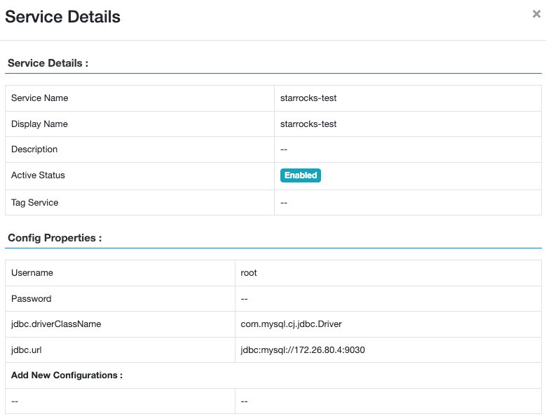
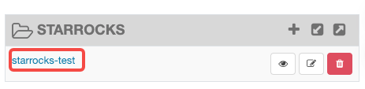

# Manage permissions with Apache Ranger

[Apache Ranger](https://ranger.apache.org/) provides a centralized security management framework that allows users to customize access policies through a visual web page. This helps determine which roles can access which data and exercise fine-grained data access control for various components and services in the Hadoop ecosystem.

Apache Ranger provides the following core modules:

- Ranger Admin: the core module of Ranger with a built-in web page. Users can create and update security policies on this page or through a REST interface. Plugins of various components of the Hadoop ecosystem poll and pull these policies at a regular basis.
- Agent Plugin: plugins of components embedded in the Hadoop ecosystem. These plugins pull security policies from Ranger Admin on a regular basis and store the policies in local files. When users access a component, the corresponding plugin assesses the request based on the configured security policy and sends the authentication results to the corresponding component.
- User Sync: used to pull user and user group information, and synchronize the permission data of users and user groups to Ranger's database.

In addition to the native RBAC privilege system, StarRocks also supports access control through Apache Ranger, providing a higher level of data security.

This topic describes the permission control methods and integration process of StarRocks and Apache Ranger. For information on how to create security policies on Ranger to manage data security, see the [Apache Ranger official website](https://ranger.apache.org/).

## Permission control method

StarRocks integrated with Apache Ranger provides the following permission control methods:

- Create StarRocks Service in Ranger to implement permission control. When users access StarRocks internal tables, external tables, or other objects, access control is performed according to the access policies configured in StarRocks Service.
- When users access an external data source, the external service (such as the Hive Service) on Apache Ranger can be reused for access control. StarRocks can match Ranger services with different External Catalogs and implements access control based on the Ranger service corresponding to the data source.

After StarRocks is integrating with Apache Ranger, you can achieve the following access control patterns:

- Use Apache Ranger to uniformly manage access to StarRocks internal tables, external tables, and all objects.
- Use Apache Ranger to manage access to StarRocks internal tables and objects. For External Catalogs, reuse the policy of the corresponding external service on Ranger for access control.
- Use Apache Ranger to manage access to External Catalogs by reusing the Service corresponding to the external data source. Use StarRocks RBAC privilege system to manage access to StarRocks internal tables and objects.

**Authentication process**

- You can also use LDAP for user authentication, then use Ranger to synchronize LDAP users and configure access rules for them. StarRocks can also complete user login authentication through LDAP.
- When users initiate a query, StarRocks parses the query statement, passes user information and required privileges to Apache Ranger. Ranger determines whether the user has the required privilege based on the access policy configured in the corresponding Service, and returns the authentication result to StarRocks. If the user has access, StarRocks returns the query data; if not, StarRocks returns an error.

## Prerequisites

- Apache Ranger 2.0.0 or later has been installed. For the instructions on how to install Apache Ranger, see [Ranger quick start](https://ranger.apache.org/quick_start_guide.html).
- All StarRocks FE machines have access to Apache Ranger. You can check this by running the following command on each FE machine:

   ```SQL
   telnet <ranger-ip> <ranger-host>
   ```

   If `Connected to <ip>` is displayed, the connection is successful.

## Integration procedure

### Installation ranger-starrocks-plugin

Currently, StarRocks supports:

- Creates access policies, masking policies, and row-level filter policies through Apache Ranger.
- Ranger audit logs.

1. Create the `starrocks` folder in the Ranger Admin directory `ews/webapp/WEB-INF/classes/ranger-plugins`.

   ```SQL
   mkdir {path-to-ranger}/ews/webapp/WEB-INF/classes/ranger-plugins/starrocks
   ```

2. Download `plugin-starrocks/target/ranger-starrocks-plugin- 3.0.0 -SNAPSHOT.jar` and `mysql-connector-j`, and place them in the `starrocks `folder.

   ```SQL
   cd {path-to-ranger}/ews/webapp/WEB-INF/classes/ranger-plugins/starrocks
   wget xxxx
   wget xxx
   ```

3. Restart Ranger Admin.

   ```SQL
   ranger-admin restart
   ```

### Configure StarRocks Service on Ranger Admin

1. Copy `ranger-servicedef-starrocks.json` to any directory of the StarRocks FE machine or Ranger machine. Take StarRocks FE machines as an example. `ranger-servicedef-starrocks.json` is stored in the `/agents-common/src/main/resources/service-defs` directory of the Ranger project.

   ```SQL
   vim ranger-servicedef-starrocks.json
   -- Copy the content in the JSON file and save it.
   ```

2. Add StarRocks Service by running the following command as a Ranger administrator.

   ```SQL
   curl -u <ranger_adminuser>:<ranger_adminpwd> -X POST -H "Accept: application/json" -H "Content-Type: application/json" http://<ranger-ip>:<ranger-port>/service/plugins/definitions -d@ranger-servicedef-starrocks.json
   ```

3. Access `http://<ranger-ip>:<ranger-host>/login.jsp` to log in to the Apache Ranger page. The StarRocks Service appears on the page.

   

4. Click the plus sign (`+`) after **STARROKCS** to configure StarRocks Service.

   
   

   - `Username` and `Password`: used to auto-complete object names when creating policies. The two parameters do not affect the connectivity between StarRocks and Ranger. If you want to use auto-completion, configure at least one user with the `db_admin` role activated.
   - `jdbc.url`: Enter the StarRocks cluster IP and port.

   The following figure shows a configuration example.

   

   The following figure shows the added service.

   

5. Click **Test connection** to test the connectivity, and save it after the connection is successful.
6. On each FE machine of the StarRocks cluster, create `ranger-starrocks-security.xml` in the `fe/conf` folder and copy the content. You must modify the following two parameters and save the modifications:
   a. `ranger.plugin.starrocks.service.name`: Change to the name of the StarRocks Service you created in Step 4.
   b. `ranger.plugin.starrocks.policy.rest the url`: Change to the address of the Ranger Admin.

   If you need to modify other configurations, refer to official documentation of Apache Ranger. For example, you can modify `ranger.plugin.starrocks.policy.pollIntervalM` to change the interval for pulling policy changes.

   ```SQL
   vim ranger-starrocks-security.xml

   ...
       <property>
           <name>ranger.plugin.starrocks.service.name</name>
           <value>starrocks</value> -- Change it to the StarRocks Service name.
           <description>
               Name of the Ranger service containing policies for this StarRocks instance
           </description>
       </property>
   ...

   ...
       <property>
           <name>ranger.plugin.starrocks.policy.rest.url</name>
           <value>http://localhost:6080</value> -- Change it to Ranger Admin address.
           <description>
               URL to Ranger Admin
           </description>
       </property>   
   ...
   ```

7. Add the configuration `access_control = ranger` to all FE configuration files.

   ```SQL
   vim fe.conf
   access_control=ranger 
   ```

8. Restart all FE machines.

   ```SQL
   -- Switch to the FE folder. 
   cd..

   bin/stop_fe.sh
   bin/start_fe.sh
   ```

## Reuse other services to control access to external tables

For External Catalog, you can reuse external services (such as Hive Service) for access control. StarRocks supports matching different Ranger external services for different Catalogs. When users access an external table, the system implements access control based on the access policy of the Ranger Service corresponding to the external table.

1. Copy Hive's Ranger configuration file `ranger-hive-security.xml` to the `fe/conf` file of all FE machines.
2. Restart all FE machines.
3. Configure External Catalog.

   - When you create an External Catalog, add the property `"ranger.plugin.hive.service.name"`.

      ```SQL
        CREATE EXTERNAL CATALOG hive_catalog_1
        PROPERTIES (
            "hive.metastore.uris" = "thrift://172.26.195.10:9083",
            "ranger.plugin.hive.service.name" = "hive_catalog_1"
        )
      ```
      
    - You can also add this property to an existing External Catalog.
  
       ```SQL
       ALTER CATALOG hive_catalog_1
       SET ("ranger.plugin.hive.service.name" = "hive_catalog_1");
       ```

​    This operation changes the authentication method of an existing Catalog to Ranger-based authentication.

## What to do next

After adding a StarRocks Service, you can click the service to create access control policies for the service and assign different permissions to different users or user groups. When users access StarRocks data, access control will be implemented based on these policies.
