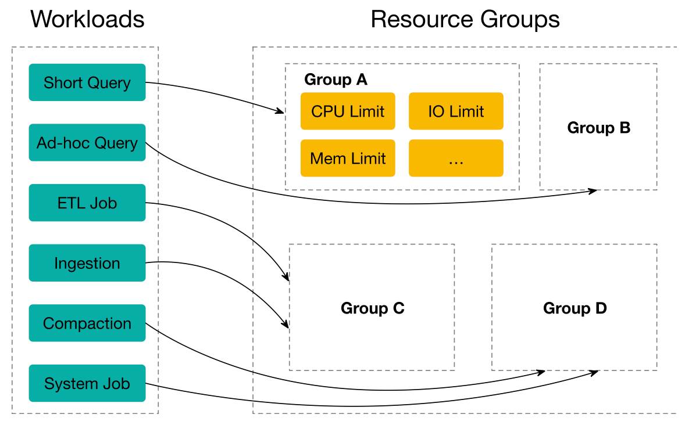

# Resource group

This topic describes the resource group feature of StarRocks.



With this feature, you could simultaneously run several workloads in a single cluster, including short query, ad-hoc query, ETL jobs, to save extra cost of deploying multiple clusters. From technical perspective, the execution engine would schedule concurrent workloads according to users' specification and isolate the interference among them.

The roadmap of Resource Group:

- Since v2.2, StarRocks supports limiting resource consumption for queries and implementing isolation and efficient use of resources among tenants in the same cluster.
- In StarRocks v2.3, you can further restrict the resource consumption for big queries, and prevent the cluster resources from getting exhausted by oversized query requests, to guarantee the system stability.
- StarRocks v2.5 supports limiting computation resource consumption for data loading (INSERT).

|  | Internal Table | External Table | Big Query Restriction| Short Query | Data Ingestion  | Schema Change | INSERT |
|---|---|---|---|---|---|---|---|
| 2.2 | √ | × | × | × | × | × | × |
| 2.3 | √ | √ | √ | √ | × | × | × |
| 2.4 | √ | √ | √ | √ | × | × | × |
| 2.5 | √ | √ | √ | √ | √ | × | √ |

## Terms

This section describes the terms that you must understand before you use the resource group feature.

### resource group

Each resource group is a set of computing resources from a specific BE. You can divide each BE of your cluster into multiple resource groups. When a query is assigned to a resource group, StarRocks allocates CPU and memory resources to the resource group based on the resource quotas that you specified for the resource group.

You can specify CPU and memory resource quotas for a resource group on a BE by using the following parameters:

- `cpu_core_limit`

  This parameter specifies the soft limit for the number of CPU cores that can be allocated to the resource group on the BE. Valid values: any non-zero positive integer.

  In actual business scenarios, CPU cores that are allocated to the resource group proportionally scale based on the availability of CPU cores on the BE.

  > **NOTE**
  >
  > For example, you configure three resource groups on a BE that provides 16 CPU cores: rg1, rg2, and rg3. The values of `cpu_core_limit` for the three resource groups are `2`, `6`, and `8`, respectively.
  >
  > If all CPU cores of the BE are occupied, the number of CPU cores that can be allocated to each of the three resource groups are 2, 6, and 8, respectively, based on the following calculations:
  >
  > - Number of CPU cores for rg1 = Total number of CPU cores on the BE × (2/16) = 2
  > - Number of CPU cores for rg2 = Total number of CPU cores on the BE × (6/16) = 6
  > - Number of CPU cores for rg3 = Total number of CPU cores on the BE × (8/16) = 8
  >
  > If not all CPU cores of the BE are occupied, as when rg1 and rg2 are loaded but rg3 is not, the number of CPU cores that can be allocated to rg1 and rg2 are 4 and 12, respectively, based on the following calculations:
  >
  > - Number of CPU cores for rg1 = Total number of CPU cores on the BE × (2/8) = 4
  > - Number of CPU cores for rg2 = Total number of CPU cores on the BE × (6/8) = 12

- `mem_limit`

  This parameter specifies the percentage of memory that can be used for queries in the total memory that is provided by the BE. Valid values: (0, 1).

  > **NOTE**
  >
  > The amount of memory that can be used for queries is indicated by the `query_pool` parameter. For more information about the parameter, see [Memory management](Memory_management.md).

- `concurrency_limit`

  This parameter specifies the upper limit of concurrent queries in a resource group. It is used to avoid system overload caused by too many concurrent queries. This parameter takes effect only when it is set greater than 0. Default: 0.

On the basis of the above resource consumption restrictions, you can further restrict the resource consumption for big queries with the following parameters:

- `big_query_cpu_second_limit`: This parameter specifies the upper time limit of CPU occupation for a big query. Concurrent queries add up the time. The unit is second. This parameter takes effect only when it is set greater than 0. Default: 0.
- `big_query_scan_rows_limit`: This parameter specifies the upper limit of row count that a big query can scan. This parameter takes effect only when it is set greater than 0. Default: 0.
- `big_query_mem_limit`: This parameter specifies the upper limit of memory usage of a big query. The unit is byte. This parameter takes effect only when it is set greater than 0. Default: 0.

> **NOTE**
>
> When a query running in a resource group exceeds the above big query limit, the query will be terminated with an error. You can also view error messages in the `ErrorCode` column of the FE node **fe.audit.log**.

You can set the resource group `type` to `short_query`, or `normal`.

- The default value is `normal`. You do not need specify `normal` in the parameter `type`.
- When queries hit a `short_query` resource group, the BE node reserves the CPU resource specified in `short_query.cpu_core_limit`. The CPU resource reserved for queries that hit `normal` resource group is limited to `BE core - short_query.cpu_core_limit`.
- When no query hits the `short_query` resource group, no limit is imposed to the resource of `normal` resource group.

> **CAUTION**
>
> - You can create at most ONE short query resource group in a StarRocks Cluster.
> - StarRocks does not set set a hard upper limit of CPU resource for `short_query` resource group.

### classifier

Each classifier holds one or more conditions that can be matched to the properties of queries. StarRocks identifies the classifier that best matches each query based on the match conditions and assigns resources for running the query.

Classifiers support the following conditions:

- `user`: the name of the user.
- `role`: the role of the user.
- `query_type`: the type of the query. `SELECT` and `INSERT` (from v2.5) are supported. When INSERT tasks hit a resource group with `query_type` as `insert`, the BE node reserves the specified CPU resources for the tasks.
- `source_ip`: the CIDR block from which the query is initiated.
- `db`: the database which the query accesses. It can be specified by strings separated by commas `,`.

A classifier matches a query only when one or all conditions of the classifier match the information about the query. If multiple classifiers match a query, StarRocks calculates the degree of matching between the query and each classifier and identifies the classifier with the highest degree of matching.

> **NOTE**
>
> You can view the resource group to which a query belongs in the `ResourceGroup` column of the FE node **fe.audit.log**.
>
> If a query does not hit any classifiers, the default resource group `default_wg` is used. The resource limits of `default_wg` are as follows:
>
> - `cpu_core_limit`: 1 (`<=` v2.3.7) or the number of CPU cores in BE (`>` v2.3.7)
> - `mem_limit`: 100%
> - `concurrency_limit`: 0
> - `big_query_cpu_second_limit`: 0
> - `big_query_scan_rows_limit`: 0
> - `big_query_mem_limit`: 0

StarRocks calculates the degree of matching between a query and a classifier by using the following rules:

- If the classifier has the same value of `user` as the query, the degree of matching of the classifier increases by 1.
- If the classifier has the same value of `role` as the query, the degree of matching of the classifier increases by 1.
- If the classifier has the same value of `query_type` as the query, the degree of matching of the classifier increases by 1 plus the number obtained from the following calculation: 1/Number of `query_type` fields in the classifier.
- If the classifier has the same value of `source_ip` as the query, the degree of matching of the classifier increases by 1 plus the number obtained from the following calculation: (32 - `cidr_prefix`)/64.
- If the classifier has the same value of `db` as the query, the degree of matching of the classifier increases by 10.

If multiple classifiers match a query, the classifier with a larger number of conditions has a higher degree of matching.

```plaintext
-- Classifier B has more conditions than Classifier A. Therefore, Classifier B has a higher degree of matching than Classifier A.


classifier A (user='Alice')


classifier B (user='Alice', source_ip = '192.168.1.0/24')
```

If multiple matching classifiers have the same number of conditions, the classifier whose conditions are described more accurately has a higher degree of matching.

```plaintext
-- The CIDR block that is specified in Classifier B is smaller in range than Classifier A. Therefore, Classifier B has a higher degree of matching than Classifier A.
classifier A (user='Alice', source_ip = '192.168.1.0/16')
classifier B (user='Alice', source_ip = '192.168.1.0/24')

-- Classifier C has fewer query types specified in it than Classifier D. Therefore, Classifier C has a higher degree of matching than Classifier D.
classifier C (user='Alice', query_type in ('select'))
classifier D (user='Alice', query_type in ('insert','select'))
```

## Isolate computing resources

You can isolate computing resources among queries by configuring resource groups and classifiers.

### Enable resource groups

To use resource group, you must enable Pipeline Engine for your StarRcosk cluster:

```SQL
-- Enable Pipeline Engine in the current session.
SET enable_pipeline_engine = true;
-- Enable Pipeline Engine globally.
SET GLOBAL enable_pipeline_engine = true;
```

> **NOTE**
>
> From v3.1.0 onwards, Resource Group is enabled by default, and the session variable `enable_resource_group` is deprecated.

### Create resource groups and classifiers

Execute the following statement to create a resource group, associate the resource group with a classifier, and allocate computing resources to the resource group:

```SQL
CREATE RESOURCE GROUP <group_name> 
TO (
    user='string', 
    role='string', 
    query_type in ('select'), 
    source_ip='cidr'
) --Create a classifier. If you create more than one classifier, separate the classifiers with commas (`,`).
WITH (
    "cpu_core_limit" = "INT",
    "mem_limit" = "m%",
    "concurrency_limit" = "INT",
    "type" = "str" --The type of the resource group. Set the value to normal.
);
```

Example:

```SQL
CREATE RESOURCE GROUP rg1
TO 
    (user='rg1_user1', role='rg1_role1', query_type in ('select'), source_ip='192.168.x.x/24'),
    (user='rg1_user2', query_type in ('select'), source_ip='192.168.x.x/24'),
    (user='rg1_user3', source_ip='192.168.x.x/24'),
    (user='rg1_user4'),
    (db='db1')
WITH (
    'cpu_core_limit' = '10',
    'mem_limit' = '20%',
    'big_query_cpu_second_limit' = '100',
    'big_query_scan_rows_limit' = '100000',
    'big_query_mem_limit' = '1073741824'
);
```

### Specify resource group (Optional)

You can specify resource group for the current session directly.

```SQL
SET resource_group = 'group_name';
```

### View resource groups and classifiers

Execute the following statement to query all resource groups and classifiers:

```SQL
SHOW RESOURCE GROUPS ALL;
```

Execute the following statement to query the resource groups and classifiers of the logged-in user:

```SQL
SHOW RESOURCE GROUPS;
```

Execute the following statement to query a specified resource group and its classifiers:

```SQL
SHOW RESOURCE GROUP group_name;
```

Example:

```plain
mysql> SHOW RESOURCE GROUPS ALL;
+------+--------+--------------+----------+------------------+--------+------------------------------------------------------------------------------------------------------------------------+
| Name | Id     | CPUCoreLimit | MemLimit | ConcurrencyLimit | Type   | Classifiers                                                                                                            |
+------+--------+--------------+----------+------------------+--------+------------------------------------------------------------------------------------------------------------------------+
| rg1  | 300039 | 10           | 20.0%    | 11               | NORMAL | (id=300040, weight=4.409375, user=rg1_user1, role=rg1_role1, query_type in (SELECT), source_ip=192.168.2.1/24)         |
| rg1  | 300039 | 10           | 20.0%    | 11               | NORMAL | (id=300041, weight=3.459375, user=rg1_user2, query_type in (SELECT), source_ip=192.168.3.1/24)                         |
| rg1  | 300039 | 10           | 20.0%    | 11               | NORMAL | (id=300042, weight=2.359375, user=rg1_user3, source_ip=192.168.4.1/24)                                                 |
| rg1  | 300039 | 10           | 20.0%    | 11               | NORMAL | (id=300043, weight=1.0, user=rg1_user4)                                                                                |
+------+--------+--------------+----------+------------------+--------+------------------------------------------------------------------------------------------------------------------------+
```

> **NOTE**
>
> In the preceding example, `weight` indicates the degree of matching.

### Manage resource groups and classifiers

You can modify the resource quotas for each resource group. You can also add or delete classifiers from resource groups.

Execute the following statement to modify the resource quotas for an existing resource group:

```SQL
ALTER RESOURCE GROUP group_name WITH (
    'cpu_core_limit' = 'INT',
    'mem_limit' = 'm%'
);
```

Execute the following statement to delete a resource group:

```SQL
DROP RESOURCE GROUP group_name;
```

Execute the following statement to add a classifier to a resource group:

```SQL
ALTER RESOURCE GROUP <group_name> ADD (user='string', role='string', query_type in ('select'), source_ip='cidr');
```

Execute the following statement to delete a classifier from a resource group:

```SQL
ALTER RESOURCE GROUP <group_name> DROP (CLASSIFIER_ID_1, CLASSIFIER_ID_2, ...);
```

Execute the following statement to delete all classifiers of a resource group:

```SQL
ALTER RESOURCE GROUP <group_name> DROP ALL;
```

## Monitor resource group

You can set [monitor and alert](Monitor_and_Alert.md) for your resource groups.

Metrics you can monitor regarding resource groups include:

- FE
  - `starrocks_fe_query_resource_group`: The number of queries in each resource group.
  - `starrocks_fe_query_resource_group_latency`: The query latency percentile for each resource group.
  - `starrocks_fe_query_resource_group_err`: The number of terminated-with-error queries in each resource group.
- BE
  - `starrocks_be_resource_group_cpu_limit_ratio`: Instantaneous value of resource group CPU quota ratio.
  - `starrocks_be_resource_group_cpu_use_ratio`: Instantaneous value of resource group CPU usage ratio.
  - `starrocks_be_resource_group_mem_limit_bytes`: Instantaneous value of resource group memory quota.
  - `starrocks_be_resource_group_mem_allocated_bytes`: Instantaneous value of resource group memory usage.

## What to do next

After you configure resource groups, you can manage memory resources and queries. For more information, see the following topics:

- [Memory management](../administration/Memory_management.md)

- [Query management](../administration/Query_management.md)
