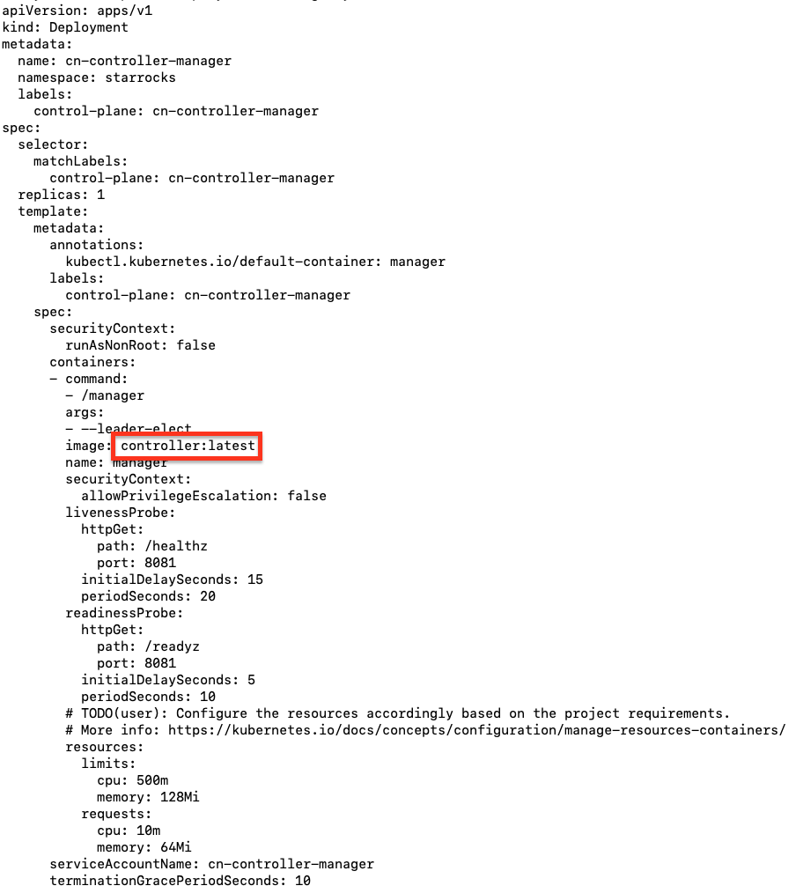
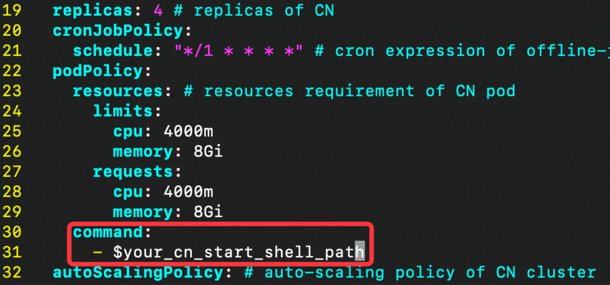
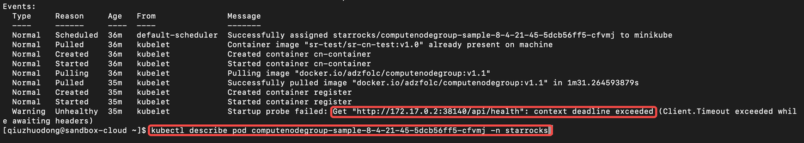

# Deploy and manage CNs on Kubernetes with StarRocks Operator [Preview]

From 2.4 onwards, StarRocks introduces a new type of node, a stateless compute node (CN for short), in addition to FEs and BEs. CNs provide compute services and are responsible for completing part of the execution plan. They don't store or manage data. Multiple CNs consist of a CN cluster. It can be containerized, deployed, and maintained on Kubernetes to achieve auto-scaling. Thus, the StarRocks cluster as a whole can better support data analytics workloads that consume a lot of compute resources, such as data lake analytics.

This topic describes how to use StarRocks operator to deploy a CN cluster on Kubernetes to achieve auto-scaling.

## Concepts

- **Kubernetes**

    [Kubernetes](https://kubernetes.io/docs/home/), also known as K8s, is an open-source system for automating deployment, scaling, and management of containerized applications.

    > A container bundles and runs a lightweight and portable executable image that contains software and all of its dependencies.

- **Operator**

    [Operators](https://kubernetes.io/docs/concepts/extend-kubernetes/operator/) are software extensions to Kubernetes that make use of [custom resources](https://kubernetes.io/docs/concepts/extend-kubernetes/api-extension/custom-resources/) to manage applications and their components. StarRocks Operator can deploy StarRocks compute service on cloud. It can simplify operation and maintenance, and realize auto-scaling of computing resources.

- **Node**

    [Node](https://kubernetes.io/docs/concepts/architecture/nodes/) is the actual resources provider in a Kubernetes cluster and are the place where Pods are scheduled to run. In a production environment, a Kubernetes cluster usually consists of multiple Nodes.

- **Pod**

    [Pod](https://kubernetes.io/docs/concepts/workloads/pods/) is the smallest deployable units of computing that you can create and manage in Kubernetes. A Pod (as in a pod of whales or pea pod) is a group of one or more [containers](https://kubernetes.io/docs/concepts/containers/), with shared storage and network resources, and a specification for how to run the containers.

    When a StarRocks Operator is in work, FEs detect compute services through Direct Connect. But StarRocks does not allow nodes in one cluster to share the same IP. So StarRocks Operator only supports a Pod containing a CN and scheduled to run on one Node.

- **CN**

    CN is a stateless compute node and is responsible for carrying out part of the execution plan. It doesn't store data. Multiple CNs consist of a CN cluster. It can be containerized, and be deployed and maintained on Kubernetes. StarRocks operator senses a CN cluster's resource load and deploys more or less CNs accordingly to achieve autoscaling.

## Principle

- **Interaction between StarRocks Operator, CN cluster, and StarRocks**

    StarRocks Operator connects to FE by using FE's IP address and query port and adds CNs to a StarRocks cluster. If you query the data stored in BEs, FE assigns the execution plan to CNs and BEs according to the data distribution and operator types in the execution plan. CNs receive data after BEs shuffle data, perform some operators (e.g. JOIN), and returns the computation results to FE.

    Also, to query data from data lake, such as HDFS, AWS S3, FE assigns the execution plan to CNs, and CNs directly access the external data source, perform all the operators, and finally returns the computation results to FE.

- **Scaling policy of StarRocks Operator**

    StarRocks Operator senses the CN cluster resource load in a K8s cluster, and automatically deploys more or less CNs to achieve autoscaling according to the configured scaling policy.

## Environment preparation

- [Deploy a StarRocks cluster](../quick_start/Deploy.md).

- [Install a Kubernetes cluster](https://kubernetes.io/docs/setup/production-environment/tools/kubeadm/).

   > Note:
   >
   > If you want to quickly get started with this feature, you can create a single-node Kubernetes cluster with Minikube.

- [Install the GO language development environment](https://go.dev/doc/install) on the machine that deploys StarRocks Operator. This is because the GO language is used to compile StarRocks Operator code while the StarRocks Operator image is created.

## Prepare Docker images

You need to build Docker images, including StarRocks Operator, CN, and CN Group images, and push the images to a remote Docker repository. When you deploy StarRocks Operator, CN, and CN Group, you will pull images from the remote repository.

### Prepare StarRocks Operator image

1. Download the StarRocks Operator code and save it to the directory **$your_code_path/****starrocks****-kubernetes-operator** .

    ```Bash
    cd $your_code_path
    git clone https://github.com/StarRocks/starrocks-kubernetes-operator
    ```

2. Enter the directory **$your_code_path/****starrocks****-kubernetes-operator**.

    ```Bash
    cd starrocks-kubernetes-operator
    ```

3. Create a StarRocks Operator image.

    ```Bash
    make docker IMG="starrocks-kubernetes-operator:v1.0"
    ```

4. Execute `docker login` and enter your account and password to log in to the remote Docker repository Docker Hub.

    > Note: You need to register an account and create a Docker repository in [Docker Hub](https://hub.docker.com) in advance.

5. Tag the StarRocks Operator image and push it to the remote Docker repository.

    ```Bash
    docker tag $operator_image_id $account/repo:tag
    docker push $account/repo:tag
    ```

    > NOTE
    >
    > - `dockerImageId`: StarRocks Operator image ID. To see images ID, execute the `docker images` command.
    >
    > - `account/repo:tag`: StarRocks Operator image tag, e.g. `starrocks/sr-cn-test:operator`. `account` is your Docker Hub account, `repo` is the Docker repository in Docker Hub, and `tag` is the tag you determined for StarRocks Operator image.

### Prepare a CN image

1. Download the StarRocks code from the Github repository.

    ```Bash
    git clone https://github.com/StarRocks/starrocks
    ```

2. Enter the directory **docker**.

    ```Bash
    cd $your_path/starrocks/docker
    ```

3. Compile StarRocks and create a CN image.

    ```Plaintext
    ./build.sh -b branch-2.4
    ```

4. Tag the CN image and push it to the remote Docker repository.

    ```Bash
    docker tag $cn_Image_Id $account/repo:tag
    docker push $account/repo:tag
    ```

### Prepare a CN Group image

1. Enter the directory **starrocks****-kubernetes-operator****/components**.

    ```Bash
    cd $your_code_path/starrocks-kubernetes-operator/components
    ```

2. Create a CN Group image and push it to the remote Docker repository.

    ```Bash
    # Build a image.
    make docker IMG="computenodegroup:v1.0"
    # Push the image to docker hub.
    make push IMG="computenodegroup:v1.0"
    ```

## Deploy StarRocks Operator

1. Enter the directory **starrocks****-kubernetes-operator****/deploy**.

    ```Bash
    cd $your_code_path/starrocks-kubernetes-operator/deploy
    ```

2. Configure **manager.yaml.** Configure the StarRocks Operator image tag. For example, `starrocks/sr-cn-test:operator.`
   

3. Execute the following command to deploy StarRocks Operator.

    ```Bash
    kubectl apply -f starrocks.com_computenodegroups.yaml
    kubectl apply -f namespace.yaml
    kubectl apply -f leader_election_role.yaml
    kubectl apply -f role.yaml
    kubectl apply -f role_binding.yaml
    kubectl apply -f leader_election_role_binding.yaml
    kubectl apply -f service_account.yaml
    kubectl apply -f manager.yaml 
    ```

4. Check the pod status by executing `kubectl get pod -n starrocks`. Check whether `STATUS` is `Running`.

    ```Bash
    kubectl get pod -n starrocks
    NAMESPACE     NAME                                                READY   STATUS             RESTARTS        AGE
    starrocks     cn-controller-manager-69598d4b48-6qj2p              1/1     Running            0               13h
    ```

## Deploy a CN cluster

1. Enter the directory **starrocks****-kubernetes-operator/examples/cn**.

    ```Bash
    cd $your_code_path/starrocks-kubernetes-operator/examples/cn
    ```

2. Configure **cn.yaml**.
   1. `cnImage`: CN image tag in the remote repository. For example, `starrocks/sr-cn-test:v3`.
   2. `componentsImage` : CN Group image tag in the remote repository. For example, `starrocks/computenodegroup:v1.0`.
   3. `<fe_ip>:<fe_query_port>`: any FE's IP address and `query_port` port (defaults to `9030`).

        ```Bash
            feInfo:
                accountSecret: test-secret # Secret of the FE account
                addresses: # FE addresses
                - <fe_ip>:<fe_query_port>
        ```

   4. Add the `command` configuration: specify the absolute path of **start_cn.shell** in the CN Group image.
      

3. Deploy a CN cluster.

    ```Bash
    cd examples/cn
    kubectl apply -f fe-account.yaml
    kubectl apply -f cn-config.yaml
    kubectl apply -f cn.yaml
    ```

4. Check the CN cluster status.

    ```Bash
    $ kubectl get pod -n starrocks # NAMESPACE is default to be starrocks
    NAMESPACE     NAME                                                READY   STATUS             RESTARTS        AGE
    starrocks     cn-controller-manager-69598d4b48-6qj2p              1/1     Running            0               13h
    starrocks     computenodegroup-sample-8-4-21-45-5dcb56ff5-4l522   2/2     Running            0               12m
    starrocks     computenodegroup-sample-8-4-21-45-5dcb56ff5-cfvmj   2/2     Running            0               4m29s
    starrocks     computenodegroup-sample-8-4-21-45-5dcb56ff5-lz5s2   2/2     Running            0               4m23s
    starrocks     computenodegroup-sample-8-4-21-45-5dcb56ff5-s7dwz   2/2     Running            0               12m
    ```

After the CN cluster is running successfully, StarRocks Operator uses the FE IP address and query port number configured in the **cn.yaml** to add CNs into the StarRocks cluster.

## Configure [policy for horizontal pod autoscaling](https://kubernetes.io/docs/tasks/run-application/horizontal-pod-autoscale/#scaling-policies)

1. If you want to configure [policy for horizontal pod autoscaling](https://kubernetes.io/docs/tasks/run-application/horizontal-pod-autoscale/#scaling-policies), you can edit the **cn.yaml** file `$your_code_path/starrocks-kubernetes-operator/examples/cn/cn.yaml`.

    ```Bash
    autoScalingPolicy: # Auto-scaling policy of CN cluster
        maxReplicas: 10 # Maximum number of CNs
        minReplicas: 1 # Minimum number of CNs
        hpaPolicy:
            metrics: # The metrics and scaling threshold. For more information, see metricspec.
            - type: Resource
                resource:
                name: memory
                target:
                    averageUtilization: 30
                    type: Utilization
            - type: Resource
                resource: 
                name: cpu
                target:
                    averageUtilization: 30
                    type: Utilization
            behavior: # Scaling behavior
            scaleUp:
                policies:
                - type: Pods
                    value: 1
                    periodSeconds: 10
            scaleDown:
                selectPolicy: Disabled
    ```

    The description for some parameters is as follows:

    > For more parameters and detailed description, see [Horizontal Pod Autoscaling](https://kubernetes.io/docs/tasks/run-application/horizontal-pod-autoscale/).

    - Set the maximum and minimum numbers of CNs for horizontal scaling.

        ```Bash
        # The maximum number of CNs. The upper limit is 10.
        maxReplicas: 10 
        # The minimum number of CNs. The lower limit is 1.
        minReplicas: 1
        ```

    - Set the CPU utilization threshold for horizontal scaling.

        ```Bash
        - type: Resource
        resource:
            name: cpu
            target:
            averageUtilization: 30
        ```

2. Validate the auto-scaling policy.

    ```Plaintext
    kubectl apply -f cn/cn.yaml
    ```

## **FAQ**

### Unable to Deploy CN

Execute `Kubectl get po -A` to check the status of pods.

- **Problem description:** If the returned result shows that `reason` is `unhealthy`, the HTTP health check fails.


- **Solution**: Refer to [Deploy a CN cluster](#deploy-a-cn-cluster) and check FE's IP address and the query port number in **cn.yaml**.


- **Problem description:** If `Message` shows `exec: "be/bin/start_cn.sh": stat be/bin/start_cn.sh: no such file or directory`, it means getting the startup script fail.

    ```Plain
    Events:
    Type     Reason     Age                    From               Message
    ----     ------     ----                   ----               -------
    Normal   Scheduled  5m53s                  default-scheduler  Successfully assigned starrocks/computenodegroup-sample-5979687fd-qw28w to ip-172-31-44-58
    Normal   Pulling    5m51s                  kubelet            Pulling image "adzfolc/computenodegroup:v1.1"
    Normal   Started    5m48s                  kubelet            Started container register
    Normal   Pulled     5m48s                  kubelet            Successfully pulled image "adzfolc/computenodegroup:v1.1" in 2.865218014s
    Normal   Created    5m48s                  kubelet            Created container register
    Normal   Created    5m3s (x4 over 5m51s)   kubelet            Created container cn-container
    Warning  Failed     5m3s (x4 over 5m51s)   kubelet            Error: failed to start container "cn-container": Error response from daemon: OCI runtime create failed: container_linux.go:380: starting container process caused: exec: "be/bin/start_cn.sh": stat be/bin/start_cn.sh: no such file or directory: unknown
    Normal   Pulled     4m15s (x5 over 5m51s)  kubelet            Container image "adzfolc/sr-cn-test:v3" already present on machine
    Warning  BackOff    41s (x27 over 5m46s)   kubelet            Back-off restarting failed container
    ```

- **Solution:** Refer to [Deploy a CN cluster](#deploy-a-cn-cluster) and check the path of **start_cn.shell** in **cn.yaml**.
