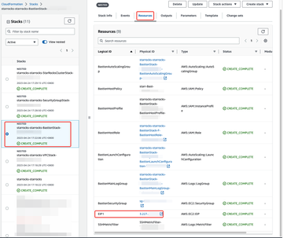
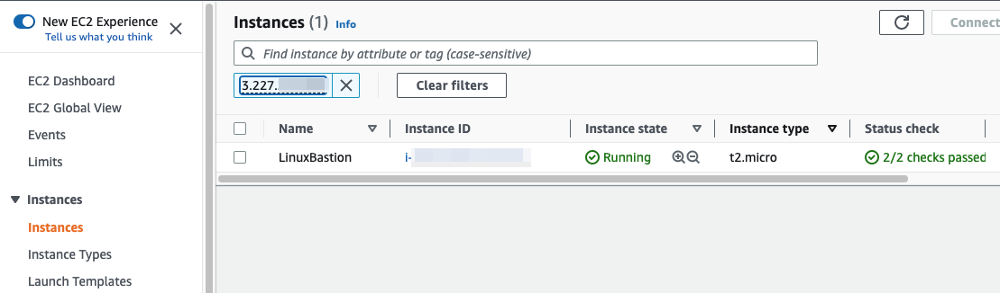
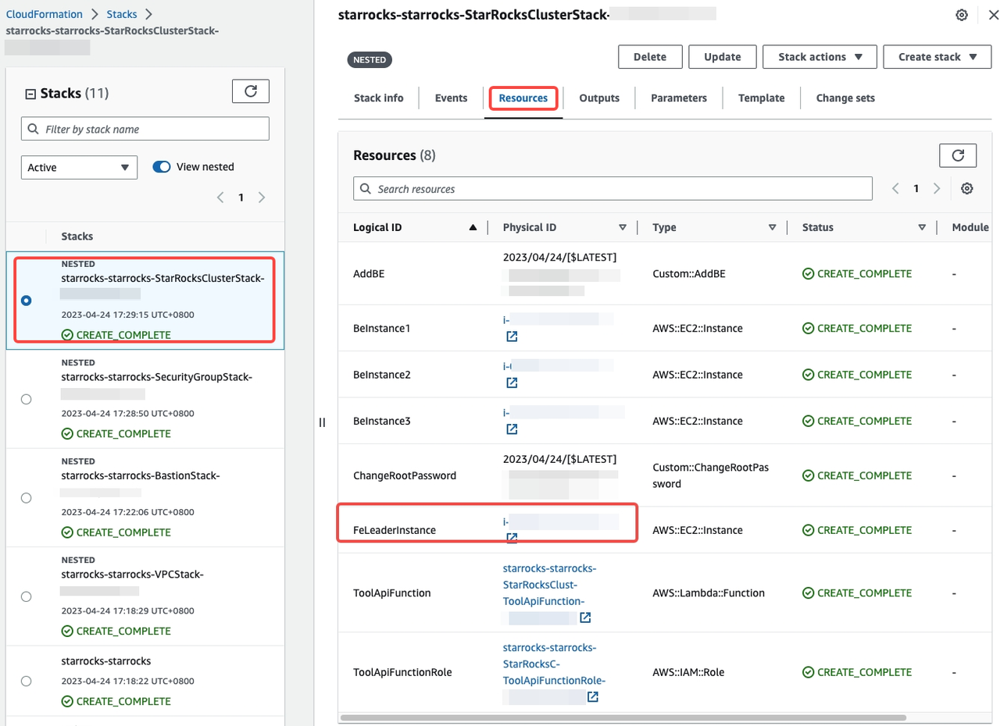
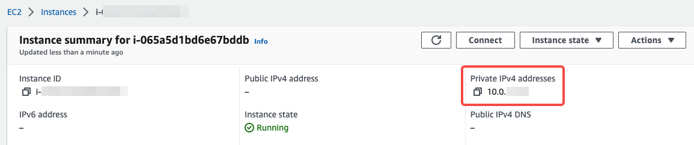

# Deploy StarRocks on AWS

StarRocks and AWS provide [AWS Partner Solutions](https://aws.amazon.com/solutions/partners) to quickly deploy StarRocks on AWS. This topic provides step-by-step instructions to help you deploy and access StarRocks.

## Basic concepts

[AWS Partner Solutions](https://aws-ia.github.io/content/qs_info.html)

AWS Partner Solutions are automated reference deployments built by AWS solutions architects and AWS Partners. AWS Partner Solutions uses [AWS CloudFormation](https://docs.aws.amazon.com/AWSCloudFormation/latest/UserGuide/Welcome.html) templates that automatically deploy AWS resources and third-party resources, such as StarRocks clusters, on the AWS Cloud.

[Templates](https://docs.aws.amazon.com/AWSCloudFormation/latest/UserGuide/cfn-whatis-concepts.html#w2aab5c15b7)

Templates are JSON or YAML formatted text files that describe AWS resources and third-party resources, as well as the properties of those resources.

[Stacks](https://docs.aws.amazon.com/AWSCloudFormation/latest/UserGuide/cfn-whatis-concepts.html#w2ab1b5c15b9)

Stacks are used to create and manage the resources described in templates. You can create, update, and delete a set of resources by creating, updating, and deleting a stack.

All resources in a stack are defined by a template. Suppose you have created a template that describes various resources. To configure these resources, you need to create a stack by submitting the template that you created, and AWS CloudFormation then configures all those resources for you.

## Deploy StarRocks cluster

1. Sign in to [your AWS account](https://console.aws.amazon.com/console/home). If you don't have an account, sign up at [https://aws.amazon.com](https://aws.amazon.com/).

2. Choose the AWS Region from the top toolbar.

3. Choose a deployment option to launch this [Partner Solution](https://aws.amazon.com/cn/quickstart/architecture/starrocks-starrocks/). The AWS CloudFormation console opens with a prepopulated template which is used to deploy a StarRocks cluster with one FE and three BEs. Deployment takes about 30 minutes to complete.

   1. [Deploy StarRocks into a new VPC](https://fwd.aws/QKGpd?). This option builds a new AWS environment that consists of a VPC, subnets, NAT gateways, security groups, bastion hosts, and other infrastructure components. It then deploys StarRocks into this new VPC.
   2. [Deploy StarRocks into an existing VPC](https://fwd.aws/vV4G6?). This option provisions StarRocks in your existing AWS infrastructure.

4. Choose the correct AWS Region.

5. On the **Create stack** page, keep the default setting for the template URL, and then choose **Next**.

6. On the **Specify stack details** page

   1. Customize the stack name if needed.

   2. Configure and review the parameters for the template.

      1. Configure the required parameters.

         - When you choose to deploy StarRocks into a new VPC, pay attention to the following parameters：

             | Type                            | Parameter                 | Required                                             | Description                                                  |
             | ------------------------------- | ------------------------- | ---------------------------------------------------- | ------------------------------------------------------------ |
             | Network configuration           | Availability Zones        | Yes                                                  | Select two availability zones for deploying the StarRocks cluster. For more information, see [Regions and Zones](https://docs.aws.amazon.com/AWSEC2/latest/UserGuide/using-regions-availability-zones.html#concepts-local-zones). |
             | EC2 configuration               | Key pair name             | Yes                                                  | Enter a key pair, consisting of a public key and a private key, is a set of security credentials that you use to prove your identity when you connect to EC2 instances. For more information, see [key pairs](https://docs.aws.amazon.com/AWSEC2/latest/UserGuide/ec2-key-pairs.html). > Note > > If you need to create a key pair, see [Create key pairs](https://docs.aws.amazon.com/AWSEC2/latest/UserGuide/create-key-pairs.html). |
             | StarRocks cluster configuration | Root Password of Starrock | Yes                                                  | Enter the password of your StarRocks root account. You need to provide the password when you connect to the StarRocks cluster by using the root account. |
             |  |Confirm Root Password           | Yes                       | Confirm the password of your StarRocks root account. |                                                              |

         - When you choose to deploy StarRocks into an existing VPC, pay attention to the following parameters:

           | Type                            | Parameter                 | Required                                                     | Description                                                  |
           | ------------------------------- | ------------------------- | ------------------------------------------------------------ | ------------------------------------------------------------ |
           | Network configuration           | VPC ID                    | Yes                                                          | Enter the ID of your existing VPC. Make sure that you [configure VPC endpoint for the AWS S3](https://docs.aws.amazon.com/vpc/latest/privatelink/vpc-endpoints-s3.html). |
           | |Private subnet 1 ID             | Yes                       | Enter the ID of the private subnet in Availability Zone 1 of your existing VPC (for example, subnet-fe9a8b32). |                                                              |
           | |Public subnet 1 ID              | Yes                       | Enter the ID of the public subnet in Availability Zone 1 of your existing VPC. |                                                              |
           | |Public subnet 2 ID              | Yes                       | Enter the ID of the public subnet in Availability Zone 2 of your existing VPC. |                                                              |
           | EC2 configuration               | Key pair name             | Yes                                                          | Enter a key pair, consisting of a public key and a private key, is a set of security credentials that you use to prove your identity when you connect to EC2 instances. For more information, see [key pairs](https://docs.aws.amazon.com/AWSEC2/latest/UserGuide/ec2-key-pairs.html). <br /> **NOTE** <br /> If you need to create a key pair, see [Create key pairs](https://docs.aws.amazon.com/AWSEC2/latest/UserGuide/create-key-pairs.html). |
           | StarRocks cluster configuration | Root Password of Starrock | Yes                                                          | Enter the password of your StarRocks root account. You need to provide the password when you connect to the StarRocks cluster by using the root account. |
           | |Confirm Root Password           | Yes                       | Confirm the password of your StarRocks root account.         |                                                              |

      2. For other parameters, review the default settings and customize them as necessary.

   3. When you finish configuring and reviewing the parameters, choose **Next**.

7. On the **Configure stack options** page, keep the default settings and click **Next**.

8. On the **Review starrocks-starrocks** page, review the stack information configured above, including the template, details, and more options. For more information, see [Reviewing your stack and estimating stack cost on the AWS CloudFormation console](https://docs.aws.amazon.com/AWSCloudFormation/latest/UserGuide/cfn-using-console-create-stack-review.html).

    > **NOTE**
    >
    > If you need to change any of the parameters, click **Edit** on the top right corner of the related section to go back to the relevant page.

9. Select the following two check boxes and click **Create stack**.

    

    **Note that you are responsible for the cost of the AWS services and any third-party licenses** used while running this Partner Solution. For cost estimates, refer to the pricing pages for each AWS service you use.

## Access StarRocks cluster

Because the StarRocks cluster is deployed into a private subnet, you need to first connect to an EC2 Bastion Host and then access the StarRocks cluster.

1. Connect to the EC2 Bastion Host that is used to access the StarRocks cluster.

   1. From the AWS CloudFormation console, on the **Outputs** tab for `BastionStack`, note the value for `EIP1` down.
   

   2. From the EC2 console, choose the EC2 Bastion Host.
   

   3. Edit the inbound rule for the security group associated with the EC2 Bastion Host, to allow traffic from your machine to the EC2 Bastion Host.

   4. Connect to the EC2 Bastion Host.

2. Access the StarRocks cluster

   1. Install MySQL on the EC2 Bastion Host.

   2. Use the following command to connect the StarRocks cluster:

      ```Bash
      mysql -u root -h 10.0.xx.xx -P 9030 -p
      ```

      - host:
        You can find the FE's private IP address according to the following steps:

        1. From the AWS CloudFormation console, on the **Outputs** tab for `StarRocksClusterStack`, click the value for `FeLeaderInstance`.
        

        2. From the instance summary page, find the FE's private IP address.
        

      - password: enter the password you configure in step 5.
