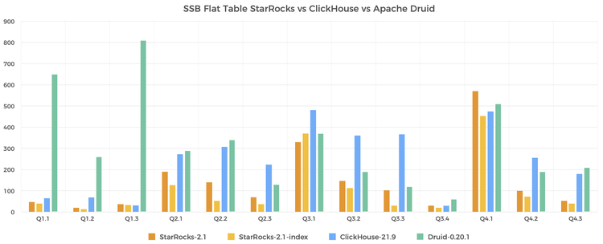
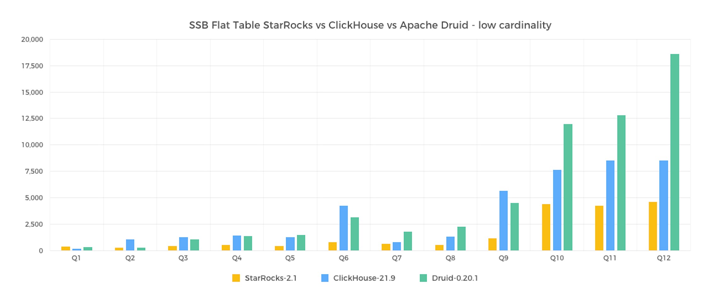
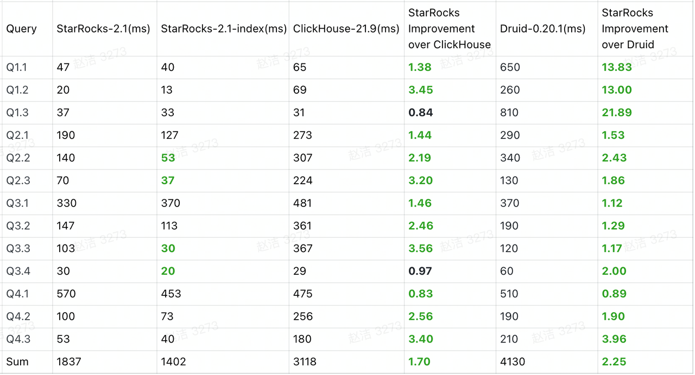
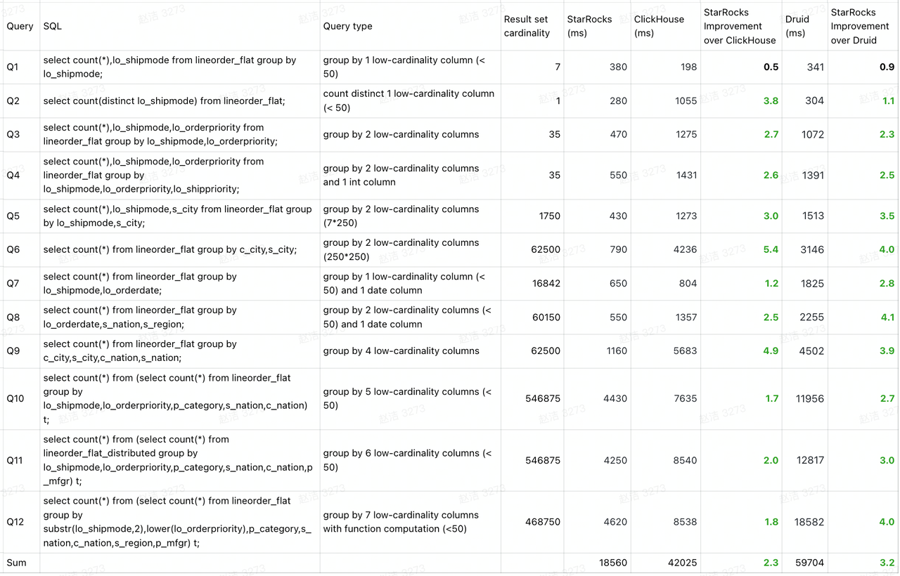

# SSB Flat-table Benchmarking

Star schema benchmark (SSB) is designed to test basic performance metrics of OLAP database products. SSB uses a star schema test set that is widely applied in academia and industry. For more information, see the paper [Star Schema Benchmark](https://www.cs.umb.edu/~poneil/StarSchemaB.PDF).
ClickHouse flattens the star schema into a wide flat table and rewrites the SSB into a single-table benchmark. For more information, see [Star schema benchmark of ClickHouse](https://clickhouse.tech/docs/en/getting-started/example-datasets/star-schema/).
This test compares the performance of StarRocks, Apache Druid, and ClickHouse against SSB single-table datasets and also compares the performance of StarRocks and ClickHouse in low-cardinality aggregation scenarios.

## 1. Test Conclusion

- Among the 13 queries performed on SSB standard datasets, ClickHouse has a response time 1.7x that of StarRocks, and Apache Druid 2.2x that of StarRocks.
- StarRocks performs even better when the bitmap indexing and cache features are enabled, especially on Q2.2, Q2.3, and Q3.3. The overall performance is 2.2x that of ClickHouse and 2.9x that of Apache Druid.



- We also conduct tests on low-cardinality aggregation against standard datasets. ClickHouse has a query response time 2.26x that of StarRocks.



In the SSB single-table test and low-cardinality aggregation test, three cloud hosts with a configuration of 16-core CPU and 64 GB of memory are used to test data at a scale of 600 million rows of data.

## 2. Test Preparation

### 2.1 Hardware Environment

| Machine           | 3 cloud hosts                                                |
| ----------------- | ------------------------------------------------------------ |
| CPU               | 16-Core Intel (R) Xeon (R) Platinum 8269CY CPU @2.50GHz Cache size: 36608 KB |
| Memory            | 64 GB                                                        |
| Network bandwidth | 5 Gbit/s                                                     |
| Disk              | ESSD                                                         |

### 2.2 Software Environment

StarRocks, Apache Druid, and ClickHouse are deployed on hosts of the same configurations.

- StarRocks: three BEs and one FE. The FE can be separately deployed or hybrid deployed with BEs.
- ClickHouse: three nodes with distributed tables
- Apache Druid has an additional 8-core master host deployed with Broker, Coordinator, Overlord, and Router. However, we will not pressure test  the master host and the impact is negligible. Historical and MiddleManager processes are hybrid deployed on hosts that have the same configuration as StarRocks and ClickHouse.

Kernel version: Linux 3.10.0-1127.13.1.el 7.x86_64

OS version: CentOS Linux release 7.8.2003

Software version: StarRocks Community Version 2.1, Apache Druid 0.20.1, ClickHouse 21.9

## 3. Test Data and Results

### 3.1 Test Data

| Table          | Record       | Description              |
| -------------- | ------------ | ------------------------ |
| lineorder      | 600 million  | Lineorder fact table     |
| customer       | 3 million    | Customer dimension table |
| part           | 1.4 million  | Part dimension table     |
| supplier       | 200 thousand | Supplier dimension table |
| dates          | 2,556        | Date dimension table     |
| lineorder_flat | 600 million  | lineorder flat table     |

### 3.2 Test SQL

#### 3.2.1 SQL for single-table test

```SQL
--Q1.1 
SELECT sum(lo_extendedprice * lo_discount) AS `revenue` 
FROM lineorder_flat 
WHERE lo_orderdate >= '1993-01-01' and lo_orderdate <= '1993-12-31' AND lo_discount BETWEEN 1 AND 3 AND lo_quantity < 25; 
 
--Q1.2 
SELECT sum(lo_extendedprice * lo_discount) AS revenue FROM lineorder_flat  
WHERE lo_orderdate >= '1994-01-01' and lo_orderdate <= '1994-01-31' AND lo_discount BETWEEN 4 AND 6 AND lo_quantity BETWEEN 26 AND 35; 
 
--Q1.3 
SELECT sum(lo_extendedprice * lo_discount) AS revenue 
FROM lineorder_flat 
WHERE weekofyear(lo_orderdate) = 6 AND lo_orderdate >= '1994-01-01' and lo_orderdate <= '1994-12-31' 
 AND lo_discount BETWEEN 5 AND 7 AND lo_quantity BETWEEN 26 AND 35; 
 
 
--Q2.1 
SELECT sum(lo_revenue), year(lo_orderdate) AS year,  p_brand 
FROM lineorder_flat 
WHERE p_category = 'MFGR#12' AND s_region = 'AMERICA' 
GROUP BY year,  p_brand 
ORDER BY year, p_brand; 
 
--Q2.2 
SELECT 
sum(lo_revenue), year(lo_orderdate) AS year, p_brand 
FROM lineorder_flat 
WHERE p_brand >= 'MFGR#2221' AND p_brand <= 'MFGR#2228' AND s_region = 'ASIA' 
GROUP BY year,  p_brand 
ORDER BY year, p_brand; 
  
--Q2.3 
SELECT sum(lo_revenue),  year(lo_orderdate) AS year, p_brand 
FROM lineorder_flat 
WHERE p_brand = 'MFGR#2239' AND s_region = 'EUROPE' 
GROUP BY  year,  p_brand 
ORDER BY year, p_brand; 
 
 
--Q3.1 
SELECT c_nation, s_nation,  year(lo_orderdate) AS year, sum(lo_revenue) AS revenue FROM lineorder_flat 
WHERE c_region = 'ASIA' AND s_region = 'ASIA' AND lo_orderdate  >= '1992-01-01' AND lo_orderdate   <= '1997-12-31' 
GROUP BY c_nation, s_nation, year 
ORDER BY  year ASC, revenue DESC; 
 
--Q3.2 
SELECT  c_city, s_city, year(lo_orderdate) AS year, sum(lo_revenue) AS revenue
FROM lineorder_flat 
WHERE c_nation = 'UNITED STATES' AND s_nation = 'UNITED STATES' AND lo_orderdate  >= '1992-01-01' AND lo_orderdate <= '1997-12-31' 
GROUP BY c_city, s_city, year 
ORDER BY year ASC, revenue DESC; 
 
--Q3.3 
SELECT c_city, s_city, year(lo_orderdate) AS year, sum(lo_revenue) AS revenue 
FROM lineorder_flat 
WHERE c_city in ( 'UNITED KI1' ,'UNITED KI5') AND s_city in ( 'UNITED KI1' ,'UNITED KI5') AND lo_orderdate  >= '1992-01-01' AND lo_orderdate <= '1997-12-31' 
GROUP BY c_city, s_city, year 
ORDER BY year ASC, revenue DESC; 
 
--Q3.4 
SELECT c_city, s_city, year(lo_orderdate) AS year, sum(lo_revenue) AS revenue 
FROM lineorder_flat 
WHERE c_city in ('UNITED KI1', 'UNITED KI5') AND s_city in ( 'UNITED KI1',  'UNITED KI5') AND  lo_orderdate  >= '1997-12-01' AND lo_orderdate <= '1997-12-31' 
GROUP BY c_city,  s_city, year 
ORDER BY year ASC, revenue DESC; 
 
 
--Q4.1 
SELECT year(lo_orderdate) AS year, c_nation,  sum(lo_revenue - lo_supplycost) AS profit FROM lineorder_flat 
WHERE c_region = 'AMERICA' AND s_region = 'AMERICA' AND p_mfgr in ( 'MFGR#1' , 'MFGR#2') 
GROUP BY year, c_nation 
ORDER BY year ASC, c_nation ASC; 
 
--Q4.2 
SELECT year(lo_orderdate) AS year, 
    s_nation, p_category, sum(lo_revenue - lo_supplycost) AS profit 
FROM lineorder_flat 
WHERE c_region = 'AMERICA' AND s_region = 'AMERICA' AND lo_orderdate >= '1997-01-01' and lo_orderdate <= '1998-12-31' AND  p_mfgr in ( 'MFGR#1' , 'MFGR#2') 
GROUP BY year, s_nation,  p_category 
ORDER BY  year ASC, s_nation ASC, p_category ASC; 
 
--Q4.3 
SELECT year(lo_orderdate) AS year, s_city, p_brand, 
    sum(lo_revenue - lo_supplycost) AS profit 
FROM lineorder_flat 
WHERE s_nation = 'UNITED STATES' AND lo_orderdate >= '1997-01-01' and lo_orderdate <= '1998-12-31' AND p_category = 'MFGR#14' 
GROUP BY  year,  s_city, p_brand 
ORDER BY year ASC,  s_city ASC,  p_brand ASC; 
```

#### 3.2.2 SQL for single-table low-cardinality test

```SQL
--Q1
select count(*),lo_shipmode from lineorder_flat group by lo_shipmode;
--Q2
select count(distinct lo_shipmode) from lineorder_flat;
--Q3
select count(*),lo_shipmode,lo_orderpriority from lineorder_flat group by lo_shipmode,lo_orderpriority;
--Q4
select count(*),lo_shipmode,lo_orderpriority from lineorder_flat group by lo_shipmode,lo_orderpriority,lo_shippriority;
--Q5
select count(*),lo_shipmode,s_city from lineorder_flat group by lo_shipmode,s_city;
--Q6
select count(*) from lineorder_flat group by c_city,s_city;
--Q7
select count(*) from lineorder_flat group by lo_shipmode,lo_orderdate;
--Q8
select count(*) from lineorder_flat group by lo_orderdate,s_nation,s_region;
--Q9
select count(*) from lineorder_flat group by c_city,s_city,c_nation,s_nation;
--Q10
select count(*) from (select count(*) from lineorder_flat group by lo_shipmode,lo_orderpriority,p_category,s_nation,c_nation) t;
--Q11
select count(*) from (select count(*) from lineorder_flat_distributed group by lo_shipmode,lo_orderpriority,p_category,s_nation,c_nation,p_mfgr) t;
--Q12
select count(*) from (select count(*) from lineorder_flat group by substr(lo_shipmode,2),lower(lo_orderpriority),p_category,s_nation,c_nation,s_region,p_mfgr) t;
```

### 3.3 Test Results

SSB flat-table tests



Low-cardinality aggregation tests



## 4. Test Procedure

For more information about how to create a ClickHouse table and import data to the table, see [ClickHouse official doc](https://clickhouse.tech/docs/en/getting-started/example-datasets/star-schema/). The following sections describe data generation and import procedures of StarRocks.

### 4.1 Generate Data

1. Download the ssb-poc toolkit and compile it.

    ```Bash
    wget https://starrocks-public.oss-cn-zhangjiakou.aliyuncs.com/ssb-poc-0.10.0.zip
    unzip ssb-poc-0.10.0.zip
    cd ssb-poc-0.10.0
    cd ssb-poc
    make && make install  
    ```

2. Install all the related tools to the output directory.
3. Go to the output directory and generate data.

    ```Bash
    cd output
    bin/gen-ssb.sh 100 data_dir
    ```

### 4.2 Create Table Schema

1. Modify the configuration file conf/starrocks.conf and specify the cluster address.

    ```Bash
    # for mysql cmd
    mysql_host: 192.168.1.1
    mysql_port: 9030
    mysql_user: root
    mysql_password:
    database: ssb

    # cluster ports
    http_port: 8030
    be_heartbeat_port: 9050
    broker_port: 8000

    ```

2. Run the following script to create a table:

    ```SQL
    # Test 100 GB data.
    bin/create_db_table.sh ddl_100
    ```

   Following is the statement for creating table lineorder_flat. The default bucket number has been specified. You can delete the table and re-plan the bucket number based on your cluster size and node configuration, which helps achieve better test results.

    ```SQL
    CREATE TABLE `lineorder_flat` (
      `lo_orderdate` date NOT NULL COMMENT "",
      `lo_orderkey` int(11) NOT NULL COMMENT "",
      `lo_linenumber` tinyint(4) NOT NULL COMMENT "",
      `lo_custkey` int(11) NOT NULL COMMENT "",
      `lo_partkey` int(11) NOT NULL COMMENT "",
      `lo_suppkey` int(11) NOT NULL COMMENT "",
      `lo_orderpriority` varchar(100) NOT NULL COMMENT "",
      `lo_shippriority` tinyint(4) NOT NULL COMMENT "",
      `lo_quantity` tinyint(4) NOT NULL COMMENT "",
      `lo_extendedprice` int(11) NOT NULL COMMENT "",
      `lo_ordtotalprice` int(11) NOT NULL COMMENT "",
      `lo_discount` tinyint(4) NOT NULL COMMENT "",
      `lo_revenue` int(11) NOT NULL COMMENT "",
      `lo_supplycost` int(11) NOT NULL COMMENT "",
      `lo_tax` tinyint(4) NOT NULL COMMENT "",
      `lo_commitdate` date NOT NULL COMMENT "",
      `lo_shipmode` varchar(100) NOT NULL COMMENT "",
      `c_name` varchar(100) NOT NULL COMMENT "",
      `c_address` varchar(100) NOT NULL COMMENT "",
      `c_city` varchar(100) NOT NULL COMMENT "",
      `c_nation` varchar(100) NOT NULL COMMENT "",
      `c_region` varchar(100) NOT NULL COMMENT "",
      `c_phone` varchar(100) NOT NULL COMMENT "",
      `c_mktsegment` varchar(100) NOT NULL COMMENT "",
      `s_region` varchar(100) NOT NULL COMMENT "",
      `s_nation` varchar(100) NOT NULL COMMENT "",
      `s_city` varchar(100) NOT NULL COMMENT "",
      `s_name` varchar(100) NOT NULL COMMENT "",
      `s_address` varchar(100) NOT NULL COMMENT "",
      `s_phone` varchar(100) NOT NULL COMMENT "",
      `p_name` varchar(100) NOT NULL COMMENT "",
      `p_mfgr` varchar(100) NOT NULL COMMENT "",
      `p_category` varchar(100) NOT NULL COMMENT "",
      `p_brand` varchar(100) NOT NULL COMMENT "",
      `p_color` varchar(100) NOT NULL COMMENT "",
      `p_type` varchar(100) NOT NULL COMMENT "",
      `p_size` tinyint(4) NOT NULL COMMENT "",
      `p_container` varchar(100) NOT NULL COMMENT ""
    ) ENGINE=OLAP
    DUPLICATE KEY(`lo_orderdate`, `lo_orderkey`)
    COMMENT "OLAP"
    PARTITION BY RANGE(`lo_orderdate`)
    (START ("1992-01-01") END ("1999-01-01") EVERY (INTERVAL 1 YEAR))
    DISTRIBUTED BY HASH(`lo_orderkey`) BUCKETS 48
    PROPERTIES (
    "replication_num" = "1",
    "in_memory" = "false",
    "storage_format" = "DEFAULT"
    );
    ```

3. Modify page_cache parameters and restart the BE node.

    ```SQL
      disable_storage_page_cache=false; -- Enable page_cache.
      storage_page_cache_limit=4294967296; -- Specify page_cache_limit.
    ```

   If you want to test the performance of StarRocks with bitmap indexing enabled, you can perform the following steps. If you want to test standard performance, skip this step and proceed with data loading.

4. Create bitmap indexes for all string columns.

    ```SQL
    #Create bitmap indexes for lo_orderpriority, lo_shipmode, c_name, c_address, c_city, c_nation, c_region, c_phone, c_mktsegment, s_region, s_nation, s_city, s_name, s_address, s_phone, p_name, p_mfgr, p_category, p_brand, p_color, p_type, p_container.
    CREATE INDEX bitmap_lo_orderpriority ON lineorder_flat (lo_orderpriority) USING BITMAP;
    CREATE INDEX bitmap_lo_shipmode ON lineorder_flat (lo_shipmode) USING BITMAP;
    CREATE INDEX bitmap_c_name ON lineorder_flat (c_name) USING BITMAP;
    CREATE INDEX bitmap_c_address ON lineorder_flat (c_address) USING BITMAP;
    CREATE INDEX bitmap_c_city ON lineorder_flat (c_city) USING BITMAP;
    CREATE INDEX bitmap_c_nation ON lineorder_flat (c_nation) USING BITMAP;
    CREATE INDEX bitmap_c_region ON lineorder_flat (c_region) USING BITMAP;
    CREATE INDEX bitmap_c_phone ON lineorder_flat (c_phone) USING BITMAP;
    CREATE INDEX bitmap_c_mktsegment ON lineorder_flat (c_mktsegment) USING BITMAP;
    CREATE INDEX bitmap_s_region ON lineorder_flat (s_region) USING BITMAP;
    CREATE INDEX bitmap_s_nation ON lineorder_flat (s_nation) USING BITMAP;
    CREATE INDEX bitmap_s_city ON lineorder_flat (s_city) USING BITMAP;
    CREATE INDEX bitmap_s_name ON lineorder_flat (s_name) USING BITMAP;
    CREATE INDEX bitmap_s_address ON lineorder_flat (s_address) USING BITMAP;
    CREATE INDEX bitmap_s_phone ON lineorder_flat (s_phone) USING BITMAP;
    CREATE INDEX bitmap_p_name ON lineorder_flat (p_name) USING BITMAP;
    CREATE INDEX bitmap_p_mfgr ON lineorder_flat (p_mfgr) USING BITMAP;
    CREATE INDEX bitmap_p_category ON lineorder_flat (p_category) USING BITMAP;
    CREATE INDEX bitmap_p_brand ON lineorder_flat (p_brand) USING BITMAP;
    CREATE INDEX bitmap_p_color ON lineorder_flat (p_color) USING BITMAP;
    CREATE INDEX bitmap_p_type ON lineorder_flat (p_type) USING BITMAP;
    CREATE INDEX bitmap_p_container ON lineorder_flat (p_container) USING BITMAP;
    ```

5. Modify the following BE parameter and restart the BE node.

    ```SQL
    bitmap_max_filter_ratio=1000; 
    ```

### 4.3 Import Data

1. Use Stream Load to import single-table data.

    ```Bash
    bin/stream_load.sh data_dir
    ```

2. Insert data into the flat table lineorder_flat.

    ```Bash
    bin/flat_insert.sh 
    ```

### 4.4 Query Data

1. SSB query

    ```Bash
    bin/benchmark.sh -p -d ssb
    bin/benchmark.sh -p -d ssb-flat
    ```

2. Low-cardinality field query

    ```Bash
    bin/benchmark.sh -p -d ssb-low_cardinality
    ```
