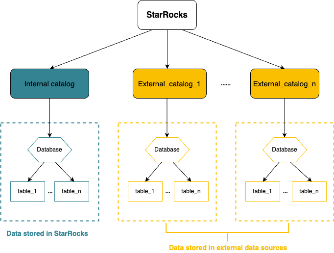

# Overview

This topic describes what a catalog is, and how to manage and query internal data and external data by using a catalog.

StarRocks supports the catalog feature from v2.3 onwards. Catalogs enable you to manage internal and external data in one system, and offer a flexible way for you to easily query and analyze data that is stored in various external systems.

## Basic concepts

- **Internal data**: refers to the data stored in StarRocks.
- **External data**: refers to the data stored in an external data source, such as Apache Hive™, Apache Iceberg, Apache Hudi, or Delta Lake.

## Catalog

Currently, StarRocks provides two types of catalogs: internal catalog and external catalog.



- **Internal catalog** manages internal data of StarRocks. For example, if you execute the CREATE DATABASE or CREATE TABLE statements to create a database or a table, the database or table is stored in the internal catalog. Each StarRocks cluster has only one internal catalog named [default catalog](../catalog/default_catalog.md).

- **External catalog** acts like a link to externally managed metastores, which grants StarRocks direct access to external data sources. You can query external data directly with zero data loading or migration. Currently, StarRocks supports the following types of external catalogs:
  - [Hive catalog](../catalog/hive_catalog.md): used to query data from Hive.
  - [Iceberg catalog](../catalog/iceberg_catalog.md): used to query data from Iceberg.
  - [Hudi catalog](../catalog/hudi_catalog.md): used to query data from Hudi.
  - [Delta Lake catalog](../catalog/deltalake_catalog.md): used to query data from Delta Lake.

  StarRocks interacts with the following two components of external data sources when you query external data:

  - **Metadata service**: used by the FEs to access the metadata of external data sources. The FEs generate a query execution plan based on the metadata.
  - **Data storage system**: used to store external data. Both distributed file systems and object
  storage systems can be used as data storage systems to store data files in various formats. After the FEs distribute the query execution plan to all BEs, all BEs scan the target external data in parallel, perform calculations and then return the query result.

## Query data

### Query internal data

To query data in StarRocks, see [Default catalog](../catalog/default_catalog.md).

### Query external data

To query data from external data sources, see [Query external data](../catalog/query_external_data.md).

### Cross-catalog query

To perform a cross-catalog federated query from your current catalog, specify the data you want to query in the `catalog_name.database_name` or `catalog_name.database_name.table_name` format.

- Query `hive_table` in `hive_db` when the current session is `default_catalog.olap_db`.

    ```SQL
    SELECT * FROM hive_catalog.hive_db.hive_table;
    ```

- Query `olap_table` in `default_catalog` when the current session is `hive_catalog.hive_db`.

   ```SQL
    SELECT * FROM default_catalog.olap_db.olap_table;
    ```

- Perform a JOIN query on `hive_table` in `hive_catalog` and `olap_table` in `default_catalog` when the current session is `hive_catalog.hive_db`.

    ```SQL
    SELECT * FROM hive_table h JOIN default_catalog.olap_db.olap_table o WHERE h.id = o.id;
    ```

- Perform a JOIN query on `hive_table` in `hive_catalog` and `olap_table` in `default_catalog` by using a JOIN clause when the current session is another catalog.

    ```SQL
    SELECT * FROM hive_catalog.hive_db.hive_table h JOIN default_catalog.olap_db.olap_table o WHERE h.id = o.id;
    ```
