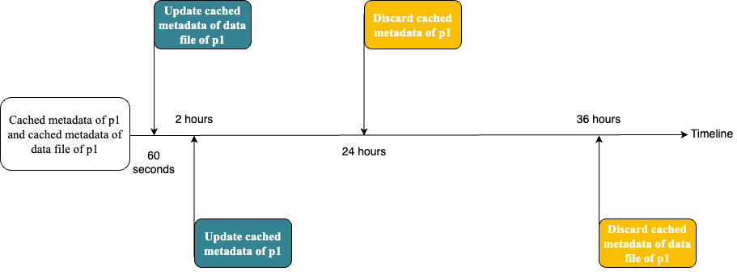

# Hive catalog

This topic describes how to create a Hive catalog, and how to configure your StarRocks cluster for querying data from Apache Hive™.

A Hive catalog is an external catalog supported in StarRocks 2.3 and later versions. It enables you to query data from Hive without loading data into StarRocks or creating external tables.

## Usage notes

- StarRocks supports querying data files of Hive in the following formats: Parquet, ORC, and CSV.
- StarRocks does not support querying data of the following types from Hive: INTERVAL, BINARY, and UNION.

    > **Note**
    >
    > - An error occurs if you query Hive data in unsupported data types.
    > - StarRocks only supports querying data of MAP and STRUCT types in Parquet or ORC data files.

- You can use the [DESC](../../sql-reference/sql-statements/Utility/DESCRIBE.md) statement to view the schema of a Hive table in StarRocks 2.4 and later versions.

## Before you begin

Before you create a Hive catalog, configure your StarRocks cluster so that StarRocks can access the data storage system and metadata service of your Hive cluster. StarRocks supports two data storage systems for Hive: HDFS and Amazon S3. StarRocks supports two metadata services for Hive: Hive metastore and AWS Glue.

### HDFS

If you use HDFS as the data storage system, configure your StarRocks cluster as follows:

- (Optional) Set the username that is used to access your HDFS and Hive metastore. By default, StarRocks uses the username of the FE and BE processes to access your HDFS and Hive metastore. You can also set the username via the `HADOOP_USERNAME` parameter in the **fe/conf/hadoop_env.sh** file of each FE and the **be/conf/hadoop_env.sh** file of each BE. Then restart each FE and BE to make the parameter settings take effect. You can set only one username for a StarRocks cluster.

- When you query Hive data, the FEs and BEs use the HDFS client to access HDFS. In general, StarRocks starts the HDFS client using the default configurations. However, in the following cases, you need to configure your StarRocks cluster:
  - If your HDFS cluster runs in HA mode, add the **hdfs-site.xml** file of your HA cluster to the **$FE_HOME/conf path** of each FE and the **$BE_HOME/conf** path of each BE.
  - If you configure View File System (ViewFs) to your HDFS cluster, add the **core-site.xml** file of your HDFS cluster to the **$FE_HOME/conf** path of each FE and the **$BE_HOME/conf** path of each BE.

> **Note**
>
> If an error (unknown host) occurs when you send a query, configure the mapping between the host names and IP addresses of HDFS nodes under the **/etc/hosts** path.

### Kerberos authentication

If  Kerberos authentication is enabled for your HDFS cluster or Hive metastore, configure your StarRocks cluster as follows:

- Run the `kinit -kt keytab_path principal` command on each FE and each BE to obtain Ticket Granting Ticket (TGT) from Key Distribution Center (KDC). To run this command, you must have the permissions to access your HDFS cluster and Hive metastore. Note that accessing KDC with this command is time-sensitive. Therefore, you need to use the cron to run this command periodically.
- Add `JAVA_OPTS="-Djava.security.krb5.conf=/etc/krb5.conf"` to the **$FE_HOME/conf/fe.conf** file of each FE and the **$BE_HOME/conf/be.conf** file of each BE. `/etc/krb5.conf` indicates the path of the **krb5.conf** file. You can modify the path based on your needs.

### Amazon S3

If you use Amazon S3 as the data storage system, configure your StarRocks cluster as follows:

1. Add the following configuration items to the **$FE_HOME/conf/core-site.xml** file of each FE.

      ```XML
      <configuration>
            <property>
                <name>fs.s3a.impl</name>
                <value>org.apache.hadoop.fs.s3a.S3AFileSystem</value>
            </property>
            <property>
                <name>fs.AbstractFileSystem.s3a.impl</name>
                <value>org.apache.hadoop.fs.s3a.S3A</value>
            </property>
            <property>
                <name>fs.s3a.access.key</name>
                <value>******</value>
            </property>
            <property>
                <name>fs.s3a.secret.key</name>
                <value>******</value>
            </property>
            <property>
                <name>fs.s3a.endpoint</name>
                <value>******</value>
            </property>
            <property>
                <name>fs.s3a.connection.maximum</name>
                <value>500</value>
            </property>
      </configuration>
      ```

     The following table describes the configuration items.

      | **Configuration item**    |**Description**                                              |
      | ------------------------- | ------------------------------------------------------------ |
      | fs.s3a.access.key         | The access key ID of the root user or an Identity and Access Management (IAM) user. For information about how to obtain the access key ID, see [Understanding and getting your AWS credentials](https://docs.aws.amazon.com/general/latest/gr/aws-sec-cred-types.html). |
      | fs.s3a.secret.key         | The secret access key of the root user or an IAM user. For information about how to obtain the secret access key, see [Understanding and getting your AWS credentials](https://docs.aws.amazon.com/general/latest/gr/aws-sec-cred-types.html). |
      | fs.s3a.endpoint           | The regional endpoint of your Amazon S3 service. For example, `s3.us-west-2.amazonaws.com` is the endpoint of US West (Oregon). For information about how to obtain your regional endpoint, see [Amazon Simple Storage Service endpoints and quotas](https://docs.aws.amazon.com/general/latest/gr/s3.html). |
      | fs.s3a.connection.maximum | The maximum number of concurrent connections that are allowed by your Amazon S3 service. This parameter defaults to `500`.  If an error (`Timeout waiting for connection from poll`) occurs when you query Hive data, increase the value of this parameter. |

2. Add the following configuration items to the **$BE_HOME/conf/be.conf** file of each BE.

      | **Configuration item**           | **Description**                                              |
      | -------------------------------- | ------------------------------------------------------------ |
      | object_storage_access_key_id     | The access key ID of the root user or an IAM user. This parameter value is the same as the `fs.s3a.access.key` parameter. |
      | object_storage_secret_access_key | The secret access key of the root user or an IAM user. The value of the parameter is the same as the value of the `fs.s3a.secret.key` parameter. |
      | object_storage_endpoint          | The regional endpoint of your Amazon S3 service. The value of the parameter is the same as the value of the `fs.s3a.endpoint` parameter. |

3. Restart all BEs and FEs.

## Create a Hive catalog

After you complete the preceding configurations, you can create a Hive catalog. The syntax and parameters are described below.

```SQL
CREATE EXTERNAL CATALOG <catalog_name> 
PROPERTIES ("key"="value", ...);
```

### catalog_name

The name of the Hive catalog. This parameter is required. The naming conventions are as follows:

- The name can contain letters, digits (0-9), and underscores (_). It must start with a letter.
- The name cannot exceed 64 characters in length.

### PROPERTIES

The properties of the Hive catalog. This parameter is required. You can configure the following properties:

- Configure the properties based on the metadata service used by your Hive cluster.
- Set the policy that the Hive catalog uses to update cached metadata.

#### Properties for metadata services

- If you use Hive metastore for your Hive cluster, configure the following properties for the Hive catalog.

    | **Property**        | **Required** | **Description**                                              |
    | ------------------- | ------------ | ------------------------------------------------------------ |
    | type                | Yes          | The type of the data source. Set the value to `hive`.        |
    | hive.metastore.uris | Yes          | The URI of the Hive metastore. Format: `thrift://<IP address of Hive metastore>:<port number>`. The port number defaults to 9083. |

    > **Note**
    >
    > Before querying Hive data, you must add the mapping between the domain name and IP address of the Hive metastore node to the **/etc/hosts** path. Otherwise, StarRocks may fail to access Hive metastore when you start a query.

- If you use AWS Glue for your Hive cluster, configure the following properties for the Hive catalog.

    | **Property**                           | **Required** | **Description**                                              |
    | -------------------------------------- | ------------ | ------------------------------------------------------------ |
    | type                                   | Yes          | The type of the data source. Set the value to `hive`.        |
    | hive.metastore.type                    | Yes          | The metadata service used by your Hive cluster. Set the value to `glue`. |
    | aws.hive.metastore.glue.aws-access-key | Yes          | The access key ID of the AWS Glue user.                      |
    | aws.hive.metastore.glue.aws-secret-key | Yes          | The secret access key of the AWS Glue user.                  |
    | aws.hive.metastore.glue.endpoint       | Yes          | The regional endpoint of your AWS Glue service. For information about how to obtain your regional endpoint, see [AWS Glue endpoints and quotas](https://docs.aws.amazon.com/general/latest/gr/glue.html). |

#### Properties for update policies for cached metadata

StarRocks supports two policies to update cached metadata: asynchronous update and automatic incremental update. For more information, see [Update policies for cached metadata](#update-policies-for-cached-metadata).

- Asynchronous update is the default policy that StarRocks uses to update the cached metadata of Hive. In most cases, you do not need to tune the following parameters because the default settings already maximize query performance. However, if the frequency of updating Hive data is relatively high, you can adjust the time interval of updating and discarding cached metadata to match the data update frequency.

    | **Property**                           | **Required** | **Description**                                              |
    | -------------------------------------- | ------------ | ------------------------------------------------------------ |
    | enable_hive_metastore_cache            | No           | Whether the metadata of Hive tables or partitions is cached. Valid values:<ul><li>`true`: Cache the metadata of Hive tables or partitions. The value of this parameter defaults to `true`.</li><li>`false`: Do not cache the metadata of Hive tables or partitions.</li></ul> |
    | enable_remote_file_cache               | No           | Whether the metadata of the data files of Hive tables or partitions is cached. Valid values:<ul><li>`true`: Cache the metadata of data files of Hive tables or partitions. The value of this parameter defaults to `true`.</li><li>`false`: Do not cache the metadata of data files of Hive tables or partitions.</li></ul> |
    | metastore_cache_refresh_interval_sec   | No           | The time interval to asynchronously update the metadata of Hive tables or partitions cached in StarRocks. Unit: seconds. Default value: `7200`, which is 2 hours. |
    | remote_file_cache_refresh_interval_sec | No           | The time interval to asynchronously update the metadata of the data files of Hive tables or partitions cached in StarRocks. Unit: seconds. Default value: `60`. |
    | metastore_cache_ttl_sec                | No           | The time interval to automatically discard the metadata of Hive tables or partitions cached in StarRocks. Unit: seconds. Default value: `86400`, which is 24 hours. |
    | remote_file_cache_ttl_sec              | No           | The time interval to automatically discard the metadata of the data files of Hive tables or partitions cached in StarRocks. Unit: seconds. Default value: `129600`, which is 36 hours. |

  If you want to query the latest Hive data but the time interval for updating cached metadata has not arrived, you can manually update the cached metadata. For example, there is a Hive table named `table1`, which has four partitions: `p1`, `p2`, `p3`, and `p4`. If StarRocks only cached the two kinds of metadata of `p1`, `p2`, and `p3`, you can update the cached metadata in one of the following ways:

  - Updates the two kinds of cached metadata of all partitions (`p1`, `p2`, and `p3`) at the same time.

      ```SQL
      REFRESH EXTERNAL TABLE [external_catalog.][db_name.]table_name;
      ```

  - Updates the two kinds of cached metadata of given partitions.

      ```SQL
      REFRESH EXTERNAL TABLE [external_catalog.][db_name.]table_name
      [PARTITION ('partition_name', ...)];
      ```

    For more information about the parameter descriptions and examples of using the REFRESH EXTERNAL TABEL statement, see [REFRESH EXTERNAL TABLE](../../sql-reference/sql-statements/data-definition/REFRESH%20EXTERNAL%20TABLE.md).
- To enable the automatic incremental update policy for the Hive catalog, add the following property.

    | **Property**                       | **Required** | **Description**                                              |
    | ---------------------------------- | ------------ | ------------------------------------------------------------ |
    | enable_hms_events_incremental_sync | No           | Whether the automatic incremental update policy is enabled. Valid values:<ul><li>`TRUE`: means enabled.</li><li>`FALSE`: means disabled. The value of the parameter defaults to `FALSE`.</li></ul>To enable the automatic incremental update policy for the Hive catalog, set the value of this parameter to `TRUE`. |

After the catalog is created, you can use the Hive catalog to query Hive data. For more information, see [Query external data](../catalog/query_external_data.md).

## Update policies for cached metadata

StarRocks develops a query execution plan based on the following data:

- Metadata (such as table schema) of Hive tables or partitions in the metadata service.
- Metadata (such as file size) of the data files of Hive tables or partitions in the storage system.

Therefore, the time consumed by StarRocks to access the metadata service and storage system of Hive directly affects the time consumed by a query. To reduce the impact, StarRocks supports caching metadata of Hive and provides two policies, based on which StarRocks can cache and update the metadata of Hive tables or partitions and the metadata of their data files.

- **Asynchronous update**: This is the default policy and requires no further configurations on your StarRocks cluster. With this policy, updates on cached metadata are automatically triggered when several conditions are met (see [Asynchronous update](#asynchronous-update) for more information), thereby reducing the access frequency on metadata services and storage systems. This means that the metadata cached in StarRocks cannot always stay up-to-date with the metadata in Hive. In some cases, you need to manually update the metadata cached in StarRocks.
- **Automatic incremental update**: The policy is available only when Hive metastore is used for your Hive cluster. To enable this policy, you need to add additional configurations to your StarRocks cluster and metadata service. After this policy is enabled, the asynchronous update policy is automatically disabled. The metadata cached in StarRocks always stays up-to-date with the metadata in Hive, and no manual updates are required.

### Asynchronous update

By default (the values of the`enable_hive_metastore_cache` and `enable_remote_file_cache` parameters are `true`), if a query hits a partition of a Hive table, StarRocks automatically caches the metadata of the partition and the metadata of the data file of the partition. The cached metadata is updated by using the lazy update policy. Example：

There is a Hive table named `table2`, which has four partitions: `p1`, `p2`, `p3`, and `p4`. A query hit `p1`, and StarRocks caches the metadata of `p1` and the metadata of the data file of `p1`. Assume that the default time intervals to update and discard the cached metadata are as follows:

- The time interval (set by the `metastore_cache_refresh_interval_sec` parameter) to asynchronously update the cached metadata of `p1` is 2 hours.
- The time interval (set by the `remote_file_cache_refresh_interval_sec` parameter) to asynchronously update the cached metadata of the data file of `p1`is 60 seconds.
- The time interval (set by the `metastore_cache_ttl_sec` parameter) to automatically discard the cached metadata of `p1` is 24 hours.
- The time interval (set by the `remote_file_cache_ttl_sec` parameter) to automatically discard the cached metadata of the data file of `p1` is 36 hours.

Then StarRocks updates or discards these metadata in the following situations:



- If another query hits `p1` again and the current time from the last update is less than 60 seconds, StarRocks does not update the cached metadata of `p1` and the cached metadata of the data file of `p1`.
- If another query hits `p1` again and the current time from the last update is more than 60 seconds, StarRocks updates the cached metadata of the data file of `p1`.
- If another query hits `p1` again and the current time from the last update is more than 2 hours, StarRocks updates the cached metadata of `p1`.
- If `p1` has not been accessed in 24 hours from the last update, StarRocks discards the cached metadata of `p1`. The metadata will be cached at the next query.
- If `p1` has not been accessed in 36 hours from the last update, StarRocks discards the cached metadata of the data file of `p1`. The metadata will be cached at the next query.

### Automatic incremental update

This policy enables FEs to read the events from Hive metastore, such as adding columns, removing partitions, or updating data. Then StarRocks automatically updates the metadata cached in StarRocks based on these events. Follow the steps below to enable this policy.

#### Configure the event listener for your Hive metastore

Both Hive metastore 2.x and 3.x support the configuration of the event listener. The following configuration is for Hive metastore 3.1.2. Add the following configuration items to the file **$HiveMetastore/conf/hive-site.xml** and restart Hive metastore.

```XML
<property>
    <name>hive.metastore.event.db.notification.api.auth</name>
    <value>false</value>
</property>
<property>
    <name>hive.metastore.notifications.add.thrift.objects</name>
    <value>true</value>
</property>
<property>
    <name>hive.metastore.alter.notifications.basic</name>
    <value>false</value>
</property>
<property>
    <name>hive.metastore.dml.events</name>
    <value>true</value>
</property>
<property>
    <name>hive.metastore.transactional.event.listeners</name>
    <value>org.apache.hive.hcatalog.listener.DbNotificationListener</value>
</property>
<property>
    <name>hive.metastore.event.db.listener.timetolive</name>
    <value>172800s</value>
</property>
<property>
    <name>hive.metastore.server.max.message.size</name>
    <value>858993459</value>
</property>
```

You can search for the `event id` parameter in the FE log to check whether the event listener is successfully configured. If not, the `event id` parameter is `0`.

#### Enable automatic incremental update of StarRocks

To enable the automatic incremental update policy, set `enable_hms_events_incremental_sync=true`. You can enable this policy for a single external catalog or for all external catalogs that support the automatic incremental update policy in your StarRocks cluster.

- To enable this policy for a single external catalog, configure the parameter in PROPERTIES when you create the external catalog.
- To enable this policy for all external catalogs, add this parameter to the **$FE_HOME/conf/fe.conf** file of each FE. Then restart each FE to make the setting take effect.

You can also tune the following parameters in the **$FE_HOME/conf/fe.conf** file of each FE based on your business requirements. Then restart each FE to make the setting take effect.

| **Parameter**                      | **Description**                                              |
| ---------------------------------- | ------------------------------------------------------------ |
| hms_events_polling_interval_ms     | The time interval for StarRocks to read events from Hive metastore. The parameter defaults to `5000`. Unit: milliseconds. |
| hms_events_batch_size_per_rpc      | The maximum number of events that StarRocks can read at a time. The parameter value defaults to `500`. |
| enable_hms_parallel_process_evens  | Whether the read events are processed in parallel. Valid values are:<ul><li>`TRUE`: means the events are processed in parallel. The value of the parameter defaults to `TRUE`.</li><li>`FALSE`: means the events are not processed in parallel.</li></ul> |
| hms_process_events_parallel_num    | The maximum number of events that can be processed in parallel. This parameter defaults to `4`. |

## References

- To view examples of creating an external catalog, see [CREATE EXTERNAL CATALOG](../../sql-reference/sql-statements/data-definition/CREATE%20EXTERNAL%20CATALOG.md).
- To view all catalogs in the current StarRocks cluster, see [SHOW CATALOGS](../../sql-reference/sql-statements/data-manipulation/SHOW%20CATALOGS.md).
- To delete an external catalog, see [DROP CATALOG](../../sql-reference/sql-statements/data-definition/DROP%20CATALOG.md).
