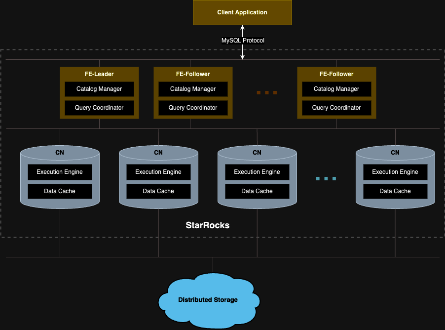

# Deploy and use shared-data StarRocks

This topic describes how to deploy and use a shared-data StarRocks cluster. This feature is supported from v3.0.

The shared-data StarRocks cluster is specifically engineered for the cloud on the premise of separation of storage and compute. It allows data to be stored in object storage that is compatible with the S3 protocol (for example, AWS S3 and MinIO). You can achieve not only cheaper storage and better resource isolation, but elastic scalability for your cluster. The query performance of the shared-data StarRocks cluster aligns with that of a classic cluster (shared-nothing) when the local disk cache is hit.

Compared to the classic StarRocks architecture, separation of storage and compute offers a wide range of benefits. By decoupling these components, StarRocks provides:

- Inexpensive and seamlessly scalable storage.
- Elastic scalable compute. Because data is no longer stored in BE nodes, scaling can be done without data migration or shuffling across nodes.
- Local disk cache for hot data to boost query performance.
- Asynchronous data ingestion into object storage, allowing a significant improvement in loading performance.

The architecture of the shared-data StarRocks cluster is as follows:



## Deploy a shared-data StarRocks cluster

The deployment of a shared-data StarRocks cluster is similar to that of a classic StarRocks cluster. The only difference is the parameters in the configuration files of FE and BE **fe.conf** and **be.conf**. This section only lists the FE and BE configuration items you need to add to the configuration files when you deploy a shared-data StarRocks cluster. For detailed instructions on deploying a StarRocks cluster, see [Deploy StarRocks](../deployment/deploy_manually.md).

### Configure FE nodes for shared-data StarRocks

Before starting FEs, add the following configuration items in the FE configuration file **fe.conf**:

| **Configuration item**              | **Description**                                              |
| ----------------------------------- | ------------------------------------------------------------ |
| run_mode                            | The running mode of the StarRocks cluster. Valid values: `shared_data` and `shared_nothing` (Default). <br>`shared_data` indicates running StarRocks in shared-data mode. `shared_nothing` indicates running StarRocks in classic mode.<br />**CAUTION**<br />You cannot adopt the `shared_data` and `shared_nothing` modes simultaneously for a StarRocks cluster. Mixed deployment is not supported.<br />DO NOT change `run_mode` after the cluster is deployed. Otherwise, the cluster fails to restart. The transformation from a classic cluster to a shared-data cluster or vice versa is not supported. |
| cloud_native_meta_port              | The cloud-native meta service RPC port. Default: `6090`.     |
| enable_load_volume_from_conf        | Whether to allow StarRocks to create the default storage volume by using the object storage-related properties specified in the FE configuration file. Valid values: `true` (Default) and `false`. Supported from v3.1.0.<ul><li>If you specify this item as `true` when creating a new shared-data cluster, StarRocks creates a built-in storage volume `builtin_storage_volume` using the object storage-related properties in the FE configuration file, and sets it as the default storage volume. However, if you have not specified the object storage-related properties, StarRocks fails to start.</li><li>If you specify this item as `false` when creating a new shared-data cluster, StarRocks starts directly without creating the built-in storage volume. You must manually create a storage volume and set it as the default storage volume before creating any object in StarRocks. For more information, see [Create the default storage volume](#create-default-storage-volume).</li></ul>**CAUTION**<br />We strongly recommend you leave this item as `true` while you are upgrading an existing shared-data cluster from v3.0. If you specify this item as `false`, the databases and tables you created before the upgrade become read-only, and you cannot load data into them.     |
| cloud_native_storage_type           | The type of object storage you use. In shared-data mode, StarRocks supports storing data in Azure Blob (Preview feature, supported from v3.1 onwards), and object storages that are compatible with the S3 protocol (such as AWS S3, Google GCP, and MinIO). Valid value: `S3` (Default) and `AZBLOB`. If you specify this parameter as `S3`, you must add the parameters prefixed by `aws_s3`. If you specify this parameter as `AZBLOB`, you must add the parameters prefixed by `azure_blob`. |
| aws_s3_path                         | The S3 path used to store data. It consists of the name of your S3 bucket and the sub-path (if any) under it, for example, `testbucket/subpath`. |
| aws_s3_endpoint                     | The endpoint used to access your S3 bucket, for example, `https://s3.us-west-2.amazonaws.com`. |
| aws_s3_region                       | The region in which your S3 bucket resides, for example, `us-west-2`. |
| aws_s3_use_aws_sdk_default_behavior | Whether to use the default authentication credential of AWS SDK. Valid values: `true` and `false` (Default). |
| aws_s3_use_instance_profile         | Whether to use Instance Profile and Assumed Role as credential methods for accessing S3. Valid values: `true` and `false` (Default). <ul><li>If you use IAM user-based credential (Access Key and Secret Key) to access S3, you must specify this item as `false`, and specify `aws_s3_access_key` and `aws_s3_secret_key`. </li><li>If you use Instance Profile to access S3, you must specify this item as `true`. </li><li>If you use Assumed Role to access S3, you must specify this item as `true`, and specify `aws_s3_iam_role_arn`. </li><li>And if you use an external AWS account,  you must also specify `aws_s3_external_id`.</li></ul> |
| aws_s3_access_key                   | The Access Key ID used to access your S3 bucket.             |
| aws_s3_secret_key                   | The Secret Access Key used to access your S3 bucket.         |
| aws_s3_iam_role_arn                 | The ARN of the IAM role that has privileges on your S3 bucket in which your data files are stored. |
| aws_s3_external_id                  | The external ID of the AWS account that is used for cross-account access to your S3 bucket. |
| azure_blob_path                     | The Azure Blob Storage path used to store data. It consists of the name of the container within your storage account and the sub-path (if any) under the container, for example, `testcontainer/subpath`. |
| azure_blob_endpoint                 | The endpoint of your Azure Blob Storage Account, for example, `https://test.blob.core.windows.net`. |
| azure_blob_shared_key               | The Shared Key used to authorize requests for your Azure Blob Storage.                     |
| azure_blob_sas_token                | The shared access signatures (SAS) used to authorize requests for your Azure Blob Storage.                |

> **CAUTION**
>
> Only credential-related configuration items can be modified after your shared-data StarRocks cluster is created. If you changed the original storage path-related configuration items, the databases and tables you created before the change become read-only, and you cannot load data into them.

If you want to create the default storage volume manually after the cluster is created, you only need to add the following configuration items:

```Properties
run_mode = shared_data
cloud_native_meta_port = <meta_port>
enable_load_volume_from_conf = false
```

If you want to specify the properties of your object storage in the FE configuration file, examples are as follows:

- If you use AWS S3

  - If you use the default authentication credential of AWS SDK to access S3, add the following configuration items:

    ```Properties
    run_mode = shared_data
    cloud_native_meta_port = <meta_port>
    cloud_native_storage_type = S3

    # For example, testbucket/subpath
    aws_s3_path = <s3_path>

    # For example, us-west-2
    aws_s3_region = <region>

    # For example, https://s3.us-west-2.amazonaws.com
    aws_s3_endpoint = <endpoint_url>

    aws_s3_use_aws_sdk_default_behavior = true
    ```

  - If you use IAM user-based credential (Access Key and Secret Key) to access S3, add the following configuration items:

    ```Properties
    run_mode = shared_data
    cloud_native_meta_port = <meta_port>
    cloud_native_storage_type = S3

    # For example, testbucket/subpath
    aws_s3_path = <s3_path>

    # For example, us-west-2
    aws_s3_region = <region>

    # For example, https://s3.us-west-2.amazonaws.com
    aws_s3_endpoint = <endpoint_url>

    aws_s3_access_key = <access_key>
    aws_s3_secret_key = <secret_key>
    ```

  - If you use Instance Profile to access S3, add the following configuration items:

    ```Properties
    run_mode = shared_data
    cloud_native_meta_port = <meta_port>
    cloud_native_storage_type = S3

    # For example, testbucket/subpath
    aws_s3_path = <s3_path>

    # For example, us-west-2
    aws_s3_region = <region>

    # For example, https://s3.us-west-2.amazonaws.com
    aws_s3_endpoint = <endpoint_url>

    aws_s3_use_instance_profile = true
    ```

  - If you use Assumed Role to access S3, add the following configuration items:

    ```Properties
    run_mode = shared_data
    cloud_native_meta_port = <meta_port>
    cloud_native_storage_type = S3

    # For example, testbucket/subpath
    aws_s3_path = <s3_path>

    # For example, us-west-2
    aws_s3_region = <region>

    # For example, https://s3.us-west-2.amazonaws.com
    aws_s3_endpoint = <endpoint_url>

    aws_s3_use_instance_profile = true
    aws_s3_iam_role_arn = <role_arn>
    ```

  - If you use Assumed Role to access S3 from an external AWS account, add the following configuration items:

    ```Properties
    run_mode = shared_data
    cloud_native_meta_port = <meta_port>
    cloud_native_storage_type = S3

    # For example, testbucket/subpath
    aws_s3_path = <s3_path>

    # For example, us-west-2
    aws_s3_region = <region>

    # For example, https://s3.us-west-2.amazonaws.com
    aws_s3_endpoint = <endpoint_url>

    aws_s3_use_instance_profile = true
    aws_s3_iam_role_arn = <role_arn>
    aws_s3_external_id = <external_id>
    ```

- If you use Azure Blob Storage (Preview feature, supported from v3.1 onwards):

  - If you use Shared Key to access Azure Blob Storage, add the following configuration items:

    ```Properties
    run_mode = shared_data
    cloud_native_meta_port = <meta_port>
    cloud_native_storage_type = AZBLOB

    # For example, testcontainer/subpath
    azure_blob_path = <blob_path>

    # For example, https://test.blob.core.windows.net
    azure_blob_endpoint = <endpoint_url>

    azure_blob_shared_key = <shared_key>
    ```

  - If you use shared access signatures (SAS) to access Azure Blob Storage, add the following configuration items:

    ```Properties
    run_mode = shared_data
    cloud_native_meta_port = <meta_port>
    cloud_native_storage_type = AZBLOB

    # For example, testcontainer/subpath
    azure_blob_path = <blob_path>

    # For example, https://test.blob.core.windows.net
    azure_blob_endpoint = <endpoint_url>

    azure_blob_sas_token = <sas_token>
    ```

  > **CAUTION**
  >
  >The hierarchical namespace must be disabled when you create the Azure Blob Storage Account.

- If you use GCP Cloud Storage:

  ```Properties
  run_mode = shared_data
  cloud_native_meta_port = <meta_port>
  cloud_native_storage_type = S3

  # For example, testbucket/subpath
  aws_s3_path = <s3_path>

  # For example: us-east-1
  aws_s3_region = <region>

  # For example: https://storage.googleapis.com
  aws_s3_endpoint = <endpoint_url>

  aws_s3_access_key = <access_key>
  aws_s3_secret_key = <secret_key>
  ```

- If you use MinIO:

  ```Properties
  run_mode = shared_data
  cloud_native_meta_port = <meta_port>
  cloud_native_storage_type = S3

  # For example, testbucket/subpath
  aws_s3_path = <s3_path>

  # For example: us-east-1
  aws_s3_region = <region>

  # For example: http://172.26.xx.xxx:39000
  aws_s3_endpoint = <endpoint_url>
  
  aws_s3_access_key = <access_key>
  aws_s3_secret_key = <secret_key>
  ```

### Configure BE nodes for shared-data StarRocks

**Before starting BEs**, add the following configuration items in the BE configuration file **be.conf**:

```Properties
starlet_port = <starlet_port>
storage_root_path = <storage_root_path>
```

| **Configuration item** | **Description**                |
| ---------------------- | ------------------------------ |
| starlet_port           | The BE heartbeat service port for the StarRocks shared-data cluster. Default value: `9070`.|
| storage_root_path      | The storage volume directory that the local cached data depends on and the medium type of the storage. Multiple volumes are separated by semicolon (;). If the storage medium is SSD, add `,medium:ssd` at the end of the directory. If the storage medium is HDD, add `,medium:hdd` at the end of the directory. Example: `/data1,medium:hdd;/data2,medium:ssd`. Default value: `${STARROCKS_HOME}/storage`. |

> **NOTE**
>
> The data is cached under the directory **<storage_root_path\>/starlet_cache**.

## Use your shared-data StarRocks cluster

The usage of shared-data StarRocks clusters is also similar to that of a classic StarRocks cluster, except that the shared-data cluster uses storage volumes and cloud-native tables to store data in object storage.

### Create default storage volume

You can use the built-in storage volumes that StarRocks automatically creates, or you can manually create and set the default storage volume. This section describes how to manually create and set the default storage volume.

> **NOTE**
>
> If your shared-data StarRocks cluster is upgraded from v3.0, you do not need to define a default storage volume because StarRocks created one with the object storage-related properties you specified in the FE configuration file **fe.conf**. You can still create new storage volumes with other object storage resources and set the default storage volume differently.

To give your shared-data StarRocks cluster permission to store data in your object storage, you must reference a storage volume when you create databases or cloud-native tables. A storage volume consists of the properties and credential information of the remote data storage. If you have deployed a new shared-data StarRocks cluster and disallow StarRocks to create a built-in storage volume (by specifying `enable_load_volume_from_conf` as `false`), you must define a default storage volume before you can create databases and tables in the cluster.

The following example creates a storage volume `def_volume` for an AWS S3 bucket `defaultbucket` with the IAM user-based credential (Access Key and Secret Key), enables the storage volume, and sets it as the default storage volume:

```SQL
CREATE STORAGE VOLUME def_volume
TYPE = S3
LOCATIONS = ("s3://defaultbucket/test/")
PROPERTIES
(
    "enabled" = "true",
    "aws.s3.region" = "us-west-2",
    "aws.s3.endpoint" = "https://s3.us-west-2.amazonaws.com",
    "aws.s3.use_aws_sdk_default_behavior" = "false",
    "aws.s3.use_instance_profile" = "false",
    "aws.s3.access_key" = "xxxxxxxxxx",
    "aws.s3.secret_key" = "yyyyyyyyyy"
);

SET def_volume AS DEFAULT STORAGE VOLUME;
```

For more information on how to create a storage volume for other object storages and set the default storage volume, see [CREATE STORAGE VOLUME](../sql-reference/sql-statements/Administration/CREATE%20STORAGE%20VOLUME.md) and [SET DEFAULT STORAGE VOLUME](../sql-reference/sql-statements/Administration/SET%20DEFAULT%20STORAGE%20VOLUME.md).

### Create a database and a cloud-native table

After you created a default storage volume, you can then create a database and a cloud-native table using this storage volume.

Currently, shared-data StarRocks clusters support the following table types:

- Duplicate Key table
- Aggregate table
- Unique Key table
- Primary Key table (Currently, the primary key persistent index is not supported.)

The following example creates a database `cloud_db` and a table `detail_demo` based on Duplicate Key table type, enables the local disk cache, sets the hot data validity duration to one month, and disables asynchronous data ingestion into object storage:

```SQL
CREATE DATABASE cloud_db;
USE cloud_db;
CREATE TABLE IF NOT EXISTS detail_demo (
    recruit_date  DATE           NOT NULL COMMENT "YYYY-MM-DD",
    region_num    TINYINT        COMMENT "range [-128, 127]",
    num_plate     SMALLINT       COMMENT "range [-32768, 32767] ",
    tel           INT            COMMENT "range [-2147483648, 2147483647]",
    id            BIGINT         COMMENT "range [-2^63 + 1 ~ 2^63 - 1]",
    password      LARGEINT       COMMENT "range [-2^127 + 1 ~ 2^127 - 1]",
    name          CHAR(20)       NOT NULL COMMENT "range char(m),m in (1-255) ",
    profile       VARCHAR(500)   NOT NULL COMMENT "upper limit value 65533 bytes",
    ispass        BOOLEAN        COMMENT "true/false")
DUPLICATE KEY(recruit_date, region_num)
DISTRIBUTED BY HASH(recruit_date, region_num)
PROPERTIES (
    "storage_volume" = "def_volume",
    "datacache.enable" = "true",
    "datacache.partition_duration" = "1 MONTH",
    "enable_async_write_back" = "false"
);
```

> **NOTE**
>
> The default storage volume is used when you create a database or a cloud-native table in a shared-data StarRocks cluster if no storage volume is specified.

In addition to the regular table PROPERTIES, you need to specify the following PROPERTIES when creating a table for shared-data StarRocks cluster:

| **Property**            | **Description**                                              |
| ----------------------- | ------------------------------------------------------------ |
| datacache.enable        | Whether to enable the local disk cache. Default: `true`.<ul><li>When this property is set to `true`, the data to be loaded is simultaneously written into the object storage and the local disk (as the cache for query acceleration).</li><li>When this property is set to `false`, the data is loaded only into the object storage.</li></ul>**NOTE**<br />To enable the local disk cache, you must specify the directory of the disk in the BE configuration item `storage_root_path`. |
| datacache.partition_duration | The validity duration of the hot data. When the local disk cache is enabled, all data is loaded into the cache. When the cache is full, StarRocks deletes the less recently used data from the cache. When a query needs to scan the deleted data, StarRocks checks if the data is within the duration of validity. If the data is within the duration, StarRocks loads the data into the cache again. If the data is not within the duration, StarRocks does not load it into the cache. This property is a string value that can be specified with the following units: `YEAR`, `MONTH`, `DAY`, and `HOUR`, for example, `7 DAY` and `12 HOUR`. If it is not specified, all data is cached as the hot data.<br />**NOTE**<br />This property is available only when `datacache.enable` is set to `true`. |
| enable_async_write_back | Whether to allow data to be written into object storage asynchronously. Default: `false`.<ul><li>When this property is set to `true`, the load task returns success as soon as the data is written into the local disk cache, and the data is written into the object storage asynchronously. This allows better loading performance, but it also risks data reliability under potential system failures.</li><li>When this property is set to `false`, the load task returns success only after the data is written into both object storage and the local disk cache. This guarantees higher availability but leads to lower loading performance.</li></ul> |

### View table information

You can view the information of tables in a specific database using `SHOW PROC "/dbs/<db_id>"`. See [SHOW PROC](../sql-reference/sql-statements/Administration/SHOW%20PROC.md) for more information.

Example:

```Plain
mysql> SHOW PROC "/dbs/xxxxx";
+---------+-------------+----------+---------------------+--------------+--------+--------------+--------------------------+--------------+---------------+------------------------------+
| TableId | TableName   | IndexNum | PartitionColumnName | PartitionNum | State  | Type         | LastConsistencyCheckTime | ReplicaCount | PartitionType | StoragePath                  |
+---------+-------------+----------+---------------------+--------------+--------+--------------+--------------------------+--------------+---------------+------------------------------+
| 12003   | detail_demo | 1        | NULL                | 1            | NORMAL | CLOUD_NATIVE | NULL                     | 8            | UNPARTITIONED | s3://xxxxxxxxxxxxxx/1/12003/ |
+---------+-------------+----------+---------------------+--------------+--------+--------------+--------------------------+--------------+---------------+------------------------------+
```

The `Type` of a table in shared-data StarRocks cluster is `CLOUD_NATIVE`. In the field `StoragePath`, StarRocks returns the object storage directory where the table is stored.

### Load data into a shared-data StarRocks cluster

Shared-data StarRocks clusters support all loading methods provided by StarRocks. See [Overview of data loading](../loading/Loading_intro.md) for more information.

### Query in a shared-data StarRocks cluster

Tables in a shared-data StarRocks cluster support all types of queries provided by StarRocks. See StarRocks [SELECT](../sql-reference/sql-statements/data-manipulation/SELECT.md) for more information.
