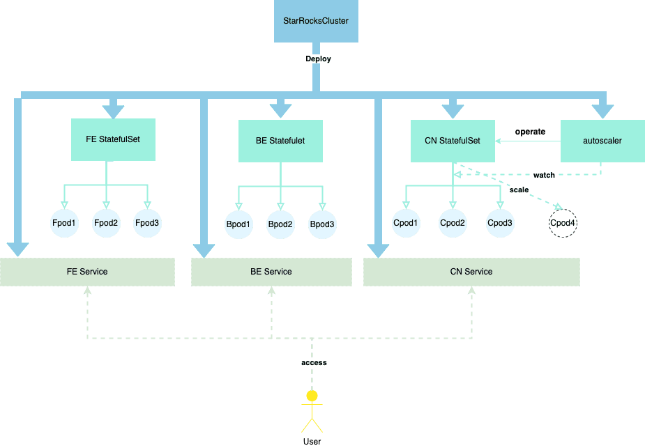

# Deploy StarRocks with Operator

This topic introduces how to use the StarRocks Operator to automate the deployment and management of a StarRocks cluster on a Kubernetes cluster.

## How it works



## Before you begin

### Create Kubernetes cluster

You can use the cloud-managed Kubernetes service, such as an [Amazon Elastic Kubernetes Service (EKS)](https://aws.amazon.com/eks/?nc1=h_ls) or [Google Kubernetes Engine (GKE)](https://cloud.google.com/kubernetes-engine) cluster, or a self-managed Kubernetes cluster.

- Create an Amazon EKS cluster

  1. Check that [the following command-line tools are installed in your environment](https://docs.aws.amazon.com/eks/latest/userguide/getting-started.html):
     1. Install and configure AWS command-line tool AWS CLI.
     2. Install EKS cluster command-line tool eksctl.
     3. Install Kubernetes cluster command-line tool kubectl.
  2. Use one of the following methods to create an EKS cluster:
     1. [Use eksctl to quickly create an EKS cluster](https://docs.aws.amazon.com/eks/latest/userguide/getting-started-eksctl.html).
     2. [Manually create an EKS cluster with the AWS console and AWS CLI](https://docs.aws.amazon.com/eks/latest/userguide/getting-started-console.html).

- Create a GKE cluster

  Before you start to create a GKE cluster, make sure that you complete all the [prerequisites](https://cloud.google.com/kubernetes-engine/docs/deploy-app-cluster#before-you-begin). Then follow the instructions provided in [Create a GKE cluster](https://cloud.google.com/kubernetes-engine/docs/deploy-app-cluster#create_cluster) to create a GKE cluster.

- Create a self-managed Kubernetes cluster

  Follow the instructions provided in [Bootstrapping clusters with kubeadm](https://kubernetes.io/docs/setup/production-environment/tools/kubeadm/) to create a self-managed Kubernetes cluster. You can use [Minikube](https://kubernetes.io/docs/tutorials/kubernetes-basics/create-cluster/cluster-intro/) and [Docker Desktop](https://docs.docker.com/desktop/) to create a single-node private Kubernetes cluster with minimum steps.

### Deploy StarRocks Operator

1. Add the custom resource StarRocksCluster.

   ```bash
   kubectl apply -f https://raw.githubusercontent.com/StarRocks/starrocks-kubernetes-operator/main/deploy/starrocks.com_starrocksclusters.yaml
   ```

2. Deploy the StarRocks Operator. You can choose to deploy the StarRocks Operator by using a default configuration file or a custom configuration file.
   1. Deploy the StarRocks Operator by using a default configuration file.

      ```bash
      kubectl apply -f https://raw.githubusercontent.com/StarRocks/starrocks-kubernetes-operator/main/deploy/operator.yaml
      ```

      The StarRocks Operator is deployed to the namespace `starrocks` and manages all StarRocks clusters under all namespaces.
   2. Deploy the StarRocks Operator by using a custom configuration file.
      - Download the configuration file **operator.yaml**, which is used to deploy the StarRocks Operator.

        ```bash
        curl -O https://raw.githubusercontent.com/StarRocks/starrocks-kubernetes-operator/main/deploy/operator.yaml
        ```

      - Modify the configuration file **operator.yaml** to suit your needs.
      - Deploy the StarRocks Operator.

        ```bash
        kubectl apply -f operator.yaml
        ```

3. Check the running status of the StarRocks Operator. If the pod is in the `Running` state and all containers inside the pod are `READY`, the StarRocks Operator is running as expected.

    ```bash
    $ kubectl -n starrocks get pods
    NAME                                  READY   STATUS    RESTARTS   AGE
    starrocks-controller-65bb8679-jkbtg   1/1     Running   0          5m6s
    ```

> **NOTE**
>
> If you customize the namespace in which the StarRocks Operator is located, you need to replace`starrocks` with the name of your customized namespace.

## Deploy StarRocks Cluster

You can directly use the [sample configuration files](https://github.com/StarRocks/starrocks-kubernetes-operator/tree/main/examples/starrocks) provided by StarRocks to deploy a StarRocks cluster (an object instantiated by using the custom resource StarRocks Cluster). For example, you can use **starrocks-fe-and-be.yaml** to deploy a StarRocks cluster that contains three FE nodes and three BE nodes.

```bash
kubectl apply -f https://raw.githubusercontent.com/StarRocks/starrocks-kubernetes-operator/main/examples/starrocks/starrocks-fe-and-be.yaml
```

The following table describes a few important fields in the **starrocks-fe-and-be.yaml** file.

| **Field** | **Description**                                              |
| --------- | ------------------------------------------------------------ |
| Kind      | The resource type of the object. The value must be `StarRocksCluster`. |
| Metadata  | Metadata, in which the following sub-fields are nested:<ul><li>`name`: the name of the object. Each object name uniquely identifies an object of the same resource type.</li><li>`namespace`: the namespace to which the object belongs.</li></ul> |
| Spec      | The expected status of the object. Valid values are `starRocksFeSpec`, `starRocksBeSpec`, and `starRocksCnSpec`. |

You can also deploy the StarRocks cluster by using a modified configuration file. For supported fields and detailed descriptions, see [api.md](https://github.com/StarRocks/starrocks-kubernetes-operator/blob/main/doc/api.md).

Deploying the StarRocks cluster takes a while. During this period, you can use the command `kubectl -n starrocks get pods` to check the starting status of the StarRocks cluster. If all the pods are in the `Running` state and all containers inside the pods are `READY`, the StarRocks cluster is running as expected.

> **NOTE**
>
> If you customize the namespace in which the StarRocks cluster is located, you need to replace `starrocks` with the name of your customized namespace.

```bash
$ kubectl -n starrocks get pods
NAME                                  READY   STATUS    RESTARTS   AGE
starrocks-controller-65bb8679-jkbtg   1/1     Running   0          22h
starrockscluster-sample-be-0          1/1     Running   0          23h
starrockscluster-sample-be-1          1/1     Running   0          23h
starrockscluster-sample-be-2          1/1     Running   0          22h
starrockscluster-sample-fe-0          1/1     Running   0          21h
starrockscluster-sample-fe-1          1/1     Running   0          21h
starrockscluster-sample-fe-2          1/1     Running   0          22h
```

> **Note**
>
> If some pods cannot start after a long period of time, you can use `kubectl logs -n starrocks <pod_name>` to view the log information or use `kubectl -n starrocks describe pod <pod_name>` to view the event information to locate the problem.

## Manage StarRocks Cluster

### Access StarRocks Cluster

The components of the StarRocks cluster can be accessed through their associated Services, such as the FE Service. For detailed descriptions of Services and their access addresses, see [api.md](https://github.com/StarRocks/starrocks-kubernetes-operator/blob/main/doc/api.md) and [Services](https://kubernetes.io/docs/concepts/services-networking/service/).

> **NOTE**
>
> - Only the FE Service is deployed by default. If you need to deploy the BE Service and CN Service, you need to configure `starRocksBeSpec` and `starRocksCnSpec` in the StarRocks cluster configuration file.
> - The name of a Service is `<cluster name>-<component name>-service` by default, for example, `starrockscluster-sample-fe-service`. You can also specify the Service name in the spec of each component.

#### Access StarRocks Cluster from within Kubernetes Cluster

From within the Kubernetes cluster, the StarRocks cluster can be accessed through the FE Service's ClusterIP.

1. Obtain the internal virtual IP address `CLUSTER-IP` and port `PORT(S)` of the FE Service.

    ```Bash
    $ kubectl -n starrocks get svc 
    NAME                                 TYPE        CLUSTER-IP       EXTERNAL-IP   PORT(S)                               AGE
    be-domain-search                     ClusterIP   None             <none>        9050/TCP                              23m
    fe-domain-search                     ClusterIP   None             <none>        9030/TCP                              25m
    starrockscluster-sample-fe-service   ClusterIP   10.100.162.xxx   <none>        8030/TCP,9020/TCP,9030/TCP,9010/TCP   25m
    ```

2. Access the StarRocks cluster by using the MySQL client from within the Kubernetes cluster.

   ```Bash
   mysql -h 10.100.162.xxx -P 9030 -uroot
   ```

#### Access StarRocks Cluster from outside Kubernetes Cluster

From outside the Kubernetes cluster, you can access the StarRocks cluster through the FE Service's LoadBalancer or NodePort. This topic uses LoadBalancer as an example:

1. Run the command `kubectl -n starrocks edit src starrockscluster-sample` to update the StarRocks cluster configuration file, and change the Service type of `starRocksFeSpec` to `LoadBalancer`.

    ```YAML
    starRocksFeSpec:
      image: starrocks/fe-ubuntu:3.0-latest
      replicas: 3
      requests:
        cpu: 4
        memory: 16Gi
      service:            
        type: LoadBalancer # specified as LoadBalancer
    ```

2. Obtain the IP address `EXTERNAL-IP` and port `PORT(S)` that the FE Service exposes to the outside.

    ```Bash
    $ kubectl -n starrocks get svc
    NAME                                 TYPE           CLUSTER-IP       EXTERNAL-IP                                                              PORT(S)                                                       AGE
    be-domain-search                     ClusterIP      None             <none>                                                                   9050/TCP                                                      127m
    fe-domain-search                     ClusterIP      None             <none>                                                                   9030/TCP                                                      129m
    starrockscluster-sample-fe-service   LoadBalancer   10.100.162.xxx   a7509284bf3784983a596c6eec7fc212-618xxxxxx.us-west-2.elb.amazonaws.com   8030:30629/TCP,9020:32544/TCP,9030:32244/TCP,9010:32024/TCP   129m               ClusterIP      None            <none>                                                                   9030/TCP                                                      23h
    ```

3. Log in to your machine host and access the StarRocks cluster by using the MySQL client.

    ```Bash
    mysql -h a7509284bf3784983a596c6eec7fc212-618xxxxxx.us-west-2.elb.amazonaws.com -P9030 -uroot
    ```

### Upgrade StarRocks Cluster

#### Upgrade BE nodes

Run the following command to specify a new BE image file, such as `starrocks/be-ubuntu:latest`:

```bash
kubectl -n starrocks patch starrockscluster starrockscluster-sample --type='merge' -p '{"spec":{"starRocksBeSpec":{"image":"starrocks/be-ubuntu:latest"}}}'
```

#### Upgrade FE nodes

Run the following command to specify a new FE image file, such as `starrocks/fe-ubuntu:latest`:

```bash
kubectl -n starrocks patch starrockscluster starrockscluster-sample --type='merge' -p '{"spec":{"starRocksFeSpec":{"image":"starrocks/fe-ubuntu:latest"}}}'
```

The upgrade process lasts for a while. You can run the command `kubectl -n starrocks get pods` to view the upgrade progress.

### Scale StarRocks cluster

This topic takes scaling out the BE and FE clusters as examples.

#### Scale out BE cluster

Run the following command to scale out the BE cluster to 9 nodes:

```bash
kubectl -n starrocks patch starrockscluster starrockscluster-sample --type='merge' -p '{"spec":{"starRocksBeSpec":{"replicas":9}}}'
```

#### Scale out FE cluster

Run the following command to scale out the FE cluster to 4 nodes:

```bash
kubectl -n starrocks patch starrockscluster starrockscluster-sample --type='merge' -p '{"spec":{"starRocksFeSpec":{"replicas":4}}}'
```

The scaling process lasts for a while. You can use the command `kubectl -n starrocks get pods` to view the scaling progress.

### Automatic scaling for CN cluster

Run the command `kubectl -n starrocks edit src starrockscluster-sample` to configure the automatic scaling policy for the CN cluster. You can specify the resource metrics for CNs as the average CPU utilization, average memory usage, elastic scaling threshold, upper elastic scaling limit, and lower elastic scaling limit. The upper elastic scaling limit and lower elastic scaling limit specify the maximum number and minimum number of CNs allowed for elastic scaling.

> **NOTE**
>
> If the automatic scaling policy for the CN cluster is configured, delete the `replicas` field from the `starRocksCnSpec` in the StarRocks cluster configuration file.

Kubernetes also supports using `behavior` to customize scaling behaviors according to business scenarios, helping you achieve rapid or slow scaling or disable scaling. For more information about automatic scaling policies, see [Horizontal Pod Scaling](https://kubernetes.io/docs/tasks/run-application/horizontal-pod-autoscale/).

The following is a [template](https://github.com/StarRocks/starrocks-kubernetes-operator/blob/main/examples/starrocks/starrocks-fe-and-cn-with-autoscaler.yaml) provided by StarRocks to help you configure automatic scaling policies:

```YAML
  starRocksCnSpec:
    image: starrocks/cn-ubuntu:3.0-latest
    requests:
      cpu: 4
      memory: 4Gi
    autoScalingPolicy: # Automatic scaling policy of the CN cluster.
      maxReplicas: 10 # The maximum number of CNs is set to 10.
      minReplicas: 1 # The minimum number of CNs is set to 1.
      hpaPolicy:
        metrics: # Resource metrics
          - type: Resource
            resource: 
              name: memory # The average memory usage of CNs is specified as a resource metric.
              target:
                averageUtilization: 30 
                # The elastic scaling threshold is 30%.
                # When the average memory utilization of CNs exceeds 30%, the number of CNs increases for scale-out.
                # When the average memory utilization of CNs is below 30%, the number of CNs decreases for scale-in.
                type: Utilization
          - type: Resource
            resource: 
              name: cpu # The average CPU utilization of CNs is specified as a resource metric.
              target:
                averageUtilization: 60
                # The elastic scaling threshold is 60%.
                # When the average CPU utilization of CNs exceeds 60%, the number of CNs increases for scale-out.
                # When the average CPU utilization of CNs is below 60%, the number of CNs decreases for scale-in.
                type: Utilization
        behavior: #  The scaling behavior is customized according to business scenarios, helping you achieve rapid or slow scaling or disable scaling.
          scaleUp:
            policies:
              - type: Pods
                value: 1
                periodSeconds: 10
          scaleDown:
            selectPolicy: Disabled
```

The following table describes a few important fields:

- The upper and lower elastic scaling limit.

```YAML
maxReplicas: 10 # The maximum number of CNs is set to 10.
minReplicas: 1 # The minimum number of CNs is set to 1.
```

- The elastic scaling threshold.

```YAML
# For example, the average CPU utilization of CNs is specified as a resource metric.
# The elastic scaling threshold is 60%.
# When the average CPU utilization of CNs exceeds 60%, the number of CNs increases for scale-out.
# When the average CPU utilization of CNs is below 60%, the number of CNs decreases for scale-in.
- type: Resource
  resource:
    name: cpu
    target:
      averageUtilization: 60
```

## FAQ

**Issue description:** When a custom resource StarRocksCluster is installed using `kubectl apply -f xxx`, an error is returned `The CustomResourceDefinition 'starrocksclusters.starrocks.com' is invalid: metadata.annotations: Too long: must have at most 262144 bytes`. 

**Cause analysis:** Whenever `kubectl apply -f xxx` is used to create or update resources, a metadata annotation `kubectl.kubernetes.io/last-applied-configuration` is added. This metadata annotation is in JSON format and records the *last-applied-configuration*. `kubectl apply -f xxx`" is suitable for most cases, but in rare situations , such as when the configuration file for the custom resource is too large, it may cause the size of the metadata annotation to exceed the limit.

**Solution:** If you install the custom resource StarRocksCluster for the first time, it is recommended to use `kubectl create -f xxx`. If the custom resource StarRocksCluster is already installed in the environment, and you need to update its configuration, it is recommended to use `kubectl replace -f xxx`.
