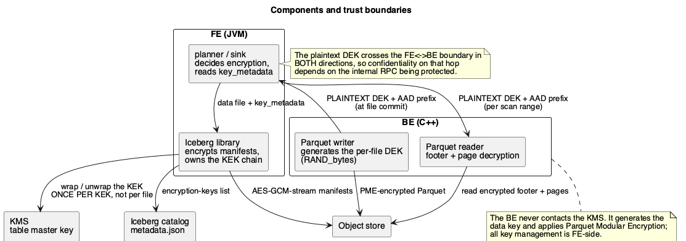
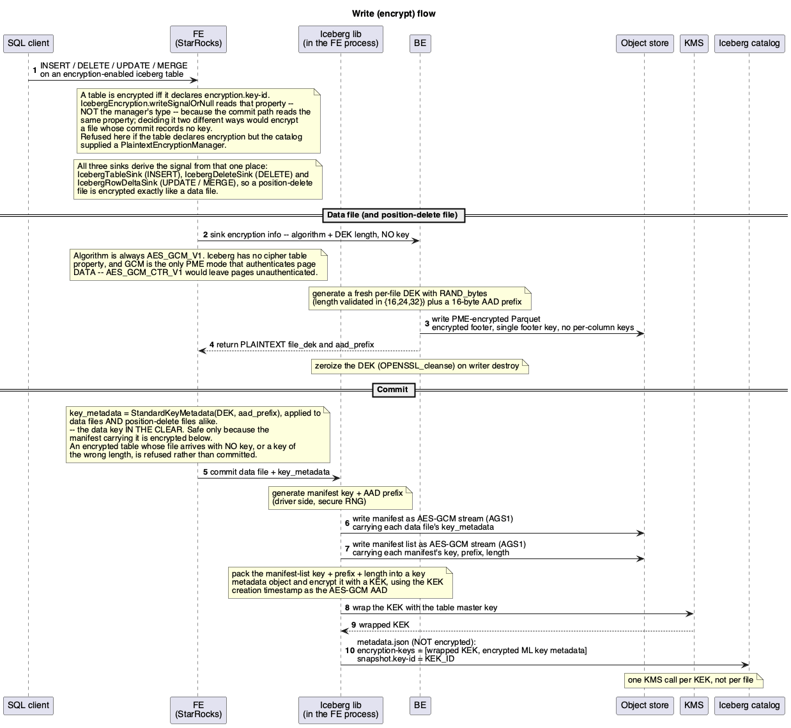
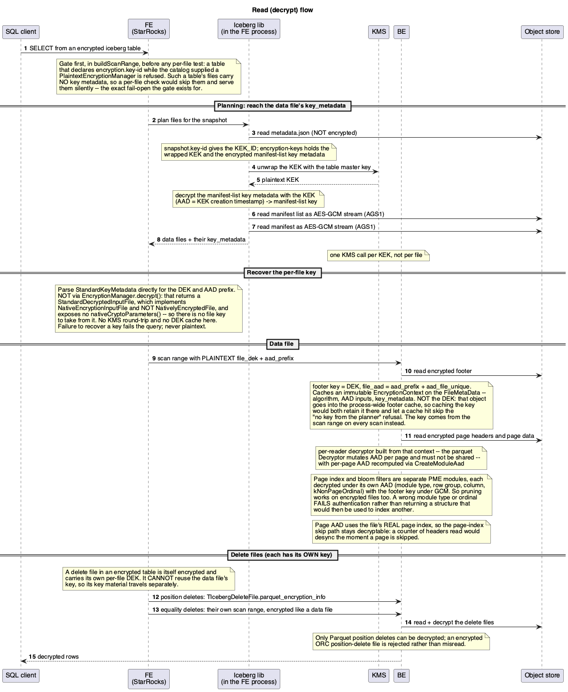
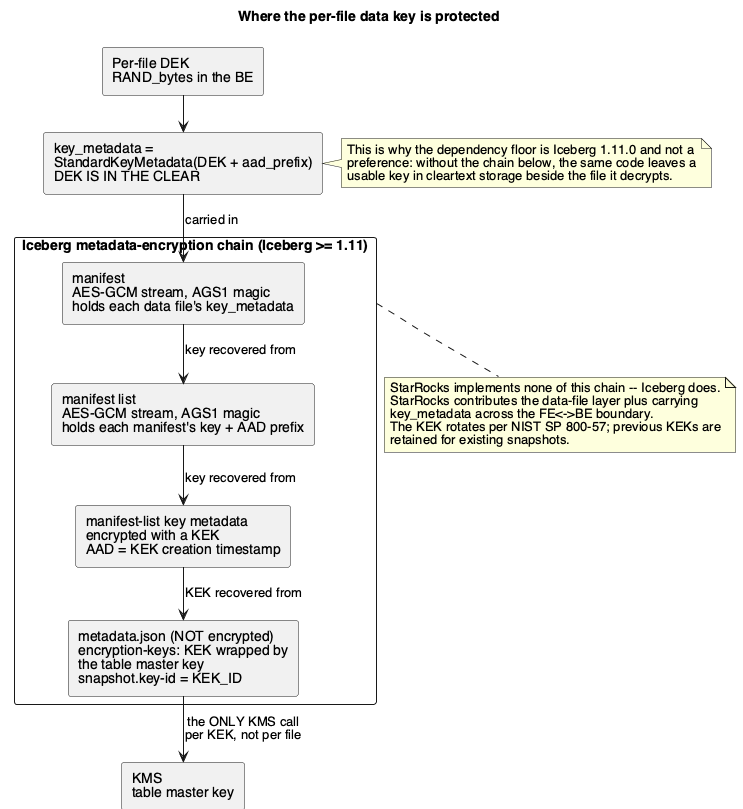

# Iceberg Table Encryption with Parquet Modular Encryption (PME) — Design

| | |
|---|---|
| **Component** | StarRocks FE (Java) + BE (C++) |
| **Audience** | StarRocks and Iceberg maintainers |
| **Iceberg** | 1.11.0 |

---

## 1. Summary

Lets StarRocks **write and read Iceberg tables whose data files are encrypted at rest** using
**Parquet Modular Encryption (PME)** with AES-GCM. Encryption is transparent to the SQL user: writing
to an encryption-enabled table produces encrypted Parquet, and reading one decrypts it, provided the
engine can obtain the file's data encryption key (DEK).

Scope is Iceberg's **Standard/PME** key management (`StandardEncryptionManager`): a **per-file DEK**
encrypts the Parquet file, and the DEK is recorded in the Iceberg file's `key_metadata` as
`StandardKeyMetadata`.

## 2. Goals / non-goals

**Goals**
- Write Iceberg data files as PME-encrypted Parquet (AES-GCM), interoperable with other Iceberg
  engines reading the same spec.
- Read PME-encrypted Iceberg data files, whether written by StarRocks or another engine.
- Fail **closed**: never silently read an encrypted file as plaintext, never silently write plaintext
  to an encryption-enabled table.

**Non-goals**
- Column-level / per-column keys. Iceberg's design uses a single footer key per file.
- Encrypting Iceberg **metadata** — manifests, manifest lists, and the KEK chain in table metadata.
  That is Iceberg's own responsibility (see §7) and is why this requires Iceberg 1.11.0.
- Managing or rotating the table master key; that belongs to the KMS and the catalog.
- A BE-side KMS client. The BE never talks to a KMS.

**Scope, set by Iceberg rather than by this design**

- **Hive Metastore catalogs only.** Encryption activates from `table.encryption()`, and in Iceberg
  1.11.0 only `HiveTableOperations` builds a real `EncryptionManager`. `RESTTableOperations` has no
  `encryption()` override, so it inherits `TableOperations`' default of
  `PlaintextEncryptionManager.instance()` and a REST-catalog table reports itself unencrypted no
  matter what its properties say. See §12.
- **Table format v3.** `EncryptionUtil.checkCompatibility`, called from `TableMetadata`, rejects
  `encryption.key-id` and `encryption.data-key-length` below v3, so a v1/v2 table cannot carry the
  properties at all.

## 3. Why Iceberg 1.11.0

`key_metadata` holds the DEK **in the clear**. That is safe only because Iceberg encrypts the
manifest carrying it, and that chain — manifest and manifest-list encryption plus the
`encryption-keys` list in table metadata — arrives in **1.11.0**. On an earlier release the same code
would place a usable key in cleartext storage beside the file it decrypts, so the dependency floor is
a correctness requirement, not a preference.

## 4. Components and trust boundaries



<sub>Source: [`diagrams/01-trust-boundaries.puml`](diagrams/01-trust-boundaries.puml)</sub>

- The **FE** plans the query, decides encryption, and reads/writes `key_metadata`. The Iceberg
  library inside the FE process owns the manifest encryption and the KEK chain.
- The **BE** generates the per-file DEK, applies PME on write, and decrypts footer and pages on
  read. **It never contacts the KMS.**
- The **plaintext DEK crosses the FE↔BE boundary in both directions** — BE→FE at commit, FE→BE per
  scan range and per position-delete file — so confidentiality on that hop depends on the internal RPC
  being protected.
- **Key material must stay out of logs and profiles.** A DEK written to `be.INFO` outlives the query
  and is copied off the host by log collection, so this is an ongoing constraint on any code that
  logs, profiles or serializes for debugging — not a one-time cleanup. Two structs carry the key:
  `TReportExecStatusParams.sink_commit_infos` on the write side, and
  `TExecPlanFragmentParams.params.per_node_scan_ranges` on the read side (data files *and*
  position-delete files, which carry their own keys). Anything that dumps either must go through
  `redacted_debug_string` in `common/util/thrift_key_redaction.h`, which replaces `file_dek` and
  `aad_prefix` on a copy. The thrift field definitions carry the same warning, so it is visible from
  the side a new caller is most likely to start from.

## 5. Write path



<sub>Source: [`diagrams/02-write-flow.puml`](diagrams/02-write-flow.puml) — regenerate per [README](README.md).</sub>

1. **FE decides, from the declaration.** `IcebergEncryption.writeSignalOrNull` treats a table as
   encrypted iff it declares `encryption.key-id`, and all three write sinks call it:
   `IcebergTableSink` (INSERT), `IcebergDeleteSink` (DELETE) and `IcebergRowDeltaSink`
   (UPDATE / MERGE). It reads the property rather than the manager's type deliberately — the commit
   path reads the same property, and deciding it two different ways would let the BE encrypt a file
   whose commit records no key, leaving data that nothing can decrypt.
2. **FE → BE, signal only.** `TIcebergTableSink.parquet_encryption_info` carries the **algorithm and
   DEK length — no key material**. The algorithm is always `AES_GCM_V1`: Iceberg exposes no cipher
   table property, and GCM is the only PME mode that authenticates page *data*.
3. **BE generates the DEK.** `ParquetFileWriter` draws a fresh DEK per file from `RAND_bytes` (length
   validated ∈ {16,24,32}), plus a 16-byte AAD prefix.
4. **BE applies PME.** `FileEncryptionProperties(DEK).algorithm(cipher).aad_prefix(prefix)` is
   attached to the writer, and `disable_aad_prefix_storage()` withholds the prefix from the file so a
   reader must supply it from `key_metadata` — that is what binds a file to its identity in the table
   and makes whole-file substitution detectable.
   Footer, page headers and pages are AES-GCM encrypted; GCM nonces and per-module AAD are produced
   internally by parquet-cpp. Encrypted footer, single footer key, no per-column keys.
5. **BE → FE returns the DEK.** `TIcebergDataFile.file_dek` and `.aad_prefix` come back at file
   completion. The writer zeroizes its copy (`OPENSSL_cleanse`) on destruction.
6. **FE commits `key_metadata`.** `IcebergMetadata.buildDataFile` serializes
   `StandardKeyMetadata(DEK, aad_prefix)` via `StarRocksKeyMetadata`.

## 6. Read path



<sub>Source: [`diagrams/03-read-flow.puml`](diagrams/03-read-flow.puml)</sub>

1. **FE recovers the DEK** in `IcebergConnectorScanRangeSource.buildEncryptionInfo`, reading
   `StandardKeyMetadata` **directly** from `file.keyMetadata()`.

   It deliberately does **not** call `EncryptionManager.decrypt()`. That returns a
   `StandardDecryptedInputFile`, which implements `NativeEncryptionInputFile` and **not**
   `NativelyEncryptedFile`, and exposes no `nativeCryptoParameters()` — so there is no file key to
   take from it. This is the shape of the API in 1.11.0, not a gap in an older release. Consequently
   there is no KMS round-trip and no DEK cache on this path: the key is already present in the
   metadata.

   Failure to recover a key **fails the query**; it never falls back to plaintext.
2. **FE → BE** sends the DEK per split as `THdfsScanRange.parquet_encryption_info.file_dek`, plus
   `.aad_prefix`.
3. **BE decrypts the footer.** `FileMetaData::_decrypt_and_deserialize_footer` requires `file_dek`
   and builds `FileDecryptionProperties().footer_key(DEK)` with
   `file_aad = aad_prefix + aad_file_unique`. The prefix comes from the file's own
   `FileCryptoMetaData` when stored there, or from the scan range when the writer set
   `supply_aad_prefix` — which is what StarRocks' own writer does. A missing prefix in that case is
   an error, not an empty AAD. What survives on the `FileMetaData` is an immutable
   `EncryptionContext` holding the algorithm, the AAD inputs and the file's `key_metadata` — but
   **not** the DEK, because that object goes into the process-wide footer cache (see §12 gap 1).
4. **BE decrypts pages.** `PageReader` builds a **per-reader** decryptor — the parquet `Decryptor`
   mutates AAD per page and must not be shared — combining that context with the DEK from the scan
   range (`ColumnReaderOptions::parquet_encryption_info`), then recomputes per-page AAD via
   `CreateModuleAad`. Taking the key from the scan range rather than the cached context is what makes
   "encrypted file, no key from the planner" fail on every scan instead of only on a cache miss.
6. **Page index and bloom filters are decrypted as their own modules.** PME encrypts the ColumnIndex,
   OffsetIndex and both bloom-filter parts separately from the pages, each under an AAD derived from
   `(module type, row group, column, kNonPageOrdinal)` and keyed with the footer key under GCM — even
   in a GCM_CTR file. `decrypt_metadata_module` does that in one place for all four, so an encrypted
   scan prunes row groups and pages exactly like a plaintext one. The AAD binding is what makes this
   safe rather than merely working: a wrong module type or ordinal fails authentication instead of
   yielding a structure that would then be used to index another.
7. **The page ordinal is the file's real page index.** The writer bakes the absolute data-page index
   into each page's AAD, so `PageReader` takes it from `_next_read_page_idx`, which advances only for
   data pages and is set by the page-skipping reader before it seeks. A counter of headers read would
   desync the moment the page index let the reader skip a page, and every remaining page in that
   chunk would fail to decrypt.
5. **Delete files carry their own keys.** Every file in an encrypted table has its own DEK, so a
   delete file cannot be opened with the data file's key. The two kinds travel differently:
   - **Position deletes** ride along with the data file's scan range, so their key material needs its
     own home: `TIcebergDeleteFile.parquet_encryption_info` (field 5), read by
     `IcebergPositionDeleteReader::read_rows`. Only Parquet is supported — an encrypted ORC
     position-delete file returns `NotSupported` rather than being misread as plaintext.
   - **Equality deletes** already get their own scan range, so they pick up key material from the
     same `buildScanRange` path a data file uses and need no special case.

   Iceberg V3 deletion vectors are rejected at planning, as they were before this change.

## 7. Where the key is protected



<sub>Source: [`diagrams/04-key-management.puml`](diagrams/04-key-management.puml)</sub>

```
per-file DEK ──> key_metadata (StandardKeyMetadata, DEK IN THE CLEAR)
                      │
                      ├─ carried in the manifest
                      │      manifest is AES-GCM-stream encrypted (AGS1 magic)
                      ├─ manifest key carried in the manifest list
                      │      manifest list is AES-GCM-stream encrypted
                      ├─ manifest-list key metadata encrypted with a KEK
                      │      AAD = KEK creation timestamp
                      └─ KEK wrapped by the table master key via the KMS,
                         stored in metadata.json's encryption-keys list;
                         snapshot.key-id = KEK_ID
```

`metadata.json` itself is not encrypted — it holds no data or stats. The KEK is rotated per NIST SP
800-57, and previous KEKs are retained for existing snapshots. **StarRocks implements none of this
chain**; Iceberg does. StarRocks' contribution is the data-file layer plus carrying `key_metadata`
across the FE/BE boundary.

Note the KMS is therefore called **once per KEK, not per file** — the per-file DEK is never
KMS-wrapped in this mode.

## 8. Thrift contract

| struct | field | direction |
|---|---|---|
| `TParquetEncryptionInfo` | `1: file_dek`, `2: encryption_algorithm`, `3: key_metadata`, `4: aad_prefix`, `5: dek_length` | both |
| `TIcebergTableSink` | `13: parquet_encryption_info` | FE → BE, write (algorithm + `dek_length` only) |
| `TIcebergDataFile` | `12: key_metadata`, `13: file_dek`, `14: aad_prefix` | BE → FE, commit |
| `THdfsScanRange` | `46: parquet_encryption_info` | FE → BE, read (data + equality-delete files) |
| `TIcebergDeleteFile` | `5: parquet_encryption_info` | FE → BE, read (position-delete files) |

`key_metadata` (field 3) is unused by the BE on both paths. It is declared so the ordinal is not
recycled later by something that *is* read.

These are wire contract: never renumber and never reuse an ordinal, or a mixed-version FE/BE pair
silently misreads the field. The scan-range field is **46, not 44** for exactly that reason — 44 and
45 were taken by `use_paimon_native_reader` and `paimon_split_info_binary`, and an earlier revision of
this work did collide with them.

## 9. Testing

| area | coverage |
|---|---|
| Write | `parquet_file_writer_test.cpp` — encrypted round trip, AAD prefix withheld from the file, and rejection of both an **unset** and an out-of-range DEK length |
| Read | `iceberg_delete_builder_test.cpp` — encrypted position-delete round trip, plus a negative case asserting a read **without** the key fails |
| Commit | `IcebergMetadataTest` — a data key shorter than the table's policy is refused at commit |
| Planning | `InsertPlanTest` — the plaintext-manager fixtures, so an unencrypted table stays unencrypted |

The negative assertions matter more than the positive ones: they are what prove the path fails closed
instead of quietly returning ciphertext, an empty result, or a weaker key than the table asked for.

## 10. Thirdparty

Arrow/parquet-cpp is built with `-DPARQUET_REQUIRE_ENCRYPTION=ON`, and the PME headers
(`internal_file_decryptor.h`, `internal_file_encryptor.h`, `encryption_internal.h`) are copied into
the install include dir — the symbols were already in `libparquet.a`; only the headers were missing.

**A dev-env image predating this change cannot build the BE**: it lacks the parquet encryption
symbols entirely.

## 11. Fail-closed behaviour

- An encrypted file whose key cannot be recovered fails the query.
- A `key_metadata` carrying no data key is an error, not an empty result.
- The BE refuses an encrypted footer with no `file_dek` (`NotSupported`) rather than attempting a
  plaintext parse.
- An encrypted **ORC** position-delete file is refused rather than parsed as plaintext: only the
  Parquet delete reader can decrypt.
- The cipher is not configurable, so it cannot be misconfigured. Iceberg 1.11.0 has no cipher table
  property — `TableProperties` carries only `encryption.key-id` and `encryption.data-key-length`, and
  the legacy `EncryptionAlgorithm` enum (`AES_CTR`, `AES_GCM`, `AES_GCM_CTR`) is referenced nowhere in
  `iceberg-core` and not by `StandardEncryptionManager`. FE therefore always signals `AES_GCM_V1`,
  which is also what parquet-java writes under Iceberg. The BE normalizes the name it is given and
  rejects anything that is not `AES_GCM_V1` or `AES_GCM_CTR_V1`, so an unknown cipher fails the write
  rather than falling back. `AES_GCM_CTR_V1` is accepted by the writer but never selected: it leaves
  page data unauthenticated, which would undercut the guarantees above.
- **A table that declares encryption the catalog will not apply is refused, on both paths.**
  `encryption.key-id` is a table property and reaches every catalog, but the `EncryptionManager` comes
  from the catalog's `TableOperations` — so the two can disagree, and a plaintext manager would
  otherwise read as "unencrypted table" and commit cleartext into a table configured to protect it.
  `IcebergEncryption.checkWriteSupported` fails the statement at planning, before any fragment reaches
  a BE; `checkReadSupported` uses the same predicate so the paths cannot drift, and it runs in
  `buildScanRange` before any per-file test — such a table's files carry no key metadata, so a
  per-file check would skip them and serve them silently. The gates test the manager the library
  actually returned, so they stop firing on their own once a catalog gains encryption support — no
  code change, only a dependency bump.
- The DEK **length** is never defaulted by the BE. FE resolves it from
  `encryption.data-key-length` (Iceberg's constant and Iceberg's default of 16, so a StarRocks file
  matches what another engine would write) and is the only side that does, because it is the only
  side that can see the table. Encryption on with no length reaching the BE fails at plan build.
- At commit, the key BE returns is checked against that length. A file encrypted below the table's
  declared strength is refused rather than recorded — nothing downstream re-checks it, since the key
  goes straight into `key_metadata`.

## 12. Known gaps

1. **The BE read DEK is not scrubbed** after use. It arrives on the scan range and is copied into
   the decryptor, then freed without being wiped — so it is recoverable from a core dump, a heap
   dump, or a swapped page. The write side does zeroize (`OPENSSL_cleanse`), so the two sides remain
   asymmetric in lifetime, though no longer in *scope*: the DEK is deliberately kept off
   `FileMetaData::EncryptionContext`, because that object is inserted into the process-wide footer
   cache keyed only by path, mtime and size. Caching it there retained plaintext key material in a
   shared, LRU-evicted, never-zeroized cache for every encrypted file scanned, and — worse — let a
   cache hit skip the "no decryption key was provided by the planner" refusal entirely, since that
   check lives on the cache-miss path. The DEK now reaches the decryptor from the scan range on
   every scan (`ColumnReaderOptions::parquet_encryption_info`), which makes that refusal
   unconditional. Wiping the remaining short-lived copies is the outstanding part.
2. **Equality-delete files are not written encrypted.** StarRocks does write delete files —
   `DELETE` plans through `IcebergDeleteSink`, `UPDATE`/`MERGE` through `IcebergRowDeltaSink` — and
   position deletes are covered: all three sinks derive their write signal from
   `IcebergEncryption.writeSignalOrNull`, the BE applies it to both delete contexts, and the per-file
   key is returned at commit and recorded via the shared `encryptionKeyMetadata` helper. StarRocks does
   not currently emit equality deletes, but if it does, the same treatment is required — an unencrypted
   equality delete would leak the literal column values the table encryption exists to protect.
3. **ORC delete files cannot be decrypted.** PME is Parquet-only, and no equivalent for ORC is wired
   up here. Iceberg's Standard encryption is format-agnostic at the `AesGcmInputFile`/`Ciphers`
   layer, so this is an implementation gap rather than a spec one — an encrypted ORC delete file
   fails the query today.
4. **REST catalogs get no encryption, and upstream fails silently at it** — an upstream gap, not one
   this change can close. StarRocks refuses such a table rather than inheriting the silence; what
   cannot be fixed here is making encryption *work* on those catalogs. Iceberg 1.11.0 wires the
   client side for Hive only:
   - `RESTTableOperations` never overrides `encryption()`, so `table.encryption()` returns
     `PlaintextEncryptionManager`
   - `EncryptionUtil.createEncryptionManager` and `createKmsClient` have exactly one caller each,
     `HiveTableOperations` / `HiveCatalog`
   - `TableMetadata.Builder.addEncryptionKey(...)` is only called from `HiveTableOperations`, so new
     KEKs would never be persisted even if a manager existed

   The metadata and protocol layers are catalog-agnostic and complete — `encryption-keys` in
   `TableMetadataParser`, `add-encryption-key` in `MetadataUpdateParser` — so a REST catalog stores
   and returns keys correctly. Only the step that turns them into an `EncryptionManager` is missing.

   Because `OutputFileFactory.build()` and `EncryptingFileIO.combine(...)` both take the manager from
   `table.encryption()`, **any** engine on a REST catalog writes plaintext data files and plaintext
   manifests into a table declaring `encryption.key-id`, with no error. That includes Spark, which
   reads the same accessor — this is not specific to StarRocks.

   Tracked upstream as [apache/iceberg#13225](https://github.com/apache/iceberg/pull/13225), open
   since 2025-06 pending a discussion on catalog vending of KMS credentials, and not expected before
   Iceberg 1.13. Nothing here needs to change when it lands. The gates in `IcebergEncryption` compare
   the table's declaration against the manager `table.encryption()` returned, so today a REST-catalog
   table declaring `encryption.key-id` is refused on both paths; once such a catalog supplies a real
   manager the refusal stops and the declaration alone drives encryption. Only the dependency moves.
