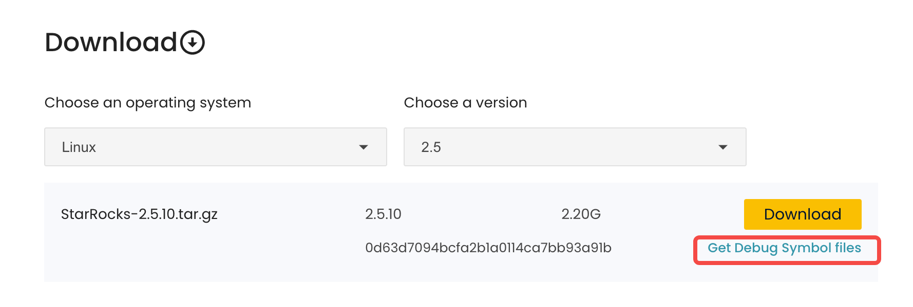

# Use the debuginfo file for debugging

## Change description

From v2.5 onwards, the debuginfo file of BE is stripped from the StarRocks installation package to reduce the size and space usage of the installation package. You can see two packages at [StarRocks website](https://www.starrocks.io/download/community).



In this figure, you can click `Get Debug Symbol files` to download the debuginfo package. `StarRocks-2.5.10.tar.gz` is the installation package and you can click **Download** to download this package.

This change does not affect your download behavior or use of StarRocks. You can download only the installation package for cluster deployment and upgrade. The debuginfo package is only for developers to debug programs using GDB.

## Precautions

GDB 12.1 or later is recommended for debugging.

## How to use the debuginfo file

1. Download and decompress the debuginfo package.

    ```SQL
    wget https://releases.starrocks.io/starrocks/StarRocks-<sr_ver>.debuginfo.tar.gz

    tar -xzvf StarRocks-<sr_ver>.debuginfo.tar.gz
    ```

    > **NOTE**
    >
    > Replace `<sr_ver>` with the version number of the StarRocks installation package you want to download.

2. Load the debuginfo file when you perform GDB debugging.

    - **Method 1**

    ```Shell
    objcopy --add-gnu-debuglink=starrocks_be.debug starrocks_be
    ```

    This operation associates the debug info file with your executable file.

    - **Method 2**

    ```Shell
    gdb -s starrocks_be.debug -e starrocks_be -c `core_file`
    ```

The debuginfo file works well with perf and pstack. You can directly use perf and pstack without additional operations.
