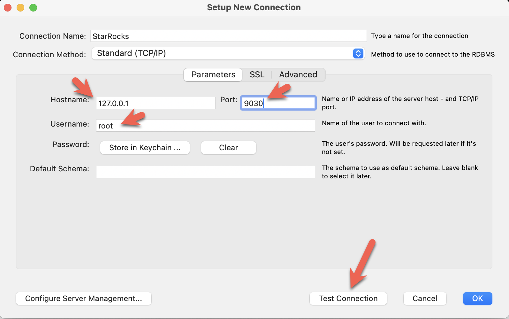
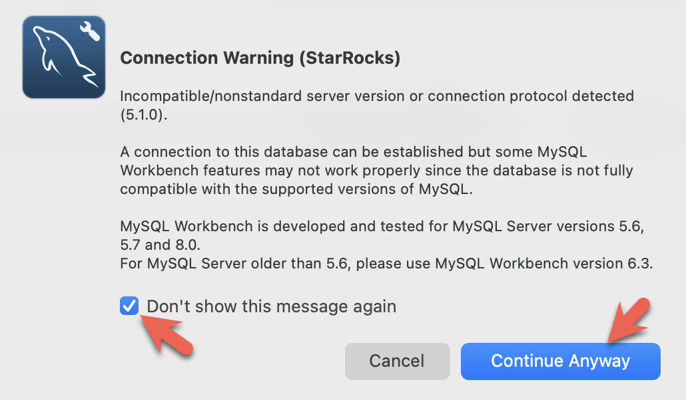

---
---
import Tabs from '@theme/Tabs';
import TabItem from '@theme/TabItem';

These three clients are tested with this tutorial, you only need one:

- mysql CLI: You can run this from the Docker environment or your machine.
- [DBeaver](https://dbeaver.io/download/) is available as a community version and a Pro version. 
- [MySQL Workbench](https://dev.mysql.com/downloads/workbench/)

#### Configuring the client

<Tabs groupId="client">
<TabItem value="mysqlCLI" label="mysql CLI" default>

The easiest way to use the mysql CLI is to run it from the StarRocks container `starrocks-fe`:

```bash
docker exec -it quickstart \
mysql -P 9030 -h 127.0.0.1 -u root --prompt="StarRocks > "
```

If you would like to install the mysql CLI expand **mysql client install** below:

<details>

<summary>mysql client install</summary>

- macOS: If you use Homebrew and do not need MySQL Server run `brew install mysql` to install the CLI.
- Linux: Check your repository system for the `mysql` client. For example, `yum install mariadb`.
- Microsoft Windows: Install the [MySQL Community Server](https://dev.mysql.com/downloads/mysql/) and run the provided client, or run `mysql` from WSL.

</details>

</TabItem>

<TabItem value="DBeaver" label="DBeaver" >

- Install [DBeaver](https://dbeaver.io/download/), and add a connection:

- Configure the port, IP, and username. Test the connection, and click Finish if the test succeeds:


</TabItem>
<TabItem value="MySQLWorkbench" label="MySQL Workbench">

- Install the [MySQL Workbench](https://dev.mysql.com/downloads/workbench/), and add a connection.
- Configure the port, IP, and username and then test the connection:

- You will see warnings from the Workbench as it is checking for a specific MySQL version. You can ignore the warnings and when prompted, you can configure Workbench to stop displaying the warnings:

</TabItem>

</Tabs>
