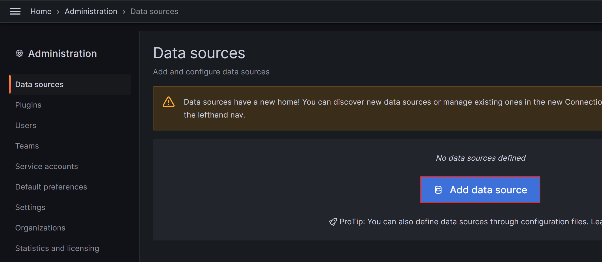
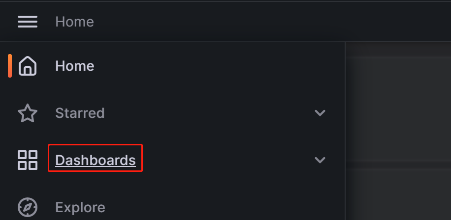
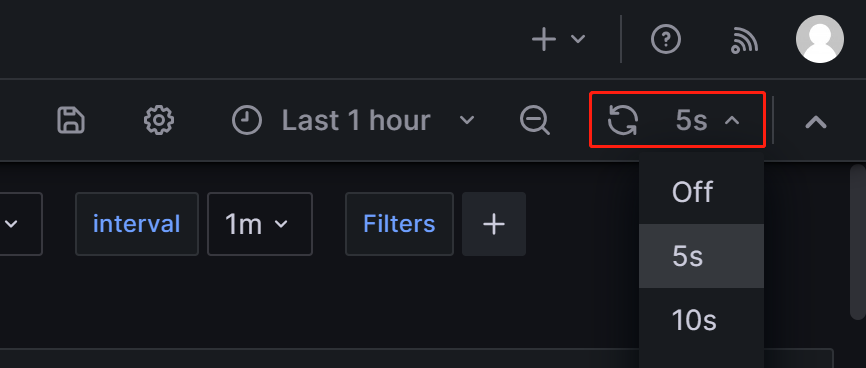
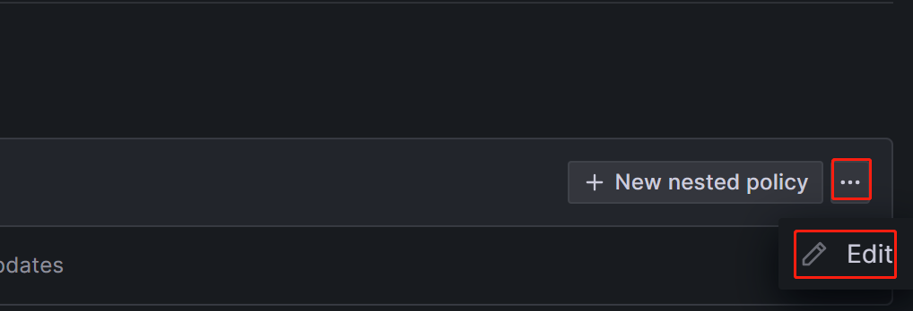
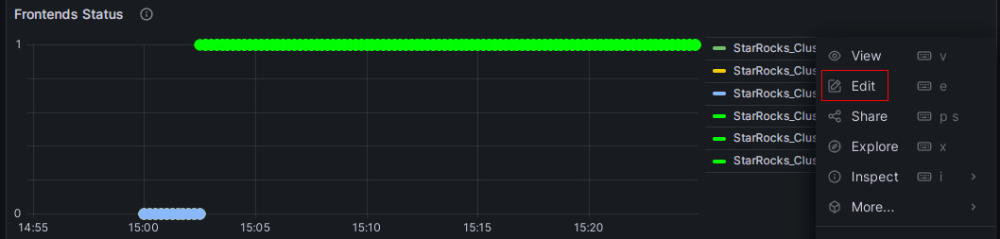
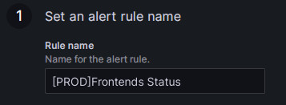
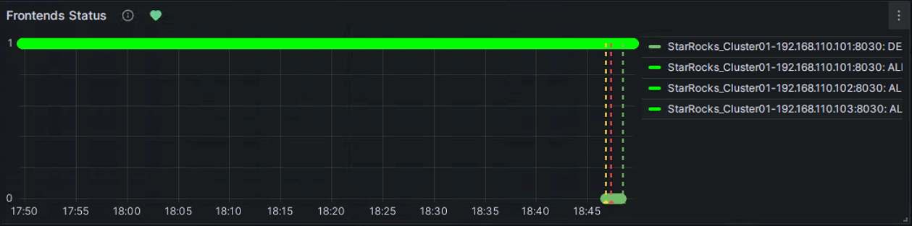

# Monitor and Alerting

You can build your own monitoring services, or use the Prometheus + Grafana solution. StarRocks provides a Prometheus-compatible interface that directly links to the HTTP port of the BE and FE to obtain monitoring information from the cluster.

## Monitoring Indicators

The available metrics are:

|Indicator|Unit|Type|Meaning|
|---|:---:|:---:|---|
|be_broker_count|pcs|average|Number of brokers |
|be_brpc_endpoint_count|pcs|average|Number of StubCache in bRPC|
|be_bytes_read_per_second|bytes/s|average| Read speed of BE |
|be_bytes_written_per_second|bytes/s|average|Write speed of BE |
|be_base_compaction_bytes_per_second|bytes/s|average|Base compaction speed of BE|
|be_cumulative_compaction_bytes_per_second|bytes/s|average|Cumulative compaction speed of BE|
|be_base_compaction_rowsets_per_second|rowsets/s|average| Base compaction speed of BE rowsets|
|be_cumulative_compaction_rowsets_per_second|rowsets/s|average| Cumulative compaction speed of BE rowsets |
|be_base_compaction_failed|pcs/s|average|Base compaction failure of BE |
|be_clone_failed| pcs/s |average|BE clone failure |
|be_create_rollup_failed| pcs/s |average|Materialized view creation failure of BE |
|be_create_tablet_failed| pcs/s |average|Tablet creation failure of BE |
|be_cumulative_compaction_failed| pcs/s |average|Cumulative compaction failure of BE |
|be_delete_failed| pcs/s |average| Delete failure of BE |
|be_finish_task_failed| pcs/s |average|Task failure of BE |
|be_publish_failed| pcs/s |average| Version release failure of BE |
|be_report_tables_failed| pcs/s |average| Table report failure of BE |
|be_report_disk_failed| pcs/s |average|Disk report failure of BE |
|be_report_tablet_failed| pcs/s |average|Tablet report failure of BE |
|be_report_task_failed| pcs/s |average|Task report failure of BE |
|be_schema_change_failed| pcs/s |average|Schema change failure of BE |
|be_base_compaction_requests| pcs/s |average|Base compaction request of BE |
|be_clone_total_requests| pcs/s |average|Clone request of BE |
|be_create_rollup_requests| pcs/s |average| Materialized view creation request of BE |
|be_create_tablet_requests|pcs/s|average| Tablet creation request of BE |
|be_cumulative_compaction_requests|pcs/s|average|Cumulative compaction request of BE |
|be_delete_requests|pcs/s|average| Delete request of BE |
|be_finish_task_requests|pcs/s|average| Task finish request of BE |
|be_publish_requests|pcs/s|average| Version publish request of BE |
|be_report_tablets_requests|pcs/s|average|Tablet report request of BE |
|be_report_disk_requests|pcs/s|average|Disk report request of BE |
|be_report_tablet_requests|pcs/s|average|Tablet report request of BE |
|be_report_task_requests|pcs/s|average|Task report request of BE |
|be_schema_change_requests|pcs/s|average|Schema change report request of BE |
|be_storage_migrate_requests|pcs/s|average| Migration request of BE |
|be_fragment_endpoint_count|pcs|average|Number of BE DataStream |
|be_fragment_request_latency_avg|ms|average| Latency of fragment requests |
|be_fragment_requests_per_second|pcs/s|average|Number of fragment requests|
|be_http_request_latency_avg|ms|average|Latency of HTTP requests |
|be_http_requests_per_second|pcs/s|average|Number of HTTP requests|
|be_http_request_send_bytes_per_second|bytes/s|average| Number of bytes sent for HTTP requests |
|fe_connections_per_second|connections/s|average| New connection rate of FE |
|fe_connection_total|connections| cumulative | Total number of FE connections |
|fe_edit_log_read|operations/s|average|Read speed of FE edit log |
|fe_edit_log_size_bytes|bytes/s|average|Size of FE edit log |
|fe_edit_log_write|bytes/s|average|Write speed of FE edit log |
|fe_checkpoint_push_per_second|operations/s|average|Number of FE checkpoints |
|fe_pending_hadoop_load_job|pcs|average| Number of pending hadoop jobs|
|fe_committed_hadoop_load_job|pcs|average| Number of committed hadoop jobs|
|fe_loading_hadoop_load_job|pcs|average| Number of loading hadoop jobs|
|fe_finished_hadoop_load_job|pcs|average| Number of completed  hadoop jobs|
|fe_cancelled_hadoop_load_job|pcs|average| Number of cancelled hadoop jobs|
|fe_pending_insert_load_job|pcs|average| Number of pending insert jobs |
|fe_loading_insert_load_job|pcs|average| Number of loading insert jobs|
|fe_committed_insert_load_job|pcs|average| Number of committed insert jobs|
|fe_finished_insert_load_job|pcs|average| Number of completed insert jobs|
|fe_cancelled_insert_load_job|pcs|average| Number of cancelled insert jobs|
|fe_pending_broker_load_job|pcs|average| Number of pending broker jobs|
|fe_loading_broker_load_job|pcs|average| Number of loading broker jobs
|fe_committed_broker_load_job|pcs|average| Number of committed broker jobs|
|fe_finished_broker_load_job|pcs|average| Number of finished broker jobs|
|fe_cancelled_broker_load_job|pcs|average| Number of cancelled broker jobs |
|fe_pending_delete_load_job|pcs|average| Number of pending delete jobs|
|fe_loading_delete_load_job|pcs|average| Number of loading delete jobs|
|fe_committed_delete_load_job|pcs|average| Number of committed delete jobs|
|fe_finished_delete_load_job|pcs|average| Number of finished delete jobs|
|fe_cancelled_delete_load_job|pcs|average| Number of cancelled delete jobs|
|fe_rollup_running_alter_job|pcs|average| Number of jobs created in rollup |
|fe_schema_change_running_job|pcs|average| Number of jobs in schema change |
|cpu_util| percentage|average|CPU usage rate |
|cpu_system | percentage|average|cpu_system usage rate |
|cpu_user| percentage|average|cpu_user usage rate |
|cpu_idle| percentage|average|cpu_idle usage rate |
|cpu_guest| percentage|average|cpu_guest usage rate |
|cpu_iowait| percentage|average|cpu_iowait usage rate |
|cpu_irq| percentage|average|cpu_irq usage rate |
|cpu_nice| percentage|average|cpu_nice usage rate |
|cpu_softirq| percentage|average|cpu_softirq usage rate |
|cpu_steal| percentage|average|cpu_steal usage rate |
|disk_free|bytes|average| Free disk capacity |
|disk_io_svctm|Ms|average| Disk IO service time |
|disk_io_util|percentage|average| Disk usage |
|disk_used|bytes|average| Used disk capacity |
|starrocks_fe_meta_log_count|pcs|Instantaneous|The number of Edit Logs without a checkpoint. A value within `100000` is considered reasonable.|
|starrocks_fe_query_resource_group|pcs|cumulative|The number of queries for each resource group|
|starrocks_fe_query_resource_group_latency|second|average|the query latency percentile for each resource group|
|starrocks_fe_query_resource_group_err|pcs|cumulative|The number of incorrect queries for each resource group|
|starrocks_be_resource_group_cpu_limit_ratio|percentage|Instantaneous|Instantaneous value of resource group cpu quota ratio|
|starrocks_be_resource_group_cpu_use_ratio|percentage|average|The ratio of CPU time used by the resource group to the CPU time of all resource groups|
|starrocks_be_resource_group_mem_limit_bytes|Byte|Instantaneous|Instantaneous value of resource group memory quota|
|starrocks_be_resource_group_mem_allocated_bytes|Byte|Instantaneous|Instantaneous value of resource group memory usage|

## Monitoring Alarm Best Practices

Background information on the monitoring system:

1. The system collects information every 15 seconds.
2. Some indicators are divided by 15 seconds and the unit is pcs/sec. Some indicators are not divided, and the count is still 15 seconds.
3. P90, P99 and other quantile values are currently counted within 15 seconds. When calculating at a greater granularity (1 minute, 5 minutes, etc.), use "how many alarms greater than a certain value" rather than "what is the average value".

### References

1. The purpose of monitoring is to only alert on abnormal conditions, not  normal conditions.
2. Different clusters have different resources (e.g., memory, disk), different usage, and need to be set to different values; however, "percentage" is universal as a measurement unit.
3. For indicators such as `number of failures`, it is necessary to monitor the change of the total number, and calculate the alarm boundary value according to a certain proportion (for example, for the amount of P90, P99, P999).
4. `A value of 2x or more` or `a value higher than the peak` can generally be used as a warning value for the growth of used/query.

### Alarm settings

#### Low frequency alarms

Trigger the alarm  if one or more failures occur. Set a more advanced alarm if there are multiple failures.

For operations (e.g.,schema change) that are not frequently performed, "alarm on failure" is sufficient.

#### No task started

Once the monitoring alarm is turned on, there may be a lot of successful and failed tasks. You can set `failed > 1` to alert and modify it later.

#### Fluctuation

##### Large fluctuations

Need to focus on data with different time granularity, as the peaks and valleys in data with large granularity may be averaged out. Generally, you need to look at 15 days, 3 days, 12 hours, 3 hours, and 1 hour (for different time ranges).

The monitoring interval may need to be slightly longer (e.g. 3 minutes, 5 minutes, or even longer) to shield the alarm caused by fluctuations.

##### Small fluctuations

Set shorter intervals to quickly get alarms when problems occur.

##### High spikes

It depends on whether the spikes need to be alarmed or not. If there are too many spikes, setting longer intervals may help smooth out the spikes.

#### Resource usage

##### High resource usage

You can set the alarm to reserve a little resource.For example, set the memory alert to `mem_avaliable<=20%`.

##### Low resource usage

You can set a stricter value than "high resource usage".For example, for  a CPU with low usage (less than 20%), set the alarm to `cpu_idle<60%`.

### Caution

Usually FE/BE are monitored together, but there are some values that only FE or BE has.

There may be some machines that need to be set up  in batches for monitoring.

### Additional information

#### P99 Batch calculation rules

The node collects data every 15 seconds and calculates a value, the 99th percentile is the 99th percentile in those 15 seconds. When the QPS is not high (e.g. QPS is below 10), these percentiles are not very accurate. Also, it is meaningless to aggregate four values generated in one minute (4 x 15 seconds) whether using sum or average function.

The same applies to P50, P90, and so on.

#### Cluster Monitoring for errors

> Some undesired cluster errors need to be found and resolved in time to keep the cluster stable. If the errors are less critical (e.g. SQL syntax errors, etc.) but **can't be stripped out from the important error items**, it’s recommended to monitor first and distinguish those at a later stage.

## Using Prometheus+Grafana

StarRocks can use [Prometheus](https://prometheus.io/) to monitor data storage and use [Grafana](https://grafana.com/) to visualize results.

### Components

>This document describes StarRocks’ visual monitoring solution based on Prometheus and Grafana implementations. StarRocks is not responsible for maintaining or developing these components. For more detailed information about Prometheus and Grafana, please refer to their official websites.

#### Prometheus

Prometheus is a temporal database with multi-dimensional data models and flexible query statements. It collects data by pulling or pushing them from monitored systems and stores these data in its temporal database. It meets different user needs through its rich multi-dimensional data query language.

#### Grafana

Grafana is an open-source metric analysis and visualization system that supports a variety of data sources. Grafana retrieves data from data sources with corresponding query statements. It allows users to create charts and dashboards to visualize data.

### Monitoring architecture


Prometheus pulls the metrics from the FE/BE interface and then stores the data into its temporal database.

In Grafana, users can configure Prometheus as a data source to customize the Dashboard.

### Deployment

#### Prometheus

**1.** Download the latest version of Prometheus from the [Prometheus official website](https://prometheus.io/download/). Take the prometheus-2.29.1.linux-amd64 version for example.

```bash
wget https://github.com/prometheus/prometheus/releases/download/v2.29.1/prometheus-2.29.1.linux-amd64.tar.gz
tar -xf prometheus-2.29.1.linux-amd64.tar.gz
```

**2.** Add configuration in `vi prometheus.yml`

```yml
# my global config
global:
  scrape_interval: 15s # global acquisition interval, 1m by default, here set to 15s
  evaluation_interval: 15s # global rule trigger interval, 1m by default, here set to 15s

scrape_configs:
  # The job name is added as a label `job=<job_name>` to any timeseries scraped from this config.
  - job_name: 'StarRocks_Cluster01' # Each cluster is called a job, job name is customizable
    metrics_path: '/metrics' # Specify the Restful API to get metrics

    static_configs:
      - targets: ['fe_host1:http_port','fe_host3:http_port','fe_host3:http_port']
        labels:
          group: fe # Here the group of FE is configured which contains 3 Frontends

      - targets: ['be_host1:http_port', 'be_host2:http_port', 'be_host3:http_port']
        labels:
          group: be # The group of BE is configured here which contains three Backends
  - job_name: 'StarRocks_Cluster02' # Multiple StarRocks clusters can be monitored in Prometheus
metrics_path: '/metrics'

    static_configs:
      - targets: ['fe_host1:http_port','fe_host3:http_port','fe_host3:http_port']
        labels:
          group: fe

      - targets: ['be_host1:http_port', 'be_host2:http_port', 'be_host3:http_port']
        labels:
          group: be
```

**3.** Start Prometheus

```bash
nohup ./prometheus \
    --config.file="./prometheus.yml" \
    --web.listen-address=":9090" \
    --log.level="info" &
```

This command runs Prometheus in the background and specifies its web port as 9090. Once set up, Prometheus starts collecting data and stores it in the `. /data` directory.

**4.** Accessing Prometheus

Prometheus can be accessed via BUI. You simply need to open port 9090 in your browser. Go to`Status -> Targets` to see the monitored host nodes for all grouped jobs. Under normal circumstances, all nodes should be `UP`. If the node status is not `UP`, you can visit the StarRocks metrics (`http://fe_host:fe_http_port/metrics` or `http://be_host:be_http_port/metrics`) interface first to check if it is accessible, or check the Prometheus documentation for troubleshooting.


A simple Prometheus has been built and configured. For more advanced usage, please refer to the [official documentation](https://prometheus.io/docs/introduction/overview/)

#### Grafana

**1.** Download the latest version of Grafana from [Grafana official website](https://grafana.com/grafana/download). Take thegrafana-8.0.6.linux-amd64 version for example.

```SHELL
wget https://dl.grafana.com/oss/release/grafana-8.0.6.linux-amd64.tar.gz
tar -zxf grafana-8.0.6.linux-amd64.tar.gz
```

**2.** Add configuration in `vi . /conf/defaults.ini`

```ini
...
[paths]
data = ./data
logs = ./data/log
plugins = ./data/plugins
[server]
http_port = 8000
domain = localhost
...
```

**3.** Start Grafana

```Plain text
nohup ./bin/grafana-server \
    --config="./conf/grafana.ini" &
```

### Dashboard

#### DashBoard Configuration

Log in to Grafana through the address configured in the previous step `http://grafana_host:8000` with the default username,password (i.e. admin,admin).

**1.** Add a data source.

Configuration path: `Configuration-->Data sources-->Add data source-->Prometheus`

Data Source Configuration Introduction


* Name: Name of the data source. Can be customized, e.g. starrocks_monitor
* URL: The web address of Prometheus, e.g. `http://prometheus_host:9090`
* Access: Select the Server method, i.e., the server where Grafana is located for Prometheus to access.
The rest of the options are default.

Click Save & Test at the bottom, if it shows `Data source is working`, it means the data source is available.

**2.** Add a dashboard.

Download a dashboard.

> **NOTE**
>
<<<<<<< HEAD
> Metric names in StarRocks v1.19.0 and v2.4.0 are changed. You must download a dashboard template based on your StarRocks version:
=======
> Prometheus and Grafana can only monitor FE, BE, and CN nodes, not Broker nodes.

### 1.1 Deploy Prometheus

#### 1.1.1 Download Prometheus

For StarRocks, you only need to download the installation package of the Prometheus server. Download the package to the monitoring node.

[Click here to download Prometheus](https://prometheus.io/download/).

Take the LTS version v2.45.0 as an example, click the package to download it.


Alternatively, you can download it using the `wget` command:

```Bash
# The following example downloads the LTS version v2.45.0.
# You can download other versions by replacing the version number in the command.
wget https://github.com/prometheus/prometheus/releases/download/v2.45.0/prometheus-2.45.0.linux-amd64.tar.gz
```

After the download is complete, upload or copy the installation package to the directory **/opt** on the monitoring node.

#### 1.1.2 Install Prometheus

1. Navigate to **/opt** and decompress the Prometheus installation package.

   ```Bash
   cd /opt
   tar xvf prometheus-2.45.0.linux-amd64.tar.gz
   ```

2. For ease of management, rename the decompressed directory to **prometheus**.

   ```Bash
   mv prometheus-2.45.0.linux-amd64 prometheus
   ```

3. Create a data storage path for Prometheus.

   ```Bash
   mkdir prometheus/data
   ```

4. For ease of management, you can create a system service startup file for Prometheus.

   ```Bash
   vim /etc/systemd/system/prometheus.service
   ```

   Add the following content to the file:

   ```Properties
   [Unit]
   Description=Prometheus service
   After=network.target

   [Service]
   User=root
   Type=simple
   ExecReload=/bin/sh -c "/bin/kill -1 `/usr/bin/pgrep prometheus`"
   ExecStop=/bin/sh -c "/bin/kill -9 `/usr/bin/pgrep prometheus`"
   ExecStart=/opt/prometheus/prometheus --config.file=/opt/prometheus/prometheus.yml --storage.tsdb.path=/opt/prometheus/data --storage.tsdb.retention.time=30d --storage.tsdb.retention.size=30GB

   [Install]
   WantedBy=multi-user.target
   ```

   Then, save and exit the editor.

   > **NOTE**
   >
   > If you deploy Prometheus under a different path, please make sure to synchronize the path in the ExecStart command in the file above. Additionally, the file configures the expiration conditions for Prometheus data storage to be "30 days or more" or "greater than 30 GB". You can modify this according to your needs.

5. Modify the Prometheus configuration file **prometheus/prometheus.yml**. This file has strict requirements for the format of the content. Please pay special attention to spaces and indentation when making modifications.

   ```Bash
   vim prometheus/prometheus.yml
   ```

   Add the following content to the file:

   ```YAML
   global:
     scrape_interval: 15s # Set the global scrape interval to 15s. The default is 1 min.
     evaluation_interval: 15s # Set the global rule evaluation interval to 15s. The default is 1 min.
   scrape_configs:
     - job_name: 'StarRocks_Cluster01' # A cluster being monitored corresponds to a job. You can customize the StarRocks cluster name here.
       metrics_path: '/metrics'    # Specify the Restful API for retrieving monitoring metrics.
       static_configs:
       # The following configuration specifies an FE group, which includes 3 FE nodes.
       # Here, you need to fill in the IP and HTTP ports corresponding to each FE.
       # If you modified the HTTP ports during cluster deployment, make sure to adjust them accordingly.
         - targets: ['192.168.110.101:8030','192.168.110.102:8030','192.168.110.103:8030']
           labels:
             group: fe
       # The following configuration specifies a BE group, which includes 3 BE nodes.
       # Here, you need to fill in the IP and HTTP ports corresponding to each BE.
       # If you modified the HTTP ports during cluster deployment, make sure to adjust them accordingly.
         - targets: ['192.168.110.101:8040','192.168.110.102:8040','192.168.110.103:8040']
           labels:
             group: be
   ```

   After you have modified the configuration file, you can use `promtool` to verify whether the modification is valid.

   ```Bash
   ./prometheus/promtool check config prometheus/prometheus.yml
   ```

   The following prompt indicates that the check has passed. You can then proceed.

   ```Bash
   SUCCESS: prometheus/prometheus.yml is valid prometheus config file syntax
   ```

6. Start Prometheus.

   ```Bash
   systemctl daemon-reload
   systemctl start prometheus.service
   ```

7. Check the status of Prometheus.

   ```Bash
   systemctl status prometheus.service
   ```

   If `Active: active (running)` is returned, it indicates that Prometheus has started successfully.

   You can also use `netstat` to check the status of the default Prometheus port (9090).

   ```Bash
   netstat -nltp | grep 9090
   ```

8. Set Prometheus to start on boot.

   ```Bash
   systemctl enable prometheus.service
   ```

**Other commands**:

- Stop Prometheus.

  ```Bash
  systemctl stop prometheus.service
  ```

- Restart Prometheus.

  ```Bash
  systemctl restart prometheus.service
  ```

- Reload configurations on runtime.

  ```Bash
  systemctl reload prometheus.service
  ```

- Disable start on boot.

  ```Bash
  systemctl disable prometheus.service
  ```

#### 1.1.3 Access Prometheus

You can access the Prometheus Web UI through a browser, and the default port is 9090. For the monitoring node in this tutorial, you need to visit `192.168.110.23:9090`.

On the Prometheus homepage, navigate to **Status** --> **Targets** in the top menu. Here, you can see all the monitored nodes for each group job configured in the **prometheus.yml** file. Usually, the status of all nodes should be UP, indicating that the service communication is normal.


At this point, Prometheus is configured and set up. For more detailed information, you can refer to the [Prometheus Documentation](https://prometheus.io/docs/).

### 1.2 Deploy Grafana

#### 1.2.1 Download Grafana

[Click here to download Grafana](https://grafana.com/grafana/download).

Alternatively, you can use the `wget` command to download the Grafana RPM installation package.

```Bash
# The following example downloads the LTS version v10.0.3.
# You can download other versions by replacing the version number in the command.
wget https://dl.grafana.com/enterprise/release/grafana-enterprise-10.0.3-1.x86_64.rpm
```

#### 1.2.2 Install Grafana

1. Use the `yum` command to install Grafana. This command will automatically install the dependencies required for Grafana.

   ```Bash
   yum -y install grafana-enterprise-10.0.3-1.x86_64.rpm
   ```

2. Start Grafana.

   ```Bash
   systemctl start grafana-server.service
   ```

3. Check the status of Grafana.

   ```Bash
   systemctl status grafana-server.service
   ```

   If `Active: active (running)` is returned, it indicates that Grafana has started successfully.

   You can also use `netstat` to check the status of the default Grafana port (3000).

   ```Bash
   netstat -nltp | grep 3000
   ```

4. Set Grafana to start on boot.

   ```Bash
   systemctl enable grafana-server.service
   ```

**Other commands**:

- Stop Grafana.

  ```Bash
  systemctl stop grafana-server.service
  ```

- Restart Grafana.

  ```Bash
  systemctl restart grafana-server.service
  ```

- Disable start on boot.

  ```Bash
  systemctl disable grafana-server.service
  ```

For more information, refer to the [Grafana Documentation](https://grafana.com/docs/grafana/latest/).

#### 1.2.3 Access Grafana

You can access the Grafana Web UI through a browser, and the default port is 3000. For the monitoring node in this tutorial, you need to visit `192.168.110.23:3000`. The default username and password required for login are both set to `admin`. Upon the initial login, Grafana will prompt you to change the default login password. If you want to skip this for now, you can click `Skip`. Then, you will be re-directed to the Grafana Web UI homepage.


#### 1.2.4 Configure data sources

Click on the menu button in the upper-left corner, expand **Administration**, and then click **Data sources**.


On the page that appears, click **Add data source**, and then choose **Prometheus**.




To integrate Grafana with your Prometheus service, you need to modify the following configuration:

- **Name**: The name of the data source. You can customize the name for the data source.

  

- **Prometheus Server URL**: The URL of the Prometheus server, which, in this tutorial, is `http://192.168.110.23:9090`.

  

After the configuration is complete, click **Save & Test** to save and test the configuration. If **Successfully queried the Prometheus API** is displayed, it means the data source is accessible.


#### 1.2.5 Configure Dashboard

1. Download the corresponding Dashboard template based on your StarRocks version.

   - [Dashboard template for StarRocks-2.4.0 and later](http://starrocks-thirdparty.oss-cn-zhangjiakou.aliyuncs.com/StarRocks-Overview-24-new.json)
   - [Shared-data dashboard template - General](http://starrocks-thirdparty.oss-cn-zhangjiakou.aliyuncs.com/StarRocks-Shared_data-General.json)
   - [Shared-data dashboard template - Starlet](http://starrocks-thirdparty.oss-cn-zhangjiakou.aliyuncs.com/StarRocks-Shared_data-Starlet.json)

   > **NOTE**
   >
   > The template file needs to be uploaded through the Grafana Web UI. Therefore, you need to download the template file to the machine you use to access Grafana, not the monitoring node itself.

2. Configure the Dashboard template.

   Click on the menu button in the upper-left corner and click **Dashboards**.

   

   On the page that appears, expand the **New** button and click **Import**.

   

   On the new page, click on **Upload Dashboard JSON file** and upload the template file you downloaded earlier.

   

    After uploading the file, you can rename the Dashboard. By default, it is named `StarRocks Overview`. Then, select the data source, which is the one you created earlier (`starrocks_monitor`). Then, click **Import**.

   

   After the import is complete, you should see the StarRocks Dashboard displayed.

   

#### 1.2.6 Monitor StarRocks via Grafana

Log in to the Grafana Web UI, click on the menu button in the upper-left corner, and click **Dashboards**.



On the page that appears, select **StarRocks Overview** from the **General** directory.


After you enter the StarRocks monitoring Dashboard, you can manually refresh the page in the upper-right corner or set the automatic refresh interval for monitoring the StarRocks cluster status.



## Step 2: Understand the core monitoring metrics

To accommodate the needs of development, operations, DBA, and more, StarRocks provides a wide range of monitoring metrics. This section only introduces some important metrics commonly used in business and their alert rules. For other metric details, please refer to [Monitoring Metrics](./metrics.md).

### 2.1 Metrics for FE and BE status

| **Metric**       | **Description**                                              | **Alert rule**                                               | **Note**                                                     |
| ---------------- | ------------------------------------------------------------ | ------------------------------------------------------------ | ------------------------------------------------------------ |
| Frontends Status | FE Node Status. The status of a live node is represented by `1`, while a node that is down (DEAD) will be displayed as `0`. | The status of all FE nodes should be alive, and any FE node with a status of DEAD should trigger an alert. | The failure of any FE or BE nodes is considered critical, and it requires prompt troubleshooting to identify the cause of failure. |
| Backends Status  | BE Node Status. The status of a live node is represented by `1`, while a node that is down (DEAD) will be displayed as `0`. | The status of all BE nodes should be alive, and any BE node with a status of DEAD should trigger an alert. |                                                              |

### 2.2 Metrics for query failure

| **Metric**  | **Description**                                              | **Alert rule**                                               | **Note**                                                     |
| ----------- | ------------------------------------------------------------ | ------------------------------------------------------------ | ------------------------------------------------------------ |
| Query Error | The query failure (including timeout) rate within one minute. Its value is calculated as the number of failed queries in one minute divided by 60 seconds. | You can configure this based on the actual QPS of your business. 0.05, for example, can be used as a preliminary setting. You can adjust it later as needed. | Usually, the query failure rate should be kept low. Setting this threshold to 0.05 means allowing a maximum of 3 failed queries per minute. If you receive the alert from this item, you can check resource utilization or configure the query timeout appropriately. |

### 2.3 Metrics for external operation failure

| **Metric**    | **Description**                           | **Alert rule**                                               | **Note**                                                     |
| ------------- | ----------------------------------------- | ------------------------------------------------------------ | ------------------------------------------------------------ |
| Schema Change | The Schema Change operation failure rate. | Schema Change is a low-frequency operation. You can set this item to send an alert immediately upon failure. | Usually, Schema Change operations should not fail. If an alert is triggered for this item, you can consider increasing the memory limit of Schema Change operations, which is set to 2GB by default. |

### 2.4 Metrics for internal operation failure

| **Metric**          | **Description**                                              | **Alert rule**                                               | **Note**                                                     |
| ------------------- | ------------------------------------------------------------ | ------------------------------------------------------------ | ------------------------------------------------------------ |
| BE Compaction Score | The highest Compaction Score among all BE nodes, indicating the current compaction pressure. | In typical offline scenarios, this value is usually lower than 100. However, when there are a large number of loading tasks, the Compaction Score may increase significantly. In most cases, intervention is required when this value exceeds 800. | Usually, if the Compaction Score is greater than 1000, StarRocks will return an error "Too many versions". In such cases, you may consider reducing the loading concurrency and frequency. |
| Clone               | The tablet clone operation failure rate.                     | You can set this item to send an alert immediately upon failure. | If an alert is triggered for this item, you can check the status of BE nodes, disk status, and network status. |

### 2.5 Metrics for service availability

| **Metric**     | **Description**                                        | **Alert rule**                                               | **Note**                                                     |
| -------------- | ------------------------------------------------------ | ------------------------------------------------------------ | ------------------------------------------------------------ |
| Meta Log Count | The number of BDB metadata log entries on the FE node. | It is recommended to configure this item to trigger an immediate alert if it exceeds 100,000. | By default, the leader FE node triggers a checkpoint to flush the log to disk when the number of logs exceeds 50,000. If this value exceeds 50,000 by a large margin, it usually indicates a checkpoint failure. You can check whether the Xmx heap memory configuration is reasonable in **fe.conf**. |

### 2.6 Metrics for system load

| **Metric**           | **Description**                                              | **Alert rule**                                               | **Note**                                                     |
| -------------------- | ------------------------------------------------------------ | ------------------------------------------------------------ | ------------------------------------------------------------ |
| BE CPU Idle          | CPU idle rate of the BE node.                                | It is recommended to configure this item to trigger an alert if the idle rate is lower than 10% for 30 consecutive seconds. | This item is used to monitor CPU resource bottlenecks. CPU usage can fluctuate significantly, and setting a small polling interval may result in false alerts. Therefore, you need to adjust this item based on the actual business conditions. If you have multiple batch processing tasks or a large number of queries, you may consider setting a lower threshold. |
| BE Mem               | Memory usage for the BE node.                                | It is recommended to configure this item to 90% of the available memory size for each BE. | This value is equivalent to the value of Process Mem, and BE's default memory limit is 90% of the server's memory size (controlled by configuration `mem_limit` in **be.conf**). If you have deployed other services on the same server, be sure to adjust this value to avoid OOM. The alert threshold for this item should be set to 90% of BE's actual memory limit so that you can confirm whether BE memory resources have reached a bottleneck. |
| Disks Avail Capacity | Available disk space ratio (percentage) of the local disks on each BE node. | It is recommended to configure this item to trigger an alert if the value is less than 20%. | It is recommended to reserve sufficient available space for StarRocks based on your business requirements. |
| FE JVM Heap Stat     | JVM heap memory usage percentage for each FE node in the cluster. | It is recommended to configure this item to trigger an alert if the value is greater than or equal to 80%. | If an alert is triggered for this item, it is recommended to increase the Xmx heap memory configuration in **fe.conf**; otherwise, it may affect query efficiency or lead to FE OOM issues. |

## Step 3: Configure alert via Email

### 3.1 Configure SMTP service

Grafana supports various alerting solutions, such as email and webhooks. This tutorial uses email as an example.

To enable email alerting, you first need to configure SMTP information in Grafana, allowing Grafana to send emails to your mailbox. Most commonly used email providers support SMTP services, and you need to enable SMTP service for your email account and obtain an authorization code.

After completing these steps, modify the Grafana configuration file on the node where Grafana is deployed.

```bash
vim /usr/share/grafana/conf/defaults.ini
```

Example: 

```Properties
###################### SMTP / Emailing #####################
[smtp]
enabled = true
host = <smtp_server_address_and_port>
user = johndoe@gmail.com
# If the password contains # or ; you have to wrap it with triple quotes.Ex """#password;"""
password = ABCDEFGHIJKLMNOP  # The authorization password obtained after enabling SMTP.
cert_file =
key_file =
skip_verify = true  ## Verify SSL for SMTP server
from_address = johndoe@gmail.com  ## Address used when sending out emails.
from_name = Grafana
ehlo_identity =
startTLS_policy =

[emails]
welcome_email_on_sign_up = false
templates_pattern = emails/*.html, emails/*.txt
content_types = text/html
```

You need to modify the following configuration items:

- `enabled`: Whether to allow Grafana to send email alerts. Set this item to `true`.
- `host`: The SMTP server address and port for your email, separated by a colon (`:`). Example: `smtp.gmail.com:465`.
- `user`: SMTP username.
- `password`: The authorization password obtained after enabling SMTP.
- `skip_verify`: Whether to skip SSL verification for the SMTP server. Set this item to `true`.
- `from_address`: The email address used to send alert emails.

After the configuration is complete, restart Grafana.

```bash
systemctl daemon-reload
systemctl restart grafana-server.service
```

### 3.2 Create alert channel

You need to create an alert channel (Contact Point) in Grafana to specify how to notify contacts when an alert is triggered.

1. Log in to the Grafana Web UI, click on the menu button in the upper-left corner, expand **Alerting**, and select **Contact Points**. On the **Contact points** page, click **Add contact point** to create a new alert channel.

   

2. In the **Name** field, customize the name of the contact point. Then, in the **Integration** dropdown list, select **Email**.

   

3. In the **Addresses** field, enter the email addresses of the contacts to receive the alert. If there are multiple email addresses, separate the addresses using semicolons (`;`), commas (`,`), or line breaks.

   The configurations on the page can be left with their default values except for the following two items:

   - **Single email**: When enabled, if there are multiple contacts, the alert will be sent to them through a single email. It's recommended to enable this item.
   - **Disable resolved message**: By default, when the issue causing the alert is resolved, Grafana sends another notification notifying the service recovery. If you don't need this recovery notification, you can disable this item. It's not recommended to disable this option.

4. After the configuration is complete, click the **Test** button in the upper-right corner of the page. In the prompt that appears, click **Sent test notification**. If your SMTP service and address configuration are correct, the target email account should receive a test email with the subject "TestAlert Grafana". Once you confirm that you can receive the test alert email successfully, click the **Save contact point** button at the bottom of the page to complete the configuration.

   

   

You can configure multiple notification methods for each contact point through "Add contact point integration", which will not be detailed here. For more details about Contact Points, you can refer to the [Grafana Documentation](https://grafana.com/docs/grafana-cloud/alerting-and-irm/alerting/fundamentals/contact-points/).

For subsequent demonstration, let's assume that in this step, you have created two contact points, "StarRocksDev" and "StarRocksOp", using different email addresses.

### 3.3 Set notification policies

Grafana uses notification policies to associate contact points with alert rules. Notification policies use matching labels to provide a flexible way to route different alerts to different contacts, allowing for alert grouping during O&M.

1. Log in to the Grafana Web UI, click on the menu button in the upper-left corner, expand **Alerting**, and select **Notification policies**.

   

2. On the **Notification policies** page, click the more (**...**) icon to the right of **Default policy** and click **Edit** to modify the Default policy.

   

   

   Notification policies use a tree-like structure, and the Default policy represents the default root policy for notification. When no other policies are set, all alert rules will default to matching this policy. It will then use the default contact point configured within it for notifications.

   1. In the **Default contact point** field, select the contact point you created previously, for example, "StarRocksOp".

   2. **Group by** is a key concept in Grafana Alerting, grouping alert instances with similar characteristics into a single funnel. This tutorial does not involve grouping, and you can use the default setting.

      

   3. Expand the **Timing options** field and configure **Group wait**, **Group interval**, and **Repeat interval**.

      - **Group wait**: The time waiting for the initial notification to send after the new alert creates a new group. Default 30 seconds.
      - **Group interval**: The interval at which alerts are sent for an existing group. Defaults to 5 minutes, which means that notifications will not be sent to this group any sooner than 5 minutes since the previous alert was sent. This means that notifications will not be sent any sooner than 5 minutes (default) since the last batch of updates were delivered, regardless of whether the alert rule interval for those alert instances was lower. Default 5 minutes.
      - **Repeat interval**: The waiting time to resend an alert after they have successfully been sent. The interval at which alerts are sent for an existing group. Defaults to 5 minutes, which means that notifications will not be sent to this group any sooner than 5 minutes since the previous alert was sent.

      You can configure the parameters as shown below so that Grafana will send the alert by these rules: 0 seconds (Group wait) after the **alert conditions are met**, Grafana will send the first alert email. After that, Grafana will re-send the alert every 1 minute (Group interval + Repeat interval).

      

      > **NOTE**
      >
      > The previous paragraph uses "meeting the alert conditions" rather than "reaching the alert threshold" to avoid false alerts. It's recommended to set the alert to be triggered a certain duration of time after the threshold has been reached.

3. After the configuration is complete, click **Update default policy**.

4. If you need to create a nested policy, click on **New nested policy** on the **Notification policies** page.

   Nested policies use labels to define matching rules. The labels defined in a nested policy can be used as conditions to match when configuring alert rules later. The following example configures a label as `Group=Development_team`.

   

   In the **Contact point** field, select "StarRocksDev". This way, when configuring alert rules with the label `Group=Development_team`, "StarRocksDev" is set to receive the alerts.

   You can have the nested policy inherit the timing options from the parent policy. After the configuration is complete, click **Save policy** to save the policy.

   

If you are interested in the details of notification policies or if your business has more complex alerting scenarios, you can refer to the [Grafana Documentation](https://grafana.com/docs/grafana-cloud/alerting-and-irm/alerting/fundamentals/contact-points/) for more information.

### 3.4 Define alert rules

After setting up notification policies, you also need to define alert rules for StarRocks.

Log in to the Grafana Web UI, and search for and navigate to the previously configured StarRocks Overview Dashboard.


#### 3.4.1 FE and BE status alert rule

For a StarRocks cluster, the status of all FE and BE nodes must be alive. Any node with a status of DEAD should trigger an alert.

The following example uses the Frontends Status and Backends Status metrics under StarRocks Overview to monitor FE and BE status. As you can configure multiple StarRocks clusters in Prometheus, note that the Frontends Status and Backends Status metrics are for all clusters that you have registered.

##### Configure the alert rule for FE

Follow these procedures to configure alerts for **Frontends Status**:

1. Click on the More (...) icon to the right of the **Frontends Status** monitoring item, and click **Edit**.

   

2. On the new page, choose **Alert**, then click **Create alert rule** from this panel to enter the rule creation page.

   

3. Set the rule name in the **Rule name** field. The default value is the title of the monitoring metric. If you have multiple clusters, you can add the cluster name as a prefix for differentiation, for example, "[PROD]Frontends Status".

   

4. Configure the alert rule as follows.

   1. Choose **Grafana managed alert**.
   2. For section **B**, modify the rule as `(up{group="fe"})`.
   3. Click on the delete icon on the right of section **A** to remove section **A**.
   4. For section **C**, modify the **Input** field to **B**.
   5. For section **D**, modify the condition to `IS BELOW 1`.

   After completing these settings, the page will appear as shown below:

   

   <details>
     <summary>Click to view detailed instructions</summary>

   Configuring alert rules in Grafana typically involves three steps:

   1. Retrieve the metric values from Prometheus through PromQL queries. PromQL is a data query DSL language developed by Prometheus, and it is also used in the JSON templates of Dashboards. The `expr` property of each monitoring item corresponds to the respective PromQL. You can click **Run queries** on the rule settings page to view the query results.
   2. Apply functions and modes to process the result data from the above queries. Usually, you need to use the Last function to retrieve the latest value and use Strict mode to ensure that if the returned value is non-numeric data, it can be displayed as `NaN`.
   3. Set rules for the processed query results. Taking FE as an example, if the FE node status is alive, the output result is `1`. If the FE node is down, the result is `0`. Therefore, you can set the rule to `IS BELOW 1`, meaning an alert will be triggered when this condition occurs.
   </details>

5. Set up alert evaluation rules.

   According to the Grafana documentation, you need to configure the frequency for evaluating alert rules and the frequency at which their status changes. In simple terms, this involves configuring "how often to check with the alert rules" and "how long the abnormal state must persist after detection before triggering the alert (to avoid false alerts caused by transient spikes)". Each Evaluation group contains an independent evaluation interval to determine the frequency of checking the alert rules. You can create a new folder named **PROD** specifically for the StarRocks production cluster and create a new Evaluation group `01` within it. Then, configure this group to check every `10` seconds, and trigger the alert if the anomaly persists for `30` seconds.

   

   > **NOTE**
   >
   > The previously mentioned "Disable resolved message" option in the alert channel configuration section, which controls the timing of sending emails for cluster service recovery, is also influenced by the "Evaluate every" parameter above. In other words, when Grafana performs a new check and detects that the service has recovered, it sends an email to notify the contacts.

6. Add alert annotations.

   In the **Add details for your alert rule** section, click **Add annotation** to configure the content of the alert email. Please note not to modify the **Dashboard UID** and **Panel ID** fields.

   

   3.  In the **Choose** drop-down list, select **Description**, and add the descriptive content for the alert email, for example, "FE node in your StarRocks production cluster failed, please check!"

7. Match notification policies.

   Specify the notification policy for the alert rule. By default, all alert rules match the Default policy. When the alert condition is met, Grafana will use the "StarRocksOp" contact point in the Default policy to send alert messages to the configured email group.

   

   If you want to use a nested policy, set the **Label** field to the corresponding nested policy, for example, `Group=Development_team`.

   Example:

   

   When the alert condition is met, emails will be sent to "StarRocksDev" instead of "StarRocksOp" in the Default policy.

8. Once all configurations are complete, click **Save rule and exit**.

   

##### Test alert trigger

You can manually stop an FE node to test the alert. At this point, the heart-shaped symbol to the right of Frontends Status will change from green to yellow and then to red.

**Green**: Indicates that during the last periodic check, the status of each instance of the metric item was normal, and no alert was triggered. The green status does not guarantee that the current node is in normal status. There may be a delay in status change after a node service anomaly, but typically, the delay is not in the order of minutes.



**Yellow**: Indicates that during the last periodic check, an instance of the metric item was found abnormal, but the abnormal state duration has not yet reached the "Duration" configured above. At this point, Grafana will not send an alert and will continue periodic checks until the abnormal state duration reaches the configured "Duration". During this period, if the status is restored, the symbol will change back to green.


**Red**: When the abnormal state duration reaches the configured "Duration", the symbol changes to red, and Grafana will send an email alert. The symbol will remain red until the abnormal state is resolved, at which point it will change back to green.


##### Manually pause Alerts

Suppose the anomaly requires an extended period for resolution or the alerts are continuously triggered for some reasons other than anomaly. You can temporarily pause the evaluation of the alert rule to prevent Grafana from persistently sending alert emails.

Navigate to the Alert tab corresponding to the metric item on the Dashboard and click the edit icon:


In the **Alert Evaluation Behavior** section, toggle the **Pause Evaluation** switch to the ON position.


> **NOTE**
>>>>>>> 60f645d81f ([Doc] fix chinese characters in Branch 3.1 (backport #42140) (#42226))
>
> * [Dashboard template for versions earlier than v1.19.0](http://starrocks-thirdparty.oss-cn-zhangjiakou.aliyuncs.com/StarRocks-Overview.json)
> * [Dashboard template for v1.19.0 to v2.4.0 (exclusive)](http://starrocks-thirdparty.oss-cn-zhangjiakou.aliyuncs.com/StarRocks-Overview-19.json)
> * [Dashboard template for v2.4.0 and later](http://starrocks-thirdparty.oss-cn-zhangjiakou.aliyuncs.com/StarRocks-Overview-24-new.json)

Dashboard templates will be updated from time to time.

After confirming the data source is available, click on the `+` sign to add a new Dashboard, here we use the StarRocks Dashboard template downloaded above. Go to Import -> Upload Json File to load the downloaded json file.

After loading, you can name the Dashboard. The default name is StarRocks Overview. Then select`starrocks_monitor`as the data source.
Click`Import` to complete the import. Then you should see the Dashboard.

#### Dashboard Description

Add a description for your dashboard. Update the description for each version.

**1.** Top bar


The top left corner shows the Dashboard name.
The top right corner shows the current time range. Use the drop down to select a different time range and specify an interval for page refresh.
cluster_name: The `job_name` of each job in the Prometheus configuration file, representing a StarRocks cluster. You can select a cluster and view its monitoring information in the chart.

* fe_master: The leader node of the cluster.
* fe_instance: All frontend nodes of the corresponding cluster. Select to view the monitoring information in the chart.
* be_instance: All backend nodes of the corresponding cluster. Select to view the monitoring information in the chart.
* interval: Some charts show intervals  related to monitoring items. Interval is customizable(Note: 15s interval may cause some charts not to display).

**2.** Row


In Grafana, the concept of a `Row` is a collection of diagrams. You can collapse a `Row` by clicking on it. The current Dashboard has the following `Rows` :

* Overview: Display of all StarRocks clusters.
* Cluster Overview: Display of selected clusters.
* Query Statistic: Monitoring for Queries of  selected clusters.
* Jobs: Monitoring for Import jobs.
* Transaction: Monitoring for Transactions.
* FE JVM: Monitoring for JVM of selected Frontend.
* BE: Display of Backends of selected clusters.
* BE Task: Display of Backends tasks of selected clusters.

**3.** A typical chart is divided into the following parts.


* Hover over the i icon in the upper left corner to see the chart description.
* Click on the legend below to view a particular item. Click again to display all.
* Drag and drop in the chart to select a time range.
* The name of the selected cluster is displayed in [] of the title.
* Values may correspond to the left Y-axis or the right Y-axis, which can be distinguished by the -right at the end of the legend.
* Click on the chart name to edit the name.

### Other

If you need to access the monitoring data in your own Prometheus system, access it through the following interface.

* FE: fe_host:fe_http_port/metrics
* BE: be_host:be_web_server_port/metrics

If JSON format is required, access the following instead.

* FE: fe_host:fe_http_port/metrics?type=json
* BE: be_host:be_web_server_port/metrics?type=json
