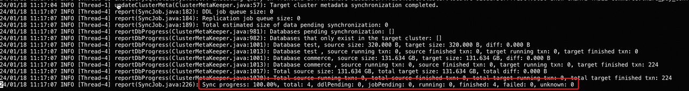
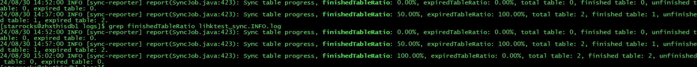

# Cross-cluster Data Migration Tool

The StarRocks Cross-cluster Data Migration Tool is provided by StarRocks Community. You can use this tool to easily migrate data from the source cluster to the target cluster.

:::note

- The StarRocks Cross-cluster Data Migration Tool only supports migrating data from a shared-nothing cluster to either another shared-nothing cluster or a shared-data cluster.
- The StarRocks version of the target cluster must be v3.1.8, v3.2.3, or later.

:::

## Preparations

The following preparations must be performed on the target cluster for data migration.

### Enable Legacy Compatibility for Replication

StarRocks may behave differently between the old and new versions, causing problems during cross-cluster data migration. Therefore, you must enable Legacy Compatibility for the target cluster before data migration and disable it after data migration is completed.

1. You can check whether Legacy Compatibility for Replication is enabled by using the following statement:

   ```SQL
   ADMIN SHOW FRONTEND CONFIG LIKE 'enable_legacy_compatibility_for_replication';
   ```

   If `true` is returned, it indicates that Legacy Compatibility for Replication is enabled.

2. Dynamically enable Legacy Compatibility for Replication:

   ```SQL
   ADMIN SET FRONTEND CONFIG("enable_legacy_compatibility_for_replication"="true");
   ```

3. To prevent Legacy Compatibility for Replication from automatically disabling during the data migration process in case of cluster restart, you also need to add the following configuration item in the FE configuration file **fe.conf**:

   ```Properties
   enable_legacy_compatibility_for_replication = true
   ```

After the data migration is completed, you need to remove the configuration `enable_legacy_compatibility_for_replication = true` from the configuration file, and dynamically disable Legacy Compatibility for Replication using the following statement:

```SQL
ADMIN SET FRONTEND CONFIG("enable_legacy_compatibility_for_replication"="false");
```

### Configure Data Migration (Optional)

You can configure data migration operations using the following FE and BE parameters. In most cases, the default configuration can meet your needs. If you wish to use the default configuration, you can skip this step.

:::note

Please note that increasing the values of the following configuration items can accelerate migration but will also increase the load pressure on the source cluster.

:::

#### FE Parameters

The following FE parameters are dynamic configuration items. Refer to [Configure FE Dynamic Parameters](../administration/management/FE_configuration.md#configure-fe-dynamic-parameters) on how to modify them.

| **Parameter**                         | **Default** | **Unit** | **Description**                                              |
| ------------------------------------- | ----------- | -------- | ------------------------------------------------------------ |
| replication_max_parallel_table_count  | 100         | -        | The maximum number of concurrent data synchronization tasks allowed. StarRocks creates one synchronization task for each table. |
| replication_max_parallel_replica_count| 10240       | -        | The maximum number of tablet replica allowed for concurrent synchronization. |
| replication_max_parallel_data_size_mb | 1048576     | MB       | The maximum size of data allowed for concurrent synchronization. |
| replication_transaction_timeout_sec   | 86400       | Seconds  | The timeout duration for synchronization tasks.              |

#### BE Parameters

The following BE parameter is a dynamic configuration item. Refer to [Configure BE Dynamic Parameters](../administration/management/BE_configuration.md) on how to modify it.

| **Parameter**       | **Default** | **Unit** | **Description**                                              |
| ------------------- | ----------- | -------- | ------------------------------------------------------------ |
| replication_threads | 0           | -        | The number of threads for executing synchronization tasks. `0` indicates setting the number of threads to the 4 times of number of CPU cores on the machine where the BE resides. |

## Step 1: Install the Tool

It is recommended to install the migration tool on the server where the target cluster resides.

1. Launch a terminal, and download the binary package of the tool.

   ```Bash
   wget https://releases.starrocks.io/starrocks/starrocks-cluster-sync.tar.gz
   ```

2. Decompress the package.

   ```Bash
   tar -xvzf starrocks-cluster-sync.tar.gz
   ```

## Step 2: Configure the Tool

### Migration-related configuration

Navigate to the extracted folder and modify the configuration file **conf/sync.properties**.

```Bash
cd starrocks-cluster-sync
vi conf/sync.properties
```

The file content is as follows:

```Properties
# If true, all tables will be synchronized only once, and the program will exit automatically after completion.
one_time_run_mode=false

source_fe_host=
source_fe_query_port=9030
source_cluster_user=root
source_cluster_password=
source_cluster_password_secret_key=
source_cluster_token=

target_fe_host=
target_fe_query_port=9030
target_cluster_user=root
target_cluster_password=
target_cluster_password_secret_key=

# Comma-separated list of database names or table names like <db_name> or <db_name.table_name>
# example: db1,db2.tbl2,db3
# Effective order: 1. include 2. exclude
include_data_list=
exclude_data_list=

# If there are no special requirements, please maintain the default values for the following configurations.
target_cluster_storage_volume=
target_cluster_replication_num=-1
target_cluster_max_disk_used_percent=80

max_replication_data_size_per_job_in_gb=-1

meta_job_interval_seconds=180
meta_job_threads=4
ddl_job_interval_seconds=10
ddl_job_batch_size=10
ddl_job_allow_drop_target_only=false
ddl_job_allow_drop_schema_change_table=true
ddl_job_allow_drop_inconsistent_partition=true
ddl_job_allow_drop_partition_target_only=true
replication_job_interval_seconds=10
replication_job_batch_size=10
report_interval_seconds=300
```

The description of the parameters is as follows:

| **Parameter**                             | **Description**                                              |
| ----------------------------------------- | ------------------------------------------------------------ |
| one_time_run_mode                         | Whether to enable one-time synchronization mode. When one-time synchronization mode is enabled, the migration tool only performs full synchronization instead of incremental synchronization. |
| source_fe_host                            | The IP address or FQDN (Fully Qualified Domain Name) of the source cluster's FE. |
| source_fe_query_port                      | The query port (`query_port`) of the source cluster's FE.    |
| source_cluster_user                       | The username used to log in to the source cluster. This user must be granted the OPERATE privilege on the SYSTEM level. |
| source_cluster_password                   | The user password used to log in to the source cluster.      |
| source_cluster_password_secret_key        | The secret key used to encrypt the password of the login user for the source cluster. The default value is an empty string, which means that the login password is not encrypted. If you want to encrypt `source_cluster_password`, you can get the encrypted `source_cluster_password` string by using SQL statement `SELECT TO_BASE64(AES_ENCRYPT('<source_cluster_password>','<source_cluster_password_ secret_key>'))`. |
| source_cluster_token                      | Token of the source cluster. For information on how to obtain the cluster token, refer to [Obtain Cluster Token](#obtain-cluster-token) below. |
| target_fe_host                            | The IP address or FQDN (Fully Qualified Domain Name) of the target cluster's FE. |
| target_fe_query_port                      | The query port (`query_port`) of the target cluster's FE.    |
| target_cluster_user                       | The username used to log in to the target cluster. This user must be granted the OPERATE privilege on the SYSTEM level. |
| target_cluster_password                   | The user password used to log in to the target cluster.      |
| target_cluster_password_secret_key        | The secret key used to encrypt the password of the login user for the target cluster. The default value is an empty string, which means that the login password is not encrypted. If you want to encrypt `target_cluster_password`, you can get the encrypted `target_cluster_password` string by using SQL statement `SELECT TO_BASE64(AES_ENCRYPT('<target_cluster_password>','<target_cluster_password_ secret_key>'))`. |
| include_data_list                         | The databases and tables that need to be migrated, with multiple objects separated by commas (`,`). For example: `db1, db2.tbl2, db3`. This item takes effect prior to `exclude_data_list`. If you want to migrate all databases and tables in the cluster, you do not need to configure this item. |
| exclude_data_list                         | The databases and tables that do not need to be migrated, with multiple objects separated by commas (`,`). For example: `db1, db2.tbl2, db3`. `include_data_list` takes effect prior to this item. If you want to migrate all databases and tables in the cluster, you do not need to configure this item. |
| target_cluster_storage_volume             | The storage volume used to store tables in the target cluster when the target cluster is a shared-data cluster. If you want to use the default storage volume, you do not need to specify this item. |
| target_cluster_replication_num            | The number of replicas specified when creating tables in the target cluster. If you want to use the same replica number as the source cluster, you do not need to specify this item. |
| target_cluster_max_disk_used_percent      | Disk usage percentage threshold for BE nodes of the target cluster when the target cluster is shared-nothing. Migration is terminated when the disk usage of any BE in the target cluster exceeds this threshold. The default value is `80`, which means 80%. |
| meta_job_interval_seconds                 | The interval, in seconds, at which the migration tool retrieves metadata from the source and target clusters. You can use the default value for this item. |
| meta_job_threads                          | The number of threads used by the migration tool to obtain metadata from the source and target clusters. You can use the default value for this item. |
| ddl_job_interval_seconds                  | The interval, in seconds, at which the migration tool executes DDL statements on the target cluster. You can use the default value for this item. |
| ddl_job_batch_size                        | The batch size for executing DDL statements on the target cluster. You can use the default value for this item. |
| ddl_job_allow_drop_target_only            | Whether to allow the migration tool to delete databases or tables that exist only in the target cluster but not in the source cluster. The default is `false`, which means they will not be deleted. You can use the default value for this item. |
| ddl_job_allow_drop_schema_change_table    | Whether to allow the migration tool to delete tables with inconsistent schemas between the source and target clusters. The default is `true`, meaning they will be deleted. You can use the default value for this item. The migration tool will automatically synchronize the deleted tables during the migration. |
| ddl_job_allow_drop_inconsistent_partition | Whether to allow the migration tool to delete partitions with inconsistent data distribution between the source and target clusters. The default is `true`, meaning they will be deleted. You can use the default value for this item. The migration tool will automatically synchronize the deleted partitions during the migration. |
| ddl_job_allow_drop_partition_target_only  | Whether to allow the migration tool to delete partitions that are deleted in the source cluster to keep the partitions consistent between the source and target clusters. The default is `true`, meaning they will be deleted. You can use the default value for this item. |
| replication_job_interval_seconds          | The interval, in seconds, at which the migration tool triggers data synchronization tasks. You can use the default value for this item. |
| replication_job_batch_size                | The batch size at which the migration tool triggers data synchronization tasks. You can use the default value for this item. |
| max_replication_data_size_per_job_in_gb   | The data size threshold at which the migration tool triggers data synchronization tasks. Unit: GB. Multiple data synchronization tasks will be triggered if the size of the partition to be migrated exceed this value. The default value is `-1`, meaning no limit is imposed, and all partitions in a table will be migrated in a single synchronization task. You can set this parameter to restrict the data size of each task if the table to be migrated has a large data volume. |
| report_interval_seconds                   | The time interval at which the migration tool prints the progress information. Unit: Seconds. Default value: `300`. You can use the default value for this item. |

### Obtain Cluster Token

The Cluster Token is available in the FE metdata. Log in to the server where the FE node is located and run the following command:

```Bash
cat fe/meta/image/VERSION | grep token
```

Output:

```Properties
token=wwwwwwww-xxxx-yyyy-zzzz-uuuuuuuuuu
```

### Network-related configuration (Optional)

During data migration, the migration tool needs to access **all** FE nodes of both the source and target clusters, and the target cluster needs to access **all** BE and CN nodes of the source cluster.

You can obtain the network addresses of these nodes by executing the following statements on the corresponding cluster:

```SQL
-- Obtain the network addresses of FE nodes in a cluster.
SHOW FRONTENDS;
-- Obtain the network addresses of BE nodes in a cluster.
SHOW BACKENDS;
-- Obtain the network addresses of CN nodes in a cluster.
SHOW COMPUTE NODES;
```

If these nodes use private addresses that cannot be accessed outside the cluster, such as internal network addresses within a Kubernetes cluster, you need to map these private addresses to addresses that can be accessed from outside.

Navigate to the extracted folder of the tool and modify the configuration file **conf/hosts.properties**。

```Bash
cd starrocks-cluster-sync
vi conf/hosts.properties
```

The default content of the file is as follows, describing how network address mapping is configured:

```Properties
# <SOURCE/TARGET>_<domain>=<IP>
```

The following example performs these operations:

1. Map the source cluster's private network addresses `192.1.1.1` and `192.1.1.2` to `10.1.1.1` and `10.1.1.2`.
2. Map the target cluster's private network address `fe-0.starrocks.svc.cluster.local` to `10.1.2.1`.

```Properties
# <SOURCE/TARGET>_<domain>=<IP>
SOURCE_192.1.1.1=10.1.1.1
SOURCE_192.1.1.2=10.1.1.2
TARGET_fe-0.starrocks.svc.cluster.local=10.1.2.1
```

## Step 3: Start the Migration Tool

After configuring the tool, start the migration tool to initiate the data migration process.

```Bash
./bin/start.sh
```

:::note

- Make sure that the BE nodes of the source and target clusters can properly communicate via the network.
- During runtime, the migration tool regularly checks whether the data in the target cluster is lagging behind the source cluster. If there is a lag, it initiates data migration tasks.
- If new data is constantly loaded into the source cluster, data synchronization will continue until the data in the target cluster is consistent with that in the source cluster.
- You can query tables in the target cluster during migration, but do not load new data into the tables, as it may result in inconsistencies between the data in the target cluster and the source cluster. Currently, the migration tool does not forbid data loading into the target cluster during migration.
- Note that data migration does not automatically terminate. You need to manually check and confirm the completion of migration and then stop the migration tool.

:::

## View Migration Progress

### View Migration Tool logs

You can check the migration progress through the migration tool log **log/sync.INFO.log**.

Example 1: View task progress.



The important metrics are as follows:

- `Sync job progress`: The progress of data migration. The migration tool regularly checks whether the data in the target cluster is lagging behind the source cluster. Therefore, a progress of 100% only means that the data synchronization is completed within the current check interval. If new data continues to be loaded into the source cluster, the progress may decrease in the next check interval.
- `total`: The total number of all types of jobs in this migration operation.
- `ddlPending`: The number of DDL jobs pending to be executed.
- `jobPending`: The number of pending data synchronization jobs to be executed.
- `sent`: The number of data synchronization jobs sent from the source cluster but not yet started. Theoretically, this value should not be too large. If the value keeps increasing, please contact our engineers.
- `running`: The number of data synchronization jobs that are currently running.
- `finished`: The number of data synchronization jobs that are finished.
- `failed`: The number of failed data synchronization jobs. Failed data synchronization jobs will be resent. Therefore, in most cases, you can ignore this metric. If this value is significantly large, please contact our engineers.
- `unknown`: The number of jobs with an unknown status. Theoretically, this value should always be `0`. If this value is not `0`, please contact our engineers.

Example 2: View the table migration progress.



- `Sync table progress`: Table migration progress, that is, the ratio of tables that have been migrated in this migration task to all the tables that need to be migrated.
- `finishedTableRatio`: Ratio of tables with at least one successful synchronization task execution.
- `expiredTableRatio`: Ratio of tables with expired data.
- `total table`: Total number of tables involved in this data migration progress.
- `finished table`: Number of tables with at least one successful synchronization task execution.
- `unfinished table`: Number of tables with no synchronization task execution.
- `expired table`: Number of tables with expired data.

### View Migration Transaction Status

The migration tool opens a transaction for each table. You can view the status of the migration for a table by checking the status of its corresponding transaction.

```SQL
SHOW PROC "/transactions/<db_name>/running";
```

`<db_name>` is the name of the database where the table is located.

### View Partition Data Versions

You can compare the data versions of the corresponding partitions in the source and target clusters to view the migration status of that partition.

```SQL
SHOW PARTITIONS FROM <table_name>;
```

`<table_name>` is the name of the table to which the partition belongs.

### View Data Volume

You can compare the data volumes in the source and target clusters to view the migration status.

```SQL
SHOW DATA;
```

### View Table Row Count

You can compare the row counts of tables in the source and target clusters to view the migration status of each table.

```SQL
SELECT 
  TABLE_NAME, 
  TABLE_ROWS 
FROM INFORMATION_SCHEMA.TABLES 
WHERE TABLE_TYPE = 'BASE TABLE' 
ORDER BY TABLE_NAME;
```

## Limits

The list of objects that support synchronization currently is as follows (those not included indicate that synchronization is not supported):

- Databases
- Internal tables and their data
- Materialized view schemas and their building statements (The data in the materialized view will not be synchronized. And if the base tables of the materialized view is not synchronized to the target cluster, the background refresh task of the materialized view reports an error.)
- Logical views

## Q&A

### Q1: Which ports need to be opened between clusters?

If you have enabled the firewall, you must open these ports:

| **Component** | **Port**     | **Default** |
| ----------- | -------------- | ----------- |
| FE          | query_port     | 9030 |
| FE          | http_port      | 8030 |
| FE          | rpc_port       | 9020 |
| BE          | be_http_port   | 8040 |
| BE          | be_port        | 9060 |
