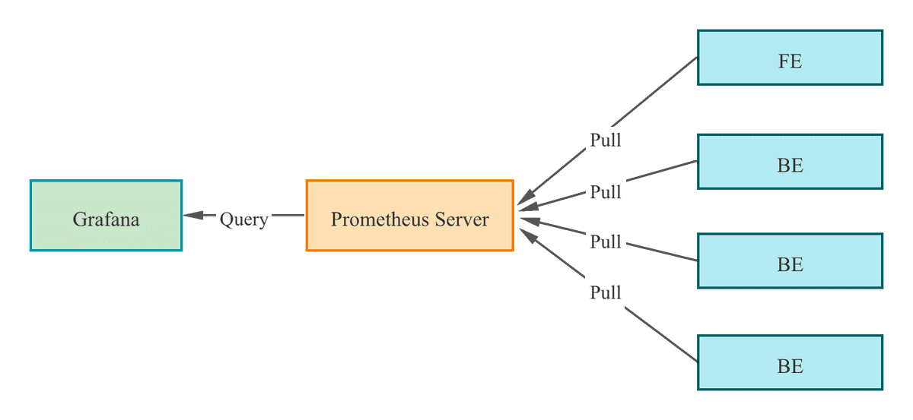
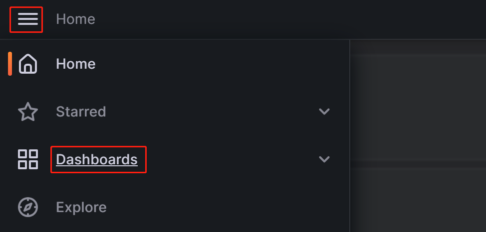
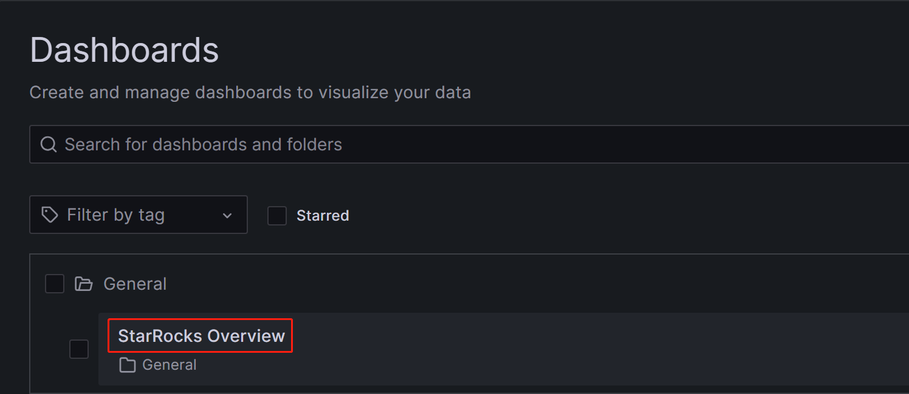
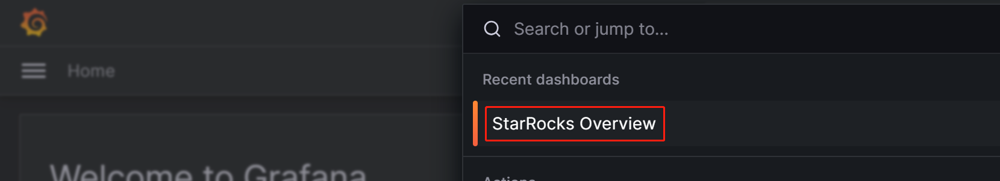
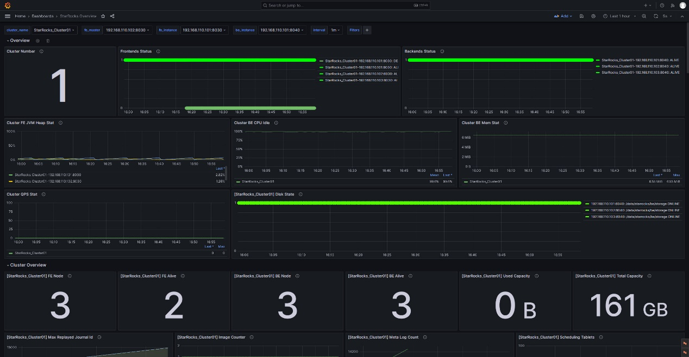
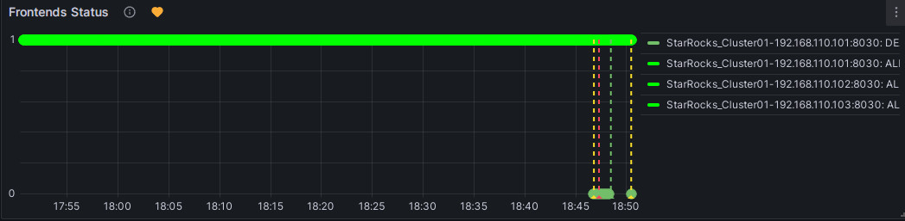

# Monitor and Alert with Prometheus and Grafana

StarRocks provides a monitor and alert solution by using Prometheus and Grafana. This allows you to visualize the running of your cluster, facilitating monitoring and troubleshooting.

## Overview

StarRocks provides a Prometheus-compatible information collection interface. Prometheus can retrieve metric information of StarRocks by connecting to the HTTP ports of BE and FE nodes and storing the information in its own time-series database. Grafana can then use Prometheus as a data source to visualize the metric information. By using the dashboard templates provided by StarRocks, you can easily monitor your StarRocks cluster and set alerts for it with Grafana.



Follow these steps to integrate your StarRocks cluster with Prometheus and Grafana:

1. Install necessary components - Prometheus and Grafana.
2. Understand the core monitoring metrics of StarRocks.
3. Set alert channel and alert rule.

## Step 1: Install Monitoring Components

The default ports of Prometheus and Grafana do not conflict with those of StarRocks. However, it is recommended to deploy them on a different server from that of your StarRocks clusters for production. This reduces the risk of resource conflicts and avoids potential alert failure due to the server's abnormal shutdown.

Additionally, please note that Prometheus and Grafana cannot monitor their own service's availability. Therefore, in a production environment, it is recommended to use Supervisor to set up a heartbeat service for them.

The following tutorial deploys monitoring components on the monitoring node (IP: 192.168.110.23) using the root OS user. They monitor the following StarRocks cluster (which uses default ports). When setting up a monitoring service for your own StarRocks cluster based on this tutorial, you only need to replace the IP addresses.

| **Host** | **IP**          | **OS user** | **Services** |
| -------- | --------------- | --------------- | ------------ |
| node01   | 192.168.110.101 | root            | 1 FE + 1 BE  |
| node02   | 192.168.110.102 | root            | 1 FE + 1 BE  |
| node03   | 192.168.110.103 | root            | 1 FE + 1 BE  |

> **NOTE**
>
> Prometheus and Grafana can only monitor FE, BE, and CN nodes, not Broker nodes.

### 1.1 Deploy Prometheus

#### 1.1.1 Download Prometheus

For StarRocks, you only need to download the installation package of the Prometheus server. Download the package to the monitoring node.

[Click here to download Prometheus](https://prometheus.io/download/).

Take the LTS version v2.45.0 as an example, click the package to download it.


Alternatively, you can download it using the `wget` command:

```Bash
# The following example downloads the LTS version v2.45.0.
# You can download other versions by replacing the version number in the command.
wget https://github.com/prometheus/prometheus/releases/download/v2.45.0/prometheus-2.45.0.linux-amd64.tar.gz
```

After the download is complete, upload or copy the installation package to the directory **/opt** on the monitoring node.

#### 1.1.2 Install Prometheus

1. Navigate to **/opt** and decompress the Prometheus installation package.

   ```Bash
   cd /opt
   tar xvf prometheus-2.45.0.linux-amd64.tar.gz
   ```

2. For ease of management, rename the decompressed directory to **prometheus**.

   ```Bash
   mv prometheus-2.45.0.linux-amd64 prometheus
   ```

3. Create a data storage path for Prometheus.

   ```Bash
   mkdir prometheus/data
   ```

4. For ease of management, you can create a system service startup file for Prometheus.

   ```Bash
   vim /etc/systemd/system/prometheus.service
   ```

   Add the following content to the file:

   ```Properties
   [Unit]
   Description=Prometheus service
   After=network.target

   [Service]
   User=root
   Type=simple
   ExecReload=/bin/sh -c "/bin/kill -1 `/usr/bin/pgrep prometheus`"
   ExecStop=/bin/sh -c "/bin/kill -9 `/usr/bin/pgrep prometheus`"
   ExecStart=/opt/prometheus/prometheus --config.file=/opt/prometheus/prometheus.yml --storage.tsdb.path=/opt/prometheus/data --storage.tsdb.retention.time=30d --storage.tsdb.retention.size=30GB

   [Install]
   WantedBy=multi-user.target
   ```

   Then, save and exit the editor.

   > **NOTE**
   >
   > If you deploy Prometheus under a different path, please make sure to synchronize the path in the ExecStart command in the file above. Additionally, the file configures the expiration conditions for Prometheus data storage to be "30 days or more" or "greater than 30 GB". You can modify this according to your needs.

5. Modify the Prometheus configuration file **prometheus/prometheus.yml**. This file has strict requirements for the format of the content. Please pay special attention to spaces and indentation when making modifications.

   ```Bash
   vim prometheus/prometheus.yml
   ```

   Add the following content to the file:

   ```YAML
   global:
     scrape_interval: 15s # Set the global scrape interval to 15s. The default is 1 min.
     evaluation_interval: 15s # Set the global rule evaluation interval to 15s. The default is 1 min.
   scrape_configs:
     - job_name: 'StarRocks_Cluster01' # A cluster being monitored corresponds to a job. You can customize the StarRocks cluster name here.
       metrics_path: '/metrics'    # Specify the Restful API for retrieving monitoring metrics.
       static_configs:
       # The following configuration specifies an FE group, which includes 3 FE nodes.
       # Here, you need to fill in the IP and HTTP ports corresponding to each FE.
       # If you modified the HTTP ports during cluster deployment, make sure to adjust them accordingly.
         - targets: ['192.168.110.101:8030','192.168.110.102:8030','192.168.110.103:8030']
           labels:
             group: fe
       # The following configuration specifies a BE group, which includes 3 BE nodes.
       # Here, you need to fill in the IP and HTTP ports corresponding to each BE.
       # If you modified the HTTP ports during cluster deployment, make sure to adjust them accordingly.
         - targets: ['192.168.110.101:8040','192.168.110.102:8040','192.168.110.103:8040']
           labels:
             group: be
   ```

   After you have modified the configuration file, you can use `promtool` to verify whether the modification is valid.

   ```Bash
   ./prometheus/promtool check config prometheus/prometheus.yml
   ```

   The following prompt indicates that the check has passed. You can then proceed.

   ```Bash
   SUCCESS: prometheus/prometheus.yml is valid prometheus config file syntax
   ```

6. Start Prometheus.

   ```Bash
   systemctl daemon-reload
   systemctl start prometheus.service
   ```

7. Check the status of Prometheus.

   ```Bash
   systemctl status prometheus.service
   ```

   If `Active: active (running)` is returned, it indicates that Prometheus has started successfully.

   You can also use `netstat` to check the status of the default Prometheus port (9090).

   ```Bash
   netstat -nltp | grep 9090
   ```

8. Set Prometheus to start on boot.

   ```Bash
   systemctl enable prometheus.service
   ```

**Other commands**:

- Stop Prometheus.

  ```Bash
  systemctl stop prometheus.service
  ```

- Restart Prometheus.

  ```Bash
  systemctl restart prometheus.service
  ```

- Reload configurations on runtime.

  ```Bash
  systemctl reload prometheus.service
  ```

- Disable start on boot.

  ```Bash
  systemctl disable prometheus.service
  ```

#### 1.1.3 Access Prometheus

You can access the Prometheus Web UI through a browser, and the default port is 9090. For the monitoring node in this tutorial, you need to visit `192.168.110.23:9090`.

On the Prometheus homepage, navigate to **Status** --> **Targets** in the top menu. Here, you can see all the monitored nodes for each group job configured in the **prometheus.yml** file. Usually, the status of all nodes should be UP, indicating that the service communication is normal.


At this point, Prometheus is configured and set up. For more detailed information, you can refer to the [Prometheus Documentation](https://prometheus.io/docs/).

### 1.2 Deploy Grafana

#### 1.2.1 Download Grafana

[Click here to download Grafana](https://grafana.com/grafana/download).

Alternatively, you can use the `wget` command to download the Grafana RPM installation package.

```Bash
# The following example downloads the LTS version v10.0.3.
# You can download other versions by replacing the version number in the command.
wget https://dl.grafana.com/enterprise/release/grafana-enterprise-10.0.3-1.x86_64.rpm
```

#### 1.2.2 Install Grafana

1. Use the `yum` command to install Grafana. This command will automatically install the dependencies required for Grafana.

   ```Bash
   yum -y install grafana-enterprise-10.0.3-1.x86_64.rpm
   ```

2. Start Grafana.

   ```Bash
   systemctl start grafana-server.service
   ```

3. Check the status of Grafana.

   ```Bash
   systemctl status grafana-server.service
   ```

   If `Active: active (running)` is returned, it indicates that Grafana has started successfully.

   You can also use `netstat` to check the status of the default Grafana port (3000).

   ```Bash
   netstat -nltp | grep 3000
   ```

4. Set Grafana to start on boot.

   ```Bash
   systemctl enable grafana-server.service
   ```

**Other commands**:

- Stop Grafana.

  ```Bash
  systemctl stop grafana-server.service
  ```

- Restart Grafana.

  ```Bash
  systemctl restart grafana-server.service
  ```

- Disable start on boot.

  ```Bash
  systemctl disable grafana-server.service
  ```

For more information, refer to the [Grafana Documentation](https://grafana.com/docs/grafana/latest/).

#### 1.2.3 Access Grafana

You can access the Grafana Web UI through a browser, and the default port is 3000. For the monitoring node in this tutorial, you need to visit `192.168.110.23:3000`. The default username and password required for login are both set to `admin`. Upon the initial login, Grafana will prompt you to change the default login password. If you want to skip this for now, you can click `Skip`. Then, you will be re-directed to the Grafana Web UI homepage.


#### 1.2.4 Configure data sources

Click on the menu button in the upper-left corner, expand **Administration**, and then click **Data sources**.


On the page that appears, click **Add data source**, and then choose **Prometheus**.


To integrate Grafana with your Prometheus service, you need to modify the following configuration:

- **Name**: The name of the data source. You can customize the name for the data source.

  

- **Prometheus Server URL**: The URL of the Prometheus server, which, in this tutorial, is `http://192.168.110.23:9090`.

  

After the configuration is complete, click **Save & Test** to save and test the configuration. If **Successfully queried the Prometheus API** is displayed, it means the data source is accessible.


#### 1.2.5 Configure Dashboard

1. Download the corresponding Dashboard template based on your StarRocks version.

   - [Dashboard template for StarRocks-2.4.0 and later](http://starrocks-thirdparty.oss-cn-zhangjiakou.aliyuncs.com/StarRocks-Overview-24-new.json)
   - [Shared-data dashboard template - General](http://starrocks-thirdparty.oss-cn-zhangjiakou.aliyuncs.com/StarRocks-Shared_data-General.json)
   - [Shared-data dashboard template - Starlet](http://starrocks-thirdparty.oss-cn-zhangjiakou.aliyuncs.com/StarRocks-Shared_data-Starlet.json)

   > **NOTE**
   >
   > The template file needs to be uploaded through the Grafana Web UI. Therefore, you need to download the template file to the machine you use to access Grafana, not the monitoring node itself.

2. Configure the Dashboard template.

   Click on the menu button in the upper-left corner and click **Dashboards**.

   

   On the page that appears, expand the **New** button and click **Import**.

   

   On the new page, click on **Upload Dashboard JSON file** and upload the template file you downloaded earlier.

   

    After uploading the file, you can rename the Dashboard. By default, it is named `StarRocks Overview`. Then, select the data source, which is the one you created earlier (`starrocks_monitor`). Then, click **Import**.

   

   After the import is complete, you should see the StarRocks Dashboard displayed.

   

#### 1.2.6 Monitor StarRocks via Grafana

Log in to the Grafana Web UI, click on the menu button in the upper-left corner, and click **Dashboards**.


On the page that appears, select **StarRocks Overview** from the **General** directory.



After you enter the StarRocks monitoring Dashboard, you can manually refresh the page in the upper-right corner or set the automatic refresh interval for monitoring the StarRocks cluster status.


## Step 2: Understand the core monitoring metrics

To accommodate the needs of development, operations, DBA, and more, StarRocks provides a wide range of monitoring metrics. This section only introduces some important metrics commonly used in business and their alert rules. For other metric details, please refer to [Monitoring Metrics](./metrics.md).

### 2.1 Metrics for FE and BE status

| **Metric**       | **Description**                                              | **Alert rule**                                               | **Note**                                                     |
| ---------------- | ------------------------------------------------------------ | ------------------------------------------------------------ | ------------------------------------------------------------ |
| Frontends Status | FE Node Status. The status of a live node is represented by `1`, while a node that is down (DEAD) will be displayed as `0`. | The status of all FE nodes should be alive, and any FE node with a status of DEAD should trigger an alert. | The failure of any FE or BE nodes is considered critical, and it requires prompt troubleshooting to identify the cause of failure. |
| Backends Status  | BE Node Status. The status of a live node is represented by `1`, while a node that is down (DEAD) will be displayed as `0`. | The status of all BE nodes should be alive, and any BE node with a status of DEAD should trigger an alert. |                                                              |

### 2.2 Metrics for query failure

| **Metric**  | **Description**                                              | **Alert rule**                                               | **Note**                                                     |
| ----------- | ------------------------------------------------------------ | ------------------------------------------------------------ | ------------------------------------------------------------ |
| Query Error | The query failure (including timeout) rate within one minute. Its value is calculated as the number of failed queries in one minute divided by 60 seconds. | You can configure this based on the actual QPS of your business. 0.05, for example, can be used as a preliminary setting. You can adjust it later as needed. | Usually, the query failure rate should be kept low. Setting this threshold to 0.05 means allowing a maximum of 3 failed queries per minute. If you receive the alert from this item, you can check resource utilization or configure the query timeout appropriately. |

### 2.3 Metrics for external operation failure

| **Metric**    | **Description**                           | **Alert rule**                                               | **Note**                                                     |
| ------------- | ----------------------------------------- | ------------------------------------------------------------ | ------------------------------------------------------------ |
| Schema Change | The Schema Change operation failure rate. | Schema Change is a low-frequency operation. You can set this item to send an alert immediately upon failure. | Usually, Schema Change operations should not fail. If an alert is triggered for this item, you can consider increasing the memory limit of Schema Change operations, which is set to 2GB by default. |

### 2.4 Metrics for internal operation failure

| **Metric**          | **Description**                                              | **Alert rule**                                               | **Note**                                                     |
| ------------------- | ------------------------------------------------------------ | ------------------------------------------------------------ | ------------------------------------------------------------ |
| BE Compaction Score | The highest Compaction Score among all BE nodes, indicating the current compaction pressure. | In typical offline scenarios, this value is usually lower than 100. However, when there are a large number of loading tasks, the Compaction Score may increase significantly. In most cases, intervention is required when this value exceeds 800. | Usually, if the Compaction Score is greater than 1000, StarRocks will return an error "Too many versions". In such cases, you may consider reducing the loading concurrency and frequency. |
| Clone               | The tablet clone operation failure rate.                     | You can set this item to send an alert immediately upon failure. | If an alert is triggered for this item, you can check the status of BE nodes, disk status, and network status. |

### 2.5 Metrics for service availability

| **Metric**     | **Description**                                        | **Alert rule**                                               | **Note**                                                     |
| -------------- | ------------------------------------------------------ | ------------------------------------------------------------ | ------------------------------------------------------------ |
| Meta Log Count | The number of BDB metadata log entries on the FE node. | It is recommended to configure this item to trigger an immediate alert if it exceeds 100,000. | By default, the leader FE node triggers a checkpoint to flush the log to disk when the number of logs exceeds 50,000. If this value exceeds 50,000 by a large margin, it usually indicates a checkpoint failure. You can check whether the Xmx heap memory configuration is reasonable in **fe.conf**. |

### 2.6 Metrics for system load

| **Metric**           | **Description**                                              | **Alert rule**                                               | **Note**                                                     |
| -------------------- | ------------------------------------------------------------ | ------------------------------------------------------------ | ------------------------------------------------------------ |
| BE CPU Idle          | CPU idle rate of the BE node.                                | It is recommended to configure this item to trigger an alert if the idle rate is lower than 10% for 30 consecutive seconds. | This item is used to monitor CPU resource bottlenecks. CPU usage can fluctuate significantly, and setting a small polling interval may result in false alerts. Therefore, you need to adjust this item based on the actual business conditions. If you have multiple batch processing tasks or a large number of queries, you may consider setting a lower threshold. |
| BE Mem               | Memory usage for the BE node.                                | It is recommended to configure this item to 90% of the available memory size for each BE. | This value is equivalent to the value of Process Mem, and BE's default memory limit is 90% of the server's memory size (controlled by configuration `mem_limit` in **be.conf**). If you have deployed other services on the same server, be sure to adjust this value to avoid OOM. The alert threshold for this item should be set to 90% of BE's actual memory limit so that you can confirm whether BE memory resources have reached a bottleneck. |
| Disks Avail Capacity | Available disk space ratio (percentage) of the local disks on each BE node. | It is recommended to configure this item to trigger an alert if the value is less than 20%. | It is recommended to reserve sufficient available space for StarRocks based on your business requirements. |
| FE JVM Heap Stat     | JVM heap memory usage percentage for each FE node in the cluster. | It is recommended to configure this item to trigger an alert if the value is greater than or equal to 80%. | If an alert is triggered for this item, it is recommended to increase the Xmx heap memory configuration in **fe.conf**; otherwise, it may affect query efficiency or lead to FE OOM issues. |

## Step 3: Configure alert via Email

### 3.1 Configure SMTP service

Grafana supports various alerting solutions, such as email and webhooks. This tutorial uses email as an example.

To enable email alerting, you first need to configure SMTP information in Grafana, allowing Grafana to send emails to your mailbox. Most commonly used email providers support SMTP services, and you need to enable SMTP service for your email account and obtain an authorization code.

After completing these steps, modify the Grafana configuration file on the node where Grafana is deployed.

```bash
vim /usr/share/grafana/conf/defaults.ini
```

Example:

```Properties
###################### SMTP / Emailing #####################
[smtp]
enabled = true
host = <smtp_server_address_and_port>
user = johndoe@gmail.com
# If the password contains # or ; you have to wrap it with triple quotes.Ex """#password;"""
password = ABCDEFGHIJKLMNOP  # The authorization password obtained after enabling SMTP.
cert_file =
key_file =
skip_verify = true  ## Verify SSL for SMTP server
from_address = johndoe@gmail.com  ## Address used when sending out emails.
from_name = Grafana
ehlo_identity =
startTLS_policy =

[emails]
welcome_email_on_sign_up = false
templates_pattern = emails/*.html, emails/*.txt
content_types = text/html
```

You need to modify the following configuration items:

- `enabled`: Whether to allow Grafana to send email alerts. Set this item to `true`.
- `host`: The SMTP server address and port for your email, separated by a colon (`:`). Example: `smtp.gmail.com:465`.
- `user`: SMTP username.
- `password`: The authorization password obtained after enabling SMTP.
- `skip_verify`: Whether to skip SSL verification for the SMTP server. Set this item to `true`.
- `from_address`: The email address used to send alert emails.

After the configuration is complete, restart Grafana.

```bash
systemctl daemon-reload
systemctl restart grafana-server.service
```

### 3.2 Create alert channel

You need to create an alert channel (Contact Point) in Grafana to specify how to notify contacts when an alert is triggered.

1. Log in to the Grafana Web UI, click on the menu button in the upper-left corner, expand **Alerting**, and select **Contact Points**. On the **Contact points** page, click **Add contact point** to create a new alert channel.

   

2. In the **Name** field, customize the name of the contact point. Then, in the **Integration** dropdown list, select **Email**.

   

3. In the **Addresses** field, enter the email addresses of the contacts to receive the alert. If there are multiple email addresses, separate the addresses using semicolons (`;`), commas (`,`), or line breaks.

   The configurations on the page can be left with their default values except for the following two items:

   - **Single email**: When enabled, if there are multiple contacts, the alert will be sent to them through a single email. It's recommended to enable this item.
   - **Disable resolved message**: By default, when the issue causing the alert is resolved, Grafana sends another notification notifying the service recovery. If you don't need this recovery notification, you can disable this item. It's not recommended to disable this option.

4. After the configuration is complete, click the **Test** button in the upper-right corner of the page. In the prompt that appears, click **Sent test notification**. If your SMTP service and address configuration are correct, the target email account should receive a test email with the subject "TestAlert Grafana". Once you confirm that you can receive the test alert email successfully, click the **Save contact point** button at the bottom of the page to complete the configuration.

   

   

You can configure multiple notification methods for each contact point through "Add contact point integration", which will not be detailed here. For more details about Contact Points, you can refer to the [Grafana Documentation](https://grafana.com/docs/grafana-cloud/alerting-and-irm/alerting/fundamentals/notifications/contact-points/)

For subsequent demonstration, let's assume that in this step, you have created two contact points, "StarRocksDev" and "StarRocksOp", using different email addresses.

### 3.3 Set notification policies

Grafana uses notification policies to associate contact points with alert rules. Notification policies use matching labels to provide a flexible way to route different alerts to different contacts, allowing for alert grouping during O&M.

1. Log in to the Grafana Web UI, click on the menu button in the upper-left corner, expand **Alerting**, and select **Notification policies**.

   

2. On the **Notification policies** page, click the more (**...**) icon to the right of **Default policy** and click **Edit** to modify the Default policy.

   

   

   Notification policies use a tree-like structure, and the Default policy represents the default root policy for notification. When no other policies are set, all alert rules will default to matching this policy. It will then use the default contact point configured within it for notifications.

   1. In the **Default contact point** field, select the contact point you created previously, for example, "StarRocksOp".

   2. **Group by** is a key concept in Grafana Alerting, grouping alert instances with similar characteristics into a single funnel. This tutorial does not involve grouping, and you can use the default setting.

      

   3. Expand the **Timing options** field and configure **Group wait**, **Group interval**, and **Repeat interval**.

      - **Group wait**: The time waiting for the initial notification to send after the new alert creates a new group. Default 30 seconds.
      - **Group interval**: The interval at which alerts are sent for an existing group. Defaults to 5 minutes, which means that notifications will not be sent to this group any sooner than 5 minutes since the previous alert was sent. This means that notifications will not be sent any sooner than 5 minutes (default) since the last batch of updates were delivered, regardless of whether the alert rule interval for those alert instances was lower. Default 5 minutes.
      - **Repeat interval**: The waiting time to resend an alert after they have successfully been sent. The interval at which alerts are sent for an existing group. Defaults to 5 minutes, which means that notifications will not be sent to this group any sooner than 5 minutes since the previous alert was sent.

      You can configure the parameters as shown below so that Grafana will send the alert by these rules: 0 seconds (Group wait) after the **alert conditions are met**, Grafana will send the first alert email. After that, Grafana will re-send the alert every 1 minute (Group interval + Repeat interval).

      

      > **NOTE**
      >
      > The previous paragraph uses "meeting the alert conditions" rather than "reaching the alert threshold" to avoid false alerts. It's recommended to set the alert to be triggered a certain duration of time after the threshold has been reached.

3. After the configuration is complete, click **Update default policy**.

4. If you need to create a nested policy, click on **New nested policy** on the **Notification policies** page.

   Nested policies use labels to define matching rules. The labels defined in a nested policy can be used as conditions to match when configuring alert rules later. The following example configures a label as `Group=Development_team`.

   

   In the **Contact point** field, select "StarRocksDev". This way, when configuring alert rules with the label `Group=Development_team`, "StarRocksDev" is set to receive the alerts.

   You can have the nested policy inherit the timing options from the parent policy. After the configuration is complete, click **Save policy** to save the policy.

   

If you are interested in the details of notification policies or if your business has more complex alerting scenarios, you can refer to the [Grafana Documentation](https://grafana.com/docs/grafana-cloud/alerting-and-irm/alerting/fundamentals/notifications/contact-points/) for more information.

### 3.4 Define alert rules

After setting up notification policies, you also need to define alert rules for StarRocks.

Log in to the Grafana Web UI, and search for and navigate to the previously configured StarRocks Overview Dashboard.





#### 3.4.1 FE and BE status alert rule

For a StarRocks cluster, the status of all FE and BE nodes must be alive. Any node with a status of DEAD should trigger an alert.

The following example uses the Frontends Status and Backends Status metrics under StarRocks Overview to monitor FE and BE status. As you can configure multiple StarRocks clusters in Prometheus, note that the Frontends Status and Backends Status metrics are for all clusters that you have registered.

##### Configure the alert rule for FE

Follow these procedures to configure alerts for **Frontends Status**:

1. Click on the More (...) icon to the right of the **Frontends Status** monitoring item, and click **Edit**.

   

2. On the new page, choose **Alert**, then click **Create alert rule** from this panel to enter the rule creation page.

   

3. Set the rule name in the **Rule name** field. The default value is the title of the monitoring metric. If you have multiple clusters, you can add the cluster name as a prefix for differentiation, for example, "[PROD]Frontends Status".

   

4. Configure the alert rule as follows.

   1. Choose **Grafana managed alert**.
   2. For section **B**, modify the rule as `(up{group="fe"})`.
   3. Click on the delete icon on the right of section **A** to remove section **A**.
   4. For section **C**, modify the **Input** field to **B**.
   5. For section **D**, modify the condition to `IS BELOW 1`.

   After completing these settings, the page will appear as shown below:

   

   <details>
     <summary>Click to view detailed instructions</summary>

   Configuring alert rules in Grafana typically involves three steps:

   1. Retrieve the metric values from Prometheus through PromQL queries. PromQL is a data query DSL language developed by Prometheus, and it is also used in the JSON templates of Dashboards. The `expr` property of each monitoring item corresponds to the respective PromQL. You can click **Run queries** on the rule settings page to view the query results.
   2. Apply functions and modes to process the result data from the above queries. Usually, you need to use the Last function to retrieve the latest value and use Strict mode to ensure that if the returned value is non-numeric data, it can be displayed as `NaN`.
   3. Set rules for the processed query results. Taking FE as an example, if the FE node status is alive, the output result is `1`. If the FE node is down, the result is `0`. Therefore, you can set the rule to `IS BELOW 1`, meaning an alert will be triggered when this condition occurs.
   </details>

5. Set up alert evaluation rules.

   According to the Grafana documentation, you need to configure the frequency for evaluating alert rules and the frequency at which their status changes. In simple terms, this involves configuring "how often to check with the alert rules" and "how long the abnormal state must persist after detection before triggering the alert (to avoid false alerts caused by transient spikes)". Each Evaluation group contains an independent evaluation interval to determine the frequency of checking the alert rules. You can create a new folder named **PROD** specifically for the StarRocks production cluster and create a new Evaluation group `01` within it. Then, configure this group to check every `10` seconds, and trigger the alert if the anomaly persists for `30` seconds.

   

   > **NOTE**
   >
   > The previously mentioned "Disable resolved message" option in the alert channel configuration section, which controls the timing of sending emails for cluster service recovery, is also influenced by the "Evaluate every" parameter above. In other words, when Grafana performs a new check and detects that the service has recovered, it sends an email to notify the contacts.

6. Add alert annotations.

   In the **Add details for your alert rule** section, click **Add annotation** to configure the content of the alert email. Please note not to modify the **Dashboard UID** and **Panel ID** fields.

   

   In the **Choose** drop-down list, select **Description**, and add the descriptive content for the alert email, for example, "FE node in your StarRocks production cluster failed, please check!"

7. Match notification policies.

   Specify the notification policy for the alert rule. By default, all alert rules match the Default policy. When the alert condition is met, Grafana will use the "StarRocksOp" contact point in the Default policy to send alert messages to the configured email group.

   

   If you want to use a nested policy, set the **Label** field to the corresponding nested policy, for example, `Group=Development_team`.

   Example:

   

   When the alert condition is met, emails will be sent to "StarRocksDev" instead of "StarRocksOp" in the Default policy.

8. Once all configurations are complete, click **Save rule and exit**.

   

##### Test alert trigger

You can manually stop an FE node to test the alert. At this point, the heart-shaped symbol to the right of Frontends Status will change from green to yellow and then to red.

**Green**: Indicates that during the last periodic check, the status of each instance of the metric item was normal, and no alert was triggered. The green status does not guarantee that the current node is in normal status. There may be a delay in status change after a node service anomaly, but typically, the delay is not in the order of minutes.


**Yellow**: Indicates that during the last periodic check, an instance of the metric item was found abnormal, but the abnormal state duration has not yet reached the "Duration" configured above. At this point, Grafana will not send an alert and will continue periodic checks until the abnormal state duration reaches the configured "Duration". During this period, if the status is restored, the symbol will change back to green.



**Red**: When the abnormal state duration reaches the configured "Duration", the symbol changes to red, and Grafana will send an email alert. The symbol will remain red until the abnormal state is resolved, at which point it will change back to green.


##### Manually pause Alerts

Suppose the anomaly requires an extended period for resolution or the alerts are continuously triggered for some reasons other than anomaly. You can temporarily pause the evaluation of the alert rule to prevent Grafana from persistently sending alert emails.

Navigate to the Alert tab corresponding to the metric item on the Dashboard and click the edit icon:


In the **Alert Evaluation Behavior** section, toggle the **Pause Evaluation** switch to the ON position.


> **NOTE**
>
> After pausing the evaluation, you will receive an email notifying you that the service is restored.

##### Configure the alert rule for BE

You can follow the above process to configure alert rules for BE.

Editing the configuration for the metric item Backends Status:

1. In the **Set an alert rule name** section, configure the name as "[PROD]Backends Status".
2. In the **Set a query and alert condition** section, set PromSQL to `(up{group="be"})`, and use the same settings as those in the FE alert rule for other items.
3. In the **Alert evaluation behavior** section, choose the **PROD** directory and Evaluation group **01** created earlier, and set the duration to 30 seconds.
4. In the **Add details for your alert rule** section, click **Add annotation**, select **Description**, and input the alert content, for example, "BE node in your StarRocks production cluster failed, please check! Stack information for BE failure will be printed in the BE log file **be.out**. You can identify the cause based on the logs".
5. In the **Notifications** section, configure **Labels** the same as the FE alert rule. If Labels are not configured, Grafana will use the Default policy and send alert emails to the "StarRocksOp" alert channel.

#### 3.4.2 Query alert rule

The metric item for query failures is **Query Error** under **Query Statistic**.

Configure the alert rule for the metric item "Query Error" as follows:

1. In the **Set an alert rule name** section, configure the name as "[PROD] Query Error".
2. In the **Set a query and alert condition** section, remove section **B**. Set **Input** in section **A** to **C**. In section **C**, use the default value for PromQL, which is `rate(starrocks_fe_query_err{job="StarRocks_Cluster01"}[1m])`, representing the number of failed queries per minute divided by 60s. This includes both failed queries and queries that exceeded the timeout limit. Then, in section **D**, configure the rule as `A IS ABOVE 0.05`.
3. In the **Alert evaluation behavior** section, choose the **PROD** directory and Evaluation group **01** created earlier, and set the duration to 30 seconds.
4. In the **Add details for your alert rule** section, click **Add annotation**, select **Description**, and input the alert content, for example, "High query failure rate, please check the resource usage or configure query timeout reasonably. If queries are failing due to timeouts, you can adjust the query timeout by setting the system variable `query_timeout`".
5. In the **Notifications** section, configure **Labels** the same as the FE alert rule. If Labels are not configured, Grafana will use the Default policy and send alert emails to the "StarRocksOp" alert channel.

#### 3.4.3 User operation failure alert rule

This item monitors the rate of Schema Change operation failures, corresponding to the metric item **Schema Change** under **BE tasks**. It should be configured to alert when greater than 0.

1. In the **Set an alert rule name** section, configure the name as "[PROD] Schema Change".
2. In the **Set a query and alert condition** section, remove section **A**. Set **Input** in section **C** to **B**. In section **B**, use the default value for PromQL, which is `irate(starrocks_be_engine_requests_total{job="StarRocks_Cluster01", type="create_rollup", status="failed"}[1m])`, representing the number of failed Schema Change tasks per minute divided by 60s. Then, in section **D**, configure the rule as `C IS ABOVE 0`.
3. In the **Alert evaluation behavior** section, choose the **PROD** directory and Evaluation group **01** created earlier, and set the duration to 30 seconds.
4. In the **Add details for your alert rule** section, click **Add annotation**, select **Description**, and input the alert content, for example, "Failed Schema Change tasks detected, please check promptly. You can increase the memory limit available for Schema Change by adjusting the BE configuration parameter `memory_limitation_per_thread_for_schema_change`, which is set to 2GB by default".
5. In the **Notifications** section, configure **Labels** the same as the FE alert rule. If Labels are not configured, Grafana will use the Default policy and send alert emails to the "StarRocksOp" alert channel.

#### 3.4.4 StarRocks operation failure alert rule

##### BE Compaction Score

This item corresponds to **BE Compaction Score** under **Cluster Overview**, and is used to monitor the compaction pressure on the cluster.

1. In the **Set an alert rule name** section, configure the name as "[PROD] BE Compaction Score".
2. In the **Set a query and alert condition** section, configure the rule in section C as `B IS ABOVE 0`. You can use default values for other items.
3. In the **Alert evaluation behavior** section, choose the **PROD** directory and Evaluation group **01** created earlier, and set the duration to 30 seconds.
4. In the **Add details for your alert rule** section, click **Add annotation**, select **Description**, and input the alert content, for example, "High compaction pressure. Please check whether there are high-frequency or high-concurrency loading tasks and reduce the loading frequency. If the cluster has sufficient CPU, memory, and I/O resources, consider adjusting the cluster compaction strategy".
5. In the **Notifications** section, configure **Labels** the same as the FE alert rule. If Labels are not configured, Grafana will use the Default policy and send alert emails to the "StarRocksOp" alert channel.

##### Clone

This item corresponds to **Clone** in **BE tasks** and is mainly used to monitor replica balancing or replica repair operations within StarRocks, which usually should not fail.

1. In the **Set an alert rule name** section, configure the name as "[PROD] Clone".
2. In the **Set a query and alert condition** section, remove section A. Set **Input** in section **C** to **B**. In section **B**, use the default value for PromQL, which is `irate(starrocks_be_engine_requests_total{job="StarRocks_Cluster01", type="clone", status="failed"}[1m])`, representing the number of failed Clone tasks per minute divided by 60s. Then, in section **D**, configure the rule as `C IS ABOVE 0`.
3. In the **Alert evaluation behavior** section, choose the **PROD** directory and Evaluation group **01** created earlier, and set the duration to 30 seconds.
4. In the **Add details for your alert rule** section, click **Add annotation**, select **Description**, and input the alert content, for example, "Detected a failure in the clone task. Please check the cluster BE status, disk status, and network status".
5. In the **Notifications** section, configure **Labels** the same as the FE alert rule. If Labels are not configured, Grafana will use the Default policy and send alert emails to the "StarRocksOp" alert channel.

#### 3.4.5 Service availability alert rule

This item monitors the metadata log count in BDB, corresponding to the **Meta Log Count** monitoring item under **Cluster Overview**.

1. In the **Set an alert rule name** section, configure the name as "[PROD] Meta Log Count".
2. In the **Set a query and alert condition** section, configure the rule in section **C** as `B IS ABOVE 100000`. You can use default values for other items.
3. In the **Alert evaluation behavior** section, choose the **PROD** directory and Evaluation group **01** created earlier, and set the duration to 30 seconds.
4. In the **Add details for your alert rule** section, click **Add annotation**, select **Description**, and input the alert content, for example, "Detected that the metadata count in FE BDB is significantly higher than the expected value, which can indicate a failed Checkpoint operation. Please check whether the Xmx heap memory configuration in the FE configuration file **fe.conf** is reasonable".
5. In the **Notifications** section, configure **Labels** the same as the FE alert rule. If Labels are not configured, Grafana will use the Default policy and send alert emails to the "StarRocksOp" alert channel.

#### 3.4.6 System overload alert rule

##### BE CPU Idle

This item monitors the CPU idle rate on BE nodes.

1. In the **Set an alert rule name** section, configure the name as "[PROD] BE CPU Idle".
2. In the **Set a query and alert condition** section, configure the rule in section C as `B IS BELOW 10`. You can use default values for other items.
3. In the **Alert evaluation behavior** section, choose the **PROD** directory and Evaluation group **01** created earlier, and set the duration to 30 seconds.
4. In the **Add details for your alert rule** section, click **Add annotation**, select **Description**, and input the alert content, for example, "Detected that BE CPU load is consistently high. It will impact other tasks in the cluster. Please check whether the cluster is abnormal or if there is a CPU resource bottleneck".
5. In the **Notifications** section, configure **Labels** the same as the FE alert rule. If Labels are not configured, Grafana will use the Default policy and send alert emails to the "StarRocksOp" alert channel.

##### BE Memory

This item corresponds to **BE Mem** under **BE**, monitoring the memory usage on BE nodes.

1. In the **Set an alert rule name** section, configure the name as "[PROD] BE Mem".
2. In the **Set a query and alert condition** section, configure PromSQL as `starrocks_be_process_mem_bytes{job="StarRocks_Cluster01"}/(<be_mem_limit>*1024*1024*1024)`, where `<be_mem_limit>` needs to be replaced with the current BE node's available memory limit, that is, the server's memory size multiplied by the value of the BE configuration item `mem_limit`. Example: `starrocks_be_process_mem_bytes{job="StarRocks_Cluster01"}/(49*1024*1024*1024)`. Then, in section **C**, configure the rule as `B IS ABOVE 0.9`.
3. In the **Alert evaluation behavior** section, choose the **PROD** directory and Evaluation group **01** created earlier, and set the duration to 30 seconds.
4. In the **Add details for your alert rule** section, click **Add annotation**, select **Description**, and input the alert content, for example, "Detected that BE memory usage is consistently high. To prevent query failure, please consider expanding memory size or adding BE nodes".
5. In the **Notifications** section, configure **Labels** the same as the FE alert rule. If Labels are not configured, Grafana will use the Default policy and send alert emails to the "StarRocksOp" alert channel.

##### Disks Avail Capacity

This item corresponds to **Disk Usage** under **BE**, monitoring the remaining space ratio in the directory where the BE storage path is located.

1. In the **Set an alert rule name** section, configure the name as "[PROD] Disks Avail Capacity".
2. In the **Set a query and alert condition** section, configure the rule in section **C** as `B`` IS BELOW 0.2`. You can use default values for other items.
3. In the **Alert evaluation behavior** section, choose the **PROD** directory and Evaluation group **01** created earlier, and set the duration to 30 seconds.
4. In the **Add details for your alert rule** section, click **Add annotation**, select **Description**, and input the alert content, for example, "Detected that BE disk available space is below 20%, please release disk space or expand the disk".
5. In the **Notifications** section, configure **Labels** the same as the FE alert rule. If Labels are not configured, Grafana will use the Default policy and send alert emails to the "StarRocksOp" alert channel.

##### FE JVM Heap Stat

This item corresponds to **Cluster FE JVM Heap Stat** under **Overview**, monitoring the proportion of FE's JVM memory usage to FE heap memory limit.

1. In the **Set an alert rule name** section, configure the name as "[PROD] FE JVM Heap Stat".
2. In the **Set a query and alert condition** section, configure the rule in section **C** as `B IS ABOVE 80`. You can use default values for other items.
3. In the **Alert evaluation behavior** section, choose the **PROD** directory and Evaluation group **01** created earlier, and set the duration to 30 seconds.
4. In the **Add details for your alert rule** section, click **Add annotation**, select **Description**, and input the alert content, for example, "Detected that FE heap memory usage is high, please adjust the heap memory limit in the FE configuration file **fe.conf**".
5. In the **Notifications** section, configure **Labels** the same as the FE alert rule. If Labels are not configured, Grafana will use the Default policy and send alert emails to the "StarRocksOp" alert channel.

## Q&A

### Q: Why can't the Dashboard detect anomalies?

A: Grafana Dashboard relies on the system time of the server it is hosted on to fetch values for monitoring items. If the Grafana Dashboard page remains unchanged after a cluster anomaly, you can check if the servers' system clock is synchronized and then perform cluster time calibration.

### Q: How can I implement alert grading?

A: Taking the Query Error item as an example, you can create two alert rules for it with different alert thresholds. For example:

- **Risk Level**: Set the failure rate greater than 0.05, indicating a risk. Send the alert to the development team.
- **Severity Level**: Set the failure rate greater than 0.20, indicating a severity. At this point, the alert notification will be sent to both the development and operations teams simultaneously.
