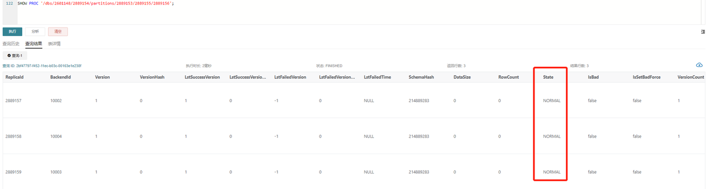
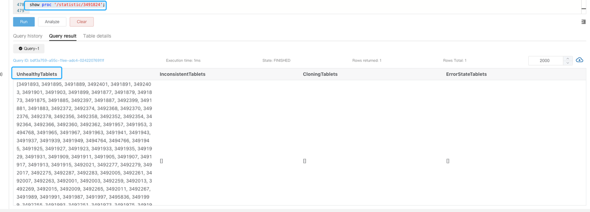
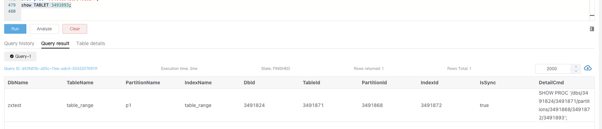
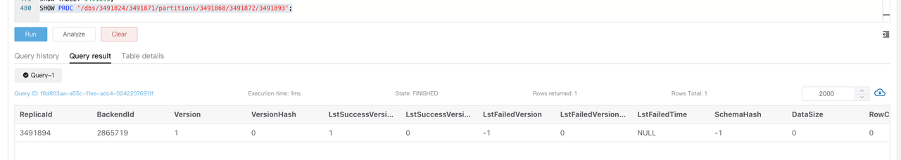

# Manage Alerts

This topic introduces various alert items from different dimensions, including business continuity, cluster availability, and machine load, and provides corresponding resolutions.

:::note

In the following examples, all variables are prefixed with `$`. They should be replaced according to your business environment. For example, `$job_name` should be replaced with the corresponding Job Name in the Prometheus configuration, and `$fe_leader` should be replaced with the IP address of the Leader FE.

:::

## Service Suspension Alerts

### FE Service Suspension

**PromSQL**

```Plain
count(up{group="fe", job="$job_name"}) >= 3
```

**Alert Description**

An alert is triggered when the number of active FE nodes falls below a specified value. You can adjust this value based on the actual number of FE nodes.

**Resolution**

Try to restart the suspended FE node.

### BE Service Suspension

**PromSQL**

```Plain
node_info{type="be_node_num", job="$job_name",state="dead"} > 1
```

**Alert Description**

An alert is triggered when more than one BE node is suspended.

**Resolution**

Try to restart the suspended BE node.

## Machine Load Alerts

### BE CPU Alert

**PromSQL**

```Plain
(1-(sum(rate(starrocks_be_cpu{mode="idle", job="$job_name",instance=~".*"}[5m])) by (job, instance)) / (sum(rate(starrocks_be_cpu{job="$job_name",host=~".*"}[5m])) by (job, instance))) * 100 > 90
```

**Alert Description**

An alert is triggered when BE CPU Utilization exceeds 90%.

**Resolution**

Check whether there are large queries or large-scale data loading and forward the details to the support team for further investigation.

1. Use the `top` command to check resource usage by processes.

   ```Bash
   top -Hp $be_pid
   ```

2. Use the `perf` command to collect and analyze performance data.

   ```Bash
   # Execute the command for 1-2 minutes, and terminate it by pressing CTRL+C.
   sudo perf top -p $be_pid -g >/tmp/perf.txt
   ```

:::note

In emergencies, to quickly restore service, you can try to restart the corresponding BE node after preserving the stack. An emergency here refers to a situation where the BE node's CPU utilization remains abnormally high, and no effective means are available to reduce CPU usage.

:::

### Memory Alert

**PromSQL**

```Plain
(1-node_memory_MemAvailable_bytes{instance=~".*"}/node_memory_MemTotal_bytes{instance=~".*"})*100 > 90
```

**Alert Description**

An alert is triggered when memory usage exceeds 90%.

**Resolution**

Refer to the [Get Heap Profile](https://github.com/StarRocks/starrocks/pull/35322) for troubleshooting.

:::note

- In emergencies, you can try to restart the corresponding BE service to restore the service. An emergency here refers to a situation where the BE node's memory usage remains abnormally high, and no effective means are available to reduce memory usage.
- If other mixed-deployed services are affecting the system, you may consider terminating those services in emergencies.

:::

### Disk Alerts

#### Disk Load Alert

**PromSQL**

```SQL
rate(node_disk_io_time_seconds_total{instance=~".*"}[1m]) * 100 > 90
```

**Alert Description**

An alert is triggered when disk load exceeds 90%.

**Resolution**

If the cluster triggers a `node_disk_io_time_seconds_total` alert, first check if there are any business changes. If so, consider rolling back the changes to maintain the previous resource balance. If no changes are identified or rollback is not possible, consider whether normal business growth is driving the need for resource expansion. You can use the `iotop` tool to analyze disk I/O usage. `iotop` has a UI similar to `top` and includes information such as `pid`, `user`, and I/O.

You can also use the following SQL query to identify the tablets consuming significant I/O and trace them back to specific tasks and tables.

```SQL
-- "all" indicates all services. 10 indicates the collection lasts 10 seconds. 3 indicates fetching the top 3 results.
ADMIN EXECUTE ON $backend_id 'System.print(ExecEnv.io_profile_and_get_topn_stats("all", 10, 3))';
```

#### Root Path Capacity Alert

**PromSQL**

```SQL
node_filesystem_free_bytes{mountpoint="/"} /1024/1024/1024 < 5
```

**Alert Description**

An alert is triggered when the available space in the root directory is less than 5GB.

**Resolution**

Common directories that may occupy significant space include **/var**, **/****opt**, and **/tmp**. Use the following command to check for large files and clear unnecessary files.

```Bash
du -sh / --max-depth=1
```

#### Data Disk Capacity Alert

**PromSQL**

```Bash
(SUM(starrocks_be_disks_total_capacity{job="$job"}) by (host, path) - SUM(starrocks_be_disks_avail_capacity{job="$job"}) by (host, path)) / SUM(starrocks_be_disks_total_capacity{job="$job"}) by (host, path) * 100 > 90
```

**Alert Description**

An alert is triggered when disk capacity utilization exceeds 90%.

**Resolution**

1. Check if there have been changes in the loaded data volume.

   Monitor the `load_bytes` metric in Grafana. If there has been a significant increase in data loading volume, you may need to scale the system resources.

2. Check for any DROP operations.

   If data loading volume has not changed much, run `SHOW BACKENDS`. If the reported disk usage does not match the actual usage, check the FE Audit Log for recent DROP DATABASE, TABLE, or PARTITION operations.

   Metadata for these operations remains in FE memory for one day, allowing you to restore data using the RECOVER statement within 24 hours to avoid misoperations. After recovery, the actual disk usage may exceed what is shown in `SHOW BACKENDS`.

   The retention period of deleted data in memory can be adjusted using the FE dynamic parameter `catalog_trash_expire_second` (default value: 86400).

   ```Bash
   ADMIN SET FRONTEND CONFIG ("catalog_trash_expire_second"="86400");
   ```

   To persist this change, add the configuration item to the FE configuration file **fe.conf**.

   After that, deleted data will be moved to the **trash** directory on BE nodes (`$storage_root_path/trash`). By default, deleted data is kept in the **trash** directory for one day, which may also result in the actual disk usage exceeding what is shown in `SHOW BACKENDS`.

   The retention time of deleted data in the **trash** directory can be adjusted using the BE dynamic parameter `trash_file_expire_time_sec` (default value: 86400).

   ```Bash
   curl http://$be_ip:$be_http_port/api/update_config?trash_file_expire_time_sec=86400
   ```

#### FE Metadata Disk Capacity Alert

**PromSQL**

```Bash
node_filesystem_free_bytes{mountpoint="${meta_path}"} /1024/1024/1024 < 10
```

**Alert Description**

An alert is triggered when the available disk space for FE metadata is less than 10GB.

**Resolution**

Use the following commands to check for directories occupying large amounts of space and clear unnecessary files. The metadata path is specified by the `meta_dir` configuration in **fe.conf**.

```Bash
du -sh /${meta_dir} --max-depth=1
```

If the metadata directory occupies a lot of space, it is usually because the **bdb** directory is large, possibly due to CheckPoint failure. Refer to the [CheckPoint Failure Alert](#checkpoint-failure-alert) for troubleshooting. If this method does not solve the issue, contact the technical support team.

## Cluster Service Exception Alerts

### Compaction Failure Alerts

#### Cumulative Compaction Failure Alert

**PromSQL**

```Bash
increase(starrocks_be_engine_requests_total{job="$job_name" ,status="failed",type="cumulative_compaction"}[1m]) > 3
increase(starrocks_be_engine_requests_total{job="$job_name" ,status="failed",type="base_compaction"}[1m]) > 3
```

**Alert Description**

An alert is triggered when there are three failures in Cumulative Compaction or Base Compaction within the last minute.

**Resolution**

Search the log of the corresponding BE node for the following keywords to identify the involved tablet.

```Bash
grep -E 'compaction' be.INFO | grep failed
```

A log record like the following indicates a Compaction failure.

```Plain
W0924 17:52:56:537041 123639 comaction_task_cpp:193] compaction task:8482. tablet:8423674 failed.
```

You can check the context of the log to analyze the failure. Typically, the failure may have been caused by a DROP TABLE or PARTITION operation during the Compaction process. The system has an internal retry mechanism for Compaction, and you can also manually set the tablet's status to BAD and trigger a Clone task to repair it.

:::note

Before performing the following operation, ensure that the table has at least three complete replicas.

:::

```Bash
ADMIN SET REPLICA STATUS PROPERTIES("tablet_id" = "$tablet_id", "backend_id" = "$backend_id", "status" = "bad");
```

#### High Compaction Pressure Alert

**PromSQL**

```Bash
starrocks_fe_max_tablet_compaction_score{job="$job_name",instance="$fe_leader"} > 100
```

**Alert Description**

An alert is triggered when the highest Compaction Score exceeds 100, indicating high Compaction pressure.

**Resolution**

This alert is typically caused by frequent loading, `INSERT INTO VALUES`, or `DELETE` operations (at a rate of 1 per second). It is recommended to set the interval between loading or DELETE tasks to more than 5 seconds and avoid submitting high-concurrency DELETE tasks.

#### Exceeding Version Count Alert

**PromSQL**

```Bash
starrocks_be_max_tablet_rowset_num{job="$job_name"} > 700
```

**Alert Description**

An alert is triggered when a tablet on a BE node has more than 700 data versions.

**Resolution**

Use the following command to check the tablet with excessive versions:

```SQL
SELECT BE_ID,TABLET_ID FROM information_schema.be_tablets WHERE NUM_ROWSET>700;
```

Example for Tablet with ID `2889156`:

```SQL
SHOW TABLET 2889156;
```

Execute the command returned in the `DetailCmd` field:

```SQL
SHOW PROC '/dbs/2601148/2889154/partitions/2889153/2889155/2889156';
```



Under normal circumstances, as shown, all three replicas should be in `NORMAL` status, and other metrics like `RowCount` and `DataSize` should remain consistent. If only one replica exceeds the version limit of 700, you can trigger a Clone task based on other replicas using the following command:

```SQL
ADMIN SET REPLICA STATUS PROPERTIES("tablet_id" = "$tablet_id", "backend_id" = "$backend_id", "status" = "bad");
```

If two or more replicas exceed the version limit, you can temporarily increase the version count limit:

```Bash
# Replace be_ip with the IP of the BE node which stores the tablet that exceeds the version limit.
# The default be_http_port is 8040.
# The default value of tablet_max_versions is 1000.
curl -XPOST http://$be_ip:$be_http_port/api/update_config?tablet_max_versions=2000
```

### CheckPoint Failure Alert

**PromSQL**

```Bash
starrocks_fe_meta_log_count{job="$job_name",instance="$fe_master"} > 100000
```

**Alert Description**

An alert is triggered when the FE node's BDB log count exceeds 100,000. By default, the system performs a CheckPoint when the BDB log count exceeds 50,000, and then resets the count to 0.

**Resolution**

This alert indicates that a CheckPoint was not performed. You need to investigate the FE logs to analyze the CheckPoint process and resolve the issue:

In the **fe.log** of the Leader FE node, search for records like `begin to generate new image: image.xxxx`. If found, it means the system has started generating a new image. Continue checking the logs for records like `checkpoint finished save image.xxxx` to confirm successful image creation. If you find `Exception when generate new image file`, the image generation failed. You should carefully handle the metadata based on the specific error. It is recommended to contact the support team for further analysis.

### Excessive FE Thread Count Alert

**PromSQL**

```Bash
starrocks_fe_thread_pool{job="$job_name", type!="completed_task_count"} > 3000
```

**Alert Description**

An alert is triggered when the number of threads on the FE exceeds 3000.

**Resolution**

The default thread count limit for FE and BE nodes is 4096. A large number of UNION ALL queries typically lead to an excessive thread count. It is recommended to reduce the concurrency of UNION ALL queries and adjust the system variable `pipeline_dop`. If it is not possible to adjust SQL query granularity, you can globally adjust `pipeline_dop`:

```SQL
SET GLOBAL pipeline_dop=8;
```

:::note

In emergencies, to restore services quickly, you can increase the FE dynamic parameter `thrift_server_max_worker_threads` (default value: 4096).

```SQL
ADMIN SET FRONTEND CONFIG ("thrift_server_max_worker_threads"="8192");
```

:::

### High FE JVM Usage Alert

**PromSQL**

```SQL
sum(jvm_heap_size_bytes{job="$job_name", type="used"}) * 100 / sum(jvm_heap_size_bytes{job="$job_name", type="max"}) > 90
```

**Alert Description**

An alert is triggered when the JVM usage on an FE node exceeds 90%.

**Resolution**

This alert indicates that JVM usage is too high. You can use the `jmap` command to analyze the situation. Since detailed monitoring information for this metric is still under development, direct insights are limited. Perform the following actions and send the results to the support team for analysis:

```Bash
# Note that specifying `live` in the command may cause FE to restart.
jmap -histo[:live] $fe_pid > jmap.dump
```

:::note

In emergencies, to quickly restore services, you can restart the corresponding FE node or increase the JVM (Xmx) size and then restart the FE service.

:::

## Service Availability Alerts

### Loading Exception Alerts

#### Loading Failure Alert

**PromSQL**

```SQL
rate(starrocks_fe_txn_failed{job="$job_name",instance="$fe_master"}[5m]) * 100 > 5
```

**Alert Description**

An alert is triggered when the number of failed loading transactions exceeds 5% of the total.

**Resolution**

Check the logs of the Leader FE node to find information about the loading errors. Search for the keyword `status: ABORTED` to identify failed loading tasks.

```Plain
2024-04-09 18:34:02.363+08:00 INFO (thrift-server-pool-8845163|12111749) [DatabaseTransactionMgr.abortTransaction():1279] transaction:[TransactionState. txn_id: 7398864, label: 967009-2f20a55e-368d-48cf-833a-762cf1fe07c5, db id: 10139, table id list: 155532, callback id: 967009, coordinator: FE: 192.168.2.1, transaction status: ABORTED, error replicas num: 0, replica ids: , prepare time: 1712658795053, commit time: -1, finish time: 1712658842360, total cost: 47307ms, reason: [E1008]Reached timeout=30000ms @192.168.1.1:8060 attachment: RLTaskTxnCommitAttachment [filteredRows=0, loadedRows=0, unselectedRows=0, receivedBytes=1033110486, taskExecutionTimeMs=0, taskId=TUniqueId(hi:3395895943098091727, lo:-8990743770681178171), jobId=967009, progress=KafkaProgress [partitionIdToOffset=2_1211970882|7_1211893755]]] successfully rollback
```

#### Routine Load Consumption Delay Alert

**PromSQL**

```SQL
(sum by (job_name)(starrocks_fe_routine_load_max_lag_of_partition{job="$job_name",instance="$fe_mater"})) > 300000
starrocks_fe_routine_load_jobs{job="$job_name",host="$fe_mater",state="NEED_SCHEDULE"} > 3
starrocks_fe_routine_load_jobs{job="$job_name",host="$fe_mater",state="PAUSED"} > 0
starrocks_fe_routine_load_jobs{job="$job_name",host="$fe_mater",state="UNSTABLE"} > 0
```

**Alert Description**

- An alert is triggered when over 300,000 entries are delayed in consumption.
- An alert is triggered when the number of pending Routine Load tasks exceeds 3.
- An alert is triggered when there are tasks in the `PAUSED` state.
- An alert is triggered when there are tasks in the `UNSTABLE` state.

**Resolution**

1. First, check if the Routine Load task status is `RUNNING`.

   ```SQL
   SHOW ROUTINE LOAD FROM $db;
   ```

   Pay attention to the `State` field in the returned data.

2. If any Routine Load task is in the `PAUSED` state, examine the `ReasonOfStateChanged`, `ErrorLogUrls`, and `TrackingSQL` fields. Typically, executing the SQL query in `TrackingSQL` can reveal the specific error.

   Example:

   

3. If the Routine Load task status is `RUNNING`, you can try to increase the task’s concurrency. The concurrency of individual Routine Load jobs is determined by the minimum value of the following four parameters:

   - `kafka_partition_num`: Number of partitions in the Kafka Topic.
   - `desired_concurrent_number`: The set concurrency for the task.
   - `alive_be_num`: Number of live BE nodes.
   - `max_routine_load_task_concurrent_num`: FE configuration parameter, with a default value of 5.

In most cases, you may need to adjust the task’s concurrency or the number of Kafka Topic partitions (contact Kafka support if necessary).

The following example shows how to set concurrency for the task.

```SQL
ALTER ROUTINE LOAD FOR ${routine_load_jobname}
PROPERTIES
(
    "desired_concurrent_number" = "5"
);
```

#### Loading Transaction Limit Alert for a Single Database

**PromSQL**

```SQL
sum(starrocks_fe_txn_running{job="$job_name"}) by(db) > 900
```

**Alert Description**

An alert is triggered when the number of loading transactions for a single database exceeds 900 (100 in versions prior to v3.1).

**Resolution**

This alert is typically triggered by a large number of newly added loading tasks. You can temporarily increase the limit on loading transactions for a single database.

```SQL
ADMIN SET FRONTEND CONFIG ("max_running_txn_num_per_db" = "2000");
```

### Query Exception Alerts

#### Query Latency Alert

**PromSQL**

```SQL
starrocks_fe_query_latency_ms{job="$job_name", quantile="0.95"} > 5000
```

**Alert Description**

An alert is triggered when the P95 query latency exceeds 5 seconds.

**Resolution**

1. Investigate whether there are any big queries.

   Check whether large queries have consumed significant machine resources during the exception, leading to other queries timing out or failing.

   - Execute `show proc '/current_queries';` to view the `QueryId` of big queries. If you need to quickly restore service, you can use the `KILL` command to terminate the long-running queries.

      ```SQL
      mysql> SHOW PROC '/current_queries';
      +--------------------------------------+--------------+------------+------+-----------+----------------+----------------+------------------+----------+
      | QueryId                              | ConnectionId | Database   | User | ScanBytes | ProcessRows    | CPUCostSeconds | MemoryUsageBytes | ExecTime |
      +--------------------------------------+--------------+------------+------+-----------+----------------+----------------+------------------+----------+
      | 7c56495f-ae8b-11ed-8ebf-00163e00accc | 4            | tpcds_100g | root | 37.88 MB  | 1075769 Rows   | 11.13 Seconds  | 146.70 MB        | 3804     |
      | 7d543160-ae8b-11ed-8ebf-00163e00accc | 6            | tpcds_100g | root | 13.02 GB  | 487873176 Rows | 81.23 Seconds  | 6.37 GB          | 2090     |
      +--------------------------------------+--------------+------------+------+-----------+----------------+----------------+------------------+----------+
      2 rows in set (0.01 sec)
      ```

   - You can also restart the BE nodes with high CPU utilization to resolve the issue.

2. Check if the machine resources are sufficient.

   Verify whether CPU, memory, Disk I/O, and network traffic during the exception are normal. If anomalies are detected, investigate the root cause by examining peak traffic variations and cluster resource usage. If the issue persists, consider restarting the affected node.

:::note

In emergencies, you can resolve the issue by:

- Reducing business traffic and restarting the affected BE node if a sudden traffic spike caused resource overuse and query failure.
- Expanding node capacity if high resource usage is due to normal operations.

:::

#### Query Failure Alert

**PromSQL**

```Plain
sum by (job,instance)(starrocks_fe_query_err_rate{job="$job_name"}) * 100 > 10

# This PromSQL is supported from v3.1.15, v3.2.11, and v3.3.3 onwards.
increase(starrocks_fe_query_internal_err{job="$job_name"})[1m] >10
```

**Alert Description**

An alert is triggered when the query failure rate exceeds 0.1/second or 10 failed queries occur within one minute.

**Resolution**

When this alert is triggered, check the logs to identify the queries that failed.

```Bash
grep 'State=ERR' fe.audit.log
```

If you have the AuditLoader plugin installed, you can locate the corresponding queries using the following query.

```Bash
SELECT stmt FROM starrocks_audit_db__.starrocks_audit_tbl__ WHERE state='ERR';
```

Note that queries that fail due to syntax errors or timeouts are also recorded in `starrocks_fe_query_err_rate`.

For query failures caused by kernel issues, search the `fe.log` for the error and obtain the complete stack trace and [Query Dump](../../../faq/Dump_query.md), and contact the support team for troubleshooting.

#### Query Overload Alert

**PromSQL**

```Bash
abs((sum by (exported_job)(rate(starrocks_fe_query_total{process="FE",job="$job_name"}[3m]))-sum by (exported_job)(rate(starrocks_fe_query_total{process="FE",job="$job_name"}[3m] offset 1m)))/sum by (exported_job)(rate(starrocks_fe_query_total{process="FE",job="$job_name"}[3m]))) * 100 > 100
abs((sum(starrocks_fe_connection_total{job="$job_name"})-sum(starrocks_fe_connection_total{job="$job_name"} offset 3m))/sum(starrocks_fe_connection_total{job="$job_name"})) * 100 > 100
```

**Alert Description**

An alert is triggered when the QPS or the number of connections increases by 100% within the last minute.

**Resolution**

Check whether the high-frequency queries in the `fe.audit.log` are expected. If there are legitimate changes in business behavior (for example, new services going live or increased data volumes), monitor machine load and scale BE nodes as needed.

#### User Connection Limit Exceeded Alert

**PromSQL**

```Bash
sum(starrocks_fe_connection_total{job="$job_name"}) by(user) > 90
```

**Alert Description**

An alert is triggered when the number of user connections exceeds 90. (User connection limits are supported from versions v3.1.16, v3.2.12, and v3.3.4 onward.)

**Resolution**

Use the SQL command `SHOW PROCESSLIST` to check if the number of current connections is as expected. You can terminate unexpected connections using the `KILL` command. Additionally, ensure that frontend services are not holding connections open for too long, and consider adjusting the system variable `wait_timeout` (Unit: Seconds) to accelerate the system's automatic termination of idle connections.

```Bash
SET wait_timeout = 3600;
```

:::note

In emergencies, you can increase the user connection limit temporarily to restore service:

- For v3.1.16, v3.2.12, and v3.3.4 or later:

  ```Bash
  ALTER USER 'jack' SET PROPERTIES ("max_user_connections" = "1000");
  ```

- For v2.5 and earlier:

  ```Bash
  SET PROPERTY FOR 'jack' 'max_user_connections' = '1000';
  ```

:::

### Schema Change Exception Alert

**PromSQL**

```Bash
increase(starrocks_be_engine_requests_total{job="$job_name",type="schema_change", status="failed"}[1m]) > 1
```

**Alert Description**

An alert is triggered when more than one Schema Change task fails in the last minute.

**Resolution**

Run the following statement to check if the `Msg` field contains any error messages:

```Bash
SHOW ALTER COLUMN FROM $db;
```

If no message is found, search for the JobId from the previous step in the Leader FE logs to retrieve the context.

- Schema Change Out of Memory

  If the Schema Change fails due to insufficient memory, search the **be.WARNING** logs for `failed to process the version`, `failed to process the schema change from tablet`, or `Memory of schema change task exceeded limit` to identify log records shown in the following:

  ```Bash
  fail to execute schema change: Memory of schema change task exceed limit. DirectSchemaChange Used: 2149621304, Limit: 2147483648. You can change the limit by modify BE config [memory_limitation_per_thread_for_schema_change]
  ```

  The memory limit error is typically caused by exceeding the 2GB memory limit for a single Schema Change, controlled by the BE dynamic parameter `memory_limitation_per_thread_for_schema_change`. You can modify this parameter to resolve the issue.

  ```Bash
  curl -XPOST http://be_host:http_port/api/update_config?memory_limitation_per_thread_for_schema_change=8
  ```

- Schema Change Timeout

  Except for adding columns, which is a lightweight implementation, most Schema Changes involve creating a large number of new tablets, rewriting the original data, and implementing the operation via SWAP.

  ```Plain
  Create replicas failed. Error: Error replicas:21539953=99583471, 21539953=99583467, 21539953=99599851
  ```

  You can address this by:

  - Increasing the timeout for creating tablets (Default: 10 seconds).

    ```Bash
    ADMIN SET FRONTEND CONFIG ("tablet_create_timeout_second"="60");
    ```

  - Increasing the number of threads for creating tablets (default: 3).

    ```Bash
    curl -XPOST http://be_host:http_port/api/update_config?alter_tablet_worker_count=6
    ```

- Non-Normal Tablet State

  1. If a tablet is in a non-normal state, search the **be.WARNING** logs for `tablet is not normal` and execute `SHOW PROC '/statistic'` to check the cluster-level `UnhealthyTabletNum`.

     

  2. Execute `SHOW PROC '/statistic/$DbId'` to check the unhealthy tablet number in the specified database.

     

  3. Execute `SHOW TABLET $tablet_id` to view the table information of the corresponding tablet.

     

  4. Execute the command returned in the `DetailCmd` field to identify the cause of the unhealthy tablets.

     

  Typically, unhealthy as well as inconsistent replicas are usually caused by high-frequency loading, where the progress of writes to different replicas is not synchronized. You can check if the table has a large number of real-time writes and reduce the number of abnormal replicas by reducing the frequency of loading or temporarily suspending the service and retrying the task thereafter.

:::note

In emergencies, to restore the service, you can set the non-Normal replicas as Bad to trigger a Clone task.

```Bash
ADMIN SET REPLICA STATUS PROPERTIES("tablet_id" = "$tablet_id", "backend_id" = "$backend_id", "status" = "bad");
```

Before performing this operation, ensure the table has at least three complete replicas with only one non-normal replica.

:::

### Materialized View Refresh Exception Alert

**PromSQL**

```Bash
increase(starrocks_fe_mv_refresh_total_failed_jobs[5m]) > 0
```

**Alert Description**

An alert is triggered when more than one materialized view refresh fails in the last five minutes.

**Resolution**

1. Check the materialized views that failed to refresh.

   ```SQL
   SELECT TABLE_NAME,IS_ACTIVE,INACTIVE_REASON,TASK_NAME FROM information_schema.materialized_views WHERE LAST_REFRESH_STATE !=" SUCCESS";
   ```

2. Try manually refreshing the materialized view.

   ```SQL
   REFRESH MATERIALIZED VIEW $mv_name;
   ```

3. If the materialized view is in the `INACTIVE` state, try to manually activate it.

   ```SQL
   ALTER MATERIALIZED VIEW $mv_name ACTIVE;
   ```

4. Investigate the cause of the refresh failure.

   ```SQL
   SELECT * FROM information_schema.task_runs WHERE task_name ='mv-112517' \G
   ```
