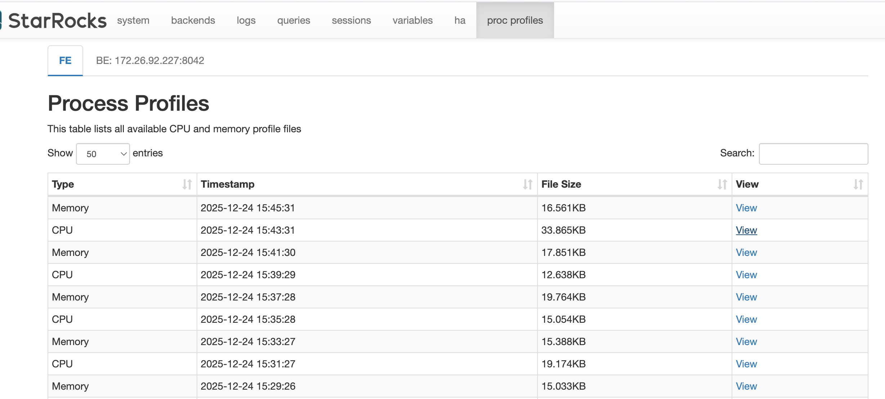

# Process Profile (Proc Profile)

The **Process Profile** (Proc Profile) feature provides a built-in mechanism to collect and visualize performance profiles for StarRocks Frontend (FE) and Backend (BE) processes. By generating flame graphs for CPU and memory allocation, it helps developers and administrators diagnose performance bottlenecks, high resource utilization, and complex runtime issues directly from the Web UI.

## Overview

Process Profiling is a system-level diagnostic tool that captures the state of the StarRocks processes over a period of time. Unlike Query Profiles, which focus on individual SQL execution, Process Profiles provide a holistic view of what the processes are doing, including background tasks, metadata management, and internal synchronization.

## Page Examples

The Proc Profile interface is integrated into the StarRocks Web UI under the **proc profiles** tab.

### Profile List View

The main page displays a list of collected profile files for the selected node.
You can switch between FE and different BE nodes using the tabs at the top.



### Flame Graph


A Flame Graph is a visualization tool used to show the resource consumption distribution of functions or code paths in a program. It represents the call stack using stacked rectangles (usually in a horizontal "flame" shape), where:

- **Each box represents a function (or method) call.**
- **The width of a box represents the amount of resources consumed by that function (such as CPU time, memory allocation frequency, or lock wait time). The wider the box, the more resources are consumed.**
- **Vertical stacking represents the calling relationship, with the bottom layer being the entry function and child functions stacked on top.**

Flame graphs help developers and operations personnel quickly identify code hotspots, performance bottlenecks, and call paths with the highest resource consumption, and are commonly used for performance tuning and troubleshooting.

In StarRocks Process Profile, flame graphs are used to visually display the data distribution of CPU usage, memory allocation, and (in BE scenarios) lock contention, helping to locate the most time-consuming code segments or call paths.


## Use Scenarios

- **CPU Hotspot Analysis**: Identify which code paths or functions are consuming the most CPU cycles.
- **Memory Allocation Profiling**: Track where memory is being frequently allocated to find potential memory pressure sources.
- **R&D Troubleshooting**: Assist developers in analyzing complex bugs or performance regressions in production environments without needing external profiling tools.

## Feature Description

### How to Use

1. **Access**: Open the StarRocks Web UI (default port 8030) and click on the **proc profiles** tab.
2. **Select Node**: Choose the **FE** tab or a specific **BE** node tab.
3. **Visualize**: Click the **View** link for any entry. 
   - For **FE**, it extracts and displays a pre-generated HTML flame graph.
   - For **BE**, it may convert a raw `pprof` file into an SVG flame graph on the fly (the first view might take a few seconds as it performs the conversion).
4. **Interact**: Use the flame graph to zoom into specific call stacks, search for function names, or analyze stack depth.

### Information Provided

- **Type**: CPU, Memory (Allocation), or Contention (BE only).
- **Timestamp**: When the profile collection was completed.
- **File Size**: Size of the compressed profile data.
- **Flame Graph**: A hierarchical visualization where the width of each box represents the relative resource consumption (CPU time, allocation frequency, or lock wait time).

## Configuration

The profiling feature performs function-level sampling to generate flame graphs for visualization.

### Frontend (FE) Configuration

FE profiling is managed by an internal daemon and uses **AsyncProfiler** for data collection. You can configure these in `fe.conf`.

| Parameter | Default | Description |
| :--- | :--- | :--- |
| `proc_profile_cpu_enable` | `true` | Whether to enable automatic CPU profiling for FE. |
| `proc_profile_mem_enable` | `true` | Whether to enable automatic memory allocation profiling for FE. |
| `proc_profile_collect_time_s` | `120` | Duration (seconds) for each profile collection. |
| `proc_profile_jstack_depth` | `128` | Maximum Java stack depth to collect. |
| `proc_profile_file_retained_days` | `1` | How many days to retain profile files. |
| `proc_profile_file_retained_size_bytes` | `2147483648` (2GB) | Maximum total size of retained profile files. |

### Backend (BE) Configuration

BE profiles are collected using the built-in **gperftools** and are typically collected via a background script or manual triggers. The collected data is then converted into flame graphs using **pprof**. 

#### Configuration in `be.conf`

| Parameter | Default | Description |
| :--- | :--- | :--- |
| `brpc_port` | `8060` | Port used by collection scripts to fetch data from BE. |
| `sys_log_dir` | `${STARROCKS_HOME}/log` | Base directory for storing collected profiles (stored in the `proc_profile` subdirectory). |
| `flamegraph_tool_dir` | `${STARROCKS_HOME}/bin/flamegraph` | Path to conversion tools (**pprof**, `flamegraph.pl`). |
| `COLLECT_BE_PROFILE_INTERVAL` | `60` | Collection interval in seconds when running the `collect_be_profile.sh` script in daemon mode. |

#### Manual BE Collection Options

The `collect_be_profile.sh` script supports the following command-line options:

| Option | Default | Description |
| :--- | :--- | :--- |
| `--profiling-type` | `cpu` | Type of profile to collect: `cpu`, `contention`, or `both`. |
| `--duration` | `10` | Duration (seconds) for each profile collection. |
| `--interval` | `60` | Interval (seconds) between collections in daemon mode. |
| `--cleanup-days` | `1` | Number of days to retain profile files. |
| `--cleanup-size` | `2147483648` (2GB) | Maximum total size of retained profile files. |
| `--daemon` | - | Run the collection script in daemon mode in the background. |

### Manual BE Collection Example

You can use the provided script to trigger or schedule BE collection:

```bash
# Collect a 30-second CPU profile
./bin/collect_be_profile.sh --profiling-type cpu --duration 30

# Run in daemon mode to collect profiles every hour
./bin/collect_be_profile.sh --daemon --interval 3600
```

