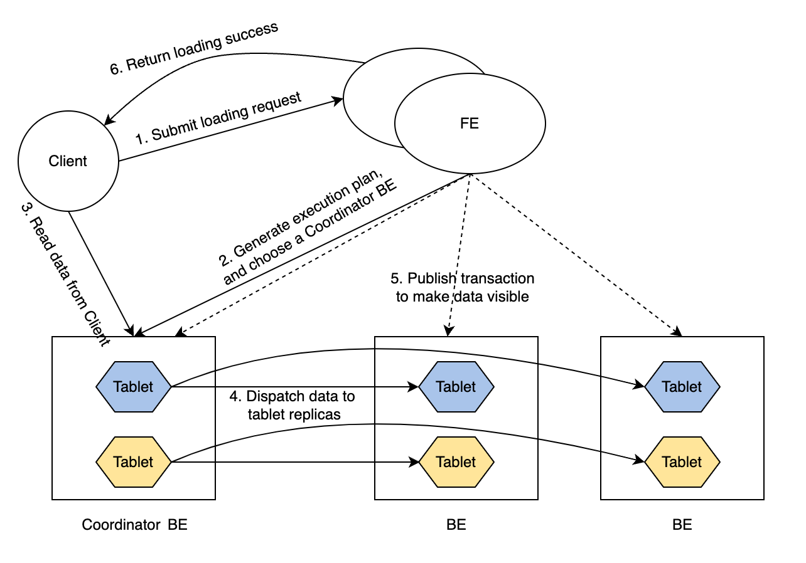
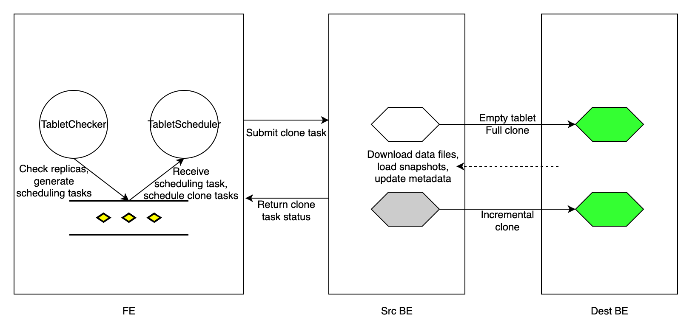

# Manage replica

This topic describes how to manage data replicas in your StarRocks cluster.

## Overview

StarRocks adopts a multi-replica strategy to guarantee the high availability of data. When you create a table, you must specify the replica count of the table using the table property `replication_num` (Default value: `3`). When a loading transaction starts, data is simultaneously loaded into the specified number of replicas. The transaction is returned with success only after the data is stored in the majority of replicas. For detailed information, see [Write quorum](#write-quorum). Nonetheless, StarRocks allows you to specify a lower write quorum for a table to achieve better loading performance.

StarRocks stores multiple replicas across different BE nodes. For example, if you want to store three replicas for a table, you must deploy at least three BE nodes in your StarRocks cluster. If any of the replicas fail, StarRocks clones a healthy replica, partially or wholly, from another BE node to repair the failed replica. By using the Multi-Version Concurrency Control (MVCC) technique, StarRocks accelerates the repairing of the replica by duplicating the physical copies of these multi-version data.

### Loading data into a multi-replica table



The routine of a loading transaction is as follows:

1. The client submits a loading request to FE.

2. FE chooses a BE node as the Coordinator BE node of this loading transaction, and generates an execution plan for the transaction.

3. The Coordinator BE node reads the data to be loaded from the client.

4. The Coordinator BE node dispatches the data to all the replicas of tablets.

   > **NOTE**
   >
   > A tablet is a logical slice of a table. A table has multiple tablets, and each tablet has replication_num replicas. The number of tablets in a table is determined by the `bucket_size` property of the table.

5. After the data is loaded and stored in all the tablets, FE makes the loaded data visible.

6. FE returns loading success to the client.

Such a routine guarantees service availability even under extreme scenarios.

### Write quorum

Loading data into a multi-replica table can be very time-consuming. If you want to improve the loading performance and you can tolerate relatively lower data availability, you can set a lower write quorum for tables. A write quorum refers to the minimum number of replicas that need to acknowledge a write operation before it is considered successful. You can specify write quorum by adding the property `write_quorum` when you [CREATE TABLE](../../../sql-reference/sql-statements/table_bucket_part_index/CREATE_TABLE.md), or add this property to an existing table using [ALTER TABLE](../../../sql-reference/sql-statements/table_bucket_part_index/ALTER_TABLE.md). This property is supported from v2.5.

`write_quorum` supports the following values:

- `MAJORITY`: Default value. When the majority of data replicas return loading success, StarRocks returns loading task success. Otherwise, StarRocks returns loading task failed.
- `ONE`: When one of the data replicas returns loading success, StarRocks returns loading task success. Otherwise, StarRocks returns loading task failed.
- `ALL`: When all of the data replicas return loading success, StarRocks returns loading task success. Otherwise, StarRocks returns loading task failed.

## Automatic replica repair

Replicas can fail because certain BE nodes crash or some loading tasks fail. StarRocks automatically repairs these failed replicas.

Every `tablet_sched_checker_interval_seconds`, default 20 seconds, Tablet Checker in FE scans all tablet replicas of all tables in your StarRocks cluster, and judges if a replica is healthy by checking the version number of the currently visible data and the health status of the BE node. If the visible version of a replica lags behind those of the other replicas, StarRocks performs an incremental clone to repair the failed replica. If a BE node fails to receive heartbeats or is dropped from the cluster, or the replica is too lagged to be repaired by an incremental clone, StarRocks performs a full clone to repair the lost replica.

After detecting tablet replicas that need repair, FE generates a tablet scheduling task, and adds the task to the scheduling task queue. Tablet Scheduler in the FE receives the scheduling task from the queue, creates clone tasks for each failed replica in accordance with the clone type they need, and assigns the tasks to the executor BE nodes.

A clone task is essentially copying data from a source BE node (which has a healthy replica), and loading the data into the destination BE node (which has a failed replica). For a replica with a lagged data version, FE assigns an incremental clone task to the BE executor that stores the failed replica, and informs the executor BE node from which peer BE node it can find a healthy replica and clone the new data. If a replica is lost, FE chooses a surviving BE node as the executor BE node, creates an empty replica in the BE node, and assigns a full clone task to the BE node.

For each clone task, regardless of its type, the executor BE node duplicates the physical data files from a healthy replica, and then updates its metadata accordingly. After the clone task is completed, the executor BE node reports task success to Tablet Scheduler in FE. After removing the redundant tablet replicas, FE updates its metadata, marking the completion of the replica repair.



During tablet repair, StarRocks can still execute queries. StarRocks can load data into the table as long as the number of healthy replicas satisfies `write_quorum`.

## Repair replica manually

The manual replica repair consists of two steps:

1. Check the replica status.
2. Set the replica priority level.

### Check replica status

Follow these steps to check the replica status of tablets to identify the unhealthy (failed) tablets.

1. **Check the status of all tablets in the cluster.**

   ```SQL
   SHOW PROC '/statistic';
   ```

   Example:

   ```Plain
   mysql> SHOW PROC '/statistic';
   +----------+-----------------------------+----------+--------------+----------+-----------+------------+--------------------+-----------------------+
   | DbId     | DbName                      | TableNum | PartitionNum | IndexNum | TabletNum | ReplicaNum | UnhealthyTabletNum | InconsistentTabletNum |
   +----------+-----------------------------+----------+--------------+----------+-----------+------------+--------------------+-----------------------+
   | 35153636 | default_cluster:DF_Newrisk  | 3        | 3            | 3        | 96        | 288        | 0                  | 0                     |
   | 48297972 | default_cluster:PaperData   | 0        | 0            | 0        | 0         | 0          | 0                  | 0                     |
   | 5909381  | default_cluster:UM_TEST     | 7        | 7            | 10       | 320       | 960        | 1                  | 0                     |
   | Total    | 240                         | 10       | 10           | 13       | 416       | 1248       | 1                  | 0                     |
   +----------+-----------------------------+----------+--------------+----------+-----------+------------+--------------------+-----------------------+
   ```

   - `UnhealthyTabletNum`: indicates the number of unhealthy tablets in the corresponding database.
   - `InconsistentTabletNum`: indicates the number of tablets whose replicas are inconsistent.

   If the value of `UnhealthyTabletNum` or `InconsistentTabletNum` is not `0` in a specific database, you can check the unhealthy tablets in the database with its `DbId`.

   ```SQL
   SHOW PROC '/statistic/<DbId>'
   ```

   Example:

   ```Plain
   mysql> SHOW PROC '/statistic/5909381';
   +------------------+---------------------+
   | UnhealthyTablets | InconsistentTablets |
   +------------------+---------------------+
   | [40467980]       | []                  |
   +------------------+---------------------+
   ```

   The ID of the unhealthy tablet is returned in the field `UnhealthyTablets`.

2. **Check the tablet status in a specific table or partition.**

   You can use the WHERE clause in [ADMIN SHOW REPLICA STATUS](../../../sql-reference/sql-statements/cluster-management/tablet_replica/ADMIN_SHOW_REPLICA_STATUS.md) to filter the tablets with a certain `STATUS`.

   ```SQL
   ADMIN SHOW REPLICA STATUS FROM <table_name> 
   [PARTITION (<partition_name_1>[, <partition_name_2>, ...])]
   [WHERE STATUS = {'OK'|'DEAD'|'VERSION_ERROR'|'SCHEMA_ERROR'|'MISSING'}]
   ```

   Example:

   ```Plain
   mysql> ADMIN SHOW REPLICA STATUS FROM tbl PARTITION (p1, p2) WHERE STATUS = "OK";
   +----------+-----------+-----------+---------+-------------------+--------------------+------------------+------------+------------+-------+--------+--------+
   | TabletId | ReplicaId | BackendId | Version | LastFailedVersion | LastSuccessVersion | CommittedVersion | SchemaHash | VersionNum | IsBad | State  | Status |
   +----------+-----------+-----------+---------+-------------------+--------------------+------------------+------------+------------+-------+--------+--------+
   | 29502429 | 29502432  | 10006     | 2       | -1                | 2                  | 1                | -1         | 2          | false | NORMAL | OK     |
   | 29502429 | 36885996  | 10002     | 2       | -1                | -1                 | 1                | -1         | 2          | false | NORMAL | OK     |
   | 29502429 | 48100551  | 10007     | 2       | -1                | -1                 | 1                | -1         | 2          | false | NORMAL | OK     |
   | 29502433 | 29502434  | 10001     | 2       | -1                | 2                  | 1                | -1         | 2          | false | NORMAL | OK     |
   | 29502433 | 44900737  | 10004     | 2       | -1                | -1                 | 1                | -1         | 2          | false | NORMAL | OK     |
   | 29502433 | 48369135  | 10006     | 2       | -1                | -1                 | 1                | -1         | 2          | false | NORMAL | OK     |
   +----------+-----------+-----------+---------+-------------------+--------------------+------------------+------------+------------+-------+--------+--------+
   ```

   If the field `IsBad` is `true`, this tablet is corrupted.

   For detailed information provided in the field `Status`, see [ADMIN SHOW REPLICA STATUS](../../../sql-reference/sql-statements/cluster-management/tablet_replica/ADMIN_SHOW_REPLICA_STATUS.md).

   You can further explore the details of tablets in the table using [SHOW TABLET](../../../sql-reference/sql-statements/table_bucket_part_index/SHOW_TABLET.md).

   ```SQL
   SHOW TABLET FROM <table_name>
   ```

   Example:

   ```Plain
   mysql> SHOW TABLET FROM tbl1;
   +----------+-----------+-----------+------------+---------+-------------+-------------------+-----------------------+------------------+----------------------+---------------+----------+----------+--------+-------------------------+--------------+----------------------+--------------+----------------------+----------------------+----------------------+
   | TabletId | ReplicaId | BackendId | SchemaHash | Version | VersionHash | LstSuccessVersion | LstSuccessVersionHash | LstFailedVersion | LstFailedVersionHash | LstFailedTime | DataSize | RowCount | State  | LstConsistencyCheckTime | CheckVersion |     CheckVersionHash | VersionCount | PathHash             | MetaUrl              | CompactionStatus     |
   +----------+-----------+-----------+------------+---------+-------------+-------------------+-----------------------+------------------+----------------------+---------------+----------+----------+--------+-------------------------+--------------+----------------------+--------------+----------------------+----------------------+----------------------+
   | 29502429 | 29502432  | 10006     | 1421156361 | 2       | 0           | 2                 | 0                     | -1               | 0                    | N/A           | 784      | 0        | NORMAL | N/A                     | -1           |     -1               | 2            | -5822326203532286804 | url                  | url                  |
   | 29502429 | 36885996  | 10002     | 1421156361 | 2       | 0           | -1                | 0                     | -1               | 0                    | N/A           | 784      | 0        | NORMAL | N/A                     | -1           |     -1               | 2            | -1441285706148429853 | url                  | url                  |
   | 29502429 | 48100551  | 10007     | 1421156361 | 2       | 0           | -1                | 0                     | -1               | 0                    | N/A           | 784      | 0        | NORMAL | N/A                     | -1           |     -1               | 2            | -4784691547051455525 | url                  | url                  |
   +----------+-----------+-----------+------------+---------+-------------+-------------------+-----------------------+------------------+----------------------+---------------+----------+----------+--------+-------------------------+--------------+----------------------+--------------+----------------------+----------------------+----------------------+
   ```

   The returned results show the size, row count, version, and URL of the tablets.

   The field `State` returned by SHOW TABLET indicates the task state of the tablet, including `CLONE`, `SCHEMA_CHANGE`, and `ROLLUP`.

   You can also check the replica distribution of a specific table or partition to see if these replicas are distributed evenly using [ADMIN SHOW REPLICA DISTRIBUTION](../../../sql-reference/sql-statements/cluster-management/tablet_replica/ADMIN_SHOW_REPLICA_DISTRIBUTION.md).

   ```SQL
   ADMIN SHOW REPLICA DISTRIBUTION FROM <table_name>
   ```

   Example:

   ```Plain
   mysql> ADMIN SHOW REPLICA DISTRIBUTION FROM tbl1;
   +-----------+------------+-------+---------+
   | BackendId | ReplicaNum | Graph | Percent |
   +-----------+------------+-------+---------+
   | 10000     | 7          |       | 7.29 %  |
   | 10001     | 9          |       | 9.38 %  |
   | 10002     | 7          |       | 7.29 %  |
   | 10003     | 7          |       | 7.29 %  |
   | 10004     | 9          |       | 9.38 %  |
   | 10005     | 11         | >     | 11.46 % |
   | 10006     | 18         | >     | 18.75 % |
   | 10007     | 15         | >     | 15.62 % |
   | 10008     | 13         | >     | 13.54 % |
   +-----------+------------+-------+---------+
   ```

   The returned results show the number of tablet replicas on each BE node, and their corresponding percentages.

3. **Check the** **replica** **status of a specific tablet.**

   With the `TabletId` of the unhealthy tablets you obtained in the preceding procedures, you can examine the replica statues of them.

   ```SQL
   SHOW TABLET <TabletId>
   ```

   Example:

   ```Plain
   mysql> SHOW TABLET 29502553;
   +------------------------+-----------+---------------+-----------+----------+----------+-------------+----------+--------+---------------------------------------------------------------------------+
   | DbName                 | TableName | PartitionName | IndexName | DbId     | TableId  | PartitionId | IndexId  | IsSync | DetailCmd                                                                 |
   +------------------------+-----------+---------------+-----------+----------+----------+-------------+----------+--------+---------------------------------------------------------------------------+
   | default_cluster:test   | test      | test          | test      | 29502391 | 29502428 | 29502427    | 29502428 | true   | SHOW PROC '/dbs/29502391/29502428/partitions/29502427/29502428/29502553'; |
   +------------------------+-----------+---------------+-----------+----------+----------+-------------+----------+--------+---------------------------------------------------------------------------+
   ```

   The returned results show detailed information about the database, table, partition, and index (Rollup) of the tablet.

   You can copy the SQL statement in the field `DetailCmd` to further examine the replica status of the tablet.

   Example:

   ```Plain
   mysql> SHOW PROC '/dbs/29502391/29502428/partitions/29502427/29502428/29502553';
   +-----------+-----------+---------+-------------+-------------------+-----------------------+------------------+----------------------+---------------+------------+----------+----------+--------+-------+--------------+----------------------+----------+------------------+
   | ReplicaId | BackendId | Version | VersionHash | LstSuccessVersion | LstSuccessVersionHash | LstFailedVersion | LstFailedVersionHash | LstFailedTime | SchemaHash | DataSize | RowCount | State  | IsBad | VersionCount | PathHash             | MetaUrl  | CompactionStatus |
   +-----------+-----------+---------+-------------+-------------------+-----------------------+------------------+----------------------+---------------+------------+----------+----------+--------+-------+--------------+----------------------+----------+------------------+
   | 43734060  | 10004     | 2       | 0           | -1                | 0                     | -1               | 0                    | N/A           | -1         | 784      | 0        | NORMAL | false | 2            | -8566523878520798656 | url      | url              |
   | 29502555  | 10002     | 2       | 0           | 2                 | 0                     | -1               | 0                    | N/A           | -1         | 784      | 0        | NORMAL | false | 2            | 1885826196444191611  | url      | url              |
   | 39279319  | 10007     | 2       | 0           | -1                | 0                     | -1               | 0                    | N/A           | -1         | 784      | 0        | NORMAL | false | 2            | 1656508631294397870  | url      | url              |
   +-----------+-----------+---------+-------------+-------------------+-----------------------+------------------+----------------------+---------------+------------+----------+----------+--------+-------+--------------+----------------------+----------+------------------+
   ```

   The returned results show all the replicas of the tablet.

### Set replica priority level

Tablet Scheduler automatically assigns a different priority level to each different type of clone task.

If you want the tablets from a certain table or certain partitions to be repaired at the earliest opportunity, you can manually assign a `VERY_HIGH` priority level to them using [ADMIN REPAIR TABLE](../../../sql-reference/sql-statements/cluster-management/tablet_replica/ADMIN_REPAIR.md).

```SQL
ADMIN REPAIR TABLE <table_name>
[PARTITION (<partition_name_1>[, <partition_name_2>, ...])]
```

> **NOTE**
>
> - Executing this SQL statement only submits a hint to modify the priority level of the tablets to be repaired. It does not guarantee that these tablets can be successfully repaired.
> - Tablet Scheduler might still assign different priority levels to these tablets after you execute this SQL statement.
> - When the Leader FE node is changed or restarted, the hint this SQL statement submitted expires.

You can cancel this operation using [ADMIN CANCEL REPAIR TABLE](../../../sql-reference/sql-statements/cluster-management/tablet_replica/ADMIN_CANCEL_REPAIR.md).

```SQL
ADMIN CANCEL REPAIR TABLE <table_name>
[PARTITION (<partition_name_1>[, <partition_name_2>, ...])]
```

## Replica balancing

StarRocks automatically balances the tablets across BE nodes.

To move a tablet from a high-load node to a low-load node, StarRocks first creates a replica of the tablet in the low-load node, and then drops the corresponding replica on the high-load node. If different types of storage mediums are used in the cluster, StarRocks categorizes all the BE nodes in accordance with the storage medium types. StarRocks moves the tablet across the BE nodes of the same storage medium type whenever possible. Replicas of the same tablet are stored on different BE nodes.

### BE load

StarRocks shows the load statistics of each BE node in the cluster using `ClusterLoadStatistics` (CLS). Tablet Scheduler triggers the replica balancing based on `ClusterLoadStatistics`. StarRocks evaluates the **disk utilization** and the **replica count** of each BE node and calculates a `loadScore` accordingly. The higher the `loadScore` of a BE node, the higher the load the node has. Tablet Scheduler updates `ClusterLoadStatistics` every one minute.

`capacityCoefficient` and `replicaNumCoefficient`are the weighting factors for the disk utilization and the replica count respectively. The sum of `capacityCoefficient` and `replicaNumCoefficient` is one. `capacityCoefficient` is dynamically adjusted according to the actual disk usage. When the overall disk utilization of a BE node is below 50%, the `capacityCoefficient` value is 0.5. When the disk utilization is above 75%, the value is 1. You can configure this limit via the FE configuration item `capacity_used_percent_high_water`. If the utilization is between 50% and 75%, `capacityCoefficient` increases smoothly based on this formula:

```SQL
capacityCoefficient= 2 * Disk utilization - 0.5
```

`capacityCoefficient` ensures that when the disk usage is exceedingly high, the `loadScore` of this BE node gets higher, forcing the system to reduce the load on this BE node at the earliest opportunity.

### Balancing policy

Each time Tablet Scheduler schedules tablets, it selects a certain number of healthy tablets as the candidate tablets to be balanced through Load Balancer. Next time when scheduling tablets, Tablet Scheduler balances these healthy tablets.

### Check tablet scheduling tasks

You can check tablet scheduling tasks that are pending, running, and finished.

- **Check pending tablet scheduling tasks**

  ```SQL
  SHOW PROC '/cluster_balance/pending_tablets';
  ```

  Example:

   ```Plain
   +----------+--------+-----------------+---------+----------+----------+-------+---------+--------+----------+---------+---------------------+---------------------+---------------------+----------+------+-------------+---------------+---------------------+------------+---------------------+--------+---------------------+-------------------------------+
   | TabletId | Type   | Status          | State   | OrigPrio | DynmPrio | SrcBe | SrcPath | DestBe | DestPath | Timeout | Create              | LstSched            | LstVisit            | Finished | Rate | FailedSched | FailedRunning | LstAdjPrio          | VisibleVer | VisibleVerHash      | CmtVer | CmtVerHash          | ErrMsg                        |
   +----------+--------+-----------------+---------+----------+----------+-------+---------+--------+----------+---------+---------------------+---------------------+---------------------+----------+------+-------------+---------------+---------------------+------------+---------------------+--------+---------------------+-------------------------------+
   | 4203036  | REPAIR | REPLICA_MISSING | PENDING | HIGH     | LOW      | -1    | -1      | -1     | -1       | 0       | 2019-02-21 15:00:20 | 2019-02-24 11:18:41 | 2019-02-24 11:18:41 | N/A      | N/A  | 2           | 0             | 2019-02-21 15:00:43 | 1          | 0                   | 2      | 0                   | unable to find source replica |
   +----------+--------+-----------------+---------+----------+----------+-------+---------+--------+----------+---------+---------------------+---------------------+---------------------+----------+------+-------------+---------------+---------------------+------------+---------------------+--------+---------------------+-------------------------------+
   ```

  - `TabletId`: the ID of the tablet pending to be scheduled. A scheduled task is only for one tablet.
  - `Type`: the task type. Valid values: REPAIR and BALANCE.
  - `Status`: the current status of the tablet, such as REPLICA_MISSING.
  - `State`: the state of the scheduling task. Valid values: PENDING, RUNNING, FINISHED, CANCELLED, TIMEOUT, and UNEXPECTED.
  - `OrigPrio`: the original priority of the task.
  - `DynmPrio`: the current priority of the task after the dynamic adjustment.
  - `SrcBe`: the ID of the source BE node.
  - `SrcPath`: the hash value of the path to the source BE node.
  - `DestBe`: the ID of the destination BE node.
  - `DestPath`: the hash value of the path to the destination BE node.
  - `Timeout`: the timeout of the task when the task is scheduled successfully. Unit: second.
  - `Create`: the time when the task was created.
  - `LstSched`: the time when the task was scheduled most recently.
  - `LstVisit`: the time when the task was visited most recently. To visit the task here means to schedule the task or to report its execution.
  - `Finished`: the time when the task is finished.
  - `Rate`: the rate at which the data is cloned.
  - `FailedSched`: the number of task scheduling failures.
  - `FailedRunning`: the number of task execution failures.
  - `LstAdjPrio`: the time when the task priority was adjusted most recently.
  - `CmtVer`, `CmtVerHash`, `VisibleVer`, and `VisibleVerHash`: the version information used to execute the clone task.
  - `ErrMsg`: the error message that occurs when the task is scheduled and running.

- **Check running tablet scheduling tasks**

  ```SQL
  SHOW PROC '/cluster_balance/running_tablets';
  ```

  The returned results are identical to those of the pending tasks.

- **Check finished tablet scheduling tasks**

  ```SQL
  SHOW PROC '/cluster_balance/history_tablets';
  ```

  The returned results are identical to those of the pending tasks. If the `State` of the task is `FINISHED`, the task is completed successfully. If not, please check the `ErrMsg` field for the cause of the task failure.

## Resource control

Because StarRocks repairs and balances tablets by cloning tablets from one BE node to another, the I/O load of a BE node can increase dramatically if the node executes such tasks too frequently in a short time. To avoid this situation, StarRocks sets a concurrency limit on clone tasks for each BE node. The minimum unit of resource control is a disk, which is a data storage path (`storage_root_path`) you have specified in the BE configuration file. By default, StarRocks allocates two slots for each disk to process tablet repair tasks. A clone task occupies one slot on the source BE node and one on the destination BE node. If all the slots on a BE node are occupied, StarRocks stops scheduling tasks to the node. You can increase the number of slots on a BE node by increasing the value of the FE dynamic parameter `tablet_sched_slot_num_per_path`.

StarRocks allocates two slots specifically for tablet balancing tasks to avoid the situation that a high-load BE node fails to release the disk space by balancing tablets because tablet repair tasks constantly occupy the slots.

