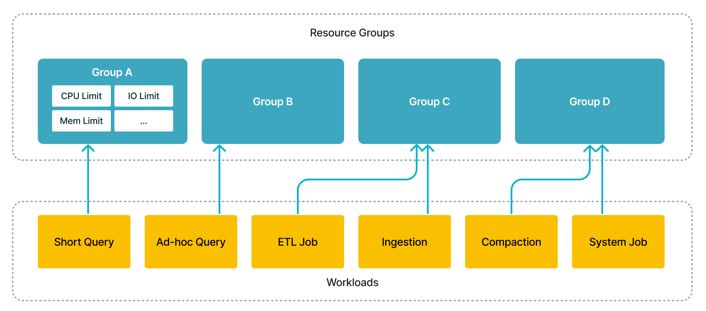

# Resource group

This topic describes the resource group feature of StarRocks.



With this feature, you could simultaneously run several workloads in a single cluster, including short query, ad-hoc query, ETL jobs, to save extra cost of deploying multiple clusters. From technical perspective, the execution engine would schedule concurrent workloads according to users' specification and isolate the interference among them.

The roadmap of Resource Group:

- Since v2.2, StarRocks supports limiting resource consumption for queries and implementing isolation and efficient use of resources among tenants in the same cluster.
- In StarRocks v2.3, you can further restrict the resource consumption for big queries, and prevent the cluster resources from getting exhausted by oversized query requests, to guarantee the system stability.
- StarRocks v2.5 supports limiting computation resource consumption for data loading (INSERT).
- From v3.3.5 onwards, StarRocks supports imposing hard limits on CPU resources.

|                 | Internal Table | External Table | Big Query Restriction | INSERT INTO | Broker Load | Routine Load, Stream Load, Schema Change | CPU Hard Limit |
| --------------- | -------------- | -------------- | --------------------- | ----------- | ----------- | ---------------------------------------- | -------------- |
| 2.2             | √              | ×              | ×                     | ×           | ×           | ×                                        | x              |
| 2.3             | √              | √              | √                     | ×           | ×           | ×                                        | x              |
| 2.5             | √              | √              | √                     | √           | ×           | ×                                        | x              |
| 3.1 & 3.2       | √              | √              | √                     | √           | √           | ×                                        | x              |
| 3.3.5 and later | √              | √              | √                     | √           | √           | √                                        | √              |

## Terms

This section describes the terms that you must understand before you use the resource group feature.

### resource group

Each resource group is a set of computing resources from a specific BE. You can divide each BE of your cluster into multiple resource groups. When a query is assigned to a resource group, StarRocks allocates CPU and memory resources to the resource group based on the resource quotas that you specified for the resource group.

You can specify CPU and memory resource quotas for a resource group on a BE by using the following parameters:

| Parameter                  | Description                                                    | Value Range                                                    | Default |
| -------------------------- | -------------------------------------------------------------- | -------------------------------------------------------------- | ------- |
| cpu_weight                 | The CPU scheduling weight of this resource group on a BE node. | (0, `avg_be_cpu_cores`] (takes effect when greater than 0)     | 0       |
| exclusive_cpu_cores        | CPU hard isolation parameter for this resource group.          | (0, `min_be_cpu_cores - 1`] (takes effect when greater than 0) | 0       |
| mem_limit                  | The percentage of memory available for queries by this resource group on the current BE node. | (0, 1] (required)               | -       |
| spill_mem_limit_threshold  | Memory usage threshold that triggers spilling to disk.         | (0, 1]                                                         | 1.0     |
| concurrency_limit          | Maximum number of concurrent queries in this resource group.   | Integer (takes effect when greater than 0)                     | 0       |
| big_query_cpu_second_limit | Maximum CPU time (in seconds) for big query tasks on each BE node.   | Integer (takes effect when greater than 0)               | 0       |
| big_query_scan_rows_limit  | Maximum number of rows big query tasks can scan on each BE node.   | Integer (takes effect when greater than 0)                 | 0       |
| big_query_mem_limit        | Maximum memory big query tasks can use on each BE node.        | Integer (takes effect when greater than 0)                     | 0       |

#### CPU resource parameters

##### `cpu_weight`

This parameter specifies the CPU scheduling weight of a resource group on a single BE node, determining the relative share of CPU time allocated to tasks from this group. Before v3.3.5, this was referred to as `cpu_core_limit`.

Its value range is (0, `avg_be_cpu_cores`], where `avg_be_cpu_cores` is the average number of CPU cores across all BE nodes. The parameter is effective only when it is set to greater than 0. Either cpu_weight or exclusive_cpu_cores must be greater than 0, but not both.

> **NOTE**
>
> For example, suppose three resource groups, rg1, rg2, and rg3, have cpu_weight values of 2, 6, and 8, respectively. On a fully loaded BE node, these groups would receive 12.5%, 37.5%, and 50% of the CPU time. If the node is not fully loaded and rg1 and rg2 are under load while rg3 is idle, rg1 and rg2 would receive 25% and 75% of the CPU time, respectively.

##### `exclusive_cpu_cores`

This parameter defines CPU hard hard limit for a resource group. It has two implications:

- **Exclusive**: Reserves `exclusive_cpu_cores` CPU cores exclusively for this resource group, making them unavailable to other groups, even when idle.
- **Quota**: Limits the resource group to only using these reserved CPU cores, preventing it from using available CPU resources from other groups.

The value range is (0, `min_be_cpu_cores - 1`], where `min_be_cpu_cores` is the minimum number of CPU cores across all BE nodes. It takes effect only when greater than 0. Only one of `cpu_weight` or `exclusive_cpu_cores` can be set to greater than 0.

- Resource groups with `exclusive_cpu_cores` greater than 0 are called Exclusive resource groups, and the CPU cores allocated to them are called Exclusive Cores. Other groups are called Shared resource groups and run on Shared Cores.
- The total number of `exclusive_cpu_cores` across all resource groups cannot exceed `min_be_cpu_cores - 1`. The upper limit is set to leave at least one Shared Core available.

The relationship between `exclusive_cpu_cores` and `cpu_weight`:

Only one of `cpu_weight` or `exclusive_cpu_cores` can be active at a time. Exclusive resource groups operate on their own reserved Exclusive Cores without requiring a share of CPU time through `cpu_weight`.

You can configure whether Shared resource groups can borrow Exclusive Cores from Exclusive resource groups using the BE configuration `enable_resource_group_cpu_borrowing`. When set to `true` (default), Shared groups can borrow CPU resources when Exclusive groups are idle.

To modify this configuration dynamically, use the following command:

```SQL
UPDATE information_schema.be_configs SET VALUE = "false" WHERE NAME = "enable_resource_group_cpu_borrowing";
```

#### Memory resource parameters

##### `mem_limit`

Specifies the percentage of memory (query pool) available to the resource group on the current BE node. The value range is (0,1].

##### `spill_mem_limit_threshold`

Defines the memory usage threshold that triggers spilling to disk. The value range is (0,1], with the default being 1 (inactive). Introduced in v3.1.7.

- When automatic spilling is enabled (`spill_mode` set to `auto`), but resource groups are disabled, the system will spill intermediate results to disk when a query’s memory usage exceeds 80% of `query_mem_limit`.
- When resource groups are enabled, spilling will occur if:
  - The total memory usage of all queries in the group exceeds `current BE memory limit * mem_limit * spill_mem_limit_threshold`, or
  - The memory usage of the current query exceeds 80% of `query_mem_limit`.

#### Query concurrency parameters

##### `concurrency_limit`

Defines the maximum number of concurrent queries in the resource group to prevent system overload. Effective only when greater than 0, with a default value of 0.

#### Big query resource parameters

You can configure resource limits specifically for large queries using the following parameters:

##### `big_query_cpu_second_limit`

Specifies the maximum CPU time (in seconds) that large query tasks can use on each BE node, summing the actual CPU time used by parallel tasks. Effective only when greater than 0, with a default value of 0.

##### `big_query_scan_rows_limit`

Sets a limit on the number of rows large query tasks can scan on each BE node. Effective only when greater than 0, with a default value of 0.

##### `big_query_mem_limit`

Defines the maximum memory large query tasks can use on each BE node, in bytes. Effective only when greater than 0, with a default value of 0.

> **NOTE**
>
> When a query running in a resource group exceeds the above big query limit, the query will be terminated with an error. You can also view error messages in the `ErrorCode` column of the FE node **fe.audit.log**.

##### Type (Deprecated Since v3.3.5)

Before v3.3.5, StarRocks allowed setting the `type` of a resource group to `short_query`. However, the parameter `type` has been deprecated and replaced by `exclusive_cpu_cores`. For any existing resource groups of this type, the system will automatically convert them to an Exclusive resource group where the `exclusive_cpu_cores` value equals the `cpu_weight` after upgrading to v3.3.5.

#### System-defined resource groups

There are two system-defined resource groups in each StarRocks instance: `default_wg` and `default_mv_wg`. You can modify the configuration of system-defined resource groups using the ALTER RESOURCE GROUP command, but you cannot define classifiers for them or delete system-defined resource groups.

##### default_wg

`default_wg` will be assigned to regular queries that are under the management of resource groups but don't match any classifier. The default resource limits of `default_wg` are as follows:

- `cpu_core_limit`: 1 (for v2.3.7 or earlier) or the number of CPU cores of the BE (for versions later than v2.3.7).
- `mem_limit`: 100%.
- `concurrency_limit`: 0.
- `big_query_cpu_second_limit`: 0.
- `big_query_scan_rows_limit`: 0.
- `big_query_mem_limit`: 0.
- `spill_mem_limit_threshold`: 1.

##### default_mv_wg

`default_mv_wg` will be assigned to asynchronous materialized view refresh tasks if no resource group is allocated to the corresponding materialized view in the property `resource_group` during materialized view creation. The default resource limits of `default_mv_wg` are as follows:

- `cpu_core_limit`: 1.
- `mem_limit`: 80%.
- `concurrency_limit`: 0.
- `spill_mem_limit_threshold`: 80%.

### classifier

Each classifier holds one or more conditions that can be matched to the properties of queries. StarRocks identifies the classifier that best matches each query based on the match conditions and assigns resources for running the query.

Classifiers support the following conditions:

- `user`: the name of the user.
- `role`: the role of the user.
- `query_type`: the type of the query. `SELECT` and `INSERT` (from v2.5) are supported. When INSERT INTO or BROKER LOAD tasks hit a resource group with `query_type` as `insert`, the BE node reserves the specified CPU resources for the tasks.
- `source_ip`: the CIDR block from which the query is initiated.
- `db`: the database which the query accesses. It can be specified by strings separated by commas `,`.
- `plan_cpu_cost_range`: The estimated CPU cost range of the query. The format is `(DOUBLE, DOUBLE]`. The default value is NULL, indicating no such restriction. The `PlanCpuCost` column in `fe.audit.log` represents the system's estimate of the CPU cost for the query. This parameter is supported from v3.1.4 onwards.
- `plan_mem_cost_range`: The system-estimated memory cost range of a query. The format is `(DOUBLE, DOUBLE]`. The default value is NULL, indicating no such restriction. The `PlanMemCost` column in `fe.audit.log` represents the system's estimate of the memory cost for the query. This parameter is supported from v3.1.4 onwards.

A classifier matches a query only when one or all conditions of the classifier match the information about the query. If multiple classifiers match a query, StarRocks calculates the degree of matching between the query and each classifier and identifies the classifier with the highest degree of matching.

> **NOTE**
>
> You can view the resource group to which a query belongs in the `ResourceGroup` column of the FE node **fe.audit.log** or by running `EXPLAIN VERBOSE <query>`, as described in [View the resource group of a query](#view-the-resource-group-of-a-query).

StarRocks calculates the degree of matching between a query and a classifier by using the following rules:

- If the classifier has the same value of `user` as the query, the degree of matching of the classifier increases by 1.
- If the classifier has the same value of `role` as the query, the degree of matching of the classifier increases by 1.
- If the classifier has the same value of `query_type` as the query, the degree of matching of the classifier increases by 1 plus the number obtained from the following calculation: 1/Number of `query_type` fields in the classifier.
- If the classifier has the same value of `source_ip` as the query, the degree of matching of the classifier increases by 1 plus the number obtained from the following calculation: (32 - `cidr_prefix`)/64.
- If the classifier has the same value of `db` as the query, the degree of matching of the classifier increases by 10.
- If the query's CPU cost falls within the `plan_cpu_cost_range`, the degree of matching of the classifier increases by 1.
- If the query's memory cost falls within the `plan_mem_cost_range`, the degree of matching of the classifier increases by 1.

If multiple classifiers match a query, the classifier with a larger number of conditions has a higher degree of matching.

```Plain
-- Classifier B has more conditions than Classifier A. Therefore, Classifier B has a higher degree of matching than Classifier A.


classifier A (user='Alice')


classifier B (user='Alice', source_ip = '192.168.1.0/24')
```

If multiple matching classifiers have the same number of conditions, the classifier whose conditions are described more accurately has a higher degree of matching.

```Plain
-- The CIDR block that is specified in Classifier B is smaller in range than Classifier A. Therefore, Classifier B has a higher degree of matching than Classifier A.
classifier A (user='Alice', source_ip = '192.168.1.0/16')
classifier B (user='Alice', source_ip = '192.168.1.0/24')

-- Classifier C has fewer query types specified in it than Classifier D. Therefore, Classifier C has a higher degree of matching than Classifier D.
classifier C (user='Alice', query_type in ('select'))
classifier D (user='Alice', query_type in ('insert','select'))
```

If multiple classifiers have the same degree of matching, one of the classifiers will be randomly selected.

```Plain
-- If a query simultaneously queries both db1 and db2 and the classifiers E and F have the 
-- highest degree of matching among the hit classifiers, one of E and F will be randomly selected.
classifier E (db='db1')
classifier F (db='db2')
```

## Isolate computing resources

You can isolate computing resources among queries by configuring resource groups and classifiers.

### Enable resource groups

To use resource group, you must enable Pipeline Engine for your StarRocks cluster:

```SQL
-- Enable Pipeline Engine in the current session.
SET enable_pipeline_engine = true;
-- Enable Pipeline Engine globally.
SET GLOBAL enable_pipeline_engine = true;
```

For loading tasks, you also need to set the FE configuration item `enable_pipeline_load` to enable the Pipeline engine for loading tasks. This item is supported from v2.5.0 onwards.

```sql
ADMIN SET FRONTEND CONFIG ("enable_pipeline_load" = "true");
```

> **NOTE**
>
> From v3.1.0 onwards, Resource Group is enabled by default, and the session variable `enable_resource_group` is deprecated.

### Create resource groups and classifiers

Execute the following statement to create a resource group, associate the resource group with a classifier, and allocate computing resources to the resource group:

```SQL
CREATE RESOURCE GROUP <group_name> 
TO (
    user='string', 
    role='string', 
    query_type in ('select'), 
    source_ip='cidr'
) --Create a classifier. If you create more than one classifier, separate the classifiers with commas (`,`).
WITH (
    "{ cpu_weight | exclusive_cpu_cores }" = "INT",
    "mem_limit" = "m%",
    "concurrency_limit" = "INT",
    "type" = "str" --The type of the resource group. Set the value to normal.
);
```

Example:

```SQL
CREATE RESOURCE GROUP rg1
TO 
    (user='rg1_user1', role='rg1_role1', query_type in ('select'), source_ip='192.168.x.x/24'),
    (user='rg1_user2', query_type in ('select'), source_ip='192.168.x.x/24'),
    (user='rg1_user3', source_ip='192.168.x.x/24'),
    (user='rg1_user4'),
    (db='db1')
WITH (
    'exclusive_cpu_cores' = '10',
    'mem_limit' = '20%',
    'big_query_cpu_second_limit' = '100',
    'big_query_scan_rows_limit' = '100000',
    'big_query_mem_limit' = '1073741824'
);
```

### Specify resource group (Optional)

You can specify resource group for the current session directly, including `default_wg` and `default_mv_wg`.

```SQL
SET resource_group = 'group_name';
```

### View resource groups and classifiers

Execute the following statement to query all resource groups and classifiers:

```SQL
SHOW RESOURCE GROUPS ALL;
```

Execute the following statement to query the resource groups and classifiers of the logged-in user:

```SQL
SHOW RESOURCE GROUPS;
```

Execute the following statement to query a specified resource group and its classifiers:

```SQL
SHOW RESOURCE GROUP group_name;
```

Example:

```plain
mysql> SHOW RESOURCE GROUPS ALL;
+---------------+-------+------------+---------------------+-----------+----------------------------+---------------------------+---------------------+-------------------+---------------------------+----------------------------------------+
| name          | id    | cpu_weight | exclusive_cpu_cores | mem_limit | big_query_cpu_second_limit | big_query_scan_rows_limit | big_query_mem_limit | concurrency_limit | spill_mem_limit_threshold | classifiers                            |
+---------------+-------+------------+---------------------+-----------+----------------------------+---------------------------+---------------------+-------------------+---------------------------+----------------------------------------+
| default_mv_wg | 3     | 1          | 0                   | 80.0%     | 0                          | 0                         | 0                   | null              | 80%                       | (id=0, weight=0.0)                     |
| default_wg    | 2     | 1          | 0                   | 100.0%    | 0                          | 0                         | 0                   | null              | 100%                      | (id=0, weight=0.0)                     |
| rge1          | 15015 | 0          | 6                   | 90.0%     | 0                          | 0                         | 0                   | null              | 100%                      | (id=15016, weight=1.0, user=rg1_user)  |
| rgs1          | 15017 | 8          | 0                   | 90.0%     | 0                          | 0                         | 0                   | null              | 100%                      | (id=15018, weight=1.0, user=rgs1_user) |
| rgs2          | 15019 | 8          | 0                   | 90.0%     | 0                          | 0                         | 0                   | null              | 100%                      | (id=15020, weight=1.0, user=rgs2_user) |
+---------------+-------+------------+---------------------+-----------+----------------------------+---------------------------+---------------------+-------------------+---------------------------+----------------------------------------+
```

> **NOTE**
>
> In the preceding example, `weight` indicates the degree of matching.

To query all fields of a resource group, including deprecated fields.

By adding the keyword `VERBOSE` to the three commands mentioned above, you can view all fields of the resource group, including deprecated ones, such as `type` and `max_cpu_cores`.

```sql
SHOW VERBOSE RESOURCE GROUPS ALL;
SHOW VERBOSE RESOURCE GROUPS;
SHOW VERBOSE RESOURCE GROUP group_name;
```

### Manage resource groups and classifiers

You can modify the resource quotas for each resource group. You can also add or delete classifiers from resource groups.

Execute the following statement to modify the resource quotas for an existing resource group:

```SQL
ALTER RESOURCE GROUP group_name WITH (
    'cpu_core_limit' = 'INT',
    'mem_limit' = 'm%'
);
```

Execute the following statement to delete a resource group:

```SQL
DROP RESOURCE GROUP group_name;
```

Execute the following statement to add a classifier to a resource group:

```SQL
ALTER RESOURCE GROUP <group_name> ADD (user='string', role='string', query_type in ('select'), source_ip='cidr');
```

Execute the following statement to delete a classifier from a resource group:

```SQL
ALTER RESOURCE GROUP <group_name> DROP (CLASSIFIER_ID_1, CLASSIFIER_ID_2, ...);
```

Execute the following statement to delete all classifiers of a resource group:

```SQL
ALTER RESOURCE GROUP <group_name> DROP ALL;
```

## Observe resource groups

### View the resource group of a query

For queries that have not yet been executed, you can view the resource group matched by the query from the `RESOURCE GROUP` field returned by `EXPLAIN VERBOSE <query>`.

While a query is running, you can check which resource group the query has hit from the `ResourceGroup` field returned by `SHOW PROC '/current_queries'` and `SHOW PROC '/global_current_queries'`.

After a query has completed, you can view the resource group that the query matched by checking the `ResourceGroup` field in the **fe.audit.log** file on the FE node.

- If the query is not under the management of resource groups, the column value is an empty string `""`.
- If the query is under the management of resource groups but doesn't match any classifier, the column value is an empty string `""`. But this query is assigned to the default resource group `default_wg`.

### Monitoring resource groups

You can set up [monitoring and alerting](../monitoring/Monitor_and_Alert.md) for your resource groups.

Resource group-related FE and BE metrics are as follows. All the metrics below have a `name` label indicating their corresponding resource group.

### FE metrics

The following FE metrics only provide statistics within the current FE node:

| Metric                                          | Unit | Type          | Description                                                        |
| ----------------------------------------------- | ---- | ------------- | ------------------------------------------------------------------ |
| starrocks_fe_query_resource_group               | Count | Instantaneous | The number of queries historically run in this resource group (including those currently running). |
| starrocks_fe_query_resource_group_latency       | ms    | Instantaneous | The query latency percentile for this resource group. The label `type` indicates specific percentiles, including `mean`, `75_quantile`, `95_quantile`, `98_quantile`, `99_quantile`, `999_quantile`. |
| starrocks_fe_query_resource_group_err           | Count | Instantaneous | The number of queries in this resource group that encountered an error. |
| starrocks_fe_resource_group_query_queue_total   | Count | Instantaneous | The total number of queries historically queued in this resource group (including those currently running). This metric is supported from v3.1.4 onwards. It is valid only when query queues are enabled. |
| starrocks_fe_resource_group_query_queue_pending | Count | Instantaneous | The number of queries currently in the queue of this resource group. This metric is supported from v3.1.4 onwards. It is valid only when query queues are enabled. |
| starrocks_fe_resource_group_query_queue_timeout | Count | Instantaneous | The number of queries in this resource group that have timed out while in the queue. This metric is supported from v3.1.4 onwards. It is valid only when query queues are enabled. |

### BE metrics

| Metric                                      | Unit     | Type          | Description                                                        |
| ----------------------------------------- | -------- | ------------- | ------------------------------------------------------------------ |
| resource_group_running_queries            | Count    | Instantaneous | The number of queries currently running in this resource group.   |
| resource_group_total_queries              | Count    | Instantaneous | The number of queries historically run in this resource group (including those currently running). |
| resource_group_bigquery_count             | Count    | Instantaneous | The number of queries in this resource group that triggered the big query limit. |
| resource_group_concurrency_overflow_count | Count    | Instantaneous | The number of queries in this resource group that triggered the `concurrency_limit` limit. |
| resource_group_mem_limit_bytes            | Bytes    | Instantaneous | The memory limit for this resource group.                         |
| resource_group_mem_inuse_bytes            | Bytes    | Instantaneous | The memory currently in use by this resource group.               |
| resource_group_cpu_limit_ratio            | Percentage | Instantaneous | The ratio of this resource group's `cpu_core_limit` to the total `cpu_core_limit` across all resource groups. |
| resource_group_inuse_cpu_cores            | Count     | Average     | The estimated number of CPU cores in use by this resource group. This value is an approximate estimate. It represents the average value calculated based on the statistics from two consecutive metric collections. This metric is supported from v3.1.4 onwards. |
| resource_group_cpu_use_ratio              | Percentage | Average     | **Deprecated** The ratio of the Pipeline thread time slices used by this resource group to the total Pipeline thread time slices used by all resource groups. It represents the average value calculated based on the statistics from two consecutive metric collections. |
| resource_group_connector_scan_use_ratio   | Percentage | Average     | **Deprecated** The ratio of the external table Scan thread time slices used by this resource group to the total Pipeline thread time slices used by all resource groups. It represents the average value calculated based on the statistics from two consecutive metric collections. |
| resource_group_scan_use_ratio             | Percentage | Average     | **Deprecated** The ratio of the internal table Scan thread time slices used by this resource group to the total Pipeline thread time slices used by all resource groups. It represents the average value calculated based on the statistics from two consecutive metric collections. |

### View resource group usage information

From v3.1.4 onwards, StarRocks supports the SQL statement [SHOW USAGE RESOURCE GROUPS](../../../sql-reference/sql-statements/cluster-management/resource_group/SHOW_USAGE_RESOURCE_GROUPS.md), which is used to display usage information for each resource group across BEs. The descriptions of each field are as follows:

- `Name`: The name of the resource group.
- `Id`: The ID of the resource group.
- `Backend`: The BE's IP or FQDN.
- `BEInUseCpuCores`: The number of CPU cores currently in use by this resource group on this BE. This value is an approximate estimate.
- `BEInUseMemBytes`: The number of memory bytes currently in use by this resource group on this BE.
- `BERunningQueries`: The number of queries from this resource group that are still running on this BE.

Please note:

- BEs periodically report this resource usage information to the Leader FE at the interval specified in `report_resource_usage_interval_ms`, which is by default set to 1 second.
- The results will only show rows where at least one of `BEInUseCpuCores`/`BEInUseMemBytes`/`BERunningQueries` is a positive number. In other words, the information is displayed only when a resource group is actively using some resources on a BE.

Example:

```Plain
MySQL [(none)]> SHOW USAGE RESOURCE GROUPS;
+------------+----+-----------+-----------------+-----------------+------------------+
| Name       | Id | Backend   | BEInUseCpuCores | BEInUseMemBytes | BERunningQueries |
+------------+----+-----------+-----------------+-----------------+------------------+
| default_wg | 0  | 127.0.0.1 | 0.100           | 1               | 5                |
+------------+----+-----------+-----------------+-----------------+------------------+
| default_wg | 0  | 127.0.0.2 | 0.200           | 2               | 6                |
+------------+----+-----------+-----------------+-----------------+------------------+
| wg1        | 0  | 127.0.0.1 | 0.300           | 3               | 7                |
+------------+----+-----------+-----------------+-----------------+------------------+
| wg2        | 0  | 127.0.0.1 | 0.400           | 4               | 8                |
+------------+----+-----------+-----------------+-----------------+------------------+
```

### View thread information for Exclusive and Shared resource groups

Query execution mainly involves three thread pools: `pip_exec`, `pip_scan`, and `pip_con_scan`.

- Exclusive resource groups run in their dedicated thread pools and are bound to the Exclusive CPU cores allocated to them.
- Shared resource groups run in shared thread pools and are bound to the remaining Shared CPU cores.

The threads in these three pools follow the naming convention `{ pip_exec | pip_scan | pip_con_scan }_{ com | <resource_group_id> }`, where `com` refers to the shared thread pool, and `<resource_group_id>` refers to the ID of the Exclusive resource group.

You can view the CPU information bound to each BE thread through the system-defined view `information_schema.be_threads`. The fields `BE_ID`, `NAME`, and `BOUND_CPUS` represent the BE's ID, the name of the thread, and the number of CPU cores bound to that thread, respectively.

```sql
select * from information_schema.be_threads where name like '%pip_exec%';
select * from information_schema.be_threads where name like '%pip_scan%';
select * from information_schema.be_threads where name like '%pip_con_scan%';
```

Example:

```sql
select BE_ID, NAME, FINISHED_TASKS, BOUND_CPUS from information_schema.be_threads where name like '%pip_exec_com%' and be_id = 10223;
+-------+--------------+----------------+------------+
| BE_ID | NAME         | FINISHED_TASKS | BOUND_CPUS |
+-------+--------------+----------------+------------+
| 10223 | pip_exec_com | 2091295        | 10         |
| 10223 | pip_exec_com | 2088025        | 10         |
| 10223 | pip_exec_com | 1637603        | 6          |
| 10223 | pip_exec_com | 1641260        | 6          |
| 10223 | pip_exec_com | 1634197        | 6          |
| 10223 | pip_exec_com | 1633804        | 6          |
| 10223 | pip_exec_com | 1638184        | 6          |
| 10223 | pip_exec_com | 1636374        | 6          |
| 10223 | pip_exec_com | 2095951        | 10         |
| 10223 | pip_exec_com | 2095248        | 10         |
| 10223 | pip_exec_com | 2098745        | 10         |
| 10223 | pip_exec_com | 2085338        | 10         |
| 10223 | pip_exec_com | 2101221        | 10         |
| 10223 | pip_exec_com | 2093901        | 10         |
| 10223 | pip_exec_com | 2092364        | 10         |
| 10223 | pip_exec_com | 2091366        | 10         |
+-------+--------------+----------------+------------+
```
