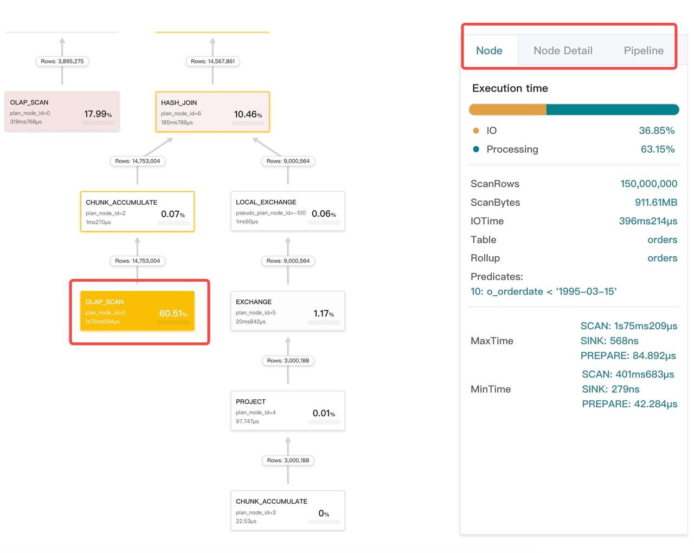
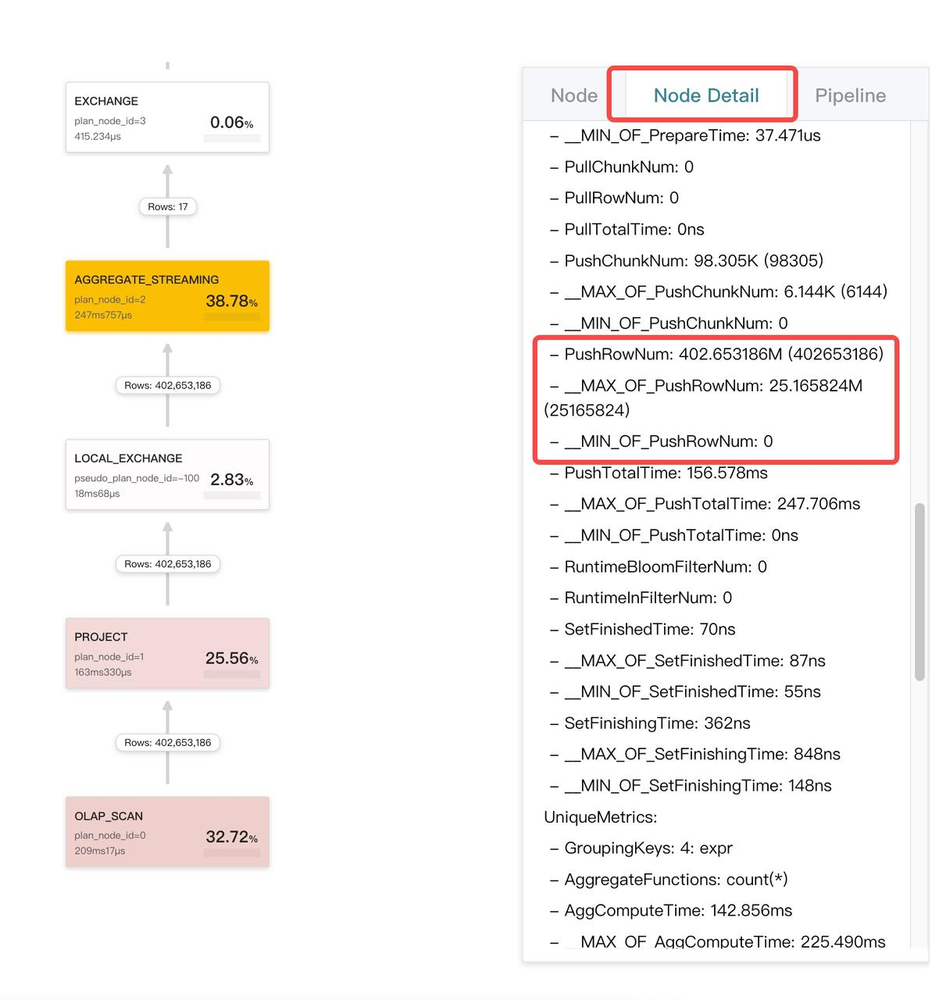
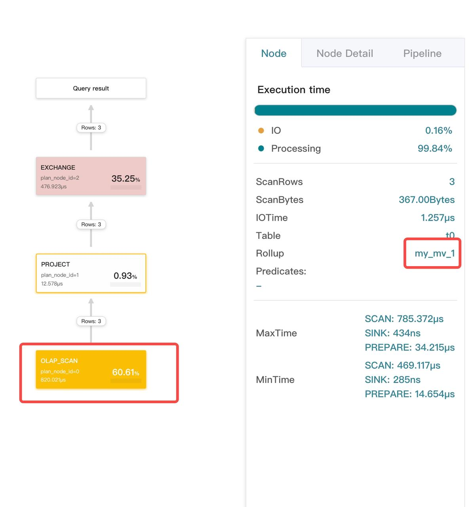

# Analyze query profile

This topic describes how to check the query profile. A query profile records the execution information of all worker nodes involved in a query. Query profiles help you quickly identify the bottlenecks that affect the query performance of your StarRocks cluster.

## Enable query profile

For StarRocks versions earlier than v2.5, you can enable query profile by setting the variable `is_report_success` to `true`:

```SQL
set is_report_success = true;
```

For StarRocks v2.5 or later versions, you can enable query profile by setting the variable `enable_profile` to `true`:

```SQL
set enable_profile = true;
```

## Access query profiles

Follow these steps to access your query profiles:

1. Enter `http://<fe_ip>:<fe_http_port>` in your browser.
2. On the page this is displayed, click **queries** on the top navigation pane.
3. In the **Finished Queries** list, choose the query you want to check and click the link in the **Profile** column.


The browser redirects you to a new page that contains the corresponding query profile.


## Interpret a query profile

### Structure of a query profile

Following is an example query profile:

```SQL
Query:
  Summary:
  Planner:
  Execution Profile 7de16a85-761c-11ed-917d-00163e14d435:
    Fragment 0:
      Pipeline (id=2):
        EXCHANGE_SINK (plan_node_id=18):
        LOCAL_MERGE_SOURCE (plan_node_id=17):
      Pipeline (id=1):
        LOCAL_SORT_SINK (plan_node_id=17):
        AGGREGATE_BLOCKING_SOURCE (plan_node_id=16):
      Pipeline (id=0):
        AGGREGATE_BLOCKING_SINK (plan_node_id=16):
        EXCHANGE_SOURCE (plan_node_id=15):
    Fragment 1:
       ...
    Fragment 2:
       ...
```

A query profile consists of three sections:

- Fragment: the execution tree. One query can be divided into one or more fragments.
- Pipeline: the execution chain. An execution chain does not have branches. A fragment can be split into several pipelines.
- Operator: A pipeline consists of a number of operators.


*A fragment consists of several pipelines.*

### Key metrics

A query profile encompasses a mass of metrics that show the details of the query execution. In most cases, you only need to observe the execution time of the operators and the size of the data that they processed. After finding the bottlenecks, you can solve them accordingly.

#### Summary

| Metric       | Description                                                  |
| ------------ | ------------------------------------------------------------ |
| Total        | Total time consumed by the query, including the time spent in planning, executing, and profiling. |
| QueryCpuCost | Total CPU time cost of the query. CPU time costs are aggregated for concurrent processes. As a result, the value of this metric may be greater than the actual execution time of the query. |
| QueryMemCost | Total memory cost of the query.                              |

#### Universal metrics for operators

| Metric            | Description                                           |
| ----------------- | ----------------------------------------------------- |
| OperatorTotalTime | Total CPU time cost of the operator.                  |
| PushRowNum        | Total row count of the data that the operator pushed. |
| PullRowNum        | Total row count of the data that the operator pulled. |

#### Scan operator

| Metric                          | Description                                                  |
| ------------------------------- | ------------------------------------------------------------ |
| Table                           | Table name.                                                  |
| ScanTime                        | Total scan time. Scans are performed in the asynchronous I/O thread pool. |
| TabletCount                     | Number of tablets.                                           |
| PushdownPredicates              | Number of the predicates that were pushed down.              |
| BytesRead                       | Size of the data read by StarRocks.                          |
| CompressedBytesRead             | Size of the compressed data read by StarRocks.               |
| IOTime                          | Total I/O time.                                              |
| BitmapIndexFilterRows           | Row count of the data that were filtered out by Bitmap index. |
| BloomFilterFilterRows           | Row count of the data that were filtered out by Bloomfilter. |
| SegmentRuntimeZoneMapFilterRows | Row count of the data that were filtered out by runtime Zone Map. |
| SegmentZoneMapFilterRows        | Row count of the data that were filtered out by Zone Map.    |
| ShortKeyFilterRows              | Row count of the data that were filtered out by Short Key.   |
| ZoneMapIndexFilterRows          | Row count of the data that were filtered out by Zone Map index. |

#### Exchange operator

| Metric            | Description                                                  |
| ----------------- | ------------------------------------------------------------ |
| PartType          | Data distribution type. Valid values: `UNPARTITIONED`, `RANDOM`, `HASH_PARTITIONED`, and `BUCKET_SHUFFLE_HASH_PARTITIONED`. |
| BytesSent         | Size of the data that were sent.                             |
| OverallThroughput | Overall throughput.                                          |
| NetworkTime       | Data package transmission time (excluding the time of post-receiving processing). See FAQ below for more about how this metric is calculated and how it can hit an exception. |
| WaitTime          | Time to wait because the queue at the sender side is full.   |

#### Aggregate operator

| Metric             | Description                                   |
| ------------------ | --------------------------------------------- |
| GroupingKeys       | Name of the grouping keys (GROUP BY columns). |
| AggregateFunctions | Aggregate functions.                          |
| AggComputeTime     | Compute time consumed by aggregate functions. |
| ExprComputeTime    | Compute time consumed by the expression.      |
| HashTableSize      | Size of the hash table.                       |

#### Join operator

| Metric                    | Description                         |
| ------------------------- | ----------------------------------- |
| JoinPredicates            | Predicates of the JOIN operation.   |
| JoinType                  | The JOIN type.                      |
| BuildBuckets              | Bucket number of the hash table.    |
| BuildHashTableTime        | Time used to build the hash table.  |
| ProbeConjunctEvaluateTime | Time consumed by Probe Conjunct.    |
| SearchHashTableTimer      | Time used to search the hash table. |

#### Window Function operator

| Metric             | Description                                           |
| ------------------ | ----------------------------------------------------- |
| ComputeTime        | Compute time consumed by the window function.         |
| PartitionKeys      | Name of the partitioning keys (PARTITION BY columns). |
| AggregateFunctions | Aggregate functions.                                  |

#### Sort operator

| Metric   | Description                                                  |
| -------- | ------------------------------------------------------------ |
| SortKeys | Name of the sort keys (ORDER BY columns).                    |
| SortType | Result sorting type: to list all results, or to list top n results. |

#### TableFunction operator

| Metric                 | Description                                     |
| ---------------------- | ----------------------------------------------- |
| TableFunctionExecTime  | Compute time consumed by the table function.    |
| TableFunctionExecCount | Number of times the table function is executed. |

#### Project operator

| Metric                   | Description                                         |
| ------------------------ | --------------------------------------------------- |
| ExprComputeTime          | Compute time consumed by the expression.            |
| CommonSubExprComputeTime | Compute time consumed by the common sub-expression. |

#### LocalExchange operator

| metric     | Description                                                  |
| ---------- | ------------------------------------------------------------ |
| Type       | Local Exchange type. Valid values: `Passthrough`, `Partition`, and `Broadcast`. |
| ShuffleNum | Number of shuffles. This metric is valid only when `Type` is `Partition`. |

### Time consumed by operators

- For the OlapScan and ConnectorScan operators, their time consumption is equivalent to `OperatorTotalTime + ScanTime`. Because the Scan operators perform I/O operations in the asynchronous I/O thread pool, ScanTime represents asynchronous I/O time.
- The time consumption of the Exchange operator is equivalent to `OperatorTotalTime + NetworkTime`. Because the Exchange operator sends and receives data packages in the bRPC thread pool, NetworkTime represents the time consumed by network transmission.
- For all other operators, their time cost is `OperatorTotalTime`.

### Metric merging and MIN/MAX

Pipeline engine is a parallel computing engine. Each fragment is distributed to multiple machines for parallel processing, and pipelines on each machine are executed in parallel as multiple concurrent instances. Therefore, while profiling, StarRocks merges same metrics, and records the minimum and maximum values of each metric among all the concurrent instances.

Different merging strategies are adopted for different types of metrics:

- Time metrics are averages. For example:
  - `OperatorTotalTime` represents the average time cost of all the concurrent instances.
  - `__MAX_OF_OperatorTotalTime` is the maximum time cost among all the concurrent instances.
  - `__MIN_OF_OperatorTotalTime` is the minimum time cost among all the concurrent instances.

```SQL
             - OperatorTotalTime: 2.192us
               - __MAX_OF_OperatorTotalTime: 2.502us
               - __MIN_OF_OperatorTotalTime: 1.882us
```

- Non-time metrics are totaled. For example:
  - `PullChunkNum` represents the total number of all concurrent instances.
  - `__MAX_OF_PullChunkNum` is the maximum value among all the concurrent instances.
  - `__MIN_OF_PullChunkNum` is the minimum value among all the concurrent instances.

  ```SQL
                 - PullChunkNum: 146.66K (146660)
                   - __MAX_OF_PullChunkNum: 24.45K (24450)
                   - __MIN_OF_PullChunkNum: 24.435K (24435)
  ```

- Some special metrics, which do not have minimum and maximum values, have identical values among all the concurrent instances (for example, `DegreeOfParallelism`).

#### Sharp difference between MIN and MAX

Usually, a noticeable difference between MIN and MAX values indicates the data is skewed. It possibly happens during aggregate or JOIN operations.

```SQL
             - OperatorTotalTime: 2m48s
               - __MAX_OF_OperatorTotalTime: 10m30s
               - __MIN_OF_OperatorTotalTime: 279.170us
```

## Visualize a query profile

If you are a user of StarRocks Enterprise Edition, you can visualize your query profiles via StarRocks Manager.

The **Profile Overview** page displays some summary metrics, including the total execution time `ExecutionWallTime`, I/O metrics, network transmission size, and the proportion of CPU and I/O time.


By clicking the card of an operator (a node), you can view its detailed information in the right pane of the page. There are three tabs:

- **Node**: core metrics of this operator.
- **Node Detail**: all metrics of this operator.
- **Pipeline**: metrics of the pipeline to which the operator belongs. You do not need to pay much attention to this tab because it is related only to scheduling.



### Identify bottlenecks

The larger the proportion of time taken by an operator, the darker color its card becomes. This helps you easily identify bottlenecks of the query.


### Check whether data is skewed

Click the card of the operator that takes a large proportion of time, and check its `MaxTime` and `MinTime`. A noticeable difference between `MaxTime` and `MinTime` usually indicates data is skewed.


Then, click the **Node Detail** tab, and check if any metric shows an exception. In this example, the metric `PushRowNum` of the Aggregate operator shows data skew.



### Check whether the partitioning or bucketing strategy takes effect

You can check whether the partitioning or bucketing strategy takes effect by viewing the corresponding query plan using `EXPLAIN <sql_statement>`.


### Check whether the correct materialized view is used

Click the corresponding Scan operator and check the `Rollup` field on the **Node Detail** tab.



### Check whether the JOIN plan is proper for left and right tables

Usually, StarRocks selects the smaller table as the right table of Join. An exception occurs if the query profile shows otherwise.


### Check whether the distribution type of JOIN is correct

Exchange operators are classified into three types in accordance with the data distribution type:

- `UNPARTITIONED`: Broadcast. Data is made into several copies and distributed to multiple BEs.
- `RANDOM`: Round robin.
- `HASH_PARTITIONED` and `BUCKET_SHUFFLE_HASH_PARTITIONED`: Shuffle. The difference between `HASH_PARTITIONED` and `BUCKET_SHUFFLE_HASH_PARTITIONED` lies in the hash functions used to calculate the hash code.

For Inner Join, the right table can be the `HASH_PARTITIONED` and `BUCKET_SHUFFLE_HASH_PARTITIONED` type or `UNPARTITIONED` type. Usually, `UNPARTITIONED` type is adopted only when there are less than 100K rows in the right table.

In the following example, the type of the Exchange operator is Broadcast, but the size of data transmitted by the operator greatly exceeds the threshold.


### Check whether JoinRuntimeFilter takes effect

When the right child of Join is building a hash table, it creates a runtime filter. This runtime filter is sent to the left child tree, and is pushed down to the Scan operator if it is possible. You can check `JoinRuntimeFilter`-related metrics on the **Node Detail** tab of the Scan operator.


## FAQ

### Why is the time cost of the Exchange operator abnormal?


The time cost of an Exchange operator consists of two parts: CPU time and network time. Network time relies on the system clock. Network time is calculated as follows:

1. The sender records a `send_timestamp` before calling the bRPC interface to send the package.
2. The receiver records a `receive_timestamp` after receiving the package from the bRPC interface (post-receiving processing time excluded).
3. After the processing is complete, the receiver sends a response and calculates the network latency. The package transmission latency is equivalent to `receive_timestamp` - `send_timestamp`.

If system clocks across machines are inconsistent, the time cost of the Exchange operator hits an exception.

### Why is the total time cost of all operators significantly less than the query execution time?

Possible cause: In high-concurrency scenarios, some pipeline drivers, despite being schedulable, may not be processed in time because they are queued. The waiting time is not recorded in operators' metrics, but in `PendingTime`, `ScheduleTime`, and `IOTaskWaitTime`.

Example:

From the profile, we can see that `ExecutionWallTime` is about 55 ms. However, the total time cost of all operators is less than 10 ms, which is significantly less than `ExecutionWallTime`.


