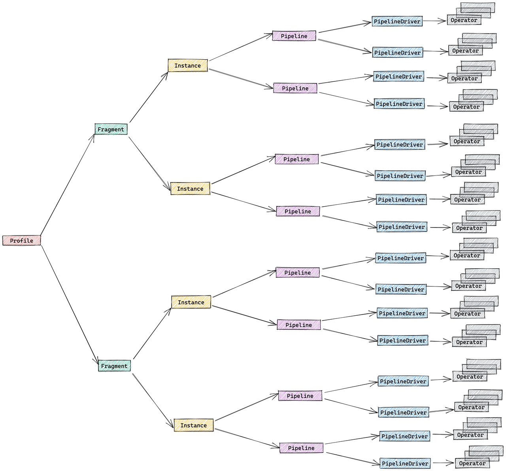
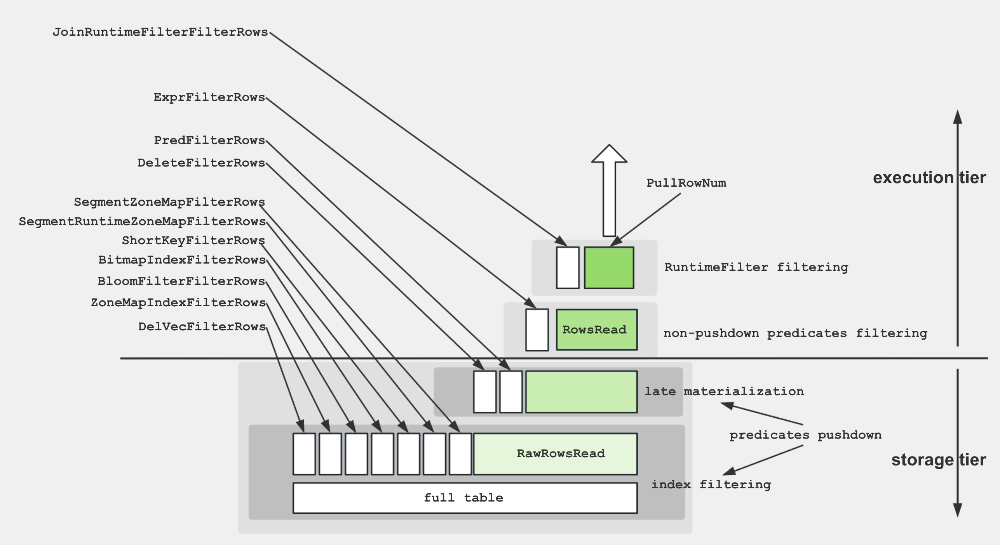

# Query Profile Structure and Metrics

## Structure of Query Profile

The structure of a Query Profile is closely related to the design of StarRocks' execution engine and consists of the following five parts:

- **Fragment**: Execution tree. A query is composed of one or more fragments.
- **FragmentInstance**: Each fragment can have multiple instances, each instance is called a FragmentInstance, and is executed by different computing nodes.
- **Pipeline**: A FragmentInstance is split into multiple pipelines. A pipeline is an execution chain consisting of a group of connected Operator instances.
- **PipelineDriver**: A Pipeline can have multiple instances, each instance is called a PipelineDriver, to fully utilize multiple computing cores.
- **Operator**: A PipelineDriver consists of multiple Operator instances.



### Query Profile Merging Strategy

By analyzing the structure of Query Profile, you can easily observe that multiple FragmentInstances associated with the same Fragment have a high degree of similarity in structure. Similarly, multiple PipelineDrivers belonging to the same Pipeline also exhibit similar structural features. To reduce the volume of the Query Profile, StarRocks by default merges the FragmentInstance layer and the PipelineDriver layer. As a result, the original five-layer structure is simplified to three layers:

- Fragment
- Pipeline
- Operator

You can control this merging behavior through a session variable `pipeline_profile_level`, which has two valid values:

- `1` (Default): StarRocks merges the metrics into a three-layer structure.
- `2`: StarRocks does not merge the metrics. The original five-layer structure is retained.
- Any other value will be treated as the default value `1`.

Generally, we do not recommend setting this parameter to `2` because the Query Profile with the five-layer structure has many limitations. For example, you cannot perform visualized analysis on the profile using any tools. Therefore, unless the merging process leads to the loss of crucial information, you do not need to adjust this parameter.

### Metric Merging and MIN/MAX Values

When merging FragmentInstance and PipelineDriver, all metrics with the same name are merged. Only the minimum and maximum values of each metric in all concurrent instances are recorded. Different types of metrics use different merging strategies:

- Time-related metrics take the average. For example:
  - `OperatorTotalTime` is the average time consumption of all concurrent instances.
  - `__MAX_OF_OperatorTotalTime` is the maximum time consumption among all concurrent instances.
  - `__MIN_OF_OperatorTotalTime` is the minimum time consumption among all concurrent instances.

```SQL
             - OperatorTotalTime: 2.192us
               - __MAX_OF_OperatorTotalTime: 2.502us
               - __MIN_OF_OperatorTotalTime: 1.882us
```

- Non-time-related metrics are summed. For example:
  - `PullChunkNum` is the sum of this metric in all concurrent instances.
  - `__MAX_OF_PullChunkNum` is the maximum value of this metric among all concurrent instances.
  - `__MIN_OF_PullChunkNum` is the minimum value of this metric among all concurrent instances.

```SQL
             - PullChunkNum: 146.66K (146660)
               - __MAX_OF_PullChunkNum: 24.45K (24450)
               - __MIN_OF_PullChunkNum: 24.435K (24435)
```

- Some metrics without extreme values have the same value in all concurrent instances, for example: `DegreeOfParallelism`.

Usually, if there is a significant difference between MIN and MAX values, it indicates a high probability of data skew. Possible scenarios include aggregation and join operations.

```SQL
             - OperatorTotalTime: 2m48s
               - __MAX_OF_OperatorTotalTime: 10m30s
               - __MIN_OF_OperatorTotalTime: 279.170us
```

## Query Profile Metrics List

The Query Profile includes a multitude of metrics providing detailed information about query execution. In most cases, you only need to focus on the execution time of operators and the size of processed data. Once you identify bottlenecks, you can address them specifically.

### Summary Metrics

##### Total

Description: The total time consumed by the query, including Planning, Executing, and Profiling phase durations.

##### Query State

Description: Query state, possible states include Finished, Error, and Running.

### Execution Overview Metrics

##### FrontendProfileMergeTime

Description: Query Profile processing time on the Frontend (FE) side.

##### QueryAllocatedMemoryUsage

Description: Cumulative allocated memory across all compute nodes.

##### QueryDeallocatedMemoryUsage

Description: Cumulative deallocated memory across all compute nodes.

##### QueryPeakMemoryUsage

Description: Maximum peak memory across all compute nodes.

##### QueryExecutionWallTime

Description: Wall time of the execution.

##### QueryCumulativeCpuTime

Description: Cumulative CPU time across all compute nodes.

##### QueryCumulativeOperatorTime

Description: Cumulative time across all nodes. This is a simple linear accumulation, but in reality, execution times of different operators may overlap. This parameter serves as the denominator for calculating the percentage of time spent on each operator.

##### QueryCumulativeNetworkTime

Description: Cumulative network time of all Exchange nodes. Similar to cumulative operator time, actual execution times of different Exchanges may overlap.

##### QueryCumulativeScanTime

Description: Cumulative IO time of all Scan nodes. Similar to cumulative operator time, actual execution times of different Scan operations may overlap.

##### QueryPeakScheduleTime

Description: Maximum ScheduleTime metric across all Pipelines.

##### QuerySpillBytes

Description: Size of data spilled to local disks.

##### ResultDeliverTime

Description: Additional time to transfer results. For query statements, this parameter refers to the time it takes to send data back to the client; for insert statements, it refers to the time it takes to write data to the storage layer.

### Fragment Metrics

##### InstanceNum

Description: Number of all FragmentInstances for this Fragment.

##### InstanceIds

Description: IDs of all FragmentInstances for this Fragment.

##### BackendNum

Description: Number of BEs participating in the execution of this Fragment.

##### BackendAddresses

Description: Addresses of all BEs participating in the execution of this Fragment.

##### FragmentInstancePrepareTime

Description: Time spent in the Fragment Prepare phase.

##### InstanceAllocatedMemoryUsage

Description: Cumulative allocated memory for all FragmentInstances under this Fragment.

##### InstanceDeallocatedMemoryUsage

Description: Cumulative deallocated memory for all FragmentInstances under this Fragment.

##### InstancePeakMemoryUsage

Description: The peak of memory usage across all FragmentInstances under this Fragment.

### Pipeline Metrics

The relationship between core metrics is illustrated in the following diagram:

- DriverTotalTime = ActiveTime + PendingTime + ScheduleTime
- ActiveTime = ∑ OperatorTotalTime + OverheadTime
- PendingTime = InputEmptyTime + OutputFullTime + PreconditionBlockTime + PendingFinishTime
- InputEmptyTime = FirstInputEmptyTime + FollowupInputEmptyTime


##### DegreeOfParallelism

Description: Degree of pipeline execution parallelism.

##### TotalDegreeOfParallelism

Description: Sum of degrees of parallelism. Since the same Pipeline may execute on multiple machines, this item aggregates all values.

##### DriverPrepareTime

Description: Time taken by the Prepare phase. This metric is not included in DriverTotalTime.

##### DriverTotalTime

Description: Total execution time of the Pipeline, excluding the time spent in the Prepare phase.

##### ActiveTime

Description: Execution time of the Pipeline, including the execution time of each operator and the overall framework overhead, such as time spent in invoking methods like has_output, need_input, etc.

##### PendingTime

Description: Time the Pipeline is blocked from being scheduled for various reasons.

##### InputEmptyTime

Description: Time the Pipeline is blocked due to an empty input queue.

##### FirstInputEmptyTime

Description: Time the Pipeline is first blocked due to an empty input queue. The first blocking time is separately calculated because the first blocking is mainly caused by Pipeline dependencies.

##### FollowupInputEmptyTime

Description: Time the Pipeline is subsequently blocked due to an empty input queue.

##### OutputFullTime

Description: Time the Pipeline is blocked due to a full output queue.

##### PreconditionBlockTime

Description: Time the Pipeline is blocked due to unmet dependencies.

##### PendingFinishTime

Description: Time the Pipeline is blocked waiting for asynchronous tasks to finish.

##### ScheduleTime

Description: Scheduling time of the Pipeline, from entering the ready queue to being scheduled for execution.

##### BlockByInputEmpty

Description: Number of times the pipeline is blocked due to InputEmpty.

##### BlockByOutputFull

Description: Number of times the pipeline is blocked due to OutputFull.

##### BlockByPrecondition

Description: Number of times the pipeline is blocked due to unmet preconditions.

### Operator General Metrics

##### OperatorAllocatedMemoryUsage

Description: Cumulative memory allocated by the Operator.

##### OperatorDeallocatedMemoryUsage

Description: Cumulative memory deallocated by the Operator.

##### OperatorPeakMemoryUsage

Description: Peak memory usage of the Operator. This metric is meaningful for certain materialization operators, such as aggregation, sorting, Join, etc. It is not relevant for operators like Project because memory is allocated by the current operator and released by subsequent operators, making peak memory equivalent to cumulative allocated memory for the current operator.

##### PrepareTime

Description: Time spent on preparation.

##### OperatorTotalTime

Description: Total time consumed by the Operator. It satisfies the equation: OperatorTotalTime = PullTotalTime + PushTotalTime + SetFinishingTime + SetFinishedTime + CloseTime. It excludes time spent on preparation.

##### PullTotalTime

Description: Total time the Operator spends executing push_chunk.

##### PushTotalTime

Description: Total time the Operator spends executing pull_chunk.

##### SetFinishingTime

Description: Total time the Operator spends executing set_finishing.

##### SetFinishedTime

Description: Total time the Operator spends executing set_finished.

##### PushRowNum

Description: Cumulative number of input rows for the Operator.

##### PullRowNum

Description: Cumulative number of output rows for the Operator.

##### JoinRuntimeFilterEvaluate

Description: Number of times Join Runtime Filter is evaluated.

##### JoinRuntimeFilterHashTime

Description: Time spent computing hash for Join Runtime Filter.

##### JoinRuntimeFilterInputRows

Description: Number of input rows for Join Runtime Filter.

##### JoinRuntimeFilterOutputRows

Description: Number of output rows for Join Runtime Filter.

##### JoinRuntimeFilterTime

Description: Time spent on Join Runtime Filter.

### Unique Metrics

### Scan Operator

The Scan Operator utilizes an additional thread pool for executing IO tasks. Therefore, the relationship between time metrics for this node is illustrated below:


#### OLAP Scan Operator

To facilitate a better understanding of the various metrics within the Scan Operator, the following diagram demonstrates the associations between these metrics and storage structures.



##### Table

- Description: Table name.
- Level: Primary metric

##### Rollup

- Description: Materialized view name. If no materialized view is hit, it is equivalent to the table name.
- Level: Primary metric

##### SharedScan

- Description: Whether the enable_shared_scan session variable is enabled.
- Level: Primary metric

##### TabletCount

- Description: Number of tablets.
- Level:

 Primary metric

##### MorselsCount

- Description: Number of morsels.
- Level: Primary metric

##### PushdownPredicates

- Description: Number of pushdown predicates.
- Level: Primary metric

##### Predicates

- Description: Predicate expressions.
- Level: Primary metric

##### BytesRead

- Description: Size of data read.
- Level: Primary metric

##### CompressedBytesRead

- Description: Size of compressed data read from disk.
- Level: Primary metric

##### UncompressedBytesRead

- Description: Size of uncompressed data read from disk.
- Level: Primary metric

##### RowsRead

- Description: Number of rows read (after predicate filtering).
- Level: Primary metric

##### RawRowsRead

- Description: Number of raw rows read (before predicate filtering).
- Level: Primary metric

##### ReadPagesNum

- Description: Number of pages read.
- Level: Primary metric

##### CachedPagesNum

- Description: Number of cached pages.
- Level: Primary metric

##### ChunkBufferCapacity

- Description: Capacity of the Chunk Buffer.
- Level: Primary metric

##### DefaultChunkBufferCapacity

- Description: Default capacity of the Chunk Buffer.
- Level: Primary metric

##### PeakChunkBufferMemoryUsage

- Description: Peak memory usage of the Chunk Buffer.
- Level: Primary metric

##### PeakChunkBufferSize

- Description: Peak size of the Chunk Buffer.
- Level: Primary metric

##### PrepareChunkSourceTime

- Description: Time spent preparing the Chunk Source.
- Level: Primary metric

##### ScanTime

- Description: Cumulative scan time. Scan operations are completed in an asynchronous I/O thread pool.
- Level: Primary metric

##### IOTaskExecTime

- Description: Execution time of IO tasks.
- Level: Primary metric
- Sub-metrics: CreateSegmentIter, DictDecode, GetDelVec, GetDeltaColumnGroup, GetRowsets, IOTime, LateMaterialize, ReadPKIndex, SegmentInit, SegmentRead

##### CreateSegmentIter

- Description: Time spent creating the Segment Iterator.
- Level: Secondary metric

##### DictDecode

- Description: Time spent on decoding dictionary for low cardinality optimization.
- Level: Secondary metric

##### GetDelVec

- Description: Time spent loading DelVec (delete vector).
- Level: Secondary metric

##### GetDeltaColumnGroup

- Description: Time spent loading DelVecColumnGroup.
- Level: Secondary metric

##### GetRowsets

- Description: Time spent loading RowSet.
- Level: Secondary metric

##### IOTime

- Description: Time spent on file I/O.
- Level: Secondary metric

##### LateMaterialize

- Description: Time spent on late materialization.
- Level: Secondary metric

##### ReadPKIndex

- Description: Time spent reading Primary Key index.
- Level: Secondary metric

##### SegmentInit

- Description: Time spent initializing the Segment.
- Level: Secondary metric
- Sub-metrics: BitmapIndexFilter, BitmapIndexFilterRows, BloomFilterFilter, BloomFilterFilterRows, ColumnIteratorInit, ShortKeyFilter, ShortKeyFilterRows, ShortKeyRangeNumber, RemainingRowsAfterShortKeyFilter, ZoneMapIndexFiter, ZoneMapIndexFilterRows, SegmentZoneMapFilterRows, SegmentRuntimeZoneMapFilterRows

##### BitmapIndexFilter

- Description: Time spent on Bitmap index filtering.
- Level: Tertiary metric

##### BitmapIndexFilterRows

- Description: Number of rows filtered by Bitmap index.
- Level: Tertiary metric

##### BloomFilterFilter

- Description: Time spent on Bloom filter indexing.
- Level: Tertiary metric

##### BloomFilterFilterRows

- Description: Number of rows filtered by Bloom filter.
- Level: Tertiary metric

##### ColumnIteratorInit

- Description: Time spent initializing the Column Iterator.
- Level: Tertiary metric

##### ShortKeyFilter

- Description: Time spent on ShortKey index filtering.
- Level: Tertiary metric

##### ShortKeyFilterRows

- Description: Number of rows filtered by ShortKey index.
- Level: Tertiary metric

##### ShortKeyRangeNumber

- Description: Number of ShortKey ranges.
- Level: Tertiary metric

##### RemainingRowsAfterShortKeyFilter

- Description: Number of rows remaining after ShortKey index filtering.
- Level: Tertiary metric

##### ZoneMapIndexFiter

- Description: Time spent on ZoneMap index filtering.
- Level: Tertiary metric

##### ZoneMapIndexFilterRows

- Description: Number of rows filtered by ZoneMap index.
- Level: Tertiary metric

##### SegmentZoneMapFilterRows

- Description: Number of rows filtered by Segment ZoneMap index.
- Level: Tertiary metric

##### SegmentRuntimeZoneMapFilterRows

- Description: Number of rows filtered by Segment Runtime ZoneMap index.
- Level: Tertiary metric

##### SegmentRead

- Description: Time spent reading the Segment.
- Level: Secondary metric
- Sub-metrics: BlockFetch, BlockFetchCount, BlockSeek, BlockSeekCount, ChunkCopy, DecompressT, DelVecFilterRows, PredFilter, PredFilterRows, RowsetsReadCount, SegmentsReadCount, TotalColumnsDataPageCount

##### BlockFetch

- Description: Time spent on Block fetch.
- Level: Tertiary metric

##### BlockFetchCount

- Description: Number of Block fetches.
- Level: Tertiary metric

##### BlockSeek

- Description: Time spent on Block seek.
- Level: Tertiary metric

##### BlockSeekCount

- Description: Number of Block seeks.
- Level: Tertiary metric

##### ChunkCopy

- Description: Time spent on Chunk copy.
- Level: Tertiary metric

##### DecompressT

- Description: Time spent on decompression.
- Level: Tertiary metric

##### DelVecFilterRows

- Description: Number of rows filtered by DELETE vector.
- Level: Tertiary metric

##### PredFilter

- Description: Time spent on predicate filtering.
- Level: Tertiary metric

##### PredFilterRows

- Description: Number of rows filtered by predicate.
- Level: Tertiary metric

##### RowsetsReadCount

- Description: Number of Rowsets reads.
- Level: Tertiary metric

##### SegmentsReadCount

- Description: Number of Segments reads.
- Level: Tertiary metric

##### TotalColumnsDataPageCount

- Description: Number of Column Data Pages.
- Level: Tertiary metric

##### IOTaskWaitTime

- Description: Waiting time from successful submission to scheduled execution of IO tasks.
- Level: Primary metric

##### SubmitTaskCount

- Description: Number of times IO tasks are submitted.
- Level: Primary metric

##### SubmitTaskTime

- Description: Time spent on task submission.
- Level: Primary metric

##### PeakIOTasks

- Description: Peak number of IO tasks.
- Level: Primary metric

##### PeakScanTaskQueueSize

- Description: Peak size of the IO task queue.
- Level: Primary metric

#### Connector Scan Operator

##### DataSourceType

- Description: Data source type, can be HiveDataSource, ESDataSource, and so on.
- Level: Primary Metric

##### Table

- Description: Table name.
- Level: Primary Metric

##### TabletCount

- Description: Number of tablets.
- Level: Primary Metric

##### MorselsCount

- Description: Number of morsels.
- Level: Primary Metric

##### Predicates

- Description: Predicate expression.
- Level: Primary Metric

##### PredicatesPartition

- Description: Predicate expression applied to partitions.
- Level: Primary Metric

##### SharedScan

- Description: Whether the `enable_shared_scan` Session variable is enabled.
- Level: Primary Metric

##### ChunkBufferCapacity

- Description: Capacity of the Chunk Buffer.
- Level: Primary Metric

##### DefaultChunkBufferCapacity

- Description: Default capacity of the Chunk Buffer.
- Level: Primary Metric

##### PeakChunkBufferMemoryUsage

- Description: Peak memory usage of the Chunk Buffer.
- Level: Primary Metric

##### PeakChunkBufferSize

- Description: Peak size of the Chunk Buffer.
- Level: Primary Metric

##### PrepareChunkSourceTime

- Description: Time taken to prepare the Chunk Source.
- Level: Primary Metric

##### ScanTime

- Description: Cumulative time for scanning. Scan operation is completed in the asynchronous I/O thread pool.
- Level: Primary Metric

##### IOTaskExecTime

- Description: Execution time of I/O tasks.
- Level: Primary Metric
- Sub-metrics: ColumnConvertTime, ColumnReadTime, ExprFilterTime, InputStream, ORC, OpenFile, ReaderInit, RowsRead, RowsSkip, ScanRanges, SharedBuffered

##### ColumnConvertTime

- Description: Time taken for column conversion.
- Level: Secondary Metric

##### ColumnReadTime

- Description: Time taken for reading and parsing data by the reader.
- Level: Secondary Metric

##### ExprFilterTime

- Description: Time taken for expression filtering.
- Level: Secondary Metric

##### InputStream

- Description: Used for classification purposes. It has no specific meaning.
- Level: Secondary Metric
- Sub-metrics: AppIOBytesRead, AppIOCounter, AppIOTime, FSIOBytesRead, FSIOCounter, FSIOTime

##### AppIOBytesRead

- Description: Amount of data read at the application layer.
- Level: Tertiary Metric

##### AppIOCounter

- Description: Number of I/O operations read at the application layer.
- Level: Tertiary Metric

##### AppIOTime

- Description: Cumulative reading time at the application layer.
- Level: Tertiary Metric

##### FSIOBytesRead

- Description: Amount of data read by the storage system.
- Level: Tertiary Metric

##### FSIOCounter

- Description: Number of I/O operations read by the storage layer.
- Level: Tertiary Metric

##### FSIOTime

- Description: Cumulative reading time by the storage layer.
- Level: Tertiary Metric

##### ORC

- Description: Used for classification purposes. It has no specific meaning.
- Level: Secondary Metric
- Sub-metrics: IcebergV2FormatTimer, StripeNumber, StripeSizes

##### IcebergV2FormatTimer

- Description: Time taken for format conversion.
- Level: Tertiary Metric

##### StripeNumber

- Description: Number of ORC files.
- Level: Tertiary Metric

##### StripeSizes

- Description: Average size of each stripe in ORC files.
- Level: Tertiary Metric

##### OpenFile

- Description: Time taken to open files.
- Level: Secondary Metric

##### ReaderInit

- Description: Time taken to initialize the reader.
- Level: Secondary Metric

##### RowsRead

- Description: Number of rows read.
- Level: Secondary Metric

##### RowsSkip

- Description: Number of rows skipped.
- Level: Secondary Metric

##### ScanRanges

- Description: Total number of data ranges scanned.
- Level: Secondary Metric

##### SharedBuffered

- Description: Used for classification purposes. It has no specific meaning.
- Level: Secondary Metric
- Sub-metrics: DirectIOBytes, DirectIOCount, DirectIOTime, SharedIOBytes, SharedIOCount, SharedIOTime

##### DirectIOBytes

- Description: Amount of data directly read by IO.
- Level: Tertiary Metric

##### DirectIOCount

- Description: Number of times direct IO is performed.
- Level: Tertiary Metric

##### DirectIOTime

- Description: Time taken for direct IO.
- Level: Tertiary Metric

##### SharedIOBytes

- Description: Amount of data read by shared IO.
- Level: Tertiary Metric

##### SharedIOCount

- Description: Number of times shared IO is performed.
- Level: Tertiary Metric

##### SharedIOTime

- Description: Time taken for shared IO.
- Level: Tertiary Metric

##### IOTaskWaitTime

- Description: Waiting time from successful submission to scheduled execution of IO tasks.
- Level: Primary Metric

##### SubmitTaskCount

- Description: Number of times IO tasks are submitted.
- Level: Primary Metric

##### SubmitTaskTime

- Description: Time taken to submit tasks.
- Level: Primary Metric

##### PeakIOTasks

- Description: Peak number of IO tasks.
- Level: Primary Metric

##### PeakScanTaskQueueSize

- Description: Peak size of the IO task queue.
- Level: Primary Metric

### Exchange Operator

#### Exchange Sink Operator

##### ChannelNum

Description: Number of channels. Generally, the number of channels is equal to the number of receivers.

##### DestFragments

Description: List of destination FragmentInstance IDs.

##### DestID

Description: Destination node ID.

##### PartType

Description: Data distribution mode, including: UNPARTITIONED, RANDOM, HASH_PARTITIONED, and BUCKET_SHUFFLE_HASH_PARTITIONED.

##### SerializeChunkTime

Description: Time taken to serialize chunks.

##### SerializedBytes

Description: Size of serialized data.

##### ShuffleChunkAppendCounter

Description: Number of Chunk Append operations when PartType is HASH_PARTITIONED or BUCKET_SHUFFLE_HASH_PARTITIONED.

##### ShuffleChunkAppendTime

Description: Time taken for Chunk Append operations when PartType is HASH_PARTITIONED or BUCKET_SHUFFLE_HASH_PARTITIONED.

##### ShuffleHashTime

Description: Time taken to calculate hash when PartType is HASH_PARTITIONED or BUCKET_SHUFFLE_HASH_PARTITIONED.

##### RequestSent

Description: Number of data packets sent.

##### RequestUnsent

Description: Number of unsent data packets. This metric is non-zero when there is a short-circuit logic; otherwise, it is zero.

##### BytesSent

Description: Size of sent data.

##### BytesUnsent

Description: Size of unsent data. This metric is non-zero when there is a short-circuit logic; otherwise, it is zero.

##### BytesPassThrough

Description: If the destination node is the current node, data will not be transmitted over the network, which is called passthrough data. This metric indicates the size of such passthrough data. Passthrough is controlled by `enable_exchange_pass_through`.

##### PassThroughBufferPeakMemoryUsage

Description: Peak memory usage of the PassThrough Buffer.

##### CompressTime

Description: Compression time.

##### CompressedBytes

Description: Size of compressed data.

##### OverallThroughput

Description: Throughput rate.

##### NetworkTime

Description: Time taken for data packet transmission (excluding post-reception processing time).

##### NetworkBandwidth

Description: Estimated network bandwidth.

##### WaitTime

Description: Waiting time due to a full sender queue.

##### OverallTime

Description: Total time for the entire transmission process, i.e., from sending the first data packet to confirming the correct reception of the last data packet.

##### RpcAvgTime

Description: Average time for RPC.

##### RpcCount

Description: Total number of RPCs.

#### Exchange Source Operator

##### RequestReceived

Description: Size of received data packets.

##### BytesReceived

Description: Size of received data.

##### DecompressChunkTime

Description: Time taken to decompress chunks.

##### DeserializeChunkTime

Description: Time taken to deserialize chunks.

##### ClosureBlockCount

Description: Number of blocked Closures.

##### ClosureBlockTime

Description: Blocked time for Closures.

##### ReceiverProcessTotalTime

Description: Total time taken for receiver-side processing.

##### WaitLockTime

Description: Lock waiting time.

### Aggregate Operator

##### GroupingKeys

Description: GROUP BY columns.

##### AggregateFunctions

Description: Time taken for aggregate function calculations.

##### AggComputeTime

Description: Time for AggregateFunctions + Group By.

##### ChunkBufferPeakMem

Description: Peak memory usage of the Chunk Buffer.

##### ChunkBufferPeakSize

Description: Peak size of the Chunk Buffer.

##### ExprComputeTime

Description: Time for expression computation.

##### ExprReleaseTime

Description: Time for expression release.

##### GetResultsTime

Description: Time to extract aggregate results.

##### HashTableSize

Description: Size of the Hash Table.

##### HashTableMemoryUsage

Description: Memory size of the Hash Table.

##### InputRowCount

Description: Number of input rows.

##### PassThroughRowCount

Description: In Auto mode, the number of data rows processed in streaming mode after low aggregation leads to degradation to streaming mode.

##### ResultAggAppendTime

Description: Time taken to append aggregate result columns.

##### ResultGroupByAppendTime

Description: Time taken to append Group By columns.

##### ResultIteratorTime

Description: Time to iterate over the Hash Table.

##### StreamingTime

Description: Processing time in streaming mode.

### Join Operator

##### DistributionMode

Description: Distribution type, including: BROADCAST, PARTITIONED, COLOCATE, etc.

##### JoinPredicates

Description: Join predicates.

##### JoinType

Description: Join type.

##### BuildBuckets

Description: Number of buckets in the Hash Table.

##### BuildKeysPerBucket

Description: Number of keys per bucket in the Hash Table.

##### BuildConjunctEvaluateTime

Description: Time taken for conjunct evaluation during build phase.

##### BuildHashTableTime

Description: Time taken to build the Hash Table.

##### ProbeConjunctEvaluateTime

Description: Time taken for conjunct evaluation during probe phase.

##### SearchHashTableTimer

Description: Time taken to search the Hash Table.

##### CopyRightTableChunkTime

Description: Time taken to copy chunks from the right table.

##### HashTableMemoryUsage

Description: Memory usage of the Hash Table.

##### RuntimeFilterBuildTime

Description: Time taken to build runtime filters.

##### RuntimeFilterNum

Description: Number of runtime filters.

### Window Function Operator

##### ProcessMode

Description: Execution mode, including two parts: the first part includes Materializing and Streaming; the second part includes Cumulative, RemovableCumulative, ByDefinition.

##### ComputeTime

Description: Time taken for window function calculations.

##### PartitionKeys

Description: Partition columns.

##### AggregateFunctions

Description: Aggregate functions.

##### ColumnResizeTime

Description: Time taken for column resizing.

##### PartitionSearchTime

Description: Time taken to search partition boundaries.

##### PeerGroupSearchTime

Description: Time taken to search Peer Group boundaries. Meaningful only when the window type is RANGE.

##### PeakBufferedRows

Description: Peak number of rows in the buffer.

##### RemoveUnusedRowsCount

Description: Number of times unused buffers are removed.

##### RemoveUnusedTotalRows

Description: Total number of rows removed from unused buffers.

### Sort Operator

##### SortKeys

Description: Sorting keys.

##### SortType

Description: Query result sorting method: full sorting or sorting the top N results.

##### MaxBufferedBytes

Description: Peak size of buffered data.

##### MaxBufferedRows

Description: Peak number of buffered rows.

##### NumSortedRuns

Description: Number of sorted runs.

##### BuildingTime

Description: Time taken to maintain internal data structures during sorting.

##### MergingTime

Description: Time taken to merge sorted runs during sorting.

##### SortingTime

Description: Time taken for sorting.

##### OutputTime

Description: Time taken to build the output sorted sequence.

### Merge Operator

For ease of understanding various metrics, Merge can be represented as the following state machinism:

```
               ┌────────── PENDING ◄──────────┐
               │                              │
               │                              │
               ├──────────────◄───────────────┤
               │                              │
               ▼                              │
   INIT ──► PREPARE ──► SPLIT_CHUNK ──► FETCH_CHUNK ──► FINISHED
               ▲
               |
               | one traverse from leaf to root
               |
               ▼
            PROCESS
```

##### Limit

- Description: Limit.
- Level: Primary Metric

##### Offset

- Description: Offset.
- Level: Primary Metric

##### StreamingBatchSize

- Description: Size of data processed per Merge operation when Merge is performed in Streaming mode
- Level: Primary Metric

##### LateMaterializationMaxBufferChunkNum

- Description: Maximum number of chunks in the buffer when late materialization is enabled.
- Level: Primary Metric

##### OverallStageCount

- Description: Total execution count of all stages.
- Level: Primary Metric
- Sub-metrics: 1-InitStageCount, 2-PrepareStageCount, 3-ProcessStageCount, 4-SplitChunkStageCount, 5-FetchChunkStageCount, 6-PendingStageCount, 7-FinishedStageCount

##### 1-InitStageCount

- Description: Execution count of the Init stage.
- Level: Secondary Metric

##### 2-PrepareStageCount

- Description: Execution count of the Prepare stage.
- Level: Secondary Metric

##### 3-ProcessStageCount

- Description: Execution count of the Process stage.
- Level: Secondary Metric

##### 4-SplitChunkStageCount

- Description: Execution count of the SplitChunk stage.
- Level: Secondary Metric

##### 5-FetchChunkStageCount

- Description: Execution count of the FetchChunk stage.
- Level: Secondary Metric

##### 6-PendingStageCount

- Description: Execution count of the Pending stage.
- Level: Secondary Metric

##### 7-FinishedStageCount

- Description: Execution count of the Finished stage.
- Level: Secondary Metric

##### OverallStageTime

- Description: Total execution time for each stage.
- Level: Primary metric
- Sub-metrics: 1-InitStageTime, 2-PrepareStageTime, 3-ProcessStageTime, 4-SplitChunkStageTime, 5-FetchChunkStageTime, 6-PendingStageTime, 7-FinishedStageTime

##### 1-InitStageTime

- Description: Execution time for the Init stage.
- Level: Secondary metric

##### 2-PrepareStageTime

- Description: Execution time for the Prepare stage.
- Level: Secondary metric

##### 3-ProcessStageTime

- Description: Execution time for the Process stage.
- Level: Secondary metric
- Sub-metrics: LateMaterializationGenerateOrdinalTime, SortedRunProviderTime

##### LateMaterializationGenerateOrdinalTime

- Description: Time taken for generating ordinal columns during late materialization.
- Level: Tertiary Metric

##### SortedRunProviderTime

- Description: Time taken to retrieve data from the provider during the Process stage.
- Level: Tertiary Metric

##### 4-SplitChunkStageTime

- Description: Time taken for the Split stage.
- Level: Secondary metric

##### 5-FetchChunkStageTime

- Description: Time taken for the Fetch stage.
- Level: Secondary metric

##### 6-PendingStageTime

- Description: Time taken for the Pending stage.
- Level: Secondary metric

##### 7-FinishedStageTime

- Description: Time taken for the Finished stage.
- Level: Secondary metric

#### TableFunction Operator

##### TableFunctionExecTime

Description: Computation time for the Table Function.

##### TableFunctionExecCount

Description: Number of executions for the Table Function.

#### Project Operator

##### ExprComputeTime

Description: Computation time for expressions.

##### CommonSubExprComputeTime

Description: Computation time for common sub-expressions.

#### LocalExchange Operator

##### Type

Description: Type of Local Exchange, including: `Passthrough`, `Partition`, and `Broadcast`.

##### ShuffleNum

Description: Number of shuffles. This metric is only valid when `Type` is `Partition`.

##### LocalExchangePeakMemoryUsage

Description: Peak memory usage.
