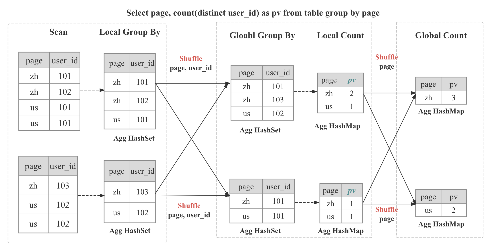

# Query Profile Structure and Metrics

## Overview

A Query Profile is a detailed report that provides insights into the execution of a SQL query within StarRocks. It offers a comprehensive view of the query's performance, including the time spent on each operation, the amount of data processed, and other relevant metrics. This information is invaluable for optimizing query performance, identifying bottlenecks, and troubleshooting issues.

## Quick-Start

> **Why this matters:** 80 % of real-world slow queries are solved by spotting one of three red-flag metrics. This cheat-sheet gets you there before you drown in numbers.

### 1 Open the profile side-by-side with your SQL
Run `ANALYZE PROFILE FOR <query_id>\G` or click **Profile** in the CelerData Web UI.  

### 2 Skim the “Execution Overview” banner

Examine key metrics for overall execution performance:
- QueryExecutionWallTime: Total wall clock time for query execution
- QueryPeakMemoryUsagePerNode: Peak memory usage per node, with values exceeding 80% of BE memory indicating potential risks of data spill or Out-of-Memory (OOM) errors
- QueryCumulativeCpuTime / WallTime < 0.5 * num_cpu_cores means CPU is waiting (likely I/O or network)

If none fire, your query is usually fine—stop here.

### 3 Drill one level deeper

Identify the operators that consume the most time or the most memory, analyze their metrics, and determine the underlying cause to pinpoint performance bottlenecks.

The "Operator Metrics" section offers numerous guidelines to aid in identifying the root cause of performance issues.

## Core Concepts

### Query Execution Flow

The comprehensive execution flow of a SQL query involves the following stages:
1. **Planning**: The query undergoes parsing, analysis, and optimization, culminating in the generation of a query plan.
2. **Scheduling**: The scheduler and coordinator work together to distribute the query plan to all participating backend nodes.
3. **Execution**: The query plan is executed using the pipeline execution engine.


### Query Plan Structure

The StarRocks execution engine is designed to execute queries in a distributed manner, and the structure of a Query Profile reflects this design. The following components make up the distributed query plan:

- **Fragment**: The highest level of the execution tree, representing a logical unit of work. A query can be divided into one or more fragments.
- **FragmentInstance**: Each fragment is instantiated multiple times, with each instance (FragmentInstance) executed on a different computing node. This allows for parallel processing across nodes.
- **Pipeline**: A FragmentInstance is further divided into multiple pipelines, which are sequences of connected Operator instances. Pipelines define the execution path for a FragmentInstance.
- **PipelineDriver**: To maximize the utilization of computing resources, each pipeline can have multiple instances, known as PipelineDrivers. These drivers execute the pipeline in parallel, leveraging multiple computing cores.
- **Operator**: The fundamental execution unit, an Operator instance is a part of a PipelineDriver. Operators implement specific algorithms, such as aggregation, join, or scan, to process data.


### Pipeline Execution Engine Concepts

The Pipeline Engine is a key component of the StarRocks execution engine. It is responsible for executing the query plan in a parallel and efficient manner. The Pipeline Engine is designed to handle complex query plans and large volumes of data, ensuring high performance and scalability.

Key concepts in the Pipeline Engine:
- **Operator**: A fundamental unit of execution responsible for implementing specific algorithms (e.g., aggregation, join, scan)
- **Pipeline**: A sequence of connected Operator instances representing the execution path
- **PipelineDriver**: Multiple instances of a pipeline for parallel execution
- **Schedule**: Non-blocking scheduling of pipelines using user-space time-slicing


### Metric Merging Strategy

By default, StarRocks merges the FragmentInstance and PipelineDriver layers to reduce profile volume, resulting in a simplified three-layer structure:
- Fragment
- Pipeline
- Operator

You can control this merging behavior through the session variable `pipeline_profile_level`:
- `1` (Default): Merged three-layer structure
- `2`: Original five-layer structure
- Other values: Treated as `1`

When merging metrics, different strategies are used based on metric type:

- **Time-related metrics**: Take the average
  - Example: `OperatorTotalTime` is the average time consumption
  - `__MAX_OF_OperatorTotalTime` and `__MIN_OF_OperatorTotalTime` record extremes

- **Non-time-related metrics**: Sum the values
  - Example: `PullChunkNum` is the sum across all instances
  - `__MAX_OF_PullChunkNum` and `__MIN_OF_PullChunkNum` record extremes

- **Constant metrics**: Same value across all instances (e.g., `DegreeOfParallelism`)

Significant differences between MIN and MAX values often indicate data skew, particularly in aggregation and join operations.

## Query Profile Metrics

### Summary Metrics

Basic information about the query execution:

| Metric | Description |
|--------|-------------|
| Total | The total time consumed by the query, including Planning, Executing, and Profiling phase durations. |
| Query State | Query state, possible states include Finished, Error, and Running. |
| Query ID | Unique identifier for the query. |
| Start Time | Timestamp when the query started. |
| End Time | Timestamp when the query ended. |
| Total | Total duration of the query. |
| Query Type | Type of the query. |
| Query State | Current state of the query. |
| StarRocks Version | Version of StarRocks used. |
| User | User who executed the query. |
| Default Db | Default database used for the query. |
| Sql Statement | SQL statement executed. |
| Variables | Important variables used for the query. |
| NonDefaultSessionVariables | Non-default session variables used for the query. |
| Collect Profile Time | Time taken to collect the profile. |
| IsProfileAsync | Indicates if the profile collection was asynchronous. |


### Planner Metrics

It provides a comprehensive overview of the planner. Typically, if the total time spent on the planner is less than 10ms, it is not a cause for concern.

In certain scenarios, the planner may require more time:
1. Complex queries may necessitate additional time for parsing and optimization to ensure an optimal execution plan.
2. The presence of numerous materialized views can increase the time required for query rewriting.
3. When multiple concurrent queries exhaust system resources and the query queue is utilized, the `Pending` time may be prolonged.
4. Queries involving external tables may incur additional time for communication with the external metadata server.


Example:
```
     - -- Parser[1] 0
     - -- Total[1] 3ms
     -     -- Analyzer[1] 0
     -         -- Lock[1] 0
     -         -- AnalyzeDatabase[1] 0
     -         -- AnalyzeTemporaryTable[1] 0
     -         -- AnalyzeTable[1] 0
     -     -- Transformer[1] 0
     -     -- Optimizer[1] 1ms
     -         -- MVPreprocess[1] 0
     -         -- MVTextRewrite[1] 0
     -         -- RuleBaseOptimize[1] 0
     -         -- CostBaseOptimize[1] 0
     -         -- PhysicalRewrite[1] 0
     -         -- DynamicRewrite[1] 0
     -         -- PlanValidate[1] 0
     -             -- InputDependenciesChecker[1] 0
     -             -- TypeChecker[1] 0
     -             -- CTEUniqueChecker[1] 0
     -             -- ColumnReuseChecker[1] 0
     -     -- ExecPlanBuild[1] 0
     - -- Pending[1] 0
     - -- Prepare[1] 0
     - -- Deploy[1] 2ms
     -     -- DeployLockInternalTime[1] 2ms
     -         -- DeploySerializeConcurrencyTime[2] 0
     -         -- DeployStageByStageTime[6] 0
     -         -- DeployWaitTime[6] 1ms
     -             -- DeployAsyncSendTime[2] 0
     - DeployDataSize: 10916
    Reason:
```


### Execution Overview Metrics

High-level execution statistics:

| Metric | Description | Rule of Thumb |
|--------|-------------|---------------|
| FrontendProfileMergeTime | FE-side profile processing time | < 10ms normal |
| QueryAllocatedMemoryUsage | Total allocated memory across nodes | |
| QueryDeallocatedMemoryUsage | Total deallocated memory across nodes | |
| QueryPeakMemoryUsagePerNode | Maximum peak memory per node | < 80% capacity normal |
| QuerySumMemoryUsage | Total peak memory across nodes | |
| QueryExecutionWallTime | Wall time of execution | |
| QueryCumulativeCpuTime | Total CPU time across nodes | Compare with `walltime * totalCpuCores` |
| QueryCumulativeOperatorTime | Total operator execution time | Denominator for operator time percentages |
| QueryCumulativeNetworkTime | Total Exchange node network time | |
| QueryCumulativeScanTime | Total Scan node IO time | |
| QueryPeakScheduleTime | Maximum Pipeline ScheduleTime | < 1s normal for simple queries |
| QuerySpillBytes | Data spilled to disk | < 1GB normal |

### Fragment Metrics

Fragment-level execution details:

| Metric | Description |
|--------|-------------|
| InstanceNum | Number of FragmentInstances |
| InstanceIds | IDs of all FragmentInstances |
| BackendNum | Number of participating BEs |
| BackendAddresses | BE addresses |
| FragmentInstancePrepareTime | Fragment Prepare phase duration |
| InstanceAllocatedMemoryUsage | Total allocated memory for instances |
| InstanceDeallocatedMemoryUsage | Total deallocated memory for instances |
| InstancePeakMemoryUsage | Peak memory across instances |

### Pipeline Metrics

Pipeline execution details and relationships:


Key relationships:
- DriverTotalTime = ActiveTime + PendingTime + ScheduleTime
- ActiveTime = ∑ OperatorTotalTime + OverheadTime
- PendingTime = InputEmptyTime + OutputFullTime + PreconditionBlockTime + PendingFinishTime
- InputEmptyTime = FirstInputEmptyTime + FollowupInputEmptyTime

| Metric | Description |
|--------|-------------|
| DegreeOfParallelism | Degree of pipeline execution parallelism. |
| TotalDegreeOfParallelism | Sum of degrees of parallelism. Since the same Pipeline may execute on multiple machines, this item aggregates all values. |
| DriverPrepareTime | Time taken by the Prepare phase. This metric is not included in DriverTotalTime. |
| DriverTotalTime | Total execution time of the Pipeline, excluding the time spent in the Prepare phase. |
| ActiveTime | Execution time of the Pipeline, including the execution time of each operator and the overall framework overhead, such as time spent in invoking methods like has_output, need_input, etc. |
| PendingTime | Time the Pipeline is blocked from being scheduled for various reasons. |
| InputEmptyTime | Time the Pipeline is blocked due to an empty input queue. |
| FirstInputEmptyTime | Time the Pipeline is first blocked due to an empty input queue. The first blocking time is separately calculated because the first blocking is mainly caused by Pipeline dependencies. |
| FollowupInputEmptyTime | Time the Pipeline is subsequently blocked due to an empty input queue. |
| OutputFullTime | Time the Pipeline is blocked due to a full output queue. |
| PreconditionBlockTime | Time the Pipeline is blocked due to unmet dependencies. |
| PendingFinishTime | Time the Pipeline is blocked waiting for asynchronous tasks to finish. |
| ScheduleTime | Scheduling time of the Pipeline, from entering the ready queue to being scheduled for execution. |
| BlockByInputEmpty | Number of times the pipeline is blocked due to InputEmpty. |
| BlockByOutputFull | Number of times the pipeline is blocked due to OutputFull. |
| BlockByPrecondition | Number of times the pipeline is blocked due to unmet preconditions. |

### Operator Metrics

| Metric | Description |
|--------|-------------|
| PrepareTime | Time spent on preparation. |
| OperatorTotalTime | Total time consumed by the Operator. It satisfies the equation: OperatorTotalTime = PullTotalTime + PushTotalTime + SetFinishingTime + SetFinishedTime + CloseTime. It excludes time spent on preparation. |
| PullTotalTime | Total time the Operator spends executing push_chunk. |
| PushTotalTime | Total time the Operator spends executing pull_chunk. |
| SetFinishingTime | Total time the Operator spends executing set_finishing. |
| SetFinishedTime | Total time the Operator spends executing set_finished. |
| PushRowNum | Cumulative number of input rows for the Operator. |
| PullRowNum | Cumulative number of output rows for the Operator. |
| JoinRuntimeFilterEvaluate | Number of times Join Runtime Filter is evaluated. |
| JoinRuntimeFilterHashTime | Time spent computing hash for Join Runtime Filter. |
| JoinRuntimeFilterInputRows | Number of input rows for Join Runtime Filter. |
| JoinRuntimeFilterOutputRows | Number of output rows for Join Runtime Filter. |
| JoinRuntimeFilterTime | Time spent on Join Runtime Filter. |

### Scan Operator


To facilitate a better understanding of the various metrics within the Scan Operator, the following diagram demonstrates the associations between these metrics and storage structures.


To retrieve data from disk and apply the predicates, the storage engine utilize several techniques:
1. **Data Storage**: Encoded and compressed data is stored on disk in segments, accompanied by various indices.
2. **Index Filtering**: The engine leverages indices such as BitmapIndex, BloomfilterIndex, ZonemapIndex, ShortKeyIndex, and NGramIndex to skip unnecessary data.
3. **Pushdown Predicates**: Simple predicates, like `a > 1`, are pushed down to evaluate on specific columns.
4. **Late Materialization**: Only the required columns and filtered rows are retrieved from disk.
5. **Non-Pushdown Predicates**: Predicates that cannot be pushed down are evaluated.
6. **Projection Expression**: Expressions, such as `SELECT a + 1`, are computed.

#### Common Performance Bottlenecks and Their Solutions:

#####  Heavy Raw I/O or Slow Storage 

**Red-flag metrics / symptoms**:  BytesRead, RawRowsRead, CompressedBytesRead, ScanTime, IOTaskExecTime dominate 

**Why it slows down OLAP scan**:  Disk (or object-store) read bandwidth becomes the constraint 

**Solutions**:  Put hot data on NVMe/SSD, Enable storage cache 

#####  Poor Predicate 

**Red-flag metrics / symptoms**:  PushdownPredicates≈0; ExprFilterRows dominates; LIKE '%x%' or other complicated predicates 

**Why it slows down OLAP scan**:  More rows flow into CPU thread-pool because filters aren’t applied in storage layer 

**Solutions**:  Rewrite filters to simple comparisons, Build targeted MVs/indexes

#####  Low DOP or Thread-pool Saturation 

**Red-flag metrics / symptoms**:  High IOTaskWaitTime; low PeakIOTasks 

**Why it slows down OLAP scan**:  Too few parallel scan tasks or threads blocked waiting for I/O slots 

**Solutions**:  Increase the disk bandwidth or enlarge the cache 

#####  Tablet / Data Skew Across BEs 

**Red-flag metrics / symptoms**:  Large max-min gap for OperatorTotalTime or BytesRead; one tablet own most data 

**Why it slows down OLAP scan**:  One thread does disproportionate work, all others idle 

**Solutions**:  Hash-bucket on high-cardinality key; Increase number of buckets 

#####  Fragmented Rowsets & Tiny Segments 

**Red-flag metrics / symptoms**:  High RowsetsReadCount / SegmentsReadCount; long SegmentInit time 

**Why it slows down OLAP scan**:  Many small files force frequent open/seek calls 

**Solutions**:  Increase compactions threads or execute manual compacctions; Batch mini-loads 

#####  High number of soft-deleted records 

**Red-flag metrics / symptoms**:  High DeleteFilterRows 

**Why it slows down OLAP scan**:  Soft-delete will apply the delete predicate when reading 

**Solutions**:  Compact the data; Reduce the frequency of delete operations 
 

The Scan Operator utilizes an additional thread pool for executing IO tasks. Therefore, the relationship between time metrics for this node is illustrated below:


#### OLAP Scan Operator

The OLAP_SCAN Operator is responsible for reading data from StarRocks native tables.


| Metric | Description |
|--------|-------------|
| Table | Table name. |
| Rollup | Materialized view name. If no materialized view is hit, it is equivalent to the table name. |
| SharedScan | Whether the enable_shared_scan session variable is enabled. |
| TabletCount | Number of tablets. | 
| MorselsCount | Number of morsels, which is the basic IO execution unit. | 
| PushdownPredicates | Number of pushdown predicates. | 
| Predicates | Predicate expressions. | 
| BytesRead | Size of data read. | 
| CompressedBytesRead | Size of compressed data read from disk. | 
| UncompressedBytesRead | Size of uncompressed data read from disk. | 
| RowsRead | Number of rows read (after predicate filtering). | 
| RawRowsRead | Number of raw rows read (before predicate filtering). | 
| ReadPagesNum | Number of pages read. | 
| CachedPagesNum | Number of cached pages. | 
| ChunkBufferCapacity | Capacity of the Chunk Buffer. | 
| DefaultChunkBufferCapacity | Default capacity of the Chunk Buffer. | 
| PeakChunkBufferMemoryUsage | Peak memory usage of the Chunk Buffer. | 
| PeakChunkBufferSize | Peak size of the Chunk Buffer. | 
| PrepareChunkSourceTime | Time spent preparing the Chunk Source. | 
| ScanTime | Cumulative scan time. Scan operations are completed in an asynchronous I/O thread pool. | 
| IOTaskExecTime | Execution time of IO tasks. | 
| IOTaskWaitTime | Waiting time from successful submission to scheduled execution of IO tasks. | 
| SubmitTaskCount | Number of times IO tasks are submitted. | 
| SubmitTaskTime | Time spent on task submission. | 
| PeakIOTasks | Peak number of IO tasks. | 
| PeakScanTaskQueueSize | Peak size of the IO task queue. | 

#### Connector Scan Operator

It's similar to OLAP_SCAN operator but used for scan external tables like Iceberg/Hive/Hudi/Detal.

| Metric | Description |
|--------|-------------|
| DataSourceType | Data source type, can be HiveDataSource, ESDataSource, and so on. | 
| Table | Table name. | 
| TabletCount | Number of tablets. | 
| MorselsCount | Number of morsels. | 
| Predicates | Predicate expression. | 
| PredicatesPartition | Predicate expression applied to partitions. | 
| SharedScan | Whether the `enable_shared_scan` Session variable is enabled. | 
| ChunkBufferCapacity | Capacity of the Chunk Buffer. | 
| DefaultChunkBufferCapacity | Default capacity of the Chunk Buffer. | 
| PeakChunkBufferMemoryUsage | Peak memory usage of the Chunk Buffer. | 
| PeakChunkBufferSize | Peak size of the Chunk Buffer. | 
| PrepareChunkSourceTime | Time taken to prepare the Chunk Source. | 
| ScanTime | Cumulative time for scanning. Scan operation is completed in the asynchronous I/O thread pool. | 
| IOTaskExecTime | Execution time of I/O tasks. | 
| IOTaskWaitTime | Waiting time from successful submission to scheduled execution of IO tasks. | 
| SubmitTaskCount | Number of times IO tasks are submitted. | 
| SubmitTaskTime | Time taken to submit tasks. | 
| PeakIOTasks | Peak number of IO tasks. | 
| PeakScanTaskQueueSize | Peak size of the IO task queue. | 

### Exchange Operator

Exchange Operator is responsible for transmitting data between BE nodes. There can be several kinds of exchange operations: GATHER/BROADCAST/SHUFFLE.

Typical scenarios that can make Exchange Operator the bottleneck of a query:
1. Broadcast Join: This is a suitable method for a small table. However, in exceptional cases when the optimizer chooses a suboptimal query plan, it can lead to a significant increase in network bandwidth.
2. Shuffle Aggregation/Join: Shuffling a large table can result in a significant increase in network bandwidth.

#### Exchange Sink Operator

| Metric | Description |
|--------|-------------|
| ChannelNum | Number of channels. Generally, the number of channels is equal to the number of receivers. |
| DestFragments | List of destination FragmentInstance IDs. |
| DestID | Destination node ID. |
| PartType | Data distribution mode, including: UNPARTITIONED, RANDOM, HASH_PARTITIONED, and BUCKET_SHUFFLE_HASH_PARTITIONED. |
| SerializeChunkTime | Time taken to serialize chunks. |
| SerializedBytes | Size of serialized data. |
| ShuffleChunkAppendCounter | Number of Chunk Append operations when PartType is HASH_PARTITIONED or BUCKET_SHUFFLE_HASH_PARTITIONED. |
| ShuffleChunkAppendTime | Time taken for Chunk Append operations when PartType is HASH_PARTITIONED or BUCKET_SHUFFLE_HASH_PARTITIONED. |
| ShuffleHashTime | Time taken to calculate hash when PartType is HASH_PARTITIONED or BUCKET_SHUFFLE_HASH_PARTITIONED. |
| RequestSent | Number of data packets sent. |
| RequestUnsent | Number of unsent data packets. This metric is non-zero when there is a short-circuit logic; otherwise, it is zero. |
| BytesSent | Size of sent data. |
| BytesUnsent | Size of unsent data. This metric is non-zero when there is a short-circuit logic; otherwise, it is zero. |
| BytesPassThrough | If the destination node is the current node, data will not be transmitted over the network, which is called passthrough data. This metric indicates the size of such passthrough data. Passthrough is controlled by `enable_exchange_pass_through`. |
| PassThroughBufferPeakMemoryUsage | Peak memory usage of the PassThrough Buffer. |
| CompressTime | Compression time. |
| CompressedBytes | Size of compressed data. |
| OverallThroughput | Throughput rate. |
| NetworkTime | Time taken for data packet transmission (excluding post-reception processing time). |
| NetworkBandwidth | Estimated network bandwidth. |
| WaitTime | Waiting time due to a full sender queue. |
| OverallTime | Total time for the entire transmission process, i.e., from sending the first data packet to confirming the correct reception of the last data packet. |
| RpcAvgTime | Average time for RPC. |
| RpcCount | Total number of RPCs. |

#### Exchange Source Operator

| Metric | Description |
|--------|-------------|
| RequestReceived | Size of received data packets. |
| BytesReceived | Size of received data. |
| DecompressChunkTime | Time taken to decompress chunks. |
| DeserializeChunkTime | Time taken to deserialize chunks. |
| ClosureBlockCount | Number of blocked Closures. |
| ClosureBlockTime | Blocked time for Closures. |
| ReceiverProcessTotalTime | Total time taken for receiver-side processing. |
| WaitLockTime | Lock waiting time. |

### Aggregate Operator


Aggregate Operator is responsible for executing aggregation functions, `GROUP BY`, and `DISTINCT`. 


**Multi forms of aggregation algorithm**

| Form | When the planner chooses it | Internal data structure | Highlights / caveats |
|------|----------------------------|-------------------------|-----------------------|
| Hash aggregation | keys fit into memory; cardinality not extreme | Compact hash table with SIMD probing | default path, excellent for modest key counts |
| Sorted aggregation | input already ordered on the GROUP BY keys | Simple row comparison + running state | zero hash table cost, often 2-3× faster on probing heavy skews |
| Spillable aggregation (3.2+) | hash table outsizes memory limit | Hybrid hash/merge with disk spill partitions | prevents OOM, preserves pipeline parallelism |

**Multi-Stage Distributed Aggregation**

In StarRocks the aggregation is implemented in distributed manner, which can be multi-stage depends on the query pattern and optimizer decision.

```
┌─────────┐        ┌──────────┐        ┌────────────┐        ┌────────────┐
│ Stage 0 │ local  │ Stage 1  │ shard/ │ Stage 2    │ gather/│ Stage 3    │ final
│ Partial │───►    │ Update   │ hash   │ Merge      │ shard  │ Finalize   │ output
└─────────┘        └──────────┘        └────────────┘        └────────────┘
```

| Stages | When Used | What Happens |
|--------|------------|--------------|
| One-stage | The `DISTRIBUTED BY` is a subset of `GROUP BY`, the partitions are colocated | Partial aggregates immediately become the final result. |
| Two-stage (local + global) | Typical distributed `GROUP BY` | Stage 0 inside each BE collapses duplicates adaptively; Stage 1 shuffles data based on `GROUP BY` then perform global aggregation |
| Three-stage (local + shuffle + final) | Heavy `DISTINCT` and high-cardianlity `GROUP BY` | Stage 0 as above; Stage 1 shuffles by `GROUP BY`, then aggregate by `GROUP BY` and `DISTINCT`; Stage 2 merges partial state as `GROUP BY` |
| Four-stage (local + partial + intermediate + final) | Heavy `DISTINCT` and low-cardinality `GROUP BY` | Introduce an additional stage to shuffle by `GROUP BY` and `DISTINCT` to avoid single-point bottleneck |


**Common Performance Bottlenecks and Their Solutions:**

###  Bottleneck Cause

####  High-cardinality `GROUP BY` → oversize hash table 

**Red-flag metrics / symptoms**:  HashTableSize, HashTableMemoryUsage, and AggComputeTime balloon; query gets close to memory limit 

**Why it hurts Agg operators**:  Hash-aggregate builds one entry per group; if millions of groups land in RAM the hash table becomes CPU- and memory-bound and can even spill 

**Solutions**:  Enable sorted streaming aggregate; Add pre-aggregated MVs or roll-ups; Reduce key width / cast to `INT` 

####  Data-skewed shuffle between partial → final stages 

**Red-flag metrics / symptoms**:  Huge gap in HashTableSize or InputRowCount across instances; one fragment’s AggComputeTime dwarfs others 

**Why it hurts Agg operators**:  A single backend receives most of the hot keys and blocks the pipeline 

**Solutions**:  Add salt column in the aggregation; Use `DISTINCT [skew]` hint 

####  Expensive or `DISTINCT`-style aggregate functions (e.g., `ARRAY_AGG`, `HLL_UNION`, `BITMAP_UNION`, `COUNT(DISTINCT)`) 

**Red-flag metrics / symptoms**:  AggregateFunctions dominates operator time; CPU still near 100 % after hash build finishes 

**Why it hurts Agg operators**:  State-heavy aggregation functions keep sizable sketches and run SIMD-heavy loops each row 

**Solutions**:  Pre-compute HLL/Bitmap columns at ingest; Use approx_count_distinct or multi_distinct_* where accuracy allows; 

####  Poor first-stage (partial) aggregation 

**Red-flag metrics / symptoms**:  Very large InputRowCount, but AggComputeTime is modest; PassThroughRowCount is high; upstream EXCHANGE shows massive BytesSent 

**Why it hurts Agg operators**:  If partial aggregation on each BE doesn't pre-aggregate the dataset well, most raw rows traverse the network and pile up in the final AGG 

**Solutions**:  Confirm plan shows two- or three-stage aggregation; Rewrite query to simple `GROUP BY` keys so optimizer can push partial AGG; set streaming_preaggregation_mode = 'force_preaggregation' 

####  Heavy expression evaluation on `GROUP BY` keys 

**Red-flag metrics / symptoms**:  ExprComputeTime high relative to `AggComputeTime` 

**Why it hurts Agg operators**:  Complex functions on every row before hashing dominate CPU 

**Solutions**:  Materialize computed keys in a sub-query or generated column; Use column dictionary / pre-encoded values; Project downstream instead 


**Metrics List**

| Metric | Description |
|--------|-------------|
| `GroupingKeys` | `GROUP BY` columns. |
| `AggregateFunctions` | Time taken for aggregate function calculations. |
| `AggComputeTime` | Time for AggregateFunctions + Group By. |
| `ChunkBufferPeakMem` | Peak memory usage of the Chunk Buffer. |
| `ChunkBufferPeakSize` | Peak size of the Chunk Buffer. |
| `ExprComputeTime` | Time for expression computation. |
| `ExprReleaseTime` | Time for expression release. |
| `GetResultsTime` | Time to extract aggregate results. |
| `HashTableSize` | Size of the Hash Table. |
| `HashTableMemoryUsage` | Memory size of the Hash Table. |
| `InputRowCount` | Number of input rows. |
| `PassThroughRowCount` | In Auto mode, the number of data rows processed in streaming mode after low aggregation leads to degradation to streaming mode. |
| `ResultAggAppendTime` | Time taken to append aggregate result columns. |
| `ResultGroupByAppendTime` | Time taken to append Group By columns. |
| `ResultIteratorTime` | Time to iterate over the Hash Table. |
| `StreamingTime` | Processing time in streaming mode. |

### Join Operator


Join Operator is responsible for implementing explicit join or implicit joins.

During execution the join operator is split into Build (hash-table construction) and Probe phases that run in parallel inside the pipeline engine. Vector chunks (up to 4096 rows) are batch-hashed with SIMD; consumed keys generate runtime filters—Bloom or IN filters—pushed back to upstream scans to cut probe input early.

**Join Strategies**

StarRocks relies on a vectorized, pipeline-friendly hash-join core that can be wired into four physical strategies the cost-based optimizer weighs at plan time:

| Strategy | When the optimizer picks it | What makes it fast |
|----------|-----------------------------|---------------------|
| Colocate Join | Both tables belong to the same colocation group (identical bucket keys, bucket count, and replica layout).   | No network shuffle: each BE joins only its local buckets. |
| Bucket-Shuffle Join | One of join tables has the same buckket key with join key | Only need to shuffle one join table, which can reduce the network cost |
| Broadcast Join | Build side is very small (row/byte thresholds or explicit hint).   | Small table is replicated to every probe node; avoids shuffling large table. |
| Shuffle (Hash) Join | General case, keys don’t align. | Hash-partition each row on the join key so probes are balanced across BEs. |


**When joins become the bottleneck**

####  Build-side table too large for RAM 

**Profile symptoms / hot metrics**:  BuildRows, HashTableSize, BuildHashTableTime dominate; memory near limit or spills 

**Why it hurts**:  Hash table has to live in memory, can become slow if it cannot fit into CPU cache 

**Solutions**:
- smaller table as build side
- Add pre-aggregation or selective projection
- Boost query/BE memory or enable hash-spill 

####  Large join probe time 

**Profile symptoms / hot metrics**:  High SearchHashTableTime 

**Why it hurts**:  Inefficient data clustering can lead to poor CPU cache locality 

**Solutions**:  Optimize data clustering by sorting the probe table on join keys 

####  Excessive Output Columns 

**Profile symptoms / hot metrics**:  High OutputBuildColumnTime or OutputProbeColumnTime 

**Why it hurts**:  The processing of numerous output columns necessitates substantial data copying, which can be CPU-intensive 

**Solutions**:  Optimize output columns by reducing their number; Exclude heavy columns from output; Consider retrieving unnecessary columns post-join 

####  Data skew after shuffle 

**Profile symptoms / hot metrics**:  One fragment’s ProbeRows ≫ others; OperatorTotalTime highly unbalanced 

**Why it hurts**:  A single BE receives most hot keys; others go idle 

**Solutions**: 
- Use higher-cardinality key
- pad composite key (concat(key,'-',mod(id,16))) 

####  Broadcasting a not-so-small table 

**Profile symptoms / hot metrics**:  Join type is BROADCAST; BytesSent and SendBatchTime soar on every BE 

**Why it hurts**:  O(N²) network traffic and deserialisation 

**Solutions**: 
- Let optimizer pick shuffle (`SET broadcast_row_limit = lower`)
- Force shuffle hint
- Analyze table to collect statistics.  

####  Missing or ineffective runtime filters 

**Profile symptoms / hot metrics**:  JoinRuntimeFilterEvaluate small, scans still read full table 

**Why it hurts**:  Scans push all rows into probe side, wasting CPU & I/O 

**Solutions**:  Rewrite join predicate to pure equality so RF can be generated; Avoid doing type casting in join key 

####  Non-equi (nested-loop) join sneak-in 

**Profile symptoms / hot metrics**:  Join node shows `CROSS` or `NESTLOOP`; ProbeRows*BuildRows skyrockets 

**Why it hurts**:  O(rows×rows) comparisons; no hash key 

**Solutions**: 
- Add proper equality predicate or pre-filter
- Materialise predicate result in temporary table, then re-join 

####  Hash-key casting / expression cost 

**Profile symptoms / hot metrics**:  High ExprComputeTime; hash function time rivals probe time 

**Why it hurts**:  Keys must be cast or evaluated per row before hashing 

**Solutions**: 
- Store keys with matching types
- Pre-compute complex expressions into generated columns 

####  No colocation on large join 

**Profile symptoms / hot metrics**:  Shuffle join between fact and dimension though buckets match 

**Why it hurts**:  Random placement forces shuffle every query 

**Solutions**: 
- Put two tables in the same colocation group
- Verify identical bucket count/key before ingest 

**Metrics List**

| Metric | Description |
|--------|-------------|
| DistributionMode | Distribution type, including: BROADCAST, PARTITIONED, COLOCATE, etc. |
| JoinPredicates | Join predicates. |
| JoinType | Join type. |
| BuildBuckets | Number of buckets in the Hash Table. |
| BuildKeysPerBucket | Number of keys per bucket in the Hash Table. |
| BuildConjunctEvaluateTime | Time taken for conjunct evaluation during build phase. |
| BuildHashTableTime | Time taken to build the Hash Table. |
| ProbeConjunctEvaluateTime | Time taken for conjunct evaluation during probe phase. |
| SearchHashTableTimer | Time taken to search the Hash Table. |
| CopyRightTableChunkTime | Time taken to copy chunks from the right table. |
| OutputBuildColumnTime | Time taken to output the column of build side. |
| OutputProbeColumnTime | Time taken to output the column of probe side. |
| HashTableMemoryUsage | Memory usage of the Hash Table. |
| RuntimeFilterBuildTime | Time taken to build runtime filters. |
| RuntimeFilterNum | Number of runtime filters. |

### Window Function Operator

| Metric | Description |
|--------|-------------|
| ProcessMode | Execution mode, including two parts: the first part includes Materializing and Streaming; the second part includes Cumulative, RemovableCumulative, ByDefinition. |
| ComputeTime | Time taken for window function calculations. |
| PartitionKeys | Partition columns. |
| AggregateFunctions | Aggregate functions. |
| ColumnResizeTime | Time taken for column resizing. |
| PartitionSearchTime | Time taken to search partition boundaries. |
| PeerGroupSearchTime | Time taken to search Peer Group boundaries. Meaningful only when the window type is `RANGE`. |
| PeakBufferedRows | Peak number of rows in the buffer. |
| RemoveUnusedRowsCount | Number of times unused buffers are removed. |
| RemoveUnusedTotalRows | Total number of rows removed from unused buffers. |

### Sort Operator

| Metric | Description |
|--------|-------------|
| SortKeys | Sorting keys. |
| SortType | Query result sorting method: full sorting or sorting the top N results. |
| MaxBufferedBytes | Peak size of buffered data. |
| MaxBufferedRows | Peak number of buffered rows. |
| NumSortedRuns | Number of sorted runs. |
| BuildingTime | Time taken to maintain internal data structures during sorting. |
| MergingTime | Time taken to merge sorted runs during sorting. |
| SortingTime | Time taken for sorting. |
| OutputTime | Time taken to build the output sorted sequence. |

### Merge Operator

For ease of understanding various metrics, Merge can be represented as the following state mechanism:

```plaintext
               ┌────────── PENDING ◄──────────┐
               │                              │
               │                              │
               ├──────────────◄───────────────┤
               │                              │
               ▼                              │
   INIT ──► PREPARE ──► SPLIT_CHUNK ──► FETCH_CHUNK ──► FINISHED
               ▲
               |
               | one traverse from leaf to root
               |
               ▼
            PROCESS
```


| Metric | Description | Level |
|--------|-------------|-------|
| Limit | Limit. | Primary |
| Offset | Offset. | Primary |
| StreamingBatchSize | Size of data processed per Merge operation when Merge is performed in Streaming mode | Primary |
| LateMaterializationMaxBufferChunkNum | Maximum number of chunks in the buffer when late materialization is enabled. | Primary |
| OverallStageCount | Total execution count of all stages. | Primary |
| OverallStageTime | Total execution time for each stage. | Primary |
| 1-InitStageCount | Execution count of the Init stage. | Secondary |
| 2-PrepareStageCount | Execution count of the Prepare stage. | Secondary |
| 3-ProcessStageCount | Execution count of the Process stage. | Secondary |
| 4-SplitChunkStageCount | Execution count of the SplitChunk stage. | Secondary |
| 5-FetchChunkStageCount | Execution count of the FetchChunk stage. | Secondary |
| 6-PendingStageCount | Execution count of the Pending stage. | Secondary |
| 7-FinishedStageCount | Execution count of the Finished stage. | Secondary |
| 1-InitStageTime | Execution time for the Init stage. | Secondary |
| 2-PrepareStageTime | Execution time for the Prepare stage. | Secondary |
| 3-ProcessStageTime | Execution time for the Process stage. | Secondary |
| 4-SplitChunkStageTime | Time taken for the Split stage. | Secondary |
| 5-FetchChunkStageTime | Time taken for the Fetch stage. | Secondary |
| 6-PendingStageTime | Time taken for the Pending stage. | Secondary |
| 7-FinishedStageTime | Time taken for the Finished stage. | Secondary |
| LateMaterializationGenerateOrdinalTime | Time taken for generating ordinal columns during late materialization. | Tertiary |
| SortedRunProviderTime | Time taken to retrieve data from the provider during the Process stage. | Tertiary |

### TableFunction Operator

| Metric | Description |
|--------|-------------|
| TableFunctionExecTime | Computation time for the Table Function. |
| TableFunctionExecCount | Number of executions for the Table Function. |

### Project Operator

Project Operator is responsible for performing `SELECT <expr>`. If there're some expensive expressions in the query, this operator can take significant time.


| Metric | Description |
|--------|-------------|
| ExprComputeTime | Computation time for expressions. |
| CommonSubExprComputeTime | Computation time for common sub-expressions. |

### LocalExchange Operator

| Metric | Description |
|--------|-------------|
| Type | Type of Local Exchange, including: `Passthrough`, `Partition`, and `Broadcast`. |
| ShuffleNum | Number of shuffles. This metric is only valid when `Type` is `Partition`. |
| LocalExchangePeakMemoryUsage | Peak memory usage. |
| LocalExchangePeakBufferSize | Peak size of the buffer. |
| LocalExchangePeakBufferMemoryUsage | Peak memory usage of the buffer. |
| LocalExchangePeakBufferChunkNum | Peak number of chunks in the buffer. |
| LocalExchangePeakBufferRowNum | Peak number of rows in the buffer. |
| LocalExchangePeakBufferBytes | Peak size of data in the buffer. |
| LocalExchangePeakBufferChunkSize | Peak size of chunks in the buffer. |
| LocalExchangePeakBufferChunkRowNum | Peak number of rows per chunk in the buffer. |
| LocalExchangePeakBufferChunkBytes | Peak size of data per chunk in the buffer. |

### OlapTableSink Operator

OlapTableSink Operator is responsible for performing the `INSERT INTO <table>` operation.

:::tip
- An excessive difference between the Max and Min values of the PushChunkNum metric of OlapTableSink indicates data skew in the upstream operators, which may lead to a bottleneck in loading performance.
- RpcClientSideTime equals RpcServerSideTime plus network transmission time plus RPC framework processing time. If there is a significant difference between RpcClientSideTime and RpcServerSideTime, consider enabling compression to reduce transmission time.
:::

| Metric | Description |
|--------|-------------|
| IndexNum | Number of the synchronous materialized views created for the destination table. |
| ReplicatedStorage | Whether Single Leader Replication is enabled. |
| TxnID | ID of the loading transaction. |
| RowsRead | Number of rows read from upstream operators. |
| RowsFiltered | Number of rows filtered out due to inadequate data quality. |
| RowsReturned | Number of rows written to the destination table. |
| RpcClientSideTime | Total RPC time consumption for loading recorded by the client side. |
| RpcServerSideTime | Total RPC time consumption for loading recorded by the server side. |
| PrepareDataTime | Total time consumption for the data preparation phase, including data format conversion and data quality check. |
| SendDataTime | Local time consumption for sending the data, including time for serializing and compressing data, and for submitting tasks to the sender queue. |

