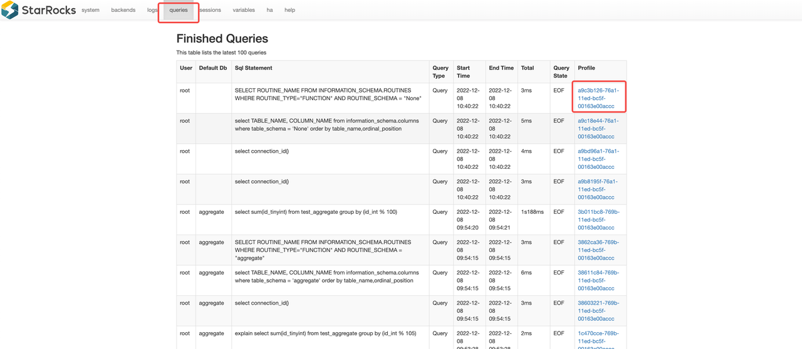

# Query Profile Overview

This topic introduces how to view and analyze the Query Profile. The Query Profile records execution information for all working nodes involved in a query. You can quickly identify bottlenecks affecting the query performance through Query Profile.

## Enable Query Profile

You can enable Query Profile by setting the variable `enable_profile` to `true`:

```SQL
SET enable_profile = true;
```

### Enable Query Profile for Slow Queries

It is not recommended to enable Query Profile in a production environment on a global, long-term basis. This is because the data collection and processing of Query Profile may impose additional burdens on the system. However, if you need to capture and analyze slow queries, you can enable Query Profile only for slow queries. This can be achieved by setting the variable `big_query_profile_threshold` to a time duration greater than `0s`. For example, if this variable is set to `30s`, it means that only queries with an execution time exceeding 30 seconds will trigger Query Profile. This ensures system performance while effectively monitoring slow queries.

```SQL
-- 30 seconds
SET global big_query_profile_threshold = 30s;

-- 500 milliseconds
SET global big_query_profile_threshold = 500ms;

-- 60 minutes
SET global big_query_profile_threshold = 60m;
```

### Enable Runtime Query Profile

Some queries may take a long time to execute, ranging from seconds to hours. Often, it is challenging to determine whether a query is still in progress or the system has crashed before the query completes. To address this issue, StarRocks introduced the Runtime Query Profile feature in v3.1 and later. This feature allows you to collect and report Query Profile data at fixed time intervals during query execution. This gives you the insight into the query's execution progress and potential bottlenecks in real-time, without waiting for the query to finish. In this way, you can monitor and optimize the query process more effectively.

When Query Profile is enabled, this feature is automatically activated, with a default reporting interval of 10 seconds. You can adjust the interval by modifying the variable `runtime_profile_report_interval`:

```SQL
SET runtime_profile_report_interval = 30;
```

Runtime Query Profile has the same format and content as regular Query Profile. You can analyze Runtime Query Profile just like analyzing regular Query Profile to understand the performance metrics of queries running in the cluster.

### Configure Query Profile Behavior

| Configuration Type | Configuration Item | Valid Values | Default Value | Description |
| -- | -- | -- | -- | -- |
| Session Variable | enable_profile | true/false | false | Whether to enable Query Profile. `true` means to enable this feature. |
| Session Variable | pipeline_profile_level | 1/2 | 1 | Set the level of Query Profile. `1` indicates merging the metrics of the Query Profile; `2` indicates retaining the original structure of the Query Profile. If this item is set as `2`, all visualization analysis tools will no longer be applicable, therefore, it is generally not recommended to change this value. |
| Session Variable | runtime_profile_report_interval | Positive integer | 10 | The report interval of Runtime Query Profile. Unit: second. |
| Session Variable | big_query_profile_threshold | String | `0s` | If the execution time of a big query excceds this value, Query Profile is automatically enbaled for this query. Setting this item to `0s` indicates this feature is disabled. Its value can be represented by a integral number followed by a unit, where the units can be `ms`, `s`, `m`. |
| FE Dynamic Configuration Item | enable_statistics_collect_profile | true/false | false | Whether to enable Query Profile for statistics collection-related queries. `true` means to enable this feature. |

### Obtain Query Profile via Web UI

Follow these steps to obtain Query Profile:

1. Access `http://<fe_ip>:<fe_http_port>` in your browser.
2. On the page that appears, click **queries** in the top navigation.
3. In the **Finished Queries** list, select the query you want to analyze and click the link in the **Profile** column.



You will be redirected to the detailed page of the selected Query Profile.


### Obtain Query Profile via get_query_profile

The following example shows how to obtain Query Profile via the function get_query_profile:

```Plain
-- Enable the profiling feature.
set enable_profile = true;
-- Run a simple query.
select 1;
-- Get the query_id of the query.
select last_query_id();
+--------------------------------------+
| last_query_id()                      |
+--------------------------------------+
| bd3335ce-8dde-11ee-92e4-3269eb8da7d1 |
+--------------------------------------+
-- Obtain the query profile.
select get_query_profile('502f3c04-8f5c-11ee-a41f-b22a2c00f66b')\G
```

## Analyze Query Profile

The raw content generated by Query Profile may contain numerous metrics. For detailed description of these metrics, see [Query Profile Structure and Detailed Metrics](./query_profile_details.md).

However, most users may find that it is not easy to analyze this raw text directly. To address this issue, StarRocks provides a [Text-based Query Profile Visualized Analysis](./query_profile_text_based_analysis.md) method. You can use this feature to gain a more intuitive understanding of the complex Query Profile.
