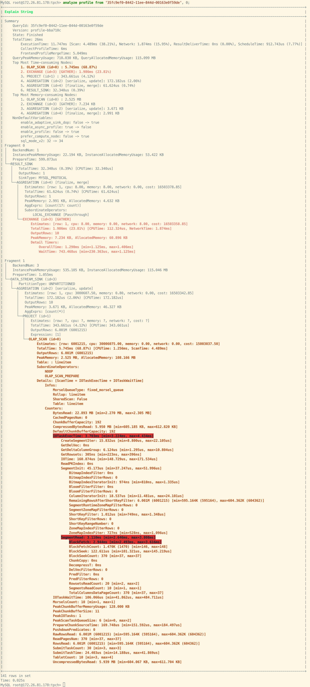

# Text-based Query Profile Visualized Analysis

This topic introduces how to obtain and analyze text-based Query Profiles through a MySQL client.

## Analyze Profiles of Existing Queries Using ANALYZE PROFILE

To analyze the text-based Profile of an existing (historical or running) query in you cluster, you first need to use the [SHOW PROFILELIST](../sql-reference/sql-statements/Administration/SHOW_PROFILELIST.md) statement to obtain a summary of the query. This command lists all queries that have finished successfully, failed with error, and those are still running (for more than 10 seconds and not yet finished). Through this statement, you can get the corresponding Query ID for subsequent analysis. The syntax is as follows:

```SQL
SHOW PROFILELIST [LIMIT <num>];
```

Examples:

```SQL
SHOW PROFILELIST;
SHOW PROFILELIST LIMIT 5;
```

Output:

```
+--------------------------------------+---------------------+-------+----------+-----------------------------------------------------------------------------------------------------------------------------------+
| QueryId                              | StartTime           | Time  | State    | Statement                                                                                                                         |
+--------------------------------------+---------------------+-------+----------+-----------------------------------------------------------------------------------------------------------------------------------+
| a40456b2-8428-11ee-8d02-6a32f8c68848 | 2023-11-16 10:34:18 | 21ms  | Finished | SELECT ROUTINE_NAME FROM INFORMATION_SCHEMA.ROUTINES\n    WHERE ROUTINE_TYPE="FUNCTION" AND ROUTINE_SCHEMA = "None"               |
| a3fc4060-8428-11ee-8d02-6a32f8c68848 | 2023-11-16 10:34:17 | 39ms  | Finished | select TABLE_NAME, COLUMN_NAME from information_schema.columns\n                                    where table_schema = 'Non ... |
| a3f7d38d-8428-11ee-8d02-6a32f8c68848 | 2023-11-16 10:34:17 | 15ms  | Finished | select connection_id()                                                                                                            |
| a3efbd3b-8428-11ee-8d02-6a32f8c68848 | 2023-11-16 10:34:17 | 16ms  | Finished | select connection_id()                                                                                                            |
| a26ec286-8428-11ee-8d02-6a32f8c68848 | 2023-11-16 10:34:15 | 269ms | Error    | EXPLAIN ANALYZE  SELECT c_nation, s_nation, year(lo_orderdate) AS year , SUM(lo_revenue) AS revenue FROM lineorder_flat WHER ...  |
+--------------------------------------+---------------------+-------+----------+-----------------------------------------------------------------------------------------------------------------------------------+
```

Once you have the Query ID, you can proceed with Query Profile analysis using the [ANALYZE PROFILE](../sql-reference/sql-statements/Administration/ANALYZE_PROFILE.md) statement. The syntax is as follows:

```SQL
ANALYZE PROFILE FROM '<Query_ID>' [, <Node_ID> [, ...] ]
```

- `Query_ID`: The ID corresponding to the query, obtained from the `SHOW PROFILELIST` statement.
- `Node_ID`: Profile node ID. For nodes whose IDs are specified, StarRocks returns detailed metric information for those node. For nodes whose IDs are not specified, StarRocks only returns the summary information.

The Profile includes the following sections:

- Summary: Summary information of the Profile.
  - QueryID
  - Version information
  - Query status, including `Finished`, `Error`, and `Running`.
  - Total query time.
  - Memory usage
  - Top 10 nodes with the highest CPU usage.
  - Top 10 nodes with the highest memory usage.
  - Session variables who has a different value from the default value.
- Fragments: Displays metrics for each node in each Fragment.
  - Time, memory usage, cost estimate information, and output rows for each node.
  - Nodes with a time usage percentage exceeding 30% are highlighted in red.
  - Nodes with a time usage percentage exceeding 15% and less than 30% are highlighted in pink.

Example 1: Querying the Query Profile without specifying node ID.


Example 2: Querying the Query Profile and specifying node ID as `0`. StarRocks returns all detailed metrics for Node ID `0` and highlights metrics with high usage for easier problem identification.



In addition, the above methods also support the display and analysis of Runtime Query Profile, that is, Profile generated for running queries. When the Query Profile feature is enabled, you can use this method to obtain the Profile of queries that are currently running for more than 10 seconds.

Compared to those of the finished queries, the text-based Query Profile for running queries contains the following information:

- Operator status:
  - ⏳: Operators not started. These operators may not have started execution due to dependency relationships.
  - 🚀: Running operators.
  - ✅: Operators that have finished execution.

- Overall progress: Calculated based on `number of running operators / total number of operators`. Due to the lack of detailed information on data rows, this value may be slightly distorted.

- Operator progress: Calculated based on `number of rows processed / total number of rows`. If the total number of rows cannot be calculated, the progress is displayed as `?`.

Example:


## Simulate a query for Profile Analysis Using EXPLAIN ANALYZE

StarRocs provides the [EXPLAIN ANALYZE](../sql-reference/sql-statements/Administration/EXPLAIN_ANALYZE.md) statement, allowing you to simulate and analyze the profile of a query directly. The syntax is as follows:

```SQL
EXPLAIN ANALYZE <sql_statement>
```

When executing `EXPLAIN ANALYZE`, StarRocks will, by default, enable the Query Profile feature for the current session.

Currently, `EXPLAIN ANALYZE` supports two types of SQL statements: SELECT statements and INSERT INTO statements. You can only simulate and analyze the Query Profile of INSERT INTO statements on internal tables within the default catalog of StarRocks. Please note that when simulating and analyzing the Query Profile of INSERT INTO statements, no actual data will be loaded. By default, the import transaction will be aborted to ensure that no unintended changes are made to the data during the analysis.

Example 1: Simulate and analyze a SELECT statement. The query result are discarded.


Example 2: Simulate and analyze an INSERT INTO statement. The loading transaction will be aborted.


## Limitations

- `EXPLAIN ANALYZE INSERT INTO` statements are only supported for tables in the default catalog.
- To achieve better visual effects, the output text contains ANSI characters to provide color, highlighting, and other features. It is recommended to use the MyCLI client. For clients that do not support ANSI features, such as the MySQL client, there may be some slight display disorders. Usually, they will not affect the usage. For example:


