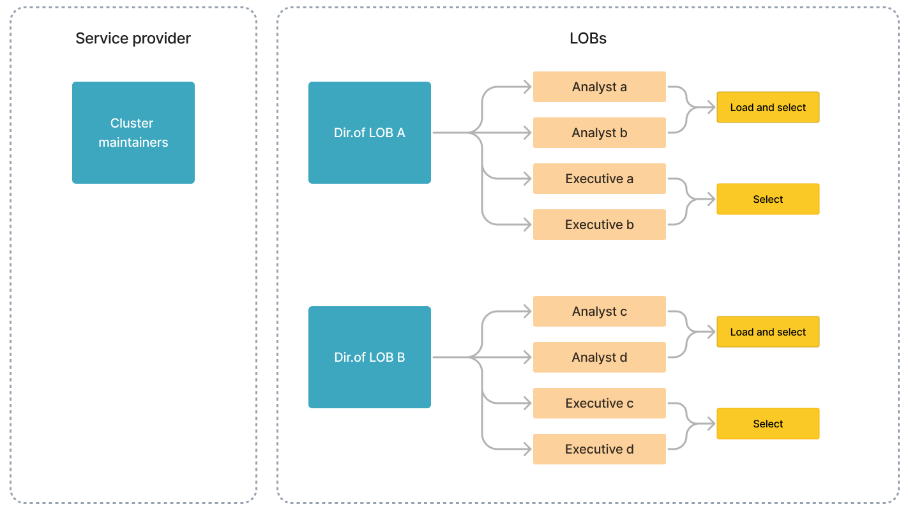
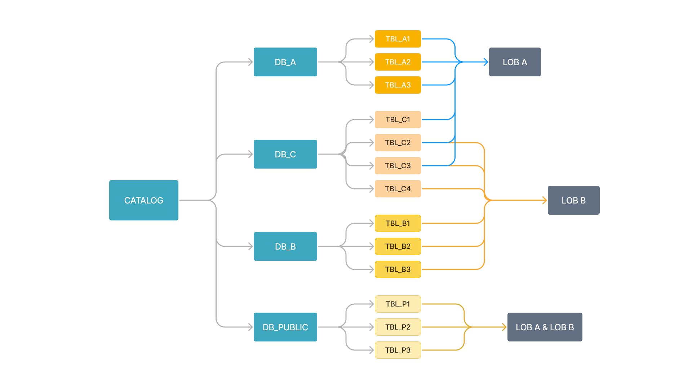
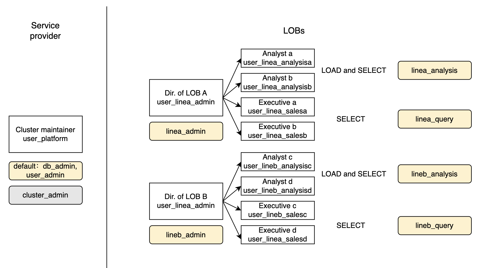

# Manage user privileges

import UserPrivilegeCase from '../../../_assets/commonMarkdown/userPrivilegeCase.mdx'
import GrantToGroup from '../../../_assets/commonMarkdown/grant_to_group.mdx'

This topic describes how to manage users, roles, and privileges in StarRocks.

StarRocks employs both role-based access control (RBAC) and identity-based access control (IBAC) to manage privileges within a StarRocks cluster, allowing cluster administrators to easily restrict privileges within the cluster on different granular levels.

Within a StarRocks cluster, privileges can be granted to users or roles. A role is a collection of privileges that can be assigned to users or other roles in the cluster as needed. A user can be granted one or more roles, which determine their permissions on different objects.

## View privilege and role information

Users with the system-defined role `user_admin` can view all the user and role information within the StarRocks cluster.

### View privilege information

You can view the privileges granted to a user or a role using [SHOW GRANTS](../../../sql-reference/sql-statements/account-management/SHOW_GRANTS.md).

- View the privileges of the current user.

  ```SQL
  SHOW GRANTS;
  ```

  > **NOTE**
  >
  > Any user can view their own privileges without needing any privileges.

- View the privileges of a specific user.

  The following example shows the privileges of the user `jack`:

  ```SQL
  SHOW GRANTS FOR jack@'172.10.1.10';
  ```

- View the privileges of a specific role.

  The following example shows the privileges of the role `example_role`:

  ```SQL
  SHOW GRANTS FOR ROLE example_role;
  ```

### View roles

You can view all the roles within the StarRocks cluster using [SHOW ROLES](../../../sql-reference/sql-statements/account-management/SHOW_ROLES.md).

```SQL
SHOW ROLES;
```

## Manage roles

Users with the system-defined role `user_admin` can create, grant, revoke, or drop roles in StarRocks.

### Create a role

You can create a role using [CREATE ROLE](../../../sql-reference/sql-statements/account-management/CREATE_ROLE.md). By default, a user can have a maximum of 64 roles. You can adjust this setting by using the FE dynamic parameter `privilege_max_total_roles_per_user`. A role can have a maximum of 16 inheritance levels. You can adjust this setting by using the FE dynamic parameter `privilege_max_role_depth`.

The following example creates the role `example_role`:

```SQL
CREATE ROLE example_role;
```

### Grant a role

You can grant roles to a user or another role using [GRANT](../../../sql-reference/sql-statements/account-management/GRANT.md).

- Grant a role to a user.

  The following example grants the role `example_role` to the user `jack`:

  ```SQL
  GRANT example_role TO USER jack@'172.10.1.10';
  ```

- Grant a role to another role.

  The following example grants the role `example_role` to the role `test_role`:

  ```SQL
  GRANT example_role TO ROLE test_role;
  ```

<GrantToGroup />

### Alter the default role of a user

The default role of a user is automatically activated when the user connects to StarRocks. For instructions on how to enable all (default and granted) roles for a user after connection, see [Enable all roles](#enable-all-roles).

You can set the default role of a user using [SET DEFAULT ROLE](../../../sql-reference/sql-statements/account-management/SET_DEFAULT_ROLE.md) or [ALTER USER](../../../sql-reference/sql-statements/account-management/ALTER_USER.md).

Both of the following examples set the default role of `jack` to `db1_admin`. Note that `db1_admin` must have been assigned to `jack`.

- Set the default role using SET DEFAULT ROLE:

  ```SQL
  SET DEFAULT ROLE 'db1_admin' TO jack@'172.10.1.10';
  ```

- Set the default role using ALTER USER:

  ```SQL
  ALTER USER jack@'172.10.1.10' DEFAULT ROLE 'db1_admin';
  ```

### Revoke a role

You can revoke roles from a user or another role using [REVOKE](../../../sql-reference/sql-statements/account-management/REVOKE.md).

> **NOTE**
>
> You cannot revoke the system-defined default role `PUBLIC` from a user.

- Revoke a role from a user.

  The following example revokes the role `example_role` from the user `jack`:

  ```SQL
  REVOKE example_role FROM USER jack@'172.10.1.10';
  ```

- Revoke a role from another role.

  The following example revokes the role `example_role` from the role `test_role`:

  ```SQL
  REVOKE example_role FROM ROLE test_role;
  ```

### Drop a role

You can drop a role using [DROP ROLE](../../../sql-reference/sql-statements/account-management/DROP_ROLE.md).

The following example drops the role `example_role`:

```SQL
DROP ROLE example_role;
```

> **CAUTION**
>
> System-defined roles cannot be dropped.

### Enable all roles

The default roles of a user are roles that are automatically activated each time the user connects to the StarRocks cluster.

If you want to enable all the roles (default and granted roles) for all StarRocks users when they connect to the StarRocks cluster, you can perform the following operation.

This operation requires the system privilege OPERATE.

```SQL
SET GLOBAL activate_all_roles_on_login = TRUE;
```

You can also use SET ROLE to activate the roles assigned to you. For example, user `jack@'172.10.1.10'` has roles `db_admin` and `user_admin` but they are not default roles of the user and are not automatically activated when the user connects to StarRocks. If `jack@'172.10.1.10'` needs to activate `db_admin` and `user_admin`, he can run `SET ROLE db_admin, user_admin;`. Note that SET ROLE overwrites original roles. If you want to enable all your roles, run SET ROLE ALL.

## Manage privileges

Users with the system-defined role `user_admin` can grant or revoke privileges in StarRocks.

### Grant privileges

You can grant privileges to a user or a role using [GRANT](../../../sql-reference/sql-statements/account-management/GRANT.md).

- Grant a privilege to a user.

  The following example grants the SELECT privilege on the table `sr_member` to the user `jack`, and allows `jack` to grant this privilege to other users or roles (by specifying WITH GRANT OPTION in the SQL):

  ```SQL
  GRANT SELECT ON TABLE sr_member TO USER jack@'172.10.1.10' WITH GRANT OPTION;
  ```

- Grant a privilege to a role.

  The following example grants the SELECT privilege on the table `sr_member` to the role `example_role`:

  ```SQL
  GRANT SELECT ON TABLE sr_member TO ROLE example_role;
  ```

<!--enterprise
- Grant a privilege to a user group. You can identify user groups from external authentication systems via [Group Provider](../group_provider.md).

  The following example grants the SELECT privilege on the table `sr_member` to the user group `analysts`:

  ```SQL
  GRANT SELECT ON TABLE sr_member TO EXTERNAL GROUP analysts;
  ```
-->

### Revoke privileges

You can revoke privileges from a user or a role using [REVOKE](../../../sql-reference/sql-statements/account-management/REVOKE.md).

- Revoke a privilege from a user.

  The following example revokes the SELECT privilege on the table `sr_member` from the user `jack`, and disallows `jack` to grant this privilege to other users or roles:

  ```SQL
  REVOKE SELECT ON TABLE sr_member FROM USER jack@'172.10.1.10';
  ```

- Revoke a privilege from a role.

  The following example revokes the SELECT privilege on the table `sr_member` from the role `example_role`:

  ```SQL
  REVOKE SELECT ON TABLE sr_member FROM ROLE example_role;
  ```

## Best practices

### Multi-service access control

Usually, a company-owned StarRocks cluster is managed by a sole service provider and maintains multiple lines of business (LOBs), each of which uses one or more databases.

As shown below, a StarRocks cluster's users include members from the service provider and two LOBs (A and B). Each LOB is operated by two roles - analysts and executives. Analysts generate and analyze business statements, and executives query the statements.



LOB A independently manages the database `DB_A`, and LOB B the database `DB_B`. LOB A and LOB B use different tables in `DB_C`. `DB_PUBLIC` can be accessed by all members of both LOBs.



Because different members perform different operations on different databases and tables, we recommend you create roles in accordance with their services and positions, apply only the necessary privileges to each role, and assign these roles to corresponding members. As shown below:



1. Assign the system-defined roles `db_admin`, `user_admin`, and `cluster_admin` to cluster maintainers, set `db_admin` and `user_admin` as their default roles for daily maintenance, and manually activate the role `cluster_admin` when they need to operate the nodes of the cluster.

   Example:

   ```SQL
   GRANT db_admin, user_admin, cluster_admin TO USER user_platform;
   ALTER USER user_platform DEFAULT ROLE db_admin, user_admin;
   ```

2. Create users for each member within the LOBs, and set complex passwords for each user.
3. Create roles for each position within the LOBs, and apply the corresponding privileges to each role.

   For the director of each LOB, grant their role the maximum collection of the privileges their LOBs need, and the corresponding GRANT privileges (by specifying WITH GRANT OPTION in the statement). Therefore, they can assign these privileges to the members of their LOB. Set the role as their default role if their daily work requires it.

   Example:

   ```SQL
   GRANT SELECT, ALTER, INSERT, UPDATE, DELETE ON ALL TABLES IN DATABASE DB_A TO ROLE linea_admin WITH GRANT OPTION;
   GRANT SELECT, ALTER, INSERT, UPDATE, DELETE ON TABLE TABLE_C1, TABLE_C2, TABLE_C3 TO ROLE linea_admin WITH GRANT OPTION;
   GRANT linea_admin TO USER user_linea_admin;
   ALTER USER user_linea_admin DEFAULT ROLE linea_admin;
   ```

   For analysts and executives, assign them the role with the corresponding privileges.

   Example:

   ```SQL
   GRANT SELECT ON ALL TABLES IN DATABASE DB_A TO ROLE linea_query;
   GRANT SELECT ON TABLE TABLE_C1, TABLE_C2, TABLE_C3 TO ROLE linea_query;
   GRANT linea_query TO USER user_linea_salesa;
   GRANT linea_query TO USER user_linea_salesb;
   ALTER USER user_linea_salesa DEFAULT ROLE linea_query;
   ALTER USER user_linea_salesb DEFAULT ROLE linea_query;
   ```

4. For the database `DB_PUBLIC`, which can be accessed by all cluster users, grant the SELECT privilege on `DB_PUBLIC` to the system-defined role `public`.

   Example:

   ```SQL
   GRANT SELECT ON ALL TABLES IN DATABASE DB_PUBLIC TO ROLE public;
   ```

You can assign roles to others to achieve role inheritance in complicated scenarios.

For example, if analysts require privileges to write into and query tables in `DB_PUBLIC`, and executives can only query these tables, you can create roles `public_analysis` and `public_sales`, apply relevant privileges to the roles, and assign them to the original roles of analysts and executives respectively.

Example:

```SQL
CREATE ROLE public_analysis;
CREATE ROLE public_sales;
GRANT SELECT, ALTER, INSERT, UPDATE, DELETE ON ALL TABLES IN DATABASE DB_PUBLIC TO ROLE public_analysis;
GRANT SELECT ON ALL TABLES IN DATABASE DB_PUBLIC TO ROLE public_sales;
GRANT public_analysis TO ROLE linea_analysis;
GRANT public_analysis TO ROLE lineb_analysis;
GRANT public_sales TO ROLE linea_query;
GRANT public_sales TO ROLE lineb_query;
```

### Customize roles based on scenarios

<UserPrivilegeCase />
