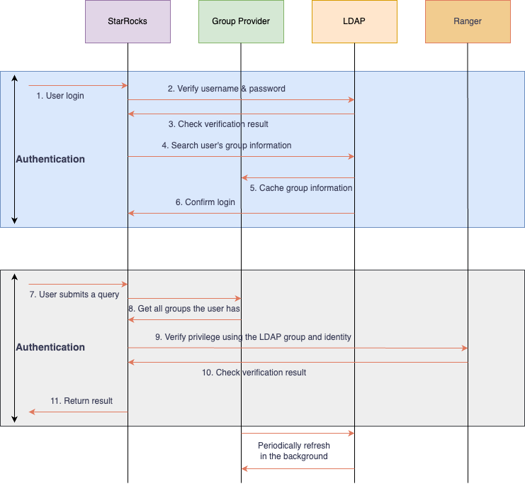

# Authenticate User Groups

Enable Group Provider in StarRocks to authenticate, and authorize user groups from external authentication systems.

From v3.5.0 onwards, StarRocks supports Group Provider to collect group information from external authentication systems for user group management.

## Overview

To deepen its integration with external user authentication and authorization systems, such as LDAP, OpenID Connect, OAuth 2.0, and Apache Ranger, StarRocks supports collecting user group information for a better experience on the collective user management.

With a group provider, you can fetch the group information from external user systems for different purposes. Group information is independent and can be integrated flexibly into authentication, authorization, or other processes without being tightly coupled to any specific workflow.

A Group Provider is essentially a mapping between users and groups. Any process that requires group information can query this mapping as needed.

### Workflow

The following flow chart uses LDAP and Apache Ranger as an example to explain the workflow of Group Provider.



## Create a group provider

StarRocks supports three types of group providers: 
- **LDAP group provider**: Search and match users with groups in your LDAP service
- **Unix group provider**: Search and match users with groups in your operating system
- **File group provider**: Search and match users with groups defined by a file

### Syntax

```SQL
-- LDAP group provider
CREATE GROUP PROVIDER <group_provider_name> 
PROPERTIES (
    "type" = "ldap",
    ldap_info,
    ldap_search_group_arg,
    ldap_search_attr,
    [ldap_cache_attr]
)

ldap_info ::=
    "ldap_conn_url" = "",
    "ldap_bind_root_dn" = "",
    "ldap_bind_root_pwd" = "",
    "ldap_bind_base_dn" = "",
    ["ldap_conn_timeout" = "",]
    ["ldap_conn_read_timeout" = ""]
    ["ldap_ssl_conn_allow_insecure" = ""]
    ["ldap_ssl_conn_trust_store_path" = ""]
    ["ldap_ssl_conn_trust_store_pwd" = ""]

ldap_search_group_arg ::= 
    { "ldap_group_dn" = "" 
    | "ldap_group_filter" = "" }, 
    "ldap_group_identifier_attr" = ""

ldap_search_user_arg ::=
    "ldap_group_member_attr" = "",
    "ldap_user_search_attr" = ""

ldap_cache_arg ::= 
    "ldap_cache_refresh_interval" = ""

-- Unix group provider
CREATE GROUP PROVIDER <group_provider_name> 
PROPERTIES (
    "type" = "unix"
)

-- File group provider
CREATE GROUP PROVIDER <group_provider_name> 
PROPERTIES (
    "type" = "file",
    "group_file_url" = ""
)
```

### Parameters

#### `type`

The type of the group provider to create. Valid values:
- `ldap`: Creates an LDAP group provider. When this value is set, you need to specify `ldap_info`, `ldap_search_group_arg`, `ldap_search_user_arg`, and optionally `ldap_cache_arg`.
- `unix`: Creates a Unix group provider.
- `file`: Creates a File group provider. When this value is set, you need to specify `group_file_url`.

#### `ldap_info` parameter group

The information used to connect to your LDAP service.

##### `ldap_conn_url`

The URL of your LDAP server. Format: `ldap://<ldap_server_host>:<ldap_server_port>)`.

##### `ldap_bind_root_dn`

The admin Distinguished Name (DN) of your LDAP service.

##### `ldap_bind_root_pwd`

The admin password of your LDAP service.

##### `ldap_bind_base_dn`

The base DN of the LDAP user for which the cluster searches.

##### `ldap_conn_timeout`

Optional. The timeout duration for the connection to your LDAP service.

##### `ldap_conn_read_timeout`

Optional. The timeout duration for the read operations in the connection to your LDAP service.

##### `ldap_ssl_conn_allow_insecure`

Optional. Whether to allow non-encrypted connections to the LDAP server. Default value: `true`. Setting this value to `false` indicates that SSL encryption is required to access LDAP.

##### `ldap_ssl_conn_trust_store_path`

Optional. Local path to store the SSL CA certificate of the LDAP server. Supports pem and jks formats. You do not need to set this item if the certificate is issued by a trusted organization.

##### `ldap_ssl_conn_trust_store_pwd`

Optional. The password used to access the locally stored SSL CA certificate of the LDAP server. pem-formatted certificates do not require a password. Only jsk-formatted certificates do.

#### `ldap_search_group_arg` parameter group

The arguments used to control how StarRocks searches for a group.

:::note
You can only specify either `ldap_group_dn` or `ldap_group_filter`. Specifying both is not supported.
:::

##### `ldap_group_dn`

The DN of the group to be searched for. The group will be queried directly using this DN. Example: `"cn=ldapgroup1,ou=Group,dc=starrocks,dc=com;cn=ldapgroup2,ou=Group,dc=starrocks,dc=com"`.

##### `ldap_group_filter`

A customized group filter that can be recognized by the LDAP server. It will be sent directly to your LDAP server for searching for the group. Example: `(&(objectClass=groupOfNames)(cn=testgroup))`.

##### `ldap_group_identifier_attr`

The attribute used as the identifier for the group name.

#### `ldap_search_user_arg` parameter group

The arguments used to control how StarRocks identifies for a user in a group.

##### `ldap_group_member_attr`

The attribute that represents group members. Valid values: `member` and `memberUid`.

##### `ldap_user_search_attr`

Specifies how to extract the user identifier from the member attribute value. You can explicitly define an attribute (for example, `cn` or `uid`) or use a regular expression.

**DN Matching Mechanism**:

- **When `ldap_user_search_attr` is configured**: Extracts the value of the specified attribute from group member DNs as usernames, uses login username as key during group lookup
- **When `ldap_user_search_attr` is not configured**: Uses the complete DN directly as user identifier, uses the DN recorded during authentication as key during group lookup

This design enables LDAP Group Provider to adapt to different LDAP environments, especially complex environments like Microsoft AD.

#### `ldap_cache_arg` parameter group

The argument used to define the cache behavior for the LDAP group information.

##### `ldap_cache_refresh_interval`

Optional. The interval at which StarRocks automatically refreshes the cached LDAP group information. Unit: Seconds. Default: `900`.

#### `group_file_url`

The URL or relative path (under `fe/conf`) to the file that defines the user groups.

:::note

A group file contains a list of groups and their members. You can define a group in each line where the group name and members are separated by a colon. Multiple users are separated by commas. Example: `group_name:user_1,user_2,user_3`.

:::

### Example

Suppose an LDAP server contains the following group and member information.

```Plain
-- Group information
# testgroup, Group, starrocks.com
dn: cn=testgroup,ou=Group,dc=starrocks,dc=com
objectClass: groupOfNames
cn: testgroup
member: uid=test,ou=people,dc=starrocks,dc=com
member: uid=tom,ou=people,dc=starrocks,dc=com

-- User information
# test, People, starrocks.com
dn: cn=test,ou=People,dc=starrocks,dc=com
objectClass: inetOrgPerson
cn: test
uid: test
sn: FTE
userPassword:: 
```

Create a group provider `ldap_group_provider` for members in `testgroup`:

```SQL
CREATE GROUP PROVIDER ldap_group_provider 
PROPERTIES(
    "type"="ldap", 
    "ldap_conn_url"="ldap://xxxx:xxx",
    "ldap_bind_root_dn"="cn=admin,dc=starrocks,dc=com",
    "ldap_bind_root_pwd"="123456",
    "ldap_bind_base_dn"="dc=starrocks,dc=com",
    "ldap_group_filter"="(&(objectClass=groupOfNames)(cn=testgroup))",
    "ldap_group_identifier_attr"="cn",
    "ldap_group_member_attr"="member",
    "ldap_user_search_attr"="uid=([^,]+)"
)
```

The above example uses `ldap_group_filter` to search for a group with the `groupOfNames` objectClass and a `cn` of `testgroup`. Therefore, `cn` is specified in `ldap_group_identifier_attr` to identify the group. `ldap_group_member_attr` is set to `member` so that the `member` attribute is used in the `groupOfNames` objectClass to identify members. `ldap_user_search_attr` is set to an expression `uid=([^,]+)`, which is used to identify users in the `member` attribute.

### Microsoft AD Environment Example

Suppose a Microsoft AD server contains the following group and member information:

```Plain
-- Group information
# ADGroup, Groups, company.com
dn: CN=ADGroup,OU=Groups,DC=company,DC=com
objectClass: group
cn: ADGroup
member: CN=John Doe,OU=Users,DC=company,DC=com
member: CN=Jane Smith,OU=Users,DC=company,DC=com

-- User information
# John Doe, Users, company.com
dn: CN=John Doe,OU=Users,DC=company,DC=com
objectClass: user
cn: John Doe
sAMAccountName: johndoe
```

Create a Group Provider for Microsoft AD environment:

```SQL
CREATE GROUP PROVIDER ad_group_provider 
PROPERTIES(
    "type"="ldap", 
    "ldap_conn_url"="ldap://ad.company.com:389",
    "ldap_bind_root_dn"="CN=admin,OU=Users,DC=company,DC=com",
    "ldap_bind_root_pwd"="password",
    "ldap_bind_base_dn"="DC=company,DC=com",
    "ldap_group_filter"="(&(objectClass=group)(cn=ADGroup))",
    "ldap_group_identifier_attr"="cn",
    "ldap_group_member_attr"="member"
    -- Note: Do not configure ldap_user_search_attr, system will use complete DN for matching
)
```

In this example, since `ldap_user_search_attr` is not configured, the system will:
1. During group cache construction, directly use the complete DN (such as `CN=John Doe,OU=Users,DC=company,DC=com`) as user identifier
2. During group lookup, use the DN recorded during authentication as key to find user's groups

This approach is particularly suitable for Microsoft AD environments, as group members in AD may lack simple username attributes.

## Combine group provider with a security integration

After creating the group provider, you can combine it with a security integration to allow users specified by the group provider to log in to StarRocks. For more information on creating a security integration, see [Authenticate with Security Integration](./authentication/security_integration.md).

### Syntax

```SQL
ALTER SECURITY INTEGRATION <security_integration_name> SET
(
    "group_provider" = "",
    "permitted_groups" = ""
)
```

### Parameters

#### `group_provider`

The name of the group provider(s) to be combined with the security integration. Multiple group providers are separated by commas. Once set, StarRocks will record the user's group information under each specified provider upon login.

#### `permitted_groups`

Optional. The name of group(s) whose members are allowed to log in to StarRocks. Multiple groups are separated by commas. Make sure that the specified groups can be retrieved by the combined group provider(s).

### Example

```SQL
ALTER SECURITY INTEGRATION LDAP SET
(
        "group_provider"="ldap_group_provider",
        "permitted_groups"="testgroup"
);
```

<!--enterprise
## Grant role or privilege to a user group

You can grant roles or privileges to a user group via [GRANT](../../sql-reference/sql-statements/account-management/GRANT.md).

- Grant a role to a user group.

  The following example grants the role `example_role` to the user group `analysts`:

  ```SQL
  GRANT example_role TO EXTERNAL GROUP analysts;
  ```

- Grant a privilege to a user group.

  The following example grants the SELECT privilege on the table `sr_member` to the user group `analysts`:

  ```SQL
  GRANT SELECT ON TABLE sr_member TO EXTERNAL GROUP analysts;
  ```
-->

## Combine group provider with external authorization system (Apache Ranger)

Once you configure the associated group provider in the security integration, StarRocks will record the user's group information upon login. This group information will then be automatically included in the authorization process with Ranger, eliminating the need for additional configuration.

For more instructions on integrating StarRocks with Ranger, see [Manage permissions with Apache Ranger](./authorization/ranger_plugin.md).
