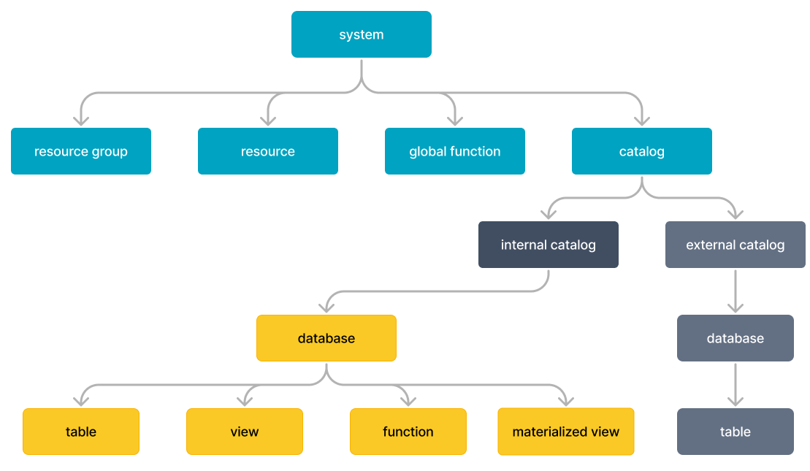
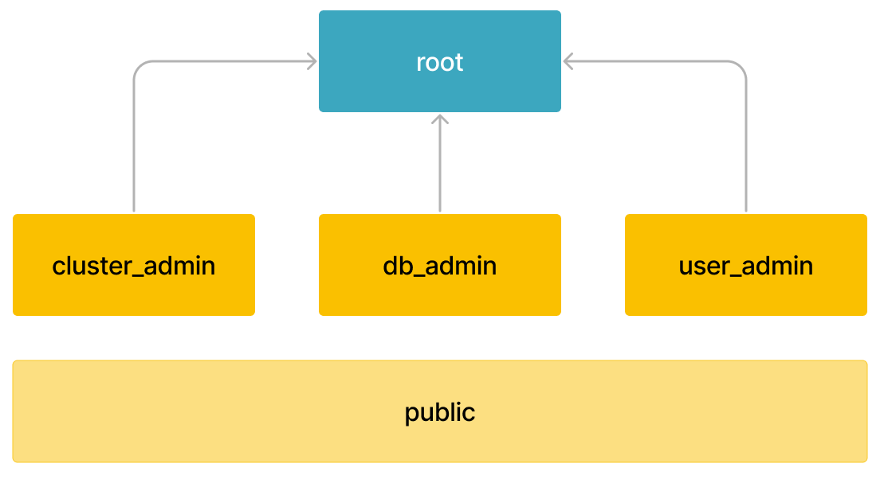
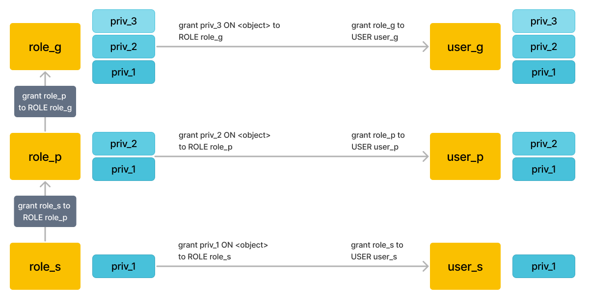

# Overview of privileges

This topic describes the basic concepts of StarRocks' privilege system. Privileges determine which users can perform which operations on which objects, so that you can more securely manage data and resources in a fine-grained manner.

> NOTE: The privileges described in this topic are available only from v3.0. The privilege framework and syntax in v3.0 are not backward compatible with those in earlier versions. After an upgrade to v3.0, most of your original privileges are still retained except those for specific operations. For the detailed differences, see [Upgrade notes] in [Privileges supported in StarRocks](privilege_item.md).

StarRocks adopts two privilege models:

- Role-based access control (RBAC): Privileges are assigned to roles, which are then assigned to users. In this case, privileges are passed to users through roles.
- Identity-based access control (IBAC): Privileges are directly assigned to user identities.

Therefore, the maximum privilege scope of each user identity is the union of its own privileges and the privileges of the roles assigned to this user identity.

**Basic concepts** for understanding StarRocks' privilege system:

- **Object**: An entity to which access can be granted. Unless allowed by a grant, access is denied. Examples of objects include CATALOG, DATABASE, TABLE, and VIEW. For more information, see [Privileges supported in StarRocks](privilege_item.md).
- **Privilege**: A defined level of access to an object. Multiple privileges can be used to control the granularity of access granted on an object. Privileges are object-specific. Different objects may have different privileges. Examples of privileges include SELECT, ALTER, and DROP.
- **User identity**: the unique identity of a user and also the entity to which privileges can be granted. User identity is represented as `username@'userhost'`, consisting of username and the IP from which the user logs in. Use identity simplifies attribute configuration. User identities that share the same user name share the same attribute. If you configure an attribute for a username, this attribute takes effect on all user identities that share this username.
- **Role**: An entity to which privileges can be granted. Roles are an abstract collection of privileges. Roles can in turn assigned to users. Roles can also be assigned to other roles, creating a role hierarchy. To facilitate data management, StarRocks provides system-defined roles. To allow for more flexibility, you can also create custom roles according to business requirements.

The following figure shows an example of privilege management under the RBAC and IBAC privilege models.

In the models, access to objects is allowed through privileges assigned to roles and users. Roles are in turn assigned to other roles or users.

## Objects and privileges

Objects have a logical hierarchy, which is related to the concept they represent. For example, Database is contained in Catalog, and Table, View, Materialized View, and Function are contained in Database. The following figure shows the object hierarchy in the StarRocks system.

Each object has a set of privilege items that can be granted. These privileges define which operations can be performed on these objects. You can grant and revoke privileges from roles or users through the [GRANT](../../sql-reference/sql-statements/account-management/GRANT.md) and [REVOKE](../../sql-reference/sql-statements/account-management/REVOKE.md) commands.

## Users

### User identity

In StarRocks, each user is identified by a unique user ID. It consists of the IP address (user host) and username, in the format of `username @'userhost'`. StarRocks identifies users with the same username but from different IP addresses as different user identities. For example, `user1@'172.65.xx.1'` and `172.65.xx.2'` are two user identities.

Another representation of user identity is `username @['domain']`, where `domain` is a domain name that can be resolved by DNS as a set of IP addresses. `username @['domain']` is finally represented as a set of `username@'userhost'`. You can use `%` for the `userhost` part for fuzzy match. If `userhost` is not specified, it defaults to `'%'`, which means users of the same name logged in from any host.

### Grant privileges to users

Users are entities to which privileges can be granted. Both privileges and roles can be assigned to users. The maximum privilege scope of each user identity is the union of its own privileges and the privileges of the roles assigned to this user identity. StarRocks ensures that each user can only perform authorized operations.

We recommend that you **use roles to pass privileges** in most cases. For example, after you create a role, you can grant privileges to the role and then assign the role to users. If you want to grant temporary or special privileges, you can directly grant them to users. This simplifies privilege management and offers flexibility.

## Roles

Roles are the entities to which privileges can be granted and revoked. Roles can be seen as a collection of privileges that can be assigned to users, to allow them to perform required actions. A user can be assigned multiple roles so they can perform different actions using separate sets of privileges. To simplify management, StarRocks recommends that you **manage privileges through roles**. Special and temporary privileges can be directly granted to users.

To facilitate management, StarRocks provides several **system-defined roles** with specific privileges, which helps you meet daily management and maintenance requirements. You can also flexibly **customize roles** to meet specific business needs and security needs. Note that the privilege scope of system-defined roles cannot be modified.

After a role is activated, users can perform operations that are authorized by the role. You can set **default roles** that are automatically activated when the user logs in. Users can also manually activate a role owned by this used in the current session.

### System-defined roles

StarRocks provides several types of system-defined roles.

- `root`: has global privileges. By default, the `root` user has the `root` role.
   After a StarRocks cluster is created, the system automatically generates a root user with root privileges. Because the root user and role have all privileges of the system, we recommend that you create new users and roles for subsequent operations to prevent any risky operations. Keep the password of the root user properly.
- `cluster_admin`: has cluster management privileges to perform node-related operations, such as adding or dropping nodes.
  `cluster_admin` has the privileges to add, drop, and decommission cluster nodes. We recommend that you do not assign `cluster_admin` or any custom roles that contain this role as a default role to any user, to prevent unexpected node changes.
- `db_admin`: has database management privileges, including the privileges to perform all operations on  catalog, database, table, view, materialized view, function, global function, resource group, and plug-ins.
- `user_admin`: has administrative privileges on users and roles, including privileges to create users, roles, and privileges.

  The above system-defined roles are designed to aggregate complex database privileges to facilitate your daily management. **The privilege scope of the above roles cannot be modified.**

  In addition, if you need to grant specific privileges to all users, StarRocks also provides a system-defined role `public`.

- `public`: This role is owned by any user and activated by default in any session, including adding new users. The `public` role does not have any privileges by default. You can modify the privileges scope of this role.

### Custom roles

You can create custom roles to meet specific business requirements and modify their privilege scope. At the same time, for the convenience of management, you can assign roles to other roles to create privilege hierarchy and inheritance. Then, the privileges associated with a role are inherited by another role.

#### Role hierarchy and privilege inheritance

The following figure shows an example of privilege inheritance.

> Note: The maximum number of inheritance levels for a role is 16 by default. The inheritance relationship cannot be bidirectional.

As shown in the figure:

- `role_s` is assigned to `role_p`. `role_p` implicitly inherits `priv_1` of `role_s`.
- `role_p` is assigned to `role_g`, `role_g` implicitly inherits `priv_2` of `role_p` and `priv_1` of `role_s`.
- After a role is assigned to a user, the user also has the privileges of this role.

### Active roles

Active roles allow users to apply the privileges of the role under the current session. You can use `SELECT CURRENT_ROLE();` to view active roles in the current session. For more information, see [current_role](../../sql-reference/sql-functions/utility-functions/current_role.md).

#### Default roles

Default roles are automatically activated when the user logs in to the cluster. It can be a role owned by one or more users. The administrator can set default roles using the `DEFAULT ROLE` keyword in [CREATE USER](../../sql-reference/sql-statements/account-management/CREATE_USER.md) and can change default roles using [ALTER USER](../../sql-reference/sql-statements/account-management/ALTER_USER.md).

Users can also change their default roles using [SET DEFAULT ROLE](../../sql-reference/sql-statements/account-management/SET_DEFAULT_ROLE.md).

Default roles provide basic privilege protection for users. For example, User A has `role_query` and `role_delete`, which has query and delete privilege respectively. We recommend that you only use `role_query` as the default role to prevent data loss caused by high-risk operations such as `DELETE` or `TRUNCATE`. If you need to perform these operations, you can do it after manually setting active roles.

A user who does not have a default role still has the `public` role, which is automatically activated after the user logs in to the cluster.

#### Manually activate roles

In addition to default roles, users can also manually activate one or more existing roles within a session. You can use [SHOW GRANTS](../../sql-reference/sql-statements/account-management/SHOW_GRANTS.md) to view the privileges and roles that can be activated, and use [SET ROLE](../../sql-reference/sql-statements/account-management/SET_ROLE.md) to configure active roles that are effective in the current session.

Note that the SET ROLE command overwrites each other. For example, after a user logs in, the `default_role` is activated by default. Then the user runs `SET ROLE role_s`. At this time, the user has only the privileges of `role_s` and their own privileges. `default_role` is overwritten.

## References

- [Privileges supported by StarRocks](privilege_item.md)
- [Manage user privileges](User_privilege.md)
