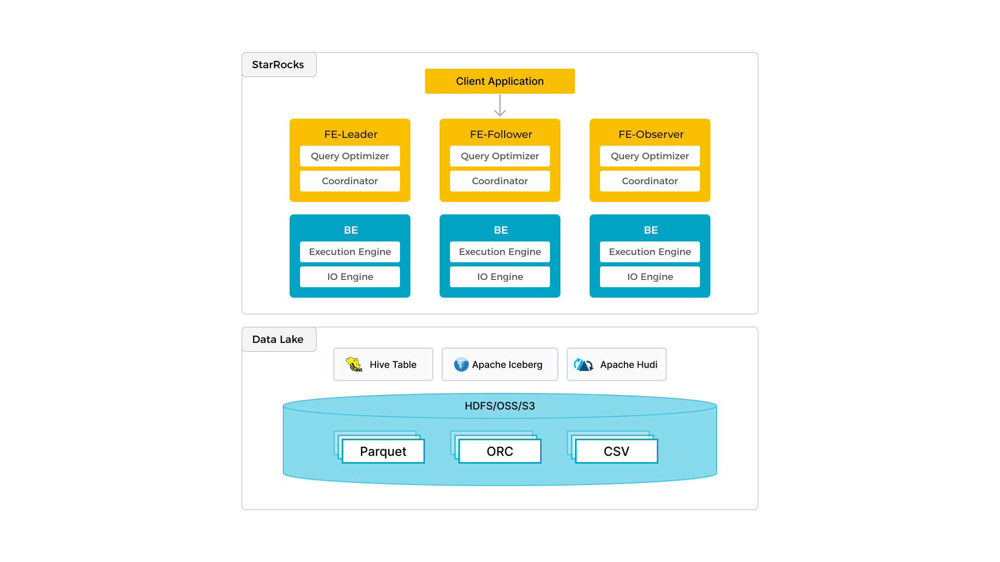

In addition to efficient analytics of local data, StarRocks can work as the compute engine to analyze data stored in data lakes such as Apache Hive, Apache Iceberg, Apache Hudi, and Delta Lake. One of the key features of StarRocks is its external catalog, which acts as the linkage to an externally maintained metastore. This functionality provides users with the capability to query external data sources seamlessly, eliminating the need for data migration. As such, users can analyze data from different systems such as HDFS and Amazon S3, in various file formats such as Parquet, ORC, and CSV, etc.

The preceding figure shows a data lake analytics scenario where StarRocks is responsible for data computing and analysis, and the data lake is responsible for data storage, organization, and maintenance. Data lakes allow users to store data in open storage formats and use flexible schemas to produce reports on "single source of truth" for various BI, AI, ad-hoc, and reporting use cases. StarRocks fully leverages the advantages of its vectorization engine and CBO, significantly improving the performance of data lake analytics.