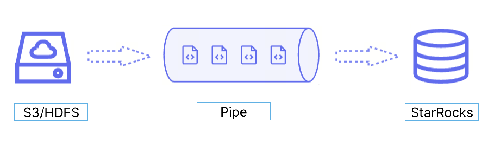

Pipe is ideal for continuous data loading and large-scale data loading:

- **Large-scale data loading in micro-batches helps reduce the cost of retries caused by data errors.**

  With the help of Pipe, StarRocks enables the efficient loading of a large number of data files with a significant data volume in total. Pipe automatically splits the files based on their number or size, breaking down the load job into smaller, sequential tasks. This approach ensures that errors in one file do not impact the entire load job. The load status of each file is recorded by Pipe, allowing you to easily identify and fix files that contain errors. By minimizing the need for retries due to data errors, this approach helps to reduce costs.

- **Continuous data loading helps reduce manpower.**

  Pipe helps you write new or updated data files to a specific location and continuously load the new data from these files into StarRocks. After you create a Pipe job with `"AUTO_INGEST" = "TRUE"` specified, it will constantly monitor changes to the data files stored in the specified path and automatically load new or updated data from the data files into the destination StarRocks table.

Additionally, Pipe performs file uniqueness checks to help prevent duplicate data loading.During the loading process, Pipe checks the uniqueness of each data file based on the file name and digest. If a file with a specific file name and digest has already been processed by a Pipe job, the Pipe job will skip all subsequent files with the same file name and digest. Note that {props.menu} as file digest.

The load status of each data file is recorded and saved to the `information_schema.pipe_files` view. After a Pipe job associated with the view is deleted, the records about the files loaded in that job will also be deleted.

### Data flow

