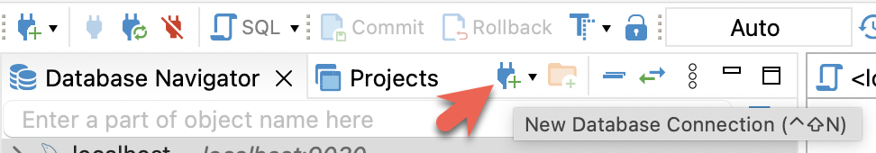

import Tabs from '@theme/Tabs';
import TabItem from '@theme/TabItem';

These three clients are tested with this tutorial, you only need one:

- [DBeaver](https://dbeaver.io/download/) is available as a community version and a Pro version. 
- [MySQL Workbench](https://dev.mysql.com/downloads/workbench/)
- mysql CLI: The mysql client is packaged with MySQL Server. If you do use this client you might want to disable the MySQL server unless you plan to use that in addition to the client.

#### Configuring the client

<Tabs groupId="client">
<TabItem value="DBeaver" label="DBeaver" default>

- Install [DBeaver](https://dbeaver.io/download/), and add a connection:

- Configure the port, IP, and username. Test the connection, and click Finish if the test succeeds:

</TabItem>
<TabItem value="MySQLWorkbench" label="MySQL Workbench">

- Install the [MySQL Workbench](https://dev.mysql.com/downloads/workbench/), and add a connection.
- Configure the port, IP, and username and then test the connection:

- You will see warnings from the Workbench as it is checking for a specific MySQL version. You can ignore the warnings and when prompted, you can configure Workbench to stop displaying the warnings:

</TabItem>
<TabItem value="mysqlCLI" label="mysql CLI">

- macOS: If you use Homebrew and do not need MySQL Server run `brew install mysql` to install the CLI.
- Linux: Check your repository system for the `mysql` client. For example, `yum install mariadb`.
- Microsoft Windows: Install the [MySQL Community Server](https://dev.mysql.com/downloads/mysql/) and run the provided client, or run `mysql` from WSL.

</TabItem>
</Tabs>
