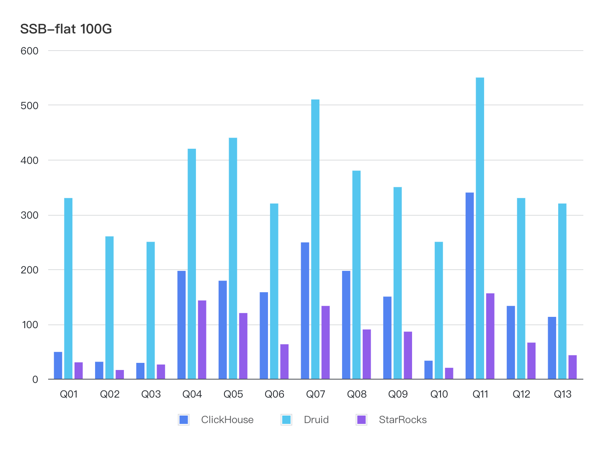

# SSB Flat-table Benchmarking

Star schema benchmark (SSB) is designed to test basic performance metrics of OLAP database products. SSB uses a star schema test set that is widely applied in academia and industry. For more information, see [Star Schema Benchmark](https://www.cs.umb.edu/~poneil/StarSchemaB.PDF).

ClickHouse flattens the star schema into a wide flat table and rewrites the SSB into a single-table benchmark. For more information, see [Star schema benchmark of ClickHouse](https://clickhouse.com/docs/en/getting-started/example-datasets/star-schema)

This test compares the performance of StarRocks, Apache Druid, and ClickHouse against SSB single-table datasets.

## Test conclusions

The test is performed on an OLAP table in a shared-nothing StarRocks cluster, together with ClickHouse and Apache Druid, against the same dataset.

Based on the results from 13 queries performed on the 100 GB SSB-Flat dataset, StarRocks has an overall query performance **1.87x that of ClickHouse and 4.75x that of Apache Druid**. The unit of the results are milliseconds.

## Test preparation

### Hardware

StarRocks, Apache Druid, and ClickHouse are deployed on hosts of the same configurations - [AWS m7i.4xlarge](https://aws.amazon.com/ec2/instance-types/m7i/?nc1=h_ls).

|                          | **Spec**    |
| ------------------------ | ----------- |
| Instance Number          | 5           |
| vCPU                     | 16          |
| Memory (GiB)             | 64          |
| Network Bandwidth (Gbps) | Up to 12.5  |
| EBS Bandwidth (Gbps)     | Up to 10    |

### Software

|                   | **StarRocks**     | **ClickHouse** | **Apache Druid**                                             |
| ----------------- | ----------------- | -------------- | ------------------------------------------------------------ |
| **Cluster Size**  | One FE, Three BEs | Three nodes    | One Master Server, one Query Servers, and three Data Servers |
| **Version**       | 3.5.0             | 25.3.3.42      | 33.0.0                                                       |
| **Release Date**  | 2025.6.13         | 2025.4.22      | 2025.4.29                                                    |
| **Configuration** | Default           | Default        | Default                                                      |

## Test results

The following table shows the performance test results on 13 queries. The unit of query latency is milliseconds. All queries are warmed up 1 time and then executed 3 times to take the average value as the result. `ClickHouse vs StarRocks` and `Druid vs StarRocks` in the table header means using the query response time of ClickHouse/Druid to divide the query response time of StarRocks. A larger value indicates better performance of StarRocks.

| Query | StarRocks | ClickHouse | Druid | ClickHouse vs StarRocks | Druid vs StarRocks |
| ----- | --------- | ---------- | ----- | ----------------------- | ------------------ |
| SUM   | 992       | 1858       | 4710  | 1.87                    | 4.75               |
| Q01   | 30        | 49         | 330   | 1.63                    | 11.00              |
| Q02   | 16        | 31         | 260   | 1.94                    | 16.25              |
| Q03   | 26        | 29         | 250   | 1.12                    | 9.62               |
| Q04   | 143       | 197        | 420   | 1.38                    | 2.94               |
| Q05   | 120       | 179        | 440   | 1.49                    | 3.67               |
| Q06   | 63        | 158        | 320   | 2.51                    | 5.08               |
| Q07   | 133       | 249        | 510   | 1.87                    | 3.83               |
| Q08   | 90        | 197        | 380   | 2.19                    | 4.22               |
| Q09   | 86        | 150        | 350   | 1.74                    | 4.07               |
| Q10   | 20        | 33         | 250   | 1.65                    | 12.50              |
| Q11   | 156       | 340        | 550   | 2.18                    | 3.53               |
| Q12   | 66        | 133        | 330   | 2.02                    | 5.00               |
| Q13   | 43        | 113        | 320   | 2.63                    | 7.44               |
