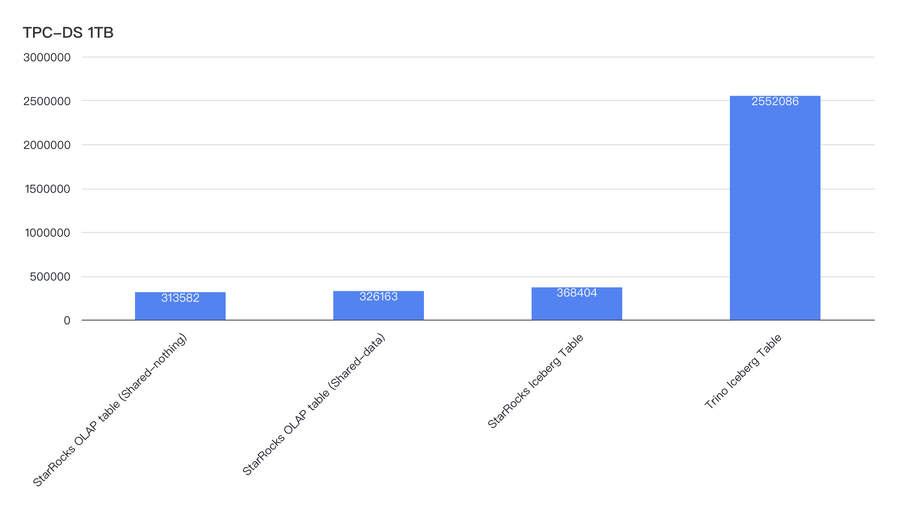

# TPC-DS Benchmarking

TPC-DS is a decision support benchmark developed by the Transaction Processing Performance Council (TPC). It uses more comprehensive test datasets and complex SQL queries than TPC-H.

TPC-DS models several generally applicable aspects of a decision support system, including queries and data maintenance. TPC-DS aims to provide a comprehensive and realistic workload for testing and evaluating the performance of database systems in a retail environment. The TPC-DS benchmark simulates the sales and return data of three sales channels (stores, Internet, and catalog) in a retail enterprise. In addition to creating tables for sales and return data models, it also includes a simple inventory system and a promotion system.

This benchmark tests a total of 99 complex SQL queries against 24 tables whose data size ranges from 1 GB to 3 TB. The main performance metric is the response time of each query, which is the duration between the time a query is submitted to the time the result is returned.

## Test Conclusions

The test is performed against the TPC-DS 1 TB dataset on StarRocks and Trino. The unit of the following results are milliseconds.

For StarRocks, the test queries are performed on its native tables (under both shared-nothing and shared-data architecture) and Iceberg Catalog (under shared-data architecture). For Trino, the test queries are performed on the same Iceberg Catalog. Both tests for StarRocks and Trino on the Iceberg Catalog use AWS Glue as the metastore, and Parquet-formatted data with ZSTD compression.

The test results are:

- Queries performed on the OLAP table in the StarRocks shared-nothing cluster took 314 seconds.
- Queries performed on the OLAP table in the StarRocks shared-data cluster took 326 seconds.
- Queries performed on Iceberg Catalog in the StarRocks shared-data cluster took 368 seconds.
- Queries performed on Iceberg Catalog in Trino took 2552 seconds.

The conclusions are:

- **StarRocks delivers comparable performance in both shared-nothing and shared-data architecture**

  In OLAP table query scenarios, StarRocks in the shared-nothing mode achieves 1.04× the performance of the shared-data mode, indicating minimal performance overhead from storage-compute separation.

- **StarRocks significantly outperforms Trino in Lakehouse query scenarios out of the box, with even greater advantages in OLAP table queries**

  - In Iceberg Catalog query scenarios, StarRocks delivers 6.93× the performance of Trino.
  - In OLAP table queries, the performance gap widens further—StarRocks achieves 8.13× (under shared-nothing mode) and 7.82× (under shared-data mode) the performance of Trino.

## Test Preparation

### Hardware

StarRocks and Trino are deployed on hosts of the same configurations - [AWS m6id.4xlarge](https://aws.amazon.com/ec2/instance-types/m6i/?nc1=h_ls).

|                          | **Spec**       |
| ------------------------ | -------------- |
| Instance Number          | 5              |
| vCPU                     | 16             |
| Memory (GiB)             | 64             |
| Instance Storage (GB)    | 1x950 NVMe SSD |
| Network Bandwidth (Gbps) | Up to 12.5     |
| EBS Bandwidth (Gbps)     | Up to 10       |

### Software

|                   | **StarRocks**                              | **Trino**                                                      |
| ----------------- | ------------------------------------------ | -------------------------------------------------------------- |
| **Cluster Size**  | One FE, four BE                            | One Coordinator, four Workers                                  |
| **Version**       | 3.5.0                                      | 475                                                            |
| **Release Date**  | 2025.6.13                                  | 2025.4.23                                                      |
| **Configuration** | `set query_mem_limit=66571993088;` (62 GB) | `query.max-memory=224GB` `query.max-memory-per-node=35GB` |

## Test results

The following table shows the performance test results on 99 queries. The unit of query latency is milliseconds. All queries are warmed up 1 time and then executed 3 times to take the average value as the result. `Trino vs StarRocks on Iceberg` in the table header means using the query response time of Trino to divide the query response time of StarRocks. A larger value indicates better performance of StarRocks. Before the test on Iceberg Catalog, `ANALYZE TABLE` and `EXPLAIN COST` statements are executed on StarRocks to collect statistics.

<table class="tg"><thead>
  <tr>
    <th rowspan="3">Query</th>
    <th colspan="3">StarRocks</th>
    <th>Trino</th>
    <th rowspan="3">Trino vs StarRocks on Iceberg</th>
  </tr>
  <tr>
    <th colspan="2">OLAP Table</th>
    <th>Iceberg Catalog</th>
    <th rowspan="2">Iceberg Catalog</th>
  </tr>
  <tr>
    <th>Shared-nothing</th>
    <th>Shared-data</th>
    <th>Share-data</th>
  </tr></thead>
<tbody>
  <tr>
    <td>SUM</td>
    <td>313582</td>
    <td>326163</td>
    <td>368404</td>
    <td>2552076</td>
    <td>6.93</td>
  </tr>
  <tr>
    <td>Q01</td>
    <td>675</td>
    <td>636</td>
    <td>727</td>
    <td>2276</td>
    <td>3.13</td>
  </tr>
  <tr>
    <td>Q02</td>
    <td>935</td>
    <td>925</td>
    <td>1949</td>
    <td>21289</td>
    <td>10.92</td>
  </tr>
  <tr>
    <td>Q03</td>
    <td>220</td>
    <td>140</td>
    <td>399</td>
    <td>1764</td>
    <td>4.42</td>
  </tr>
  <tr>
    <td>Q04</td>
    <td>17185</td>
    <td>16206</td>
    <td>16744</td>
    <td>200249</td>
    <td>11.96</td>
  </tr>
  <tr>
    <td>Q05</td>
    <td>417</td>
    <td>543</td>
    <td>1724</td>
    <td>5574</td>
    <td>3.23</td>
  </tr>
  <tr>
    <td>Q06</td>
    <td>200</td>
    <td>180</td>
    <td>343</td>
    <td>2909</td>
    <td>8.48</td>
  </tr>
  <tr>
    <td>Q07</td>
    <td>814</td>
    <td>959</td>
    <td>1795</td>
    <td>3638</td>
    <td>2.03</td>
  </tr>
  <tr>
    <td>Q08</td>
    <td>235</td>
    <td>181</td>
    <td>319</td>
    <td>2534</td>
    <td>7.94</td>
  </tr>
  <tr>
    <td>Q09</td>
    <td>7097</td>
    <td>6503</td>
    <td>23153</td>
    <td>36125</td>
    <td>1.56</td>
  </tr>
  <tr>
    <td>Q10</td>
    <td>297</td>
    <td>343</td>
    <td>497</td>
    <td>2471</td>
    <td>4.97</td>
  </tr>
  <tr>
    <td>Q11</td>
    <td>11229</td>
    <td>10249</td>
    <td>9777</td>
    <td>133230</td>
    <td>13.63</td>
  </tr>
  <tr>
    <td>Q12</td>
    <td>128</td>
    <td>130</td>
    <td>207</td>
    <td>1067</td>
    <td>5.15</td>
  </tr>
  <tr>
    <td>Q13</td>
    <td>417</td>
    <td>447</td>
    <td>2218</td>
    <td>18297</td>
    <td>8.25</td>
  </tr>
  <tr>
    <td>Q14</td>
    <td>15112</td>
    <td>15055</td>
    <td>15310</td>
    <td>143172</td>
    <td>9.35</td>
  </tr>
  <tr>
    <td>Q15</td>
    <td>455</td>
    <td>474</td>
    <td>525</td>
    <td>2158</td>
    <td>4.11</td>
  </tr>
  <tr>
    <td>Q16</td>
    <td>476</td>
    <td>523</td>
    <td>975</td>
    <td>14035</td>
    <td>14.39</td>
  </tr>
  <tr>
    <td>Q17</td>
    <td>895</td>
    <td>948</td>
    <td>1645</td>
    <td>5487</td>
    <td>3.34</td>
  </tr>
  <tr>
    <td>Q18</td>
    <td>802</td>
    <td>973</td>
    <td>1544</td>
    <td>4736</td>
    <td>3.07</td>
  </tr>
  <tr>
    <td>Q19</td>
    <td>209</td>
    <td>268</td>
    <td>507</td>
    <td>1870</td>
    <td>3.69</td>
  </tr>
  <tr>
    <td>Q20</td>
    <td>147</td>
    <td>176</td>
    <td>253</td>
    <td>1257</td>
    <td>4.97</td>
  </tr>
  <tr>
    <td>Q21</td>
    <td>83</td>
    <td>80</td>
    <td>405</td>
    <td>945</td>
    <td>2.33</td>
  </tr>
  <tr>
    <td>Q22</td>
    <td>1462</td>
    <td>1823</td>
    <td>2384</td>
    <td>7871</td>
    <td>3.30</td>
  </tr>
  <tr>
    <td>Q23</td>
    <td>82887</td>
    <td>84426</td>
    <td>50719</td>
    <td>488653</td>
    <td>9.63</td>
  </tr>
  <tr>
    <td>Q24</td>
    <td>7649</td>
    <td>9064</td>
    <td>11902</td>
    <td>43436</td>
    <td>3.65</td>
  </tr>
  <tr>
    <td>Q25</td>
    <td>795</td>
    <td>919</td>
    <td>1404</td>
    <td>4347</td>
    <td>3.10</td>
  </tr>
  <tr>
    <td>Q26</td>
    <td>376</td>
    <td>511</td>
    <td>868</td>
    <td>2961</td>
    <td>3.41</td>
  </tr>
  <tr>
    <td>Q27</td>
    <td>458</td>
    <td>532</td>
    <td>1397</td>
    <td>4219</td>
    <td>3.02</td>
  </tr>
  <tr>
    <td>Q28</td>
    <td>6489</td>
    <td>6004</td>
    <td>18727</td>
    <td>24678</td>
    <td>1.32</td>
  </tr>
  <tr>
    <td>Q29</td>
    <td>1296</td>
    <td>2168</td>
    <td>2129</td>
    <td>10640</td>
    <td>5.00</td>
  </tr>
  <tr>
    <td>Q30</td>
    <td>295</td>
    <td>330</td>
    <td>529</td>
    <td>2770</td>
    <td>5.24</td>
  </tr>
  <tr>
    <td>Q31</td>
    <td>2172</td>
    <td>2162</td>
    <td>2535</td>
    <td>10260</td>
    <td>4.05</td>
  </tr>
  <tr>
    <td>Q32</td>
    <td>110</td>
    <td>225</td>
    <td>277</td>
    <td>1035</td>
    <td>3.74</td>
  </tr>
  <tr>
    <td>Q33</td>
    <td>235</td>
    <td>245</td>
    <td>734</td>
    <td>2743</td>
    <td>3.74</td>
  </tr>
  <tr>
    <td>Q34</td>
    <td>402</td>
    <td>422</td>
    <td>696</td>
    <td>2455</td>
    <td>3.53</td>
  </tr>
  <tr>
    <td>Q35</td>
    <td>1353</td>
    <td>1393</td>
    <td>1562</td>
    <td>8023</td>
    <td>5.14</td>
  </tr>
  <tr>
    <td>Q36</td>
    <td>553</td>
    <td>559</td>
    <td>1193</td>
    <td>3342</td>
    <td>2.80</td>
  </tr>
  <tr>
    <td>Q37</td>
    <td>263</td>
    <td>243</td>
    <td>217</td>
    <td>6178</td>
    <td>28.47</td>
  </tr>
  <tr>
    <td>Q38</td>
    <td>5002</td>
    <td>5207</td>
    <td>5519</td>
    <td>38408</td>
    <td>6.96</td>
  </tr>
  <tr>
    <td>Q39</td>
    <td>356</td>
    <td>367</td>
    <td>820</td>
    <td>5696</td>
    <td>6.95</td>
  </tr>
  <tr>
    <td>Q40</td>
    <td>124</td>
    <td>134</td>
    <td>575</td>
    <td>1554</td>
    <td>2.70</td>
  </tr>
  <tr>
    <td>Q41</td>
    <td>43</td>
    <td>50</td>
    <td>76</td>
    <td>271</td>
    <td>3.57</td>
  </tr>
  <tr>
    <td>Q42</td>
    <td>81</td>
    <td>104</td>
    <td>197</td>
    <td>996</td>
    <td>5.06</td>
  </tr>
  <tr>
    <td>Q43</td>
    <td>487</td>
    <td>733</td>
    <td>722</td>
    <td>4108</td>
    <td>5.69</td>
  </tr>
  <tr>
    <td>Q44</td>
    <td>2087</td>
    <td>2102</td>
    <td>9364</td>
    <td>16468</td>
    <td>1.76</td>
  </tr>
  <tr>
    <td>Q45</td>
    <td>431</td>
    <td>470</td>
    <td>514</td>
    <td>2212</td>
    <td>4.30</td>
  </tr>
  <tr>
    <td>Q46</td>
    <td>1468</td>
    <td>1829</td>
    <td>1976</td>
    <td>4780</td>
    <td>2.42</td>
  </tr>
  <tr>
    <td>Q47</td>
    <td>2921</td>
    <td>3120</td>
    <td>3130</td>
    <td>42704</td>
    <td>13.64</td>
  </tr>
  <tr>
    <td>Q48</td>
    <td>467</td>
    <td>573</td>
    <td>1441</td>
    <td>12464</td>
    <td>8.65</td>
  </tr>
  <tr>
    <td>Q49</td>
    <td>496</td>
    <td>547</td>
    <td>1715</td>
    <td>3827</td>
    <td>2.23</td>
  </tr>
  <tr>
    <td>Q50</td>
    <td>3768</td>
    <td>5135</td>
    <td>3899</td>
    <td>21771</td>
    <td>5.58</td>
  </tr>
  <tr>
    <td>Q51</td>
    <td>4826</td>
    <td>4633</td>
    <td>3244</td>
    <td>12247</td>
    <td>3.78</td>
  </tr>
  <tr>
    <td>Q52</td>
    <td>87</td>
    <td>106</td>
    <td>219</td>
    <td>1007</td>
    <td>4.60</td>
  </tr>
  <tr>
    <td>Q53</td>
    <td>446</td>
    <td>635</td>
    <td>955</td>
    <td>1768</td>
    <td>1.85</td>
  </tr>
  <tr>
    <td>Q54</td>
    <td>198</td>
    <td>266</td>
    <td>763</td>
    <td>31864</td>
    <td>41.76</td>
  </tr>
  <tr>
    <td>Q55</td>
    <td>82</td>
    <td>105</td>
    <td>221</td>
    <td>1187</td>
    <td>5.37</td>
  </tr>
  <tr>
    <td>Q56</td>
    <td>175</td>
    <td>186</td>
    <td>499</td>
    <td>2133</td>
    <td>4.27</td>
  </tr>
  <tr>
    <td>Q57</td>
    <td>1848</td>
    <td>1787</td>
    <td>1916</td>
    <td>26042</td>
    <td>13.59</td>
  </tr>
  <tr>
    <td>Q58</td>
    <td>241</td>
    <td>245</td>
    <td>503</td>
    <td>3032</td>
    <td>6.03</td>
  </tr>
  <tr>
    <td>Q59</td>
    <td>3935</td>
    <td>3908</td>
    <td>3160</td>
    <td>20819</td>
    <td>6.59</td>
  </tr>
  <tr>
    <td>Q60</td>
    <td>262</td>
    <td>292</td>
    <td>643</td>
    <td>2749</td>
    <td>4.28</td>
  </tr>
  <tr>
    <td>Q61</td>
    <td>330</td>
    <td>344</td>
    <td>913</td>
    <td>2054</td>
    <td>2.25</td>
  </tr>
  <tr>
    <td>Q62</td>
    <td>500</td>
    <td>519</td>
    <td>840</td>
    <td>5104</td>
    <td>6.08</td>
  </tr>
  <tr>
    <td>Q63</td>
    <td>448</td>
    <td>629</td>
    <td>937</td>
    <td>1719</td>
    <td>1.83</td>
  </tr>
  <tr>
    <td>Q64</td>
    <td>4508</td>
    <td>8886</td>
    <td>8602</td>
    <td>16990</td>
    <td>1.98</td>
  </tr>
  <tr>
    <td>Q65</td>
    <td>5690</td>
    <td>5617</td>
    <td>5445</td>
    <td>20616</td>
    <td>3.79</td>
  </tr>
  <tr>
    <td>Q66</td>
    <td>387</td>
    <td>390</td>
    <td>1335</td>
    <td>3511</td>
    <td>2.63</td>
  </tr>
  <tr>
    <td>Q67</td>
    <td>31286</td>
    <td>29240</td>
    <td>21439</td>
    <td>89430</td>
    <td>4.17</td>
  </tr>
  <tr>
    <td>Q68</td>
    <td>240</td>
    <td>341</td>
    <td>683</td>
    <td>2883</td>
    <td>4.22</td>
  </tr>
  <tr>
    <td>Q69</td>
    <td>260</td>
    <td>292</td>
    <td>501</td>
    <td>2181</td>
    <td>4.35</td>
  </tr>
  <tr>
    <td>Q70</td>
    <td>2904</td>
    <td>3012</td>
    <td>3751</td>
    <td>21499</td>
    <td>5.73</td>
  </tr>
  <tr>
    <td>Q71</td>
    <td>272</td>
    <td>1111</td>
    <td>631</td>
    <td>2578</td>
    <td>4.09</td>
  </tr>
  <tr>
    <td>Q72</td>
    <td>1642</td>
    <td>1899</td>
    <td>4969</td>
    <td>504573</td>
    <td>101.54</td>
  </tr>
  <tr>
    <td>Q73</td>
    <td>186</td>
    <td>228</td>
    <td>388</td>
    <td>1933</td>
    <td>4.98</td>
  </tr>
  <tr>
    <td>Q74</td>
    <td>9433</td>
    <td>9133</td>
    <td>8890</td>
    <td>78071</td>
    <td>8.78</td>
  </tr>
  <tr>
    <td>Q75</td>
    <td>6446</td>
    <td>7718</td>
    <td>9082</td>
    <td>26270</td>
    <td>2.89</td>
  </tr>
  <tr>
    <td>Q76</td>
    <td>2356</td>
    <td>2331</td>
    <td>5028</td>
    <td>11266</td>
    <td>2.24</td>
  </tr>
  <tr>
    <td>Q77</td>
    <td>238</td>
    <td>241</td>
    <td>701</td>
    <td>2785</td>
    <td>3.97</td>
  </tr>
  <tr>
    <td>Q78</td>
    <td>17583</td>
    <td>16590</td>
    <td>18614</td>
    <td>51497</td>
    <td>2.77</td>
  </tr>
  <tr>
    <td>Q79</td>
    <td>2201</td>
    <td>2474</td>
    <td>1597</td>
    <td>5572</td>
    <td>3.49</td>
  </tr>
  <tr>
    <td>Q80</td>
    <td>800</td>
    <td>855</td>
    <td>2672</td>
    <td>4762</td>
    <td>1.78</td>
  </tr>
  <tr>
    <td>Q81</td>
    <td>518</td>
    <td>533</td>
    <td>769</td>
    <td>4040</td>
    <td>5.25</td>
  </tr>
  <tr>
    <td>Q82</td>
    <td>623</td>
    <td>613</td>
    <td>854</td>
    <td>11622</td>
    <td>13.61</td>
  </tr>
  <tr>
    <td>Q83</td>
    <td>158</td>
    <td>217</td>
    <td>404</td>
    <td>2274</td>
    <td>5.63</td>
  </tr>
  <tr>
    <td>Q84</td>
    <td>195</td>
    <td>434</td>
    <td>351</td>
    <td>3086</td>
    <td>8.79</td>
  </tr>
  <tr>
    <td>Q85</td>
    <td>455</td>
    <td>733</td>
    <td>1087</td>
    <td>5424</td>
    <td>4.99</td>
  </tr>
  <tr>
    <td>Q86</td>
    <td>725</td>
    <td>736</td>
    <td>819</td>
    <td>3422</td>
    <td>4.18</td>
  </tr>
  <tr>
    <td>Q87</td>
    <td>4816</td>
    <td>5004</td>
    <td>5535</td>
    <td>41300</td>
    <td>7.46</td>
  </tr>
  <tr>
    <td>Q88</td>
    <td>8712</td>
    <td>8444</td>
    <td>19465</td>
    <td>30738</td>
    <td>1.58</td>
  </tr>
  <tr>
    <td>Q89</td>
    <td>530</td>
    <td>730</td>
    <td>915</td>
    <td>2227</td>
    <td>2.43</td>
  </tr>
  <tr>
    <td>Q90</td>
    <td>587</td>
    <td>581</td>
    <td>1150</td>
    <td>3890</td>
    <td>3.38</td>
  </tr>
  <tr>
    <td>Q91</td>
    <td>95</td>
    <td>96</td>
    <td>227</td>
    <td>2035</td>
    <td>8.96</td>
  </tr>
  <tr>
    <td>Q92</td>
    <td>78</td>
    <td>140</td>
    <td>228</td>
    <td>994</td>
    <td>4.36</td>
  </tr>
  <tr>
    <td>Q93</td>
    <td>3723</td>
    <td>4705</td>
    <td>5781</td>
    <td>22926</td>
    <td>3.97</td>
  </tr>
  <tr>
    <td>Q94</td>
    <td>601</td>
    <td>963</td>
    <td>962</td>
    <td>5884</td>
    <td>6.12</td>
  </tr>
  <tr>
    <td>Q95</td>
    <td>1747</td>
    <td>3106</td>
    <td>2575</td>
    <td>29607</td>
    <td>11.50</td>
  </tr>
  <tr>
    <td>Q96</td>
    <td>1444</td>
    <td>1428</td>
    <td>2562</td>
    <td>4905</td>
    <td>1.91</td>
  </tr>
  <tr>
    <td>Q97</td>
    <td>4795</td>
    <td>4844</td>
    <td>5383</td>
    <td>22726</td>
    <td>4.22</td>
  </tr>
  <tr>
    <td>Q98</td>
    <td>284</td>
    <td>323</td>
    <td>365</td>
    <td>1911</td>
    <td>5.24</td>
  </tr>
  <tr>
    <td>Q99</td>
    <td>1132</td>
    <td>1184</td>
    <td>1594</td>
    <td>10970</td>
    <td>6.88</td>
  </tr>
</tbody></table>
