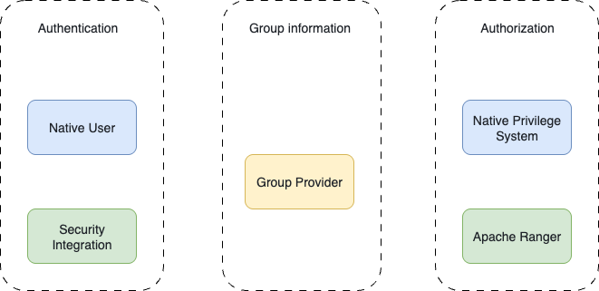
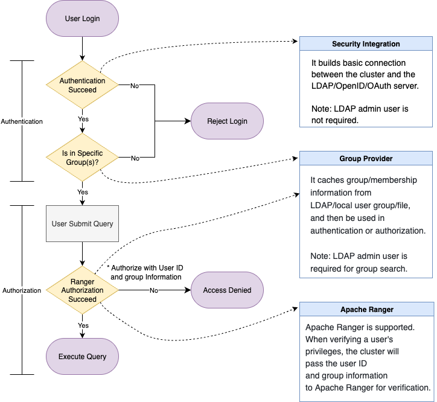

import AuthCompare from '../_assets/best_practices/_auth_comparison.mdx'
import GroupProviderExample from '../_assets/best_practices/_auth_group_provider_example.mdx'
import Solution3 from '../_assets/best_practices/_auth_solution_3.mdx'

# Authentication and Authorization

This topic aims to provide a coherent guide for best practices on developing your own authentication and authorization workflow.

For detailed instructions on each operation involved below, see links in [See Also](#see-also).

## Real-World Enterprise Scenario

Large enterprises often have complex organizational structures and a vast number of employees using diverse platforms and tools. From an IT governance perspective, having a unified identity, authentication, and authorization system brings significant advantages:

- **Simplified User Management**: Admins no longer need to manually create or delete users and assign permissions across multiple systems. User lifecycle management (for example, onboarding/offboarding) becomes seamless and audit-friendly.
- **Improved Security**: A single sign-on (SSO) mechanism eliminates the need for users to manage multiple credentials, reducing the attack surface.
- **Role-Aligned Access Control**: Access permissions are typically tied to a user’s role or department. A well-structured identity system enables easier and more accurate authorization decisions.

### Example

Suppose that three new employees join different departments of a SaaS company: one Marketing Specialist and two Solution Architects.

- **Organizationally**, they belong to different teams.
- **From an identity standpoint**, their email accounts serve as their login credentials across internal platforms.
- **By access rights**, each of the three is granted access to different platforms:
  - The Marketing Specialist can log in to Hubspot backend to view new leads.
  - Solution Architects can access the service console, and manage services for assigned customers.

Although all three use the same identity provider, their access rights are strictly enforced:

  - The Marketing Specialist only has access to Hubspot.
  - Solution Architects can access the service console, but they cannot access the service for users they are not assigned to. They also cannot access Hubspot.

## Three Layers of Access Control

This example highlights the three key components in an enterprise identity and access flow:

1. **Identity Authentication** – “I am Peter, a verified employee of the SaaS company.”
2. **Access Authentication** – “As a Solution Architect, I am authorized to log in to the service console.” (Not all verified employees should have access to all services.)
3. **Action Authorization** – “As the customer of the SaaS company, I can view the information of our own service, but not other customer’s.”

### In Database Context

These layers of access control also apply to the database system:

1. **Identity Verification**: Confirm the user is a valid employee with their own password. 
2. **Access Authentication**: Verify the user or their group has permission to log in to a specific cluster.
3. **Operation Authorization**: Check if the user can run a query, load data, etc.

As you can see, authentication and authorization are tightly coupled in practice. A user's authentication request often implies a broader access control requirement. Therefore, it is essential to understand the full access flow.

## Key Concepts

### LDAP

Lightweight Directory Access Protocol (LDAP) is a protocol for accessing and maintaining distributed directory information. You can think of it as your organization’s global address book:

- Each user has a unique path (Distinguished Name, DN).
- LDAP stores basic user information, including passwords.
- LDAP also manages group structures and membership.
- `ldapsearch` queries can retrieve users or groups.

LDAP can be used:

- As an **authentication** source (to validate usernames and passwords).
- As a **group information** provider for access control.

### UNIX Groups

Sometimes users mirror LDAP groups locally (on the host OS) for security or isolation reasons, avoiding direct communication with external LDAP servers. These local UNIX groups can be used for authentication or access control enforcement.

### OAuth, OIDC, and JWT

:::tip

**Quick Explanation of Terms**

- **ID Token**: Proof of identity (I am me.)
- **Access Token**: Proof of permission to access certain resources (I can do certain things.)
- **OAuth 2.0**: Authorization framework that provides access tokens.
- **OIDC**: Authentication layer on top of OAuth. Provides ID and Access Tokens.
- **JWT**: Token format. Used by both OAuth and OIDC.

:::

**Practical Use:**

- **OAuth-based login**: Redirects to an external login page (for example, Google), then back to the cluster. Requires browser access and redirect URL setup in advance.
- **JWT-based login**: The user passes a token directly to the cluster, which requires a public key or endpoint setup in advance.

## Features

The system supports all three layers of access control:

1. **User Authentication** – “I am who I say I am.”
2. **Login Authorization** – “I am allowed to access this cluster.” (It depends on individual or group membership.)
3. **Operation Authorization** – “I can run this query or load this dataset.” (Authorization can be based on identity or group affiliation.)

From v3.5 onward, StarRocks provides a modular, composable model to support various combinations of identity and access management components.

*Feature Mapping*



From the feature's perspective:

1. **Authentication Provider** – Supported protocols: Native user, LDAP, OIDC, and OAuth 2.0.
2. **Group Provider** – Supported sources: LDAP, Operating System, and File-based Configuration.
3. **Authorization System** – Supported systems: Native RBAC & IBAC, and Apache Ranger.

### Authentication

Comparison of supported authentication modes:

<AuthCompare />

These authentication modes can coexist. When a user attempts to log in:

1. The cluster first checks if the user exists as a native user and tries to authenticate accordingly.
2. If the user is not found, the cluster proceeds down the `authentication_chain` as defined in the configuration.

This hybrid mode provides both flexibility and control, suitable for different organizational requirements.

#### Option 1: Create Native User with External Authentication System

For example, you can use the following syntax to create a native user with OAuth2.0:

```SQL
CREATE USER <username> IDENTIFIED WITH authentication_oauth2 AS 
'{
  "auth_server_url": "<auth_server_url>",
  "token_server_url": "<token_server_url>",
  "client_id": "<client_id>",
  "client_secret": "<client_secret>",
  "redirect_url": "<redirect_url>",
  "jwks_url": "<jwks_url>",
  "principal_field": "<principal_field>",
  "required_issuer": "<required_issuer>",
  "required_audience": "<required_audience>"
}';
```

Then, you can `GRANT` privileges or roles to the user, or delegate authorization to external systems like Apache Ranger.

#### Option 2: Use Security Integration with External Authentication System

You can also create a security integration to allow access of your external authentication service to the cluster.

```SQL
CREATE SECURITY INTEGRATION <security_integration_name> 
PROPERTIES (
    "type" = "oauth2",
    "auth_server_url" = "",
    "token_server_url" = "",
    "client_id" = "",
    "client_secret" = "",
    "redirect_url" = "",
    "jwks_url" = "",
    "principal_field" = "",
    "required_issuer" = "",
    "required_audience" = ""
    "comment" = ""
);
```

After that, you need to configure the FE parameter `authentication_chain` and enable the security integration for your cluster.

```SQL
ADMIN SET FRONTEND CONFIG (
    "authentication_chain" = "<security_integration_name>[... ,]"
);
```

### Group Provider (Optional but Recommended)

Group information in the cluster is **decoupled** from both the authentication and authorization systems. It serves as a shared layer that can be independently configured and then used across both login control and access control.

#### How Groups Are Used

- **Authentication Stage**

  When used together with a security integration, group membership can define the scope of who is allowed to log in. Only users who pass authentication and belong to a specified group will be allowed to access the cluster.

- **Authorization Stage**

  Group membership is automatically taken into account during authorization. If privileges are granted to a group, all users within that group will inherit the permissions during access checks.

#### Configuration Notes

- When configuring a group provider, you should specify:
  - Groups used to define **who can log in** (login scope)
  - Groups used to define **who can access specific resources** (authorization)
- **Important**: The user identity (for example, username or ID) returned by the group provider **must match** the identity used during authentication and authorization. Inconsistent identifiers will cause permission or login failures.

#### Example

The following example is based on LDAP.

1. Create a group provider.

   ```SQL
   -- LDAP Group Provider
   CREATE GROUP PROVIDER <group_provider_name> 
   PROPERTIES (
       "type" = "ldap",
       ldap_info,
       ldap_search_group_arg,
       ldap_search_attr,
       [ldap_cache_attr]
   )
   
   ldap_info ::=
       "ldap_conn_url" = "",
       "ldap_bind_root_dn" = "",
       "ldap_bind_root_pwd" = "",
       "ldap_bind_base_dn" = "",
       ["ldap_conn_timeout" = "",]
       ["ldap_conn_read_timeout" = ""]
   
   ldap_search_group_arg ::= 
       { "ldap_group_dn" = "" 
       | "ldap_group_filter" = "" }, 
       "ldap_group_identifier_attr" = ""
   
   ldap_search_user_arg ::=
       "ldap_group_member_attr" = "",
       "ldap_user_search_attr" = ""
   
   ldap_cache_arg ::= 
       "ldap_cache_refresh_interval" = ""
   ```

2. Integrate the group provider with a security integration.

   ```SQL
   ALTER SECURITY INTEGRATION <security_integration_name> SET
   (
       "group_provider" = "",
       "authenticated_group_list" = ""
   )
   ```

3. Integrate the group provider with the authorization system.

   <GroupProviderExample />

### Authorization

StarRocks supports **both internal and external authorization mechanisms**, which can be used independently or in combination:

- **Internal Authorization**

  StarRocks provides a built-in **RBAC (Role-Based Access Control)** and **IBAC (Identity-Based Access Control)** system.

  - **RBAC**: Assigns roles to users or groups, and grants privileges to those roles.
  - **IBAC**: Grants privileges directly to users.

- **External Authorization**

  StarRocks integrates with **Apache Ranger** to support centralized and unified authorization management.

Apache Ranger can be used either as an integral solution itself or together with StarRocks' native authorization system.

- **Full Ranger Authorization** Both internal tables and external tables (for example, Hive) are authorized via Ranger.
  - Internal table permissions use the StarRocks plugin for Ranger.
  - External table permissions can be managed either via the StarRocks plugin or other external service plugins (for example, Hive plugin).
- **Hybrid Authorization**
  - **Internal tables**: Authorized by StarRocks' native system (RBAC/IBAC).
  - **External tables**: Authorized via Ranger. External table permissions can still be managed either using the StarRocks plugin or through the appropriate external service (for example, Hive, HDFS).

This flexibility allows organizations to gradually migrate to centralized authorization or maintain a hybrid model that fits their current infrastructure and security policies.

## Combo Solutions

You can choose the solution based on how you want to finish your authentication and authorization workflow.

### Solution 1: External authentication + External Authorization

You can fully leverage the external authentication and authorization systems to control login and access permissions for the cluster. The overall process is as follows:

1. Use a **security integration** to establish a connection with the external authentication system.
2. Configure the necessary group information for authentication and authorization within the **group provider**.
3. Define the group(s) allowed to log in to the cluster in the **security integration**. Users who belong to these groups will be granted login access.
4. Create a **StarRocks service** in **Apache Ranger** to manage access control for both internal and external tables. For external tables, you may also reuse existing services for authorization.
5. When a user submits a query, the system will send the user's identity along with their group memberships (as configured in the group provider) to Ranger for authorization.
6. If the authorization check passes, the system will proceed to execute the query.

:::note

You must ensure that user IDs and group names remain consistent across all integrated systems throughout this process.

:::



### Solution 2: External Authentication (Native User) + Internal Authorization

If you prefer to use the **built-in authorization system** while still relying on **external authentication**, you can follow this approach:

1. **Manually create users** and specify the external authentication method for each user.
2. After the user is created, use standard `GRANT` statements to assign roles or privileges.
3. Once authenticated, the user will be authorized based on the cluster's native permission system.

:::tip

While manually created users can still be integrated with a **group provider** and **Ranger**, this approach is more complex and less automated compared to using **security integration**. Therefore, it is **not a recommended best practice**.

:::

<Solution3 />

## See also

- **Authentication**
  - [Native Authentication](../administration/user_privs/authentication/native_authentication.md)
  - [Security Integration](../administration/user_privs/authentication/security_integration.md)
  - [LDAP Authentication](../administration/user_privs/authentication/ldap_authentication.md)
  - [OAuth 2.0 Authentication](../administration/user_privs/authentication/oauth2_authentication.md)
  - [JSON Web Token Authentication](../administration/user_privs/authentication/jwt_authentication.md)
- [**Group Provider**](../administration/user_privs/group_provider.md)
- **Authorization**
  - [Native Authorization](../administration/user_privs/authorization/User_privilege.md)
  - [Apache Ranger Plugin](../administration/user_privs/authorization/ranger_plugin.md)
