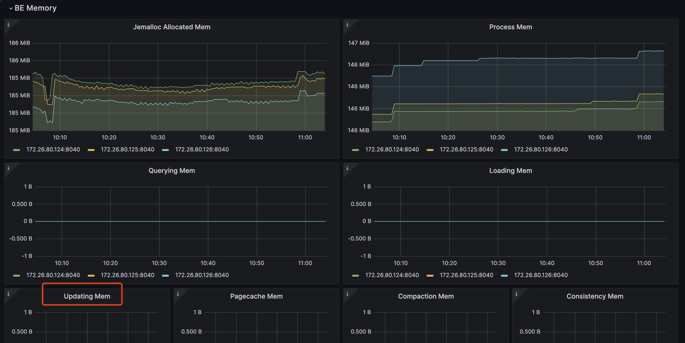

# Primary Key tables

The Primary Key table uses a new storage engine designed by StarRocks. Its main advantage lies in supporting real-time data updates while ensuring efficient performance for complex ad-hoc queries. In real-time business analytics, decision-making can benefit from Primary Key tables, which use the newest data to analyze results in real-time, which can mitigate data latency in data analysis.
However, the primary key is not a free lunch. If used improperly, it can lead to unnecessary resource waste. 

Therefore, in this section, we will guide you on how to use the primary key model more efficiently to achieve the desired results.

## Choosing Primary Key Index

The primary index is the most critical component in a Primary Key table. The primary key index which is used to store the mapping between the primary key values and the locations of the data rows identified by the primary key values.

Currently, we support three types of primary key index:
1. Full in-memory primary key index.  
```sql
PROPERTIES (
    "enable_persistent_index" = "false"
);
```
2. Local disk based persistent primary key index.
```sql
PROPERTIES (
    "enable_persistent_index" = "true",
    "persistent_index_type" = "LOCAL"
);
```
3. Cloud native persistent primary key index.
```sql
PROPERTIES (
    "enable_persistent_index" = "true",
    "persistent_index_type" = "CLOUD_NATIVE"
);
```

We DO NOT recommend using in-memory indexing, as it can lead to significant memory resource waste.

If you are using a shared-data (elastic) StarRocks cluster, we recommend opting for the cloud-native persistent primary index. Unlike the local disk based persistent primary index, it stores the complete index data on remote object storage, with local disks serving only as a cache. Compared to the local disk-based persistent primary index, its advantages include:
1. No dependency on local disk capacity.
2. No need to rebuild indexes after data shard rebalance.

## Choosing the Primary key

The primary key usually does not help accelerate queries. You can specify a column different from the primary key as the sort key using the `ORDER BY` clause to speed up queries. Therefore, when selecting a primary key, you only need to consider the uniqueness during data import and update processes.

The larger the primary key, the more memory, I/O, and other resources it consumes. Therefore, it is generally recommended to avoid selecting too many or overly large columns as the primary key. The default maximum size for the primary key is 128 bytes, controlled by the `primary_key_limit_size` parameter in `be.conf`. 

You can increase `primary_key_limit_size` to select a larger primary key, but be aware that this will result in higher resource consumption.

How much storage and memory space will a persistent index occupy?

### Formula for storage space cost

`(key size + 8 bytes) * row count * 50% `

:::note
50% is the estimated compression efficiency, the actual compression effect depends on the data itself.
:::

### Formula for memory cost

`min(l0_max_mem_usage * tablet cnt, update_memory_limit_percent * BE process memory);`

## Memory usage

The memory used by Primary Key table can be monitored by mem_tracker:

```
//View the overall memory statistics
http://be_ip:be_http_port/mem_tracker

// View primary key table memory statistics
http://be_ip:be_http_port/mem_tracker?type=update

// View primary key table memory statistics with more details
http://be_ip:be_http_port/mem_tracker?type=update&upper_level=4
```

`update` item in `mem_tracker` record whole memory used by Primary Key table, such as primary key index, delete vector and so on.
You can also monitor this `update` item via metrics monitor service. For example, in Grafana, you can check update item via (item in the red box):

   

> More about Monitor and Alert with Prometheus and Grafana: https://docs.starrocks.io/docs/administration/management/monitoring/Monitor_and_Alert/

If you are sensitive to memory usage and want to reduce memory consumption during the import process of a PK table, you can achieve this through the following configuration:

```
be.conf

l0_max_mem_usage = (some value which smaller than 104857600, default is 104857600)
skip_pk_preload = true

// Shared-nothing cluster
transaction_apply_worker_count = (some value smaller than cpu core number, default is cpu core number)

// Shared-data cluster
transaction_publish_version_worker_count = (some value smaller than cpu core number, default is cpu core number)
```

`l0_max_mem_usage` controls the max memory usage of persistent primary key index per tablet. `transaction_apply_worker_count` and `transaction_publish_version_worker_count` both control the max thread number which can be used for handling upsert and delete in primary key table.

But you need to remember, reducing `l0_max_mem_usage` may increase I/O pressure, while decreasing `transaction_apply_worker_count` or `transaction_publish_version_worker_count` could slow down data ingestion.

## Tradeoff between compaction resource, data freshness and query latency

Compared to tables in other models, primary key tables require additional operations for primary key index lookups and delete vector generation during data import, updates, and deletions, which introduces extra resource overhead.
Therefore, you need to make trade-offs among these three factors:
- Compaction resources limitation.
- Data freshness
- Query latency


#### Data freshness & Query latency

If you want to get better data freshness and also better query latency, that means you will introduce high frequency writes, and also want to make sure they can be compacted as soon as possible. 
Then you will need more compaction resource to handle these writes:
```
// shared-data
be.conf
compact_threads = 4

// shared-nothing
be.conf
update_compaction_num_threads_per_disk = 1
update_compaction_per_tablet_min_interval_seconds = 120
```

You can increase `compact_threads` and `update_compaction_num_threads_per_disk`, or decease `update_compaction_per_tablet_min_interval_seconds` to introduce more compaction resource to handle high frequency writes.

How do you know whether current compaction resource and setting can handle current high frequency writes? You can observe it in the following ways:

1. For shared-data cluster, if compaction cannot keep up with the ingestion rate, it may lead to ingestion slowdown or even write failure errors and ingestion stop.
  a. Ingestion slowdown. 
  You can use `show proc /transactions/{db_name}/running';` to check current running transactions, and if there is any slowdown message like :
```
Partition's compaction score is larger than 100.0, delay commit for xxxms. You can try to increase compaction concurrency
```
  show up in ErrMsg field, that means ingestion slowdown happens. 
  E.g.
```sql
mysql> show proc '/transactions/test_pri_load_c/running';
+---------------+----------------------------------------------+------------------+-------------------+--------------------+---------------------+------------+-------------+------------+----------------------------------------------------------------------------------------------------------------------------+--------------------+------------+-----------+--------+
| TransactionId | Label                                        | Coordinator      | TransactionStatus | LoadJobSourceType  | PrepareTime         | CommitTime | PublishTime | FinishTime | Reason                                                                                                                     | ErrorReplicasCount | ListenerId | TimeoutMs | ErrMsg |
+---------------+----------------------------------------------+------------------+-------------------+--------------------+---------------------+------------+-------------+------------+----------------------------------------------------------------------------------------------------------------------------+--------------------+------------+-----------+--------+
| 1034          | stream_load_d2753fbaa0b343acadd5f13de92d44c1 | FE: 172.26.94.39 | PREPARE           | FRONTEND_STREAMING | 2024-10-24 13:05:01 | NULL       | NULL        | NULL       | Partition's compaction score is larger than 100.0, delay commit for 6513ms. You can try to increase compaction concurrency, | 0                  | 11054      | 86400000  |        |
+---------------+----------------------------------------------+------------------+-------------------+--------------------+---------------------+------------+-------------+------------+----------------------------------------------------------------------------------------------------------------------------+--------------------+------------+-----------+--------+
```
  b. Ingestion stoppage.
   If there is an ingestion error like :
```
Failed to load data into partition xxx, because of too large compaction score, current/limit: xxx/xxx. You can reduce the loading job concurrency, or increase compaction concurrency 
```
  That means Ingestion stop because of compaction can't catch up current high frequency writes.

2. For shared-nothing cluster, there is no ingestion slowdown strategy, if the compaction can't catch up current high frequency writes. Ingestion will fail and return error message:
```
Failed to load data into tablet xxx, because of too many versions, current/limit: xxx/xxx. You can reduce the loading job concurrency, or increase loading data batch size. If you are loading data with Routine Load, you can increase FE configs routine_load_task_consume_second and max_routine_load_batch_size.
```

#### Data freshness & Compaction resources limitation
If you have limited compaction resources but still need to maintain sufficient data freshness, this means you'll need to sacrifice some query latency.

You can make these config changes to achieve that:
- Shared-data cluster
```
fe.conf

lake_ingest_slowdown_threshold = xxx (default is 100, you can increase it)
lake_compaction_score_upper_bound = xxx (default is 2000, you can increase it)
```

The `lake_ingest_slowdown_threshold` parameter controls the threshold for triggering ingestion slowdown. When a partition's compaction score exceeds this threshold, the system will begin to slowdown data ingestion. Similarly, `lake_compaction_score_upper_bound` determines the threshold for triggering ingestion stoppage.

- Shared-nothing cluster
```
be.conf

tablet_max_versions = xxx (default is 1000, you can increase it)
```

`tablet_max_versions` determines the threshold for triggering ingestion stoppage.

By increasing these configurations, the system can accommodate more small data files and reduce compaction frequency, but this will also impact query latency.

#### Query latency & Compaction resources limitation
If you want to achieve good query latency with limited compaction resources, you need to reduce write frequency and create larger data batches for ingestion.

For specific implementation, please refer to the sections on different ingestion methods, which detail how to reduce ingestion frequency and increase batch size.

