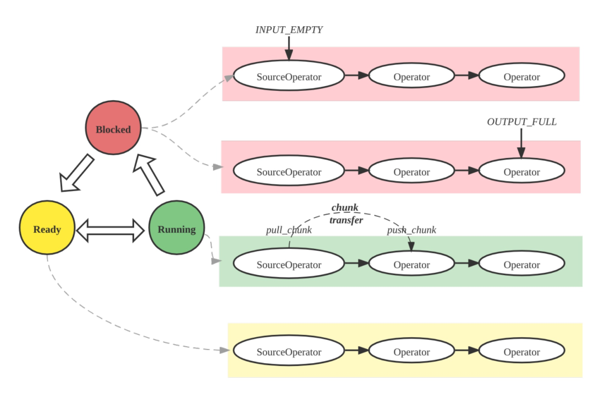

# Query Plan

Optimizing query performance is a common challenge in analytics systems. Slow queries can impair user experience and overall cluster performance. In StarRocks, understanding and interpreting query plans and query profiles is the foundation for diagnosing and improving slow queries. These tools help you:
- Identify bottlenecks and expensive operations
- Spot suboptimal join strategies or missing indexes
- Understand how data is filtered, aggregated, and moved
- Troubleshoot and optimize resource usage

A **query plan** is a detailed roadmap generated by the StarRocks FE that describes how your SQL statement will be executed. It breaks down the query into a series of operations—such as scans, joins, aggregations, and sorts—and determines the most efficient way to perform them.

StarRocks provides several ways to inspect the query plan:

1. **EXPLAIN statement**:  
   Use `EXPLAIN` to display the logical or physical execution plan for a query. You can add options to control the output:
   - `EXPLAIN LOGICAL <query>`: Shows the simplified plan.
   - `EXPLAIN <query>`: Shows the basic phyical plan
   - `EXPLAIN VERBOSE <query>`: Shows the physical plan with detailed information.
   - `EXPLAIN COSTS <query>`: Includes estimated costs for each operation, which is used to diagnose the statistics issue

2. **EXPLAIN ANALYZE**:  
   Use `EXPLAIN ANALYZE <query>` to execute the query and display the actual execution plan along with real runtime statistics.  See the [Explain Anlayze](./query_profile_text_based_analysis.md) documentation for details.

   Example:
   ```sql
   EXPLAIN ANALYZE SELECT * FROM sales_orders WHERE amount > 1000;
   ```

3. **Query Profile**:  
   After running a query, you can view its detailed execution profile, which includes timing, resource usage, and operator-level statistics. See the [Query Profile](./query_profile_overview.md) documentation for how to access and interpret this information.
   - **SQL commands**:  `SHOW PROFILELIST` and `ANALYZE PROFILE FOR <query_id>`: can be used to retrieval the execution profile for a specific query.
   - **FE HTTP Service**:  Access query profiles via the StarRocks FE web UI by navigating to the **Query** or **Profile** section, where you can search for and inspect query execution details.
   - **Managed Version**:  In cloud or managed deployments, use the provided web console or monitoring dashboard to view query plans and profiles, often with enhanced visualization and filtering options.


Typically, the query plan is used to diagnose issues related to how a query is planned and optimized, while the query profile helps identify performance problems during query execution. In the following sections, we'll explore the key concepts of query execution and walk through a concrete example of analyzing a query plan.


## Query Execution Flow
The lifecycle of a query in StarRocks consists of three main phases:
1. **Planning**: The query undergoes parsing, analysis, and optimization, culminating in the generation of a query plan.
2. **Scheduling**: The scheduler and coordinator distribute the plan to all participating backend nodes.
3. **Execution**: The plan is executed using the pipeline execution engine.


**Plan Structure**

The StarRocks plan is hierarchical:
- **Fragment**: Top-level slice of work; each fragment spawns multiple **FragmentInstances** that run on different backend nodes.
- **Pipeline**: Within an instance, a pipeline strings operators together; several **PipelineDrivers** run the same pipeline concurrently on separate CPU cores.
- **Operator**: The atomic step—scan, join, aggregate—that actually processes data.


**Pipeline Execution Engine**

The Pipeline Engine executes the query plan in a parallel and efficient manner, handling complex plans and large data volumes for high performance and scalability.



**Metric Merging Strategy**

By default, StarRocks merges the FragmentInstance and PipelineDriver layers to reduce profile volume, resulting in a simplified three-layer structure:
- Fragment
- Pipeline
- Operator

You can control this merging behavior through the session variable `pipeline_profile_level`.

## Example

### How to Read a Query Plan and Profile

1. **Understand the structure**: Query plans are split into fragments, each representing a stage of execution. Read from the bottom up: scan nodes first, then joins, aggregations, and finally the result.

2. **Overall analysis**:
   - Check total runtime, memory usage, and CPU/wall time ratio.
   - Find slow operators by sorting by operator time.
   - Ensure filters are pushed down where possible.
   - Look for data skew (uneven operator times or row counts).
   - Monitor for high memory or disk spill; adjust join order or use rollup views if needed.
   - Use materialized views and query hints (`BROADCAST`, `SHUFFLE`, `COLOCATE`) to optimize as needed.

2. **Scan operations**: Look for `OlapScanNode` or similar. Note which tables are scanned, what filters are applied, and if pre-aggregation or materialized views are used.

3. **Join operations**: Identify join types (`HASH JOIN`, `BROADCAST`, `SHUFFLE`, `COLOCATE`, `BUCKET SHUFFLE`). The join method affects performance:
   - **Broadcast**: Small table sent to all nodes; good for small tables.
   - **Shuffle**: Rows are partitioned and shuffled; good for large tables.
   - **Colocate**: Tables partitioned the same way; enables local joins.
   - **Bucket Shuffle**: Only one table is shuffled to reduce network cost.

4. **Aggregation and sorting**: Look for `AGGREGATE`, `TOP-N`, or `ORDER BY`. These can be expensive with large or high-cardinality data.

5. **Data movement**: `EXCHANGE` nodes show data transfer between fragments or nodes. Too much data movement can hurt performance.

6. **Predicate pushdown**: Filters applied early (at scan) reduce downstream data. Check `PREDICATES` or `PushdownPredicates` to see which filters are pushed down.


### Example Query Plan

:::tip
This is query 96 from the TPC-DS benchmark.
:::

```sql
EXPLAIN select  count(*)
from store_sales
    ,household_demographics
    ,time_dim
    , store
where ss_sold_time_sk = time_dim.t_time_sk
    and ss_hdemo_sk = household_demographics.hd_demo_sk
    and ss_store_sk = s_store_sk
    and time_dim.t_hour = 8
    and time_dim.t_minute >= 30
    and household_demographics.hd_dep_count = 5
    and store.s_store_name = 'ese'
order by count(*) limit 100;
```

The output is a hierarchical plan showing how StarRocks will execute the query, broken into fragments and operators. Here is a simplified example of a query plan fragment:

```
PLAN FRAGMENT 1
  6:HASH JOIN (BROADCAST)
    |-- 4:HASH JOIN (BROADCAST)
    |     |-- 2:HASH JOIN (BROADCAST)
    |     |     |-- 0:OlapScanNode (store_sales)
    |     |     |-- 1:OlapScanNode (time_dim)
    |     |-- 3:OlapScanNode (household_demographics)
    |-- 5:OlapScanNode (store)
```

- **OlapScanNode**: Scans a table, possibly with filters and pre-aggregation.
- **HASH JOIN (BROADCAST)**: Joins two tables by broadcasting the smaller one.
- **Fragments**: Each fragment can be executed in parallel on different nodes.

The query plan of Query 96 is divided into five fragments, numbered from 0 to 4. The query plan can be read one by one in a bottom-up manner.

Fragment 4 is responsible for scanning the `time_dim` table and executing the related query condition (i.e. `time_dim.t_hour = 8 and time_dim.t_minute >= 30`) in advance. This step is also known as predicate pushdown. StarRocks decides whether to enable `PREAGGREGATION` for aggregation tables. In the previous figure, preaggregation of `time_dim` is disabled. In this case, all dimension columns of `time_dim` are read, which may negatively affect performance if there are many dimension columns in the table. If the `time_dim` table selects `range partition` for data division, several partitions will be hit in the query plan and irrelevant partitions will be automatically filtered out. If there is a materialized view, StarRocks will automatically select the materialized view based on the query. If there is no materialized view, the query will automatically hit the base table (for example, `rollup: time_dim` in the previous figure).

When the scan is complete, Fragment 4 ends. Data will be passed to other fragments, as indicated by EXCHANGE ID : 09 in the previous figure, to the receiving node labeled 9.

For the query plan of Query 96, Fragment 2, 3, and 4 have similar functions but they are responsible for scanning different tables. Specifically, the `Order/Aggregation/Join` operations in the query are performed in Fragment 1.

Fragment 1 uses the `BROADCAST` method to perform `Order/Aggregation/Join` operations, that is, to broadcast the small table to the large table. If both tables are large, we recommend that you use the `SHUFFLE` method. Currently, StarRocks only supports `HASH JOIN`. The `colocate` field is used to show that the two joined tables are partitioned and bucketed in the same way, so that the join operation can be performed locally without migrating the data. When the Join operation is complete, the upper-level `aggregation`, `order by`, and `top-n` operations will be performed.

By removing the specific expressions (only keep the operators), the query plan can be presented in a more macroscopic view, as shown in the following figure.


